# Technical Specification

# 0. SUMMARY OF CHANGES

## 0.1 USER INTENT RESTATEMENT

### 0.1.1 Core Objective

Based on the provided requirements, the Blitzy platform understands that the objective is to **refactor FlyRigLoader to enhance modularity, maintainability, and extensibility** through systematic architectural improvements. The refactoring focuses on clarifying component responsibilities, simplifying interfaces, and ensuring seamless integration with downstream projects like Fly-Filt.

**Primary Requirements Enhanced for Clarity:**

1. **Decouple Data Processing Pipeline**: Separate file discovery, data loading, and transformation into distinct, reusable components with clear APIs
2. **Enhance Loader Reusability**: Create generalized, extensible loaders that support multiple file formats and data types
3. **Implement Registry Patterns**: Establish registries for configurations, schemas, and loaders to improve extensibility
4. **Simplify API Signatures**: Reduce complexity in public API functions while maintaining flexibility
5. **Strengthen Configuration Management**: Leverage Pydantic models fully with enhanced defaults and validation
6. **Standardize Error Handling**: Implement consistent exception hierarchy and logging strategies
7. **Gracefully Deprecate Legacy Code**: Phase out old implementations with clear migration paths
8. **Streamline Testing Infrastructure**: Simplify dependency injection mechanisms without sacrificing coverage
9. **Improve Documentation**: Create comprehensive technical architecture documentation
10. **Stabilize Integration Interface**: Ensure downstream projects have reliable, versioned APIs

**Implicit Requirements Detected:**

- Maintain 100% backward compatibility during the transition period
- Preserve all existing functionality while improving internal structure
- Enable plugin-style extensibility for future data formats and rigs
- Reduce cognitive load for new contributors through clearer code organization
- Establish clear boundaries between public APIs and internal implementations
- Support gradual migration for existing users without disrupting workflows

### 0.1.2 Special Instructions and Constraints

**CRITICAL: Process-Specific Directives**
- This refactoring is a **code restructuring effort only** - no new features are to be added
- Maintain existing test coverage levels (≥90%) throughout the refactoring
- All changes must be backward compatible with deprecation warnings for legacy paths
- Focus on internal architecture improvements without changing external behavior
- Preserve all existing APIs while marking deprecated ones clearly

**Methodological Requirements:**
- Apply SOLID principles, especially Single Responsibility and Dependency Inversion
- Use Protocol-based interfaces for all extensibility points
- Leverage Python's native capabilities before adding complexity
- Document all architectural decisions in code comments and docs

**User Example: Clear Separation Pattern**
The user explicitly states: "The legacy `process_experiment_data` internally discovers files, reads them, and transforms to DataFrame in one go – this monolithic approach is less flexible." The refactored version should allow:
```python
# Old monolithic approach
df = process_experiment_data(config, experiment)

#### New decoupled approach
manifest = discover_experiment_manifest(config, experiment)
raw_data = load_data_file(manifest.files[0])
df = transform_to_dataframe(raw_data, schema)
```

### 0.1.3 Technical Interpretation

These requirements translate to the following technical implementation strategy:

1. **Module Reorganization**: Restructure the existing modules to enforce clear separation of concerns
2. **Protocol Enhancement**: Extend existing Protocol definitions to support registry patterns
3. **API Layer Refinement**: Simplify the api.py facade while maintaining backward compatibility
4. **Configuration System Evolution**: Enhance Pydantic models with builder patterns and defaults
5. **Exception Hierarchy Implementation**: Create domain-specific exceptions inheriting from FlyRigLoaderError
6. **Test Hook Consolidation**: Move test injection machinery to a dedicated testing module
7. **Documentation Architecture**: Create structured technical documentation with clear extension guides

## 0.2 TECHNICAL SCOPE

### 0.2.1 Primary Objectives with Implementation Approach

**Objective 1: Decouple Discovery, Loading, and Transformation**
- Achieve clear separation by refactoring `flyrigloader.discovery` to only return file metadata
- Modify `flyrigloader.io` to handle only raw file loading without transformation
- Extend `flyrigloader.io.transformers` to be the sole location for data transformation logic
- Rationale: Enables users to intercept and modify data at any pipeline stage
- Success Factor: Each component can be tested and used independently

**Objective 2: Implement Loader and Schema Registries**
- Achieve extensibility by creating `flyrigloader.registries` module with LoaderRegistry and SchemaRegistry classes
- Modify `flyrigloader.io.pickle` to register loaders by file extension
- Extend `flyrigloader.io.column_models` to use SchemaRegistry for column definitions
- Rationale: New data formats and schemas can be added without modifying core code
- Success Factor: Third-party plugins can register custom loaders

**Objective 3: Simplify and Standardize APIs**
- Achieve consistency by refactoring `flyrigloader.api` to prefer config objects over paths
- Modify function signatures to accept Pydantic models directly
- Extend type hints to clearly indicate accepted config types
- Rationale: Reduces parameter confusion and improves IDE support
- Success Factor: Single clear pattern for all API usage

**Objective 4: Enhance Configuration Management**
- Achieve user-friendliness by adding config builder functions to `flyrigloader.config.models`
- Modify Pydantic models to include comprehensive defaults
- Extend validation to provide actionable error messages
- Rationale: Reduces boilerplate and configuration errors
- Success Factor: Minimal config files work out-of-the-box

**Objective 5: Implement Consistent Error Handling**
- Achieve reliability by creating `flyrigloader.exceptions` module with exception hierarchy
- Modify all modules to use domain-specific exceptions
- Extend logging to include exception context before raising
- Rationale: Enables granular error handling in client code
- Success Factor: All errors are catchable at appropriate levels

### 0.2.2 Component Impact Analysis

**Direct Modifications Required:**

- **flyrigloader.api.py**: 
  - Modify to simplify function signatures and parameter validation
  - Update to accept Pydantic models directly without adapter requirements
  - Add clear deprecation warnings to legacy functions

- **flyrigloader.discovery/files.py**:
  - Modify FileDiscoverer to return only metadata without loading
  - Remove any data transformation logic
  - Enhance to support pluggable pattern matchers

- **flyrigloader.io/pickle.py**:
  - Extend to use LoaderRegistry for format selection
  - Modify to focus solely on file reading without transformation
  - Add registration mechanism for new formats

- **flyrigloader.io/transformers.py**:
  - Extend to handle all data transformation logic
  - Modify to support pluggable transformation handlers
  - Add validation for transformation chain integrity

- **flyrigloader.config/models.py**:
  - Extend with builder functions for programmatic config creation
  - Modify to include comprehensive field defaults
  - Add factory methods for common configurations

**Indirect Impacts and Dependencies:**

- **flyrigloader.utils/__init__.py**:
  - Update test hook mechanism due to simplified injection approach
  - Dependency: All modules using test hooks need updates

- **flyrigloader.config/yaml_config.py**:
  - Update to leverage enhanced Pydantic models
  - Dependency: Config loading affects all downstream components

- **flyrigloader.utils/manifest.py**:
  - Update to use new separated discovery/loading approach
  - Dependency: Manifest building relies on discovery output format

**New Components Introduction:**

- **flyrigloader.registries/__init__.py**:
  - Create LoaderRegistry to manage file format handlers
  - Create SchemaRegistry to manage column configurations
  - Create base classes for registry entries

- **flyrigloader.exceptions.py**:
  - Create FlyRigLoaderError base exception
  - Create ConfigError, DiscoveryError, LoadError, TransformError subclasses
  - Create error context preservation utilities

- **flyrigloader.utils/testing.py**:
  - Create consolidated test injection machinery
  - Move complex test hooks from utils/__init__.py
  - Simplify main code paths

### 0.2.3 File and Path Mapping

| Target File/Module | Source Reference | Context Dependencies | Modification Type |
|-------------------|------------------|---------------------|-------------------|
| src/flyrigloader/api.py | Current api.py | config/models.py, all providers | Refactor parameters, add deprecations |
| src/flyrigloader/discovery/files.py | Current implementation | utils/paths.py, patterns.py | Remove loading logic, enhance metadata |
| src/flyrigloader/io/pickle.py | Current implementation | New registries module | Add registry integration |
| src/flyrigloader/io/transformers.py | Current implementation | column_models.py | Consolidate all transformations |
| src/flyrigloader/config/models.py | Current implementation | validators.py | Add builders and defaults |
| src/flyrigloader/registries/__init__.py | New module | io/pickle.py, io/column_models.py | Create registry infrastructure |
| src/flyrigloader/exceptions.py | New module | All modules | Create exception hierarchy |
| src/flyrigloader/utils/testing.py | utils/__init__.py | All modules with test hooks | Extract test machinery |
| src/flyrigloader/utils/__init__.py | Current implementation | All modules | Simplify after extraction |
| src/flyrigloader/config/discovery.py | Current implementation | New discovery architecture | Update for metadata-only discovery |
| docs/architecture.md | New file | All modules | Document technical architecture |
| docs/extension_guide.md | New file | registries module | Document extension patterns |

## 0.3 IMPLEMENTATION DESIGN

### 0.3.1 Technical Approach

**First, establish registry foundations by creating the registry infrastructure:**
- Create `flyrigloader.registries` module with abstract Registry base class
- Implement LoaderRegistry with register_loader(extension, loader_class) interface
- Implement SchemaRegistry with register_schema(name, schema_config) interface
- Design plugin discovery mechanism for automatic registration

**Next, decouple the data pipeline by separating concerns:**
- Refactor FileDiscoverer in `discovery/files.py` to return FileManifest objects containing only metadata
- Extract all pickle loading logic from discovery into dedicated PickleLoader class
- Move all transformation logic from various modules into transformers.py
- Create clear pipeline stages: discover() → load() → transform()

**Then, simplify the API layer by improving usability:**
- Add @deprecated decorator to legacy functions with migration warnings
- Implement direct Pydantic model support in all API functions
- Create config builder functions: `create_config()`, `create_experiment()`, `create_dataset()`
- Reduce function parameters by leveraging config objects

**Subsequently, enhance error handling by implementing hierarchy:**
- Create base FlyRigLoaderError with context preservation
- Implement specific exceptions for each pipeline stage
- Add error codes for programmatic handling
- Ensure all exceptions are logged before raising

**Finally, consolidate test infrastructure by extracting complexity:**
- Move all test-specific code from utils/__init__.py to utils/testing.py
- Simplify provider injection to use standard pytest monkeypatch
- Create TestRegistry for managing test doubles
- Document testing patterns for contributors

### 0.3.2 User-Provided Examples Integration

**The user's example of file discovery without loading will be implemented as:**
```python
# In flyrigloader/discovery/files.py
class FileManifest:
    """Container for discovered files without loading data"""
    files: List[FileInfo]
    metadata: Dict[str, Any]
    statistics: Optional[FileStatistics]
    
def discover_experiment_manifest(config, experiment_name) -> FileManifest:
    """Discovers files and returns manifest without loading data"""
    # Only gather file paths and metadata
    # No pickle loading or data transformation
```

**The user's example of separated loading will be implemented as:**
```python
# In flyrigloader/io/loaders.py  
def load_data_file(file_path: Path, loader: Optional[str] = None) -> Any:
    """Loads raw data from file using registered loader"""
    if loader is None:
        loader = LoaderRegistry.get_loader_for_extension(file_path.suffix)
    return loader.load(file_path)
```

### 0.3.3 Critical Implementation Details

**Registry Pattern Implementation:**
- Use metaclass registration for automatic discovery
- Support priority ordering for format handlers
- Enable runtime registration for plugins
- Implement thread-safe singleton registries

**Configuration Builder Pattern:**
```python
# In flyrigloader/config/builders.py
def create_config(
    project_name: str,
    base_directory: Path,
    datasets: List[DatasetConfig] = None,
    **kwargs
) -> ProjectConfig:
    """Builder function for creating validated configs programmatically"""
    return ProjectConfig(
        project_name=project_name,
        base_directory=base_directory,
        datasets=datasets or [],
        **kwargs
    )
```

**Deprecation Strategy Implementation:**
```python
# In flyrigloader/utils/deprecation.py
def deprecated(reason: str, version: str, alternative: str):
    """Decorator for marking deprecated functions"""
    def decorator(func):
        @functools.wraps(func)
        def wrapper(*args, **kwargs):
            warnings.warn(
                f"{func.__name__} is deprecated since {version}. {reason}. "
                f"Use {alternative} instead.",
                DeprecationWarning,
                stacklevel=2
            )
            return func(*args, **kwargs)
        return wrapper
    return decorator
```

### 0.3.4 Dependency Analysis

**Required Dependencies for Implementation:**
- No new external dependencies needed
- Utilize existing: Pydantic, PyYAML, pandas, numpy, loguru
- Python 3.8+ features: Protocol, TypedDict, Literal types

**Version Constraints:**
- Maintain compatibility with Pydantic >=2.6
- Support pandas >=1.3.0 for existing workflows
- Ensure protocol definitions work with Python 3.8

**Integration Requirements:**
- Preserve kedro compatibility through api.py facade
- Maintain jupyter notebook usage patterns
- Support existing YAML configuration files

## 0.4 SCOPE BOUNDARIES

### 0.4.1 Explicitly In Scope

**All Affected Files/Modules:**
- src/flyrigloader/api.py - Parameter simplification and deprecations
- src/flyrigloader/discovery/*.py - Separation of discovery from loading
- src/flyrigloader/io/*.py - Registry integration and transformation consolidation
- src/flyrigloader/config/*.py - Builder patterns and enhanced defaults
- src/flyrigloader/utils/*.py - Test infrastructure extraction
- src/flyrigloader/registries/ - New registry infrastructure (create)
- src/flyrigloader/exceptions.py - New exception hierarchy (create)

**All Configuration Changes:**
- Enhanced Pydantic model defaults in config/models.py
- New builder functions for programmatic config creation
- Registry configuration for loaders and schemas

**All Test Modifications:**
- Move test hooks to dedicated testing module
- Update tests for new exception types
- Add tests for registry functionality
- Maintain ≥90% coverage throughout

**All Documentation Updates:**
- docs/architecture.md - Technical architecture guide
- docs/extension_guide.md - Plugin development guide
- docs/migration_guide.md - Update for new patterns
- README.md - Update examples for new APIs
- Inline documentation for all refactored code

### 0.4.2 Explicitly Out of Scope

**What the user might expect but isn't included:**
- New features or functionality beyond refactoring
- Performance optimizations beyond architectural improvements
- Database integration or persistence layer
- Async/await implementations (marked for future)
- Web API or service layer
- Visualization or reporting features

**Related areas deliberately not touched:**
- Kedro pipeline definitions (maintain compatibility only)
- External project integrations beyond Fly-Filt
- Hardware-specific rig implementations
- Real-time data streaming capabilities

**Future considerations not addressed now:**
- GraphQL API for configuration
- Plugin marketplace or registry service
- Cloud storage integrations
- Distributed processing capabilities

## 0.5 VALIDATION CHECKLIST

### 0.5.1 Implementation Verification Points

**Requirement: Clear Separation of Concerns**
- ✓ Discovery functions return only metadata without loading files
- ✓ Loading functions read files without transforming data
- ✓ Transformation functions operate on loaded data without file I/O
- ✓ Each stage can be tested independently

**Requirement: Registry-Based Extensibility**
- ✓ LoaderRegistry allows registration of new file formats
- ✓ SchemaRegistry enables addition of new column schemas
- ✓ Plugins can register handlers without modifying core code
- ✓ Registry state is discoverable and queryable

**Requirement: Simplified API**
- ✓ Functions accept Pydantic models directly
- ✓ Reduced parameter count in public functions
- ✓ Clear deprecation warnings on legacy functions
- ✓ Single recommended pattern documented

**Requirement: Enhanced Configuration**
- ✓ Builder functions create valid configs programmatically
- ✓ Comprehensive defaults reduce required configuration
- ✓ Validation errors provide actionable guidance
- ✓ Migration from dict to Pydantic is seamless

**Requirement: Consistent Error Handling**
- ✓ All errors inherit from FlyRigLoaderError
- ✓ Domain-specific exceptions for each component
- ✓ Errors are logged before raising
- ✓ Exception context is preserved

### 0.5.2 Observable Changes

**API Usage Improvements:**
- Before: `load_experiment_files(config_path="/path/to/config.yaml", experiment_name="exp1", base_directory="/data")`
- After: `load_experiment_files(config=config_obj, experiment_name="exp1")`

**Discovery Pipeline Usage:**
- Before: `data = process_experiment_data(config, experiment)  # Does everything`
- After: 
  ```python
  manifest = discover_experiment_manifest(config, experiment)
  raw_data = [load_data_file(f.path) for f in manifest.files]
  dfs = [transform_to_dataframe(d, schema) for d in raw_data]
  ```

**Extension Pattern:**
```python
# Register custom loader
@LoaderRegistry.register('.custom')
class CustomLoader:
    def load(self, path: Path) -> Any:
        # Custom loading logic
```

**Error Handling Pattern:**
```python
try:
    manifest = discover_experiment_manifest(config, exp)
except DiscoveryError as e:
    # Handle discovery-specific errors
    logger.error(f"Discovery failed: {e.context}")
```

### 0.5.3 Integration Points That Must Be Tested

**Fly-Filt Integration:**
- ConfigManager compatibility with new Pydantic models
- API function signatures remain callable
- Error types can be caught appropriately
- Performance characteristics unchanged

**Kedro Pipeline Integration:**
- Node functions continue to work with refactored APIs
- Configuration passing through pipeline preserved
- Memory efficiency maintained or improved

**Jupyter Notebook Usage:**
- Interactive discovery and loading workflows function
- Error messages are clear and actionable
- Tab completion works with new APIs

## 0.6 EXECUTION PARAMETERS

### 0.6.1 Special Execution Instructions

**Process Requirements:**
- This is a refactoring-only effort - no new features to be implemented
- All changes must maintain backward compatibility with deprecation paths
- Refactoring should be done in phases to maintain stability
- Each phase must pass all existing tests before proceeding

**Quality Requirements:**
- Maintain test coverage at ≥90% throughout refactoring
- All public APIs must have comprehensive docstrings
- Type hints required for all function signatures
- Performance benchmarks must not regress

**Review Requirements:**
- Architecture changes require documentation before implementation
- API changes need migration examples
- Deprecations must include timeline and alternatives

### 0.6.2 Constraints and Boundaries

**Technical Constraints:**
- Must support Python 3.8+ (no newer syntax)
- Cannot break existing Pydantic 2.6+ usage
- Must maintain current memory footprint (< 2x data size)
- Cannot introduce new external dependencies

**Process Constraints:**
- Do not modify external project code (Fly-Filt)
- Do not change YAML configuration schema
- Do not alter pickle file formats
- Do not remove any public APIs (deprecate only)

**Output Constraints:**
- Generate only code refactoring and documentation
- Do not create new example datasets
- Do not modify test data files
- Do not change version number during refactoring

# 1. INTRODUCTION

## 1.1 EXECUTIVE SUMMARY

### 1.1.1 Brief Overview of the Project

FlyRigLoader is a specialized Python library designed to address critical data management challenges in neuroscience research, specifically for laboratories conducting behavioral experiments with flies using optical rigs ("opto rigs"). The library provides a robust, validated, and scalable solution for <span style="background-color: rgba(91, 57, 243, 0.2)">discovering, loading, and transforming experimental data through a three-stage, modular pipeline: discover → load → transform, enabling independent reuse and testing of each stage</span> stored across complex directory structures and various pickle file formats. <span style="background-color: rgba(91, 57, 243, 0.2)">The system features registry-based, plugin-style extensibility that allows third-party loaders and schemas to be added without modifying core code.</span>

### 1.1.2 Core Business Problem Being Solved

Neuroscience researchers face significant challenges in managing large volumes of experimental data generated by fly behavior rigs. These challenges include:

- **Data Discovery Complexity**: Inconsistent file naming and directory structures across experiments requiring manual navigation
- **Process Inefficiency**: Manual and error-prone data discovery processes that consume valuable research time
- **Standardization Gaps**: Lack of standardized data validation and transformation pipelines across research teams
- **Reproducibility Issues**: Difficulty in reproducing data loading workflows across different projects and researchers
- **Legacy System Limitations**: Existing ad-hoc scripts suffer from hard-coded paths, limited reusability, and inadequate error handling

### 1.1.3 Key Stakeholders and Users

| Stakeholder Group | Role | Primary Use Cases |
|------------------|------|------------------|
| Research Scientists | Primary Users | Experiment data loading, dataset management |
| Data Analysts | Primary Users | Behavioral data processing, pipeline integration |
| Pipeline Engineers | Secondary Users | Workflow automation, Kedro integration |
| System Integrators | Secondary Users | Framework integration, tool development |

### 1.1.4 Expected Business Impact and Value Proposition

**Efficiency Gains**:
- Reduces data discovery time from hours to seconds through automated pattern-based file finding
- Eliminates manual configuration through standardized YAML-based setup
- Streamlines data loading with support for multiple pickle formats
- <span style="background-color: rgba(91, 57, 243, 0.2)">Reduces cognitive load and accelerates onboarding through simplified, Pydantic-centric public APIs</span>

**Quality Improvement**:
- Ensures data consistency through Pydantic-validated schemas and standardized transformations
- <span style="background-color: rgba(91, 57, 243, 0.2)">Provides comprehensive error handling and logging for robust operations through the unified FlyRigLoaderError exception hierarchy for granular, consistent error management</span>
- Maintains 90% test coverage for reliability assurance

**Reproducibility Enhancement**:
- Enables exact replication of data loading workflows through version-controlled configuration files
- Supports hierarchical configuration inheritance for consistent setups
- Facilitates seamless integration with data orchestration frameworks

**Scalability Benefits**:
- Supports processing of large-scale experiments with optimized performance targets
- Handles cross-platform deployment (Linux, Windows, macOS)
- Provides memory-efficient processing capabilities

## 1.2 SYSTEM OVERVIEW

### 1.2.1 Project Context

#### 1.2.1.1 Business Context and Market Positioning

FlyRigLoader addresses a specialized niche within the neuroscience research ecosystem, specifically targeting laboratories conducting behavioral experiments with Drosophila (fruit flies) using optical experimental setups. As research questions about behavior and brain activity become more sophisticated, the ability to specify and run richly structured tasks becomes increasingly important. The library positions itself as an essential foundational tool in the modern neuroscience data pipeline, complementing other Python-based neuroscience tools while focusing specifically on fly experimental data management.

#### 1.2.1.2 Current System Limitations

The system is designed to replace manual, ad-hoc data loading scripts that suffer from:

- **Configuration Hardcoding**: Hard-coded paths and configurations that limit portability
- **Limited Validation**: Lack of comprehensive validation and error handling mechanisms
- **Inconsistent Discovery**: Inconsistent file discovery methods across different research projects
- **Poor Reusability**: Limited ability to reuse code across different experimental setups
- **Metadata Gaps**: No standardized metadata extraction from experimental files

#### 1.2.1.3 Integration with Existing Enterprise Landscape

FlyRigLoader is designed as a foundational component that integrates seamlessly with the broader scientific Python ecosystem:

| Integration Type | Component | Purpose |
|-----------------|-----------|---------|
| Primary Framework | Kedro | Data pipeline orchestration and workflow management |
| Analysis Environment | Jupyter Notebooks | Interactive data analysis and exploration |
| Scientific Stack | pandas, numpy | Data manipulation and numerical operations |
| Version Control | Git | Configuration management and code versioning |

### 1.2.2 High-Level Description (updated)

#### 1.2.2.1 Primary System Capabilities (updated)

**Intelligent File Discovery**:
- Pattern-based recursive file searching with configurable glob patterns
- Metadata extraction from filenames using regular expressions
- Multi-directory support with hierarchical organization
- Configurable filtering and ignore patterns for efficient discovery

**Configuration-Driven Architecture**:
- YAML-based hierarchical configurations with inheritance support
- Pydantic schema validation for configuration integrity
- Environment-specific overrides for flexible deployment
- Migration support from legacy configuration systems

**<span style="background-color: rgba(91, 57, 243, 0.2)">Metadata-only File Discovery</span>**:
- <span style="background-color: rgba(91, 57, 243, 0.2)">FileManifest objects containing only metadata without loading data</span>
- <span style="background-color: rgba(91, 57, 243, 0.2)">Fast directory traversal with statistical summaries</span>
- <span style="background-color: rgba(91, 57, 243, 0.2)">Decoupled discovery phase enabling independent validation and testing</span>

**<span style="background-color: rgba(91, 57, 243, 0.2)">Raw Data Loading</span>**:
- <span style="background-color: rgba(91, 57, 243, 0.2)">Multiple pickle format support (.pkl, .pklz, .pkl.gz) with automatic format detection</span>
- <span style="background-color: rgba(91, 57, 243, 0.2)">Memory-efficient processing for large experimental datasets</span>
- <span style="background-color: rgba(91, 57, 243, 0.2)">Pure data loading without transformation operations</span>

**<span style="background-color: rgba(91, 57, 243, 0.2)">Standardised Data Transformation</span>**:
- <span style="background-color: rgba(91, 57, 243, 0.2)">Manifest-driven DataFrame creation with column validation</span>
- <span style="background-color: rgba(91, 57, 243, 0.2)">Type checking and data integrity verification</span>
- <span style="background-color: rgba(91, 57, 243, 0.2)">Specialized transformation handlers for experimental formats</span>
- <span style="background-color: rgba(91, 57, 243, 0.2)">Metadata integration and preservation during transformation</span>

**<span style="background-color: rgba(91, 57, 243, 0.2)">Registry-Based Extensibility</span>**:
- <span style="background-color: rgba(91, 57, 243, 0.2)">LoaderRegistry for dynamic registration of file format handlers</span>
- <span style="background-color: rgba(91, 57, 243, 0.2)">SchemaRegistry for managing transformation schemas and validation rules</span>
- <span style="background-color: rgba(91, 57, 243, 0.2)">Plugin-style architecture enabling third-party extensions without core code modification</span>
- <span style="background-color: rgba(91, 57, 243, 0.2)">Runtime registration support for flexible system adaptation</span>

**<span style="background-color: rgba(91, 57, 243, 0.2)">Consistent Error Handling & Logging</span>**:
- <span style="background-color: rgba(91, 57, 243, 0.2)">Unified FlyRigLoaderError exception hierarchy for granular error management</span>
- <span style="background-color: rgba(91, 57, 243, 0.2)">Stage-specific exceptions with context preservation</span>
- <span style="background-color: rgba(91, 57, 243, 0.2)">Comprehensive logging integration with error code support</span>
- <span style="background-color: rgba(91, 57, 243, 0.2)">Programmatic error handling capabilities for automated systems</span>

#### 1.2.2.2 Major System Components (updated)

The system employs a layered architecture with Protocol-based dependency injection:

| Layer | Component | Technologies | Purpose |
|-------|-----------|--------------|---------|
| API | `api.py` | Python Protocols | High-level facade for external consumers |
| Configuration | `config/` | Pydantic v2, PyYAML | Schema-validated settings management |
| Discovery | `discovery/` | pathlib, regex, fnmatch | Pattern-based file finding and statistics |
| I/O | `io/` | pickle, pandas, numpy | **<span style="background-color: rgba(91, 57, 243, 0.2)">Raw file reading operations, with transformations in `io/transformers.py`</span>** |
| **<span style="background-color: rgba(91, 57, 243, 0.2)">Registries</span>** | **<span style="background-color: rgba(91, 57, 243, 0.2)">`registries/`</span>** | **<span style="background-color: rgba(91, 57, 243, 0.2)">LoaderRegistry, SchemaRegistry</span>** | **<span style="background-color: rgba(91, 57, 243, 0.2)">Dynamic handler management and plugin integration</span>** |
| **<span style="background-color: rgba(91, 57, 243, 0.2)">Exceptions</span>** | **<span style="background-color: rgba(91, 57, 243, 0.2)">`exceptions.py`</span>** | **<span style="background-color: rgba(91, 57, 243, 0.2)">FlyRigLoaderError & subclasses</span>** | **<span style="background-color: rgba(91, 57, 243, 0.2)">Domain-specific error handling and logging</span>** |
| Utilities | `utils/` | loguru, pathlib | Cross-cutting concerns and helpers |

#### 1.2.2.3 Core Technical Approach (updated)

The system implements a **layered architecture** with **Protocol-based dependency injection**, enabling:

- **Separation of Concerns**: <span style="background-color: rgba(91, 57, 243, 0.2)">Clear boundaries between discovery, loading, and transformation through a decoupled three-stage pipeline</span>
- **Testability**: Mock injection capabilities for comprehensive testing
- **Extensibility**: <span style="background-color: rgba(91, 57, 243, 0.2)">Registry-based plugin architecture that replaces hard-wired mappings with dynamic handler registration</span>
- **Performance Optimization**: Layer-specific optimizations for different operational aspects

<span style="background-color: rgba(91, 57, 243, 0.2)">The system's public APIs now accept Pydantic models directly for type-safe configuration management, while configuration builder functions reduce boilerplate code and accelerate common setup tasks.</span>

### 1.2.3 Success Criteria

#### 1.2.3.1 Measurable Objectives (updated)

| Metric Category | Target | Measurement |
|----------------|---------|-------------|
| Performance | File discovery < 5 seconds | 10,000 files benchmark |
| Reliability | 99.9% uptime | Data loading operations |
| Quality | ≥ 90% test coverage | Automated testing suite |
| Quality | **<span style="background-color: rgba(91, 57, 243, 0.2)">100% of raised exceptions subclass FlyRigLoaderError</span>** | **<span style="background-color: rgba(91, 57, 243, 0.2)">Exception hierarchy validation</span>** |
| Adoption | 100% legacy migration | Existing workflow support |

#### 1.2.3.2 Critical Success Factors

- **Backward Compatibility**: Seamless migration from existing configurations without data loss
- **Data Integrity**: Zero data loss during transformations with comprehensive validation
- **Migration Path**: Clear, documented migration process from legacy systems
- **Documentation Quality**: Comprehensive guides and examples for all use cases

#### 1.2.3.3 Key Performance Indicators (KPIs)

**Operational KPIs**:
- Data loading speed: < 1 second per 100MB of data
- Configuration validation time: < 100ms for typical configurations
- Memory efficiency: < 2x data size in memory footprint
- Error recovery rate: > 95% for transient failures

**Quality KPIs**:
- Test coverage maintenance at ≥ 90%
- Cross-platform compatibility across Linux, Windows, macOS
- Documentation completeness for all public APIs
- Performance regression detection through automated benchmarks

## 1.3 SCOPE

### 1.3.1 In-Scope

#### 1.3.1.1 Core Features and Functionalities

**Must-Have Capabilities**:
- Recursive file discovery with configurable glob patterns and filtering
- YAML configuration loading with Pydantic-based validation
- Multi-format pickle file reading (compressed and uncompressed)
- <span style="background-color: rgba(91, 57, 243, 0.2)">DataFrame transformation with column validation and type checking occurring after the separate loading stage, reflecting the new decoupled pipeline architecture</span>
- Metadata extraction from filenames using pattern matching
- Hierarchical configuration inheritance with environment overrides
- Comprehensive logging and error reporting with structured output
- <span style="background-color: rgba(91, 57, 243, 0.2)">Registry-based plugin architecture enabling external loaders and column schemas to be registered without core modifications</span>
- <span style="background-color: rgba(91, 57, 243, 0.2)">Configuration builder functions with comprehensive defaults, leveraging Pydantic for validated, minimal-effort setup</span>
- <span style="background-color: rgba(91, 57, 243, 0.2)">Domain-specific exception hierarchy (FlyRigLoaderError and subclasses) providing consistent, catchable error handling and structured logging</span>

**Primary User Workflows**:

1. **Experiment Data Loading Workflow**:
   - Configure experiment parameters in YAML files
   - Execute automatic file discovery based on patterns
   - Load and validate experimental data
   - Transform data to analysis-ready pandas DataFrames

2. **Dataset Management Workflow**:
   - Define dataset structures and relationships
   - Map experimental dates to vial configurations
   - Apply dataset-specific filters and transformations
   - Generate comprehensive file manifests for analysis

#### 1.3.1.2 Essential Integrations

**Framework Integrations**:
- Kedro pipeline framework for data orchestration
- Jupyter ecosystem for interactive analysis
- Standard Python data science stack (pandas, numpy, scipy)
- Conda environment management for dependency isolation

**Development Integrations**:
- Git version control for configuration management
- pytest framework for comprehensive testing
- setuptools for package distribution
- GitHub Actions for continuous integration

#### 1.3.1.3 Key Technical Requirements

**Platform Requirements**:
- Python 3.8-3.11 compatibility across versions
- Cross-platform support for Linux, Windows, and macOS
- Memory-efficient processing for large datasets
- Asynchronous-ready architecture for future scalability

**Quality Requirements**:
- Type safety through Pydantic validation and Python typing
- Comprehensive test coverage (≥90%) with automated verification
- Performance benchmarks with regression detection
- Security scanning and vulnerability assessment

#### 1.3.1.4 Implementation Boundaries

**System Boundaries**:
- Focuses exclusively on data loading and transformation, not analysis
- Operates on local filesystem access only
- Processes pickle-based data formats with extensible architecture
- Configuration management through YAML files with validation

**User Groups Covered**:
- Research scientists conducting fly behavioral experiments
- Data analysts processing neuroscience datasets
- Pipeline engineers building automated workflows
- System integrators developing custom tools

**Data Domains Included**:
- Fly behavioral tracking data with positional information
- Experimental metadata and configuration parameters
- Time-series data from optical rig measurements
- Signal and stimulus data from experimental protocols

### 1.3.2 Out-of-Scope

#### 1.3.2.1 Explicitly Excluded Features

**Functional Exclusions**:
- Real-time data streaming from experimental rigs
- Data analysis, statistical computations, or visualization
- Database storage, retrieval, or management
- Cloud storage integration or remote data access
- Graphical user interface or web-based interface

**Technical Exclusions**:
- Non-pickle data formats (HDF5, NWB, CSV) in current version
- Distributed computing or parallel processing frameworks
- Hardware interface or direct rig communication
- Commercial licensing or enterprise support features

#### 1.3.2.2 Future Phase Considerations

**Format Extensions**:
- Support for HDF5/NWB file formats in neuroscience standard
- Integration with neuroinformatics standards and protocols
- Support for streaming data formats and real-time processing

**Platform Extensions**:
- Cloud storage integration (AWS S3, Google Cloud Storage)
- Distributed computing support (Dask, Ray)
- Container orchestration and deployment automation

**Feature Extensions**:
- Machine learning pipeline integration
- Real-time experiment monitoring and alerts
- Advanced data validation and quality assessment

#### 1.3.2.3 Integration Points Not Covered

**System Integration Exclusions**:
- Laboratory Information Management Systems (LIMS)
- Electronic lab notebooks and research management platforms
- Commercial data analysis software or proprietary tools
- Database management systems or data warehousing solutions

#### 1.3.2.4 Unsupported Use Cases

**Domain Limitations**:
- Non-fly experimental data or other model organisms
- Clinical or human subject data processing
- Industrial or commercial data processing applications
- Real-time control systems or experimental automation

**Technical Limitations**:
- Production-scale commercial deployments
- Multi-tenant or enterprise authentication systems
- Regulatory compliance frameworks (FDA, GDPR)
- High-availability or disaster recovery requirements

#### References

**Files Examined**:
- `README.md` - Project overview, features, usage examples, and migration guidance
- `pyproject.toml` - Package metadata, dependencies, and test configuration
- `examples/external_project/example_config.yaml` - Configuration structure and validation features
- `docs/io/column_configuration.md` - Data column schema and transformation documentation

**Folders Explored**:
- Repository root - Overall project structure and organization
- `src/flyrigloader/` - Main package modules and architecture
- `src/flyrigloader/io/` - I/O subsystem with column configuration
- `src/flyrigloader/config/` - Configuration management with Pydantic models
- `src/flyrigloader/discovery/` - File discovery and pattern matching
- `src/flyrigloader/utils/` - Utility functions for paths and DataFrames
- `examples/` - Example project demonstrations and use cases
- `docs/` - Comprehensive documentation guides
- `tests/` - Test suite with coverage requirements
- `.github/` - CI/CD workflows and automation

# 2. PRODUCT REQUIREMENTS

## 2.1 FEATURE CATALOG

### 2.1.1 Feature F-001: File Discovery Engine
**Feature Category:** Core Data Management  
**Priority Level:** Critical  
**Status:** Completed  

**Description:**
- **Overview:** <span style="background-color: rgba(91, 57, 243, 0.2)">Returns file metadata only; no data loading occurs.</span> Intelligent pattern-based file discovery system with configurable filtering, metadata extraction, and statistics collection
- **Business Value:** Reduces data discovery time from hours to seconds through automated pattern-based file finding, eliminating manual search and error-prone data location processes
- **User Benefits:** Scientists can locate experimental data files quickly without memorizing complex directory structures or file naming conventions
- **Technical Context:** Implements recursive directory traversal with glob patterns, <span style="background-color: rgba(91, 57, 243, 0.2)">registry-based pluggable pattern matchers</span>, regex-based metadata extraction, and file statistics attachment

**Dependencies:**
- **Prerequisite Features:** None (foundational feature)
- **System Dependencies:** Python pathlib, fnmatch, re modules
- **External Dependencies:** Local filesystem access
- **Integration Requirements:** Must integrate with Configuration Management (F-002) for pattern definitions

### 2.1.2 Feature F-002: Configuration Management System
**Feature Category:** System Configuration  
**Priority Level:** Critical  
**Status:** Completed  

**Description:**
- **Overview:** YAML-based hierarchical configuration system with Pydantic validation, inheritance support, and environment overrides. <span style="background-color: rgba(91, 57, 243, 0.2)">Supports `create_config*` builder helpers for code-driven configuration.</span>
- **Business Value:** Ensures configuration consistency through validated schemas, preventing runtime errors and enabling reproducible workflows
- **User Benefits:** Researchers can define project structures declaratively with automatic validation and clear error messages
- **Technical Context:** Uses PyYAML for parsing and Pydantic v2 for schema validation <span style="background-color: rgba(91, 57, 243, 0.2)">with builder functions for programmatic config creation and comprehensive field defaults</span>

**Dependencies:**
- **Prerequisite Features:** None (foundational feature)
- **System Dependencies:** PyYAML, Pydantic >=2.6
- **External Dependencies:** YAML configuration files
- **Integration Requirements:** Provides configuration to all other features

### 2.1.3 Feature F-003: Data Loading Pipeline
**Feature Category:** Data Input/Output  
**Priority Level:** Critical  
**Status:** Completed  

**Description:**
- **Overview:** Multi-format pickle file loading system supporting compressed and uncompressed formats with memory-efficient processing. <span style="background-color: rgba(91, 57, 243, 0.2)">Extensible via plugin loaders without core-code changes.</span>
- **Business Value:** Enables processing of large experimental datasets without memory constraints, supporting various pickle formats used by different rigs
- **User Benefits:** Transparent loading of .pkl, .pklz, and .pkl.gz files with automatic format detection
- **Technical Context:** <span style="background-color: rgba(91, 57, 243, 0.2)">LoaderRegistry-based</span> protocol loader with fallback to <span style="background-color: rgba(91, 57, 243, 0.2)">pandas.read_pickle for compatibility; third-party loaders can register via `LoaderRegistry.register()`</span>

**Dependencies:**
- **Prerequisite Features:** File Discovery Engine (F-001)
- **System Dependencies:** pickle, gzip, pandas
- **External Dependencies:** Experimental data files in pickle format
- **Integration Requirements:** Feeds data to Data Transformation Engine (F-004)

### 2.1.4 Feature F-004: Data Transformation Engine
**Feature Category:** Data Processing  
**Priority Level:** Critical  
**Status:** Completed  

**Description:**
- **Overview:** Manifest-driven DataFrame transformation system with column validation, type checking, and special handlers
- **Business Value:** Ensures data consistency and quality through standardized transformations, reducing analysis errors
- **User Benefits:** Automatic conversion of raw experimental data to analysis-ready pandas DataFrames with validated schemas
- **Technical Context:** Uses column configuration manifest with Pydantic models <span style="background-color: rgba(91, 57, 243, 0.2)">and pluggable transformation handler registry</span> for <span style="background-color: rgba(91, 57, 243, 0.2)">customizable processing chains</span>

**Dependencies:**
- **Prerequisite Features:** Data Loading Pipeline (F-003), Column Schema Management (F-005)
- **System Dependencies:** pandas, numpy
- **External Dependencies:** Column configuration manifest (column_config.yaml)
- **Integration Requirements:** Consumes loaded data and produces DataFrames for analysis

### 2.1.5 Feature F-005: Column Schema Management
**Feature Category:** Data Validation  
**Priority Level:** High  
**Status:** Completed  

**Description:**
- **Overview:** Pydantic-validated column configuration system defining expected data columns, types, dimensions, and transformations
- **Business Value:** Prevents data integrity issues through schema enforcement, ensuring all analyses use consistent data structures
- **User Benefits:** Clear documentation of expected data format with automatic validation and helpful error messages
- **Technical Context:** YAML-based column manifest <span style="background-color: rgba(91, 57, 243, 0.2)">validated with Pydantic and managed through SchemaRegistry for runtime extensibility</span>

**Dependencies:**
- **Prerequisite Features:** Configuration Management System (F-002)
- **System Dependencies:** Pydantic, PyYAML, numpy
- **External Dependencies:** column_config.yaml manifest file
- **Integration Requirements:** Used by Data Transformation Engine (F-004)

### 2.1.6 Feature F-006: Legacy Configuration Adapter
**Feature Category:** Migration Support  
**Priority Level:** High  
**Status:** Completed  

**Description:**
- **Overview:** Backward compatibility layer allowing dict-style access to Pydantic-validated configurations
- **Business Value:** Enables gradual migration from legacy systems without breaking existing workflows
- **User Benefits:** Existing code continues to work while benefiting from validation and type safety
- **Technical Context:** MutableMapping implementation wrapping Pydantic models with dict-like interface

**Dependencies:**
- **Prerequisite Features:** Configuration Management System (F-002)
- **System Dependencies:** collections.abc.MutableMapping
- **External Dependencies:** None
- **Integration Requirements:** Transparent integration with all configuration consumers

### 2.1.7 Feature F-007: Decoupled Workflow API
**Feature Category:** API Design  
**Priority Level:** High  
**Status:** Completed  

**Description:**
- **Overview:** Three-step decoupled architecture separating file discovery, data loading, and transformation for memory efficiency
- **Business Value:** Enables selective processing of large datasets, improving performance and reducing memory usage
- **User Benefits:** Process only needed files instead of loading entire datasets, with clear workflow stages
- **Technical Context:** Manifest-based discovery followed by selective loading and optional transformation

**Dependencies:**
- **Prerequisite Features:** File Discovery Engine (F-001), Data Loading Pipeline (F-003), Data Transformation Engine (F-004)
- **System Dependencies:** All core modules
- **External Dependencies:** None
- **Integration Requirements:** Orchestrates all core features in a memory-efficient workflow

### 2.1.8 Feature F-008: Path Management Utilities
**Feature Category:** Infrastructure  
**Priority Level:** Medium  
**Status:** Completed  

**Description:**
- **Overview:** Cross-platform path manipulation utilities with dependency injection for testing
- **Business Value:** Ensures consistent file operations across Linux, Windows, and macOS environments
- **User Benefits:** Reliable path handling without platform-specific code
- **Technical Context:** Protocol-based filesystem provider with pathlib implementation

**Dependencies:**
- **Prerequisite Features:** None
- **System Dependencies:** pathlib, os
- **External Dependencies:** None
- **Integration Requirements:** Used by all file-handling features

### 2.1.9 Feature F-009: Structured Logging System
**Feature Category:** Observability  
**Priority Level:** Medium  
**Status:** Completed  

**Description:**
- **Overview:** Comprehensive logging system using Loguru with console and rotating file sinks
- **Business Value:** Enables debugging and audit trails for scientific reproducibility
- **User Benefits:** Clear operational visibility with structured, colorized logs
- **Technical Context:** Centralized logger configuration with test-specific adaptations

**Dependencies:**
- **Prerequisite Features:** None
- **System Dependencies:** loguru >=0.7.0
- **External Dependencies:** None
- **Integration Requirements:** Used by all modules for operational logging

### 2.1.10 Feature F-010: Experiment Metadata Extraction
**Feature Category:** Data Management  
**Priority Level:** Medium  
**Status:** Completed  

**Description:**
- **Overview:** Pattern-based metadata extraction from filenames using configurable regex patterns
- **Business Value:** Automates metadata collection, reducing manual data entry errors
- **User Benefits:** Automatic extraction of dates, experiment names, and other metadata from file paths
- **Technical Context:** Regex-based pattern matching with named groups and date parsing

**Dependencies:**
- **Prerequisite Features:** File Discovery Engine (F-001)
- **System Dependencies:** re, datetime
- **External Dependencies:** None
- **Integration Requirements:** Enriches file discovery results

## 2.2 FUNCTIONAL REQUIREMENTS TABLE

### 2.2.1 Feature F-001: File Discovery Engine

| Requirement ID | Description | Acceptance Criteria | Priority |
|----------------|-------------|---------------------|----------|
| F-001-RQ-001 | Recursive directory search with glob patterns | System finds all files matching pattern in directory tree | Must-Have |
| F-001-RQ-002 | Extension-based filtering | Only files with specified extensions are returned | Must-Have |
| F-001-RQ-003 | Ignore pattern support | Files matching ignore patterns are excluded | Must-Have |
| F-001-RQ-004 | Mandatory substring filtering | Only files containing required substrings are included | Should-Have |
| <span style="background-color: rgba(91, 57, 243, 0.2)">F-001-RQ-005</span> | <span style="background-color: rgba(91, 57, 243, 0.2)">Pluggable pattern matcher registration</span> | <span style="background-color: rgba(91, 57, 243, 0.2)">Users can register new filename matchers at runtime via registry API</span> | <span style="background-color: rgba(91, 57, 243, 0.2)">Should-Have</span> |

**Technical Specifications:**
- **Input Parameters:** directory paths, glob pattern, recursive flag, extensions list, ignore patterns, mandatory substrings<span style="background-color: rgba(91, 57, 243, 0.2)">, pattern matcher registry</span>
- **Output/Response:** List of file paths or dictionary with metadata
- **Performance Criteria:** <5 seconds for 10,000 files
- **Data Requirements:** Read access to filesystem<span style="background-color: rgba(91, 57, 243, 0.2)">, pattern matcher registry instances</span>

**Validation Rules:**
- **Business Rules:** Patterns must be valid glob expressions<span style="background-color: rgba(91, 57, 243, 0.2)">, registered matchers must implement pattern matching protocol</span>
- **Data Validation:** Paths must exist and be accessible<span style="background-color: rgba(91, 57, 243, 0.2)">, pattern matchers must be callable objects</span>
- **Security Requirements:** Path traversal protection enforced<span style="background-color: rgba(91, 57, 243, 0.2)">, pattern matcher code execution validation</span>
- **Compliance Requirements:** No access outside designated directories<span style="background-color: rgba(91, 57, 243, 0.2)">, pattern matcher isolation from system resources</span>

### 2.2.2 Feature F-002: Configuration Management System

| Requirement ID | Description | Acceptance Criteria | Priority |
|----------------|-------------|---------------------|----------|
| F-002-RQ-001 | YAML configuration loading | Parse and validate YAML files with Pydantic models | Must-Have |
| F-002-RQ-002 | Schema validation | All configuration fields validated against defined schemas | Must-Have |
| F-002-RQ-003 | Hierarchical inheritance | Experiment configs inherit from project defaults | Must-Have |
| F-002-RQ-004 | Environment variable overrides | FLYRIGLOADER_DATA_DIR overrides config paths | Should-Have |
| <span style="background-color: rgba(91, 57, 243, 0.2)">F-002-RQ-005</span> | <span style="background-color: rgba(91, 57, 243, 0.2)">Programmatic config builder functions</span> | <span style="background-color: rgba(91, 57, 243, 0.2)">`create_config()` and related helpers produce validated Pydantic objects without YAML files</span> | <span style="background-color: rgba(91, 57, 243, 0.2)">Should-Have</span> |

**Technical Specifications:**
- **Input Parameters:** YAML file path or dictionary<span style="background-color: rgba(91, 57, 243, 0.2)">, builder function parameters (project_name, base_directory, datasets)</span>
- **Output/Response:** Validated configuration object or LegacyConfigAdapter<span style="background-color: rgba(91, 57, 243, 0.2)">, builder-generated Pydantic models</span>
- **Performance Criteria:** <100ms validation time<span style="background-color: rgba(91, 57, 243, 0.2)">, <50ms for builder functions</span>
- **Data Requirements:** Valid YAML syntax, defined schema<span style="background-color: rgba(91, 57, 243, 0.2)">, type-checked builder parameters</span>

**Validation Rules:**
- **Business Rules:** Required fields must be present, dates in valid format<span style="background-color: rgba(91, 57, 243, 0.2)">, builder parameters must satisfy Pydantic constraints</span>
- **Data Validation:** DirectoryPath fields must exist on filesystem<span style="background-color: rgba(91, 57, 243, 0.2)">, builder-generated configs must pass schema validation</span>
- **Security Requirements:** Path normalization, no directory traversal<span style="background-color: rgba(91, 57, 243, 0.2)">, builder input sanitization</span>
- **Compliance Requirements:** Secure input handling per Security Specification<span style="background-color: rgba(91, 57, 243, 0.2)">, builder function parameter validation</span>

### 2.2.3 Feature F-003: Data Loading Pipeline

| Requirement ID | Description | Acceptance Criteria | Priority |
|----------------|-------------|---------------------|----------|
| F-003-RQ-001 | Load uncompressed pickle files | Successfully load .pkl files | Must-Have |
| F-003-RQ-002 | Load compressed pickle files | Support .pklz and .pkl.gz formats | Must-Have |
| F-003-RQ-003 | Automatic format detection | Detect and handle format based on extension | Must-Have |
| F-003-RQ-004 | Pandas fallback support | Use pandas.read_pickle when standard pickle fails | Should-Have |
| <span style="background-color: rgba(91, 57, 243, 0.2)">F-003-RQ-005</span> | <span style="background-color: rgba(91, 57, 243, 0.2)">Registry-based loader selection</span> | <span style="background-color: rgba(91, 57, 243, 0.2)">File format is resolved through `LoaderRegistry`; external loaders can be injected without code changes</span> | <span style="background-color: rgba(91, 57, 243, 0.2)">Must-Have</span> |

**Technical Specifications:**
- **Input Parameters:** File path<span style="background-color: rgba(91, 57, 243, 0.2)">, optional loader specification, LoaderRegistry instance</span>
- **Output/Response:** Dictionary containing experimental data<span style="background-color: rgba(91, 57, 243, 0.2)">, loader-specific data structures</span>
- **Performance Criteria:** <1 second per 100MB<span style="background-color: rgba(91, 57, 243, 0.2)">, registry lookup <10ms</span>
- **Data Requirements:** Valid pickle format files<span style="background-color: rgba(91, 57, 243, 0.2)">, registered loader implementations</span>

**Validation Rules:**
- **Business Rules:** File must exist and be readable<span style="background-color: rgba(91, 57, 243, 0.2)">, registered loaders must implement loader protocol</span>
- **Data Validation:** Pickle data must be valid Python objects<span style="background-color: rgba(91, 57, 243, 0.2)">, loader registry must contain valid handlers</span>
- **Security Requirements:** Only load from allowed directories<span style="background-color: rgba(91, 57, 243, 0.2)">, loader code execution validation</span>
- **Compliance Requirements:** Handle sensitive data appropriately<span style="background-color: rgba(91, 57, 243, 0.2)">, loader isolation from system resources</span>

### 2.2.4 Feature F-004: Data Transformation Engine

| Requirement ID | Description | Acceptance Criteria | Priority |
|----------------|-------------|---------------------|----------|
| F-004-RQ-001 | Column validation | Validate all columns against schema | Must-Have |
| F-004-RQ-002 | Type conversion | Convert data types per column configuration | Must-Have |
| F-004-RQ-003 | Alias resolution | Map aliased column names to canonical names | Must-Have |
| F-004-RQ-004 | Default value filling | Apply defaults for missing optional columns | Should-Have |
| <span style="background-color: rgba(91, 57, 243, 0.2)">F-004-RQ-005</span> | <span style="background-color: rgba(91, 57, 243, 0.2)">Transformation handler registry</span> | <span style="background-color: rgba(91, 57, 243, 0.2)">Additional transformation handlers can be registered and invoked via registry mechanism</span> | <span style="background-color: rgba(91, 57, 243, 0.2)">Should-Have</span> |

**Technical Specifications:**
- **Input Parameters:** Raw data dictionary, column configuration, metadata<span style="background-color: rgba(91, 57, 243, 0.2)">, transformation handler registry</span>
- **Output/Response:** pandas DataFrame with validated columns<span style="background-color: rgba(91, 57, 243, 0.2)">, handler-specific transformed data</span>
- **Performance Criteria:** <500ms for 1M rows<span style="background-color: rgba(91, 57, 243, 0.2)">, handler registry lookup <5ms</span>
- **Data Requirements:** Column configuration manifest<span style="background-color: rgba(91, 57, 243, 0.2)">, registered transformation handlers</span>

**Validation Rules:**
- **Business Rules:** Required columns must be present<span style="background-color: rgba(91, 57, 243, 0.2)">, registered handlers must implement transformation protocol</span>
- **Data Validation:** Array dimensions must match schema<span style="background-color: rgba(91, 57, 243, 0.2)">, transformation handlers must return valid data structures</span>
- **Security Requirements:** No code execution from config<span style="background-color: rgba(91, 57, 243, 0.2)">, handler code execution validation</span>
- **Compliance Requirements:** Maintain data integrity<span style="background-color: rgba(91, 57, 243, 0.2)">, handler isolation from system resources</span>

### 2.2.5 Registry Integration Requirements

| Requirement ID | Description | Acceptance Criteria | Priority |
|----------------|-------------|---------------------|----------|
| F-REG-RQ-001 | Thread-safe registry operations | All registry operations must be thread-safe for concurrent access | Must-Have |
| F-REG-RQ-002 | Plugin discovery mechanism | Automatic discovery and registration of plugins during system initialization | Should-Have |
| F-REG-RQ-003 | Priority-based handler selection | Support priority ordering for handlers when multiple options exist | Should-Have |
| F-REG-RQ-004 | Runtime registration support | Enable dynamic registration of new handlers during system runtime | Must-Have |

**Technical Specifications:**
- **Input Parameters:** Handler classes, priority levels, registration metadata
- **Output/Response:** Registry confirmation, handler instances
- **Performance Criteria:** Registry operations <10ms, plugin discovery <500ms
- **Data Requirements:** Protocol-compliant handler implementations

**Validation Rules:**
- **Business Rules:** Handlers must implement required protocol methods
- **Data Validation:** Handler registration must pass protocol validation
- **Security Requirements:** Handler code validation before registration
- **Compliance Requirements:** Isolation of handler execution environments

### 2.2.6 Backward Compatibility Requirements

| Requirement ID | Description | Acceptance Criteria | Priority |
|----------------|-------------|---------------------|----------|
| F-COMPAT-RQ-001 | Legacy configuration support | Existing YAML configurations work without modification | Must-Have |
| F-COMPAT-RQ-002 | Deprecation warnings | Clear deprecation warnings for legacy APIs with migration guidance | Should-Have |
| F-COMPAT-RQ-003 | Gradual migration path | Support mixed usage of legacy and new APIs during transition | Must-Have |
| F-COMPAT-RQ-004 | Configuration adapter compatibility | LegacyConfigAdapter provides seamless dict-style access | Must-Have |

**Technical Specifications:**
- **Input Parameters:** Legacy configuration formats, deprecated function parameters
- **Output/Response:** Compatible outputs with optional deprecation warnings
- **Performance Criteria:** No performance degradation for legacy usage
- **Data Requirements:** Backward compatibility validation test suite

**Validation Rules:**
- **Business Rules:** Legacy configurations must validate against new schemas
- **Data Validation:** Migration paths must preserve data integrity
- **Security Requirements:** Legacy support must not compromise security
- **Compliance Requirements:** Maintain audit trail during migration

## 2.3 FEATURE RELATIONSHIPS

### 2.3.1 Feature Dependencies Map

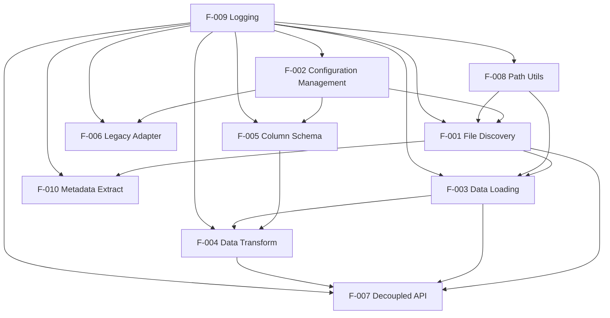

### 2.3.2 Integration Points
- **Configuration Foundation:** F-002 provides patterns and rules to F-001 File Discovery
- **Data Pipeline:** F-001 identifies files for F-003 Loading, which provides raw data to F-004 Transformation
- **Schema Validation:** F-005 Column Schema validates F-004 Transformation operations
- **Cross-Cutting Services:** F-008 Path Utils and F-009 Logging support all file operations

### 2.3.3 Shared Components
- **Pydantic Models:** Shared between F-002 Configuration and F-005 Column Schema
- **Protocol Interfaces:** Common abstractions across all I/O operations
- **Logger Instance:** Global structured logging through F-009
- **Path Utilities:** Cross-platform file operations via F-008

### 2.3.4 Common Services
- **Filesystem Access:** Abstracted through protocols in F-008
- **Validation Services:** Centralized through Pydantic models
- **Logging Services:** Structured output through Loguru
- **DataFrame Operations:** Standardized through pandas integration

## 2.4 IMPLEMENTATION CONSIDERATIONS

### 2.4.1 Feature F-001: File Discovery Engine
- **Technical Constraints:** Must handle >10,000 files efficiently
- **Performance Requirements:** <5 second discovery for large directories
- **Scalability Considerations:** Asynchronous-ready architecture for future parallel discovery
- **Security Implications:** Path traversal protection critical
- **Maintenance Requirements:** Pattern library must be extensible. <span style="background-color: rgba(91, 57, 243, 0.2)">Pattern matcher registry must be documented and support runtime extension.</span>

### 2.4.2 Feature F-002: Configuration Management System
- **Technical Constraints:** Pydantic v2 required for performance
- **Performance Requirements:** <100ms validation for typical configs
- **Scalability Considerations:** Support for distributed configuration sources in future
- **Security Implications:** Input validation prevents ReDoS and path traversal
- **Maintenance Requirements:** Schema migration support needed. <span style="background-color: rgba(91, 57, 243, 0.2)">Maintain backward-compatible builder APIs; document `create_config*` helpers.</span>

### 2.4.3 Feature F-003: Data Loading Pipeline
- **Technical Constraints:** Memory usage must not exceed 2x data size. <span style="background-color: rgba(91, 57, 243, 0.2)">Must integrate with LoaderRegistry; registry look-ups ≤1 ms.</span>
- **Performance Requirements:** <1 second per 100MB of data
- **Scalability Considerations:** Prepare for HDF5/NWB format support
- **Security Implications:** Only load from validated directories
- **Maintenance Requirements:** Format detection must be extensible

### 2.4.4 Feature F-004: Data Transformation Engine
- **Technical Constraints:** Must maintain backward compatibility
- **Performance Requirements:** <500ms for 1M row datasets
- **Scalability Considerations:** Chunk processing for very large datasets
- **Security Implications:** No arbitrary code execution from configs
- **Maintenance Requirements:** <span style="background-color: rgba(91, 57, 243, 0.2)">Transformation handler registry must be documented; handlers discovered via entry-points.</span>

### 2.4.5 Feature F-007: Decoupled Workflow API
- **Technical Constraints:** Must maintain existing API surface
- **Performance Requirements:** Minimal overhead over direct calls
- **Scalability Considerations:** Support for distributed processing
- **Security Implications:** Validate all inputs at API boundary
- **Maintenance Requirements:** Clear deprecation path for legacy APIs

### 2.4.6 Cross-Cutting Considerations
- **Dependency Injection:** All features use Protocol-based DI for testability
- **Error Handling:** Comprehensive exception hierarchy with context
- **Logging:** Structured logging at appropriate levels throughout
- **Testing:** >90% test coverage requirement enforced
- **Documentation:** All public APIs must have complete docstrings

#### 2.4.6.1 Registry Architecture Considerations
- **Pattern Matcher Registry (F-001):** Runtime registration mechanism requires thread-safe operations with documented registration protocols for third-party extensions
- **LoaderRegistry Integration (F-003):** Fast lookup performance critical for data pipeline efficiency; registry must support priority-based handler selection
- **Transformation Handler Registry (F-004):** Entry-point discovery system enables plugin architecture while maintaining isolation and security validation
- **Cross-Registry Coordination:** Shared registry patterns across features ensure consistent extension mechanisms and unified documentation standards

#### 2.4.6.2 Backward Compatibility Strategy
- **Configuration Builder APIs (F-002):** Programmatic configuration creation through `create_config*` helpers must maintain API stability across versions
- **Legacy Adapter Patterns:** Seamless migration path requires comprehensive compatibility testing and deprecation warning systems
- **Handler Registration:** Registry-based systems must support both legacy direct registration and new entry-point discovery methods
- **Documentation Requirements:** All registry mechanisms, builder APIs, and extension points require comprehensive documentation with examples

#### 2.4.6.3 Performance and Scalability Constraints
- **Registry Lookup Performance:** All registry operations must complete within millisecond timeframes to avoid pipeline bottlenecks
- **Memory Management:** Registry caching strategies must balance performance with memory efficiency, particularly for large-scale deployments
- **Thread Safety:** Concurrent access patterns require lock-free registry implementations where possible
- **Plugin Isolation:** External handlers must operate within controlled execution environments to prevent system resource conflicts

#### 2.4.6.4 Security and Validation Requirements
- **Handler Code Validation:** All registered handlers must pass security validation before registration to prevent code injection attacks
- **Input Sanitization:** Registry parameters and configuration builder inputs require comprehensive validation against known attack vectors
- **Isolation Boundaries:** Plugin handlers must operate within sandboxed environments with restricted access to system resources
- **Audit Trail:** All registry operations and handler executions must be logged for security monitoring and compliance requirements

## 2.5 TRACEABILITY MATRIX

| Feature ID | Executive Summary | System Overview | Scope | Performance KPI |
|------------|------------------|-----------------|-------|----------------|
| F-001 | Data Discovery Complexity | Intelligent File Discovery | Pattern-based discovery | <5s for 10,000 files |
| F-002 | Standardization Gaps | Configuration-Driven Architecture | YAML validation | <100ms validation |
| F-003 | Process Inefficiency | Robust Data Loading | Multi-format support | <1s per 100MB |
| F-004 | Reproducibility Issues | Standardized Transformation | DataFrame creation | <500ms for 1M rows |
| F-005 | Legacy System Limitations | Data integrity verification | Schema validation | N/A |
| F-006 | Migration support | Backward compatibility | Legacy migration | N/A |
| F-007 | Workflow automation | Decoupled architecture | Memory efficiency | <2x memory usage |
| F-008 | Cross-platform support | Platform abstraction | Linux/Windows/macOS | N/A |
| F-009 | Debugging capabilities | Structured logging | Comprehensive logging | N/A |
| F-010 | Metadata automation | Metadata extraction | Pattern matching | N/A |

#### References
- `flyrigloader/src/flyrigloader/api.py` - High-level API defining core workflows
- `flyrigloader/src/flyrigloader/config/` - Configuration management and validation
- `flyrigloader/src/flyrigloader/discovery/` - File discovery and pattern matching
- `flyrigloader/src/flyrigloader/io/` - Data loading and transformation pipeline
- `flyrigloader/src/flyrigloader/utils/` - Cross-cutting utilities and helpers
- `flyrigloader/docs/io/column_configuration.md` - Column schema documentation
- `flyrigloader/examples/external_project/` - Example configuration structures
- Technical Specification sections 1.1-1.3 - Business context and system overview

# 3. TECHNOLOGY STACK

## 3.1 PROGRAMMING LANGUAGES

### 3.1.1 Primary Implementation Language

**Python (≥3.8, <3.12)**
- **Platform Support**: Cross-platform compatibility across Linux, Windows, and macOS
- **Version Rationale**: Python 3.8 minimum provides modern type hints, assignment expressions, and Protocol support essential for the dependency injection architecture
- **Upper Bound Justification**: Python 3.12 exclusion ensures compatibility with scientific computing libraries that may lag in newer Python support
- **Implementation Scope**: 100% Python implementation across all system components

**Selection Criteria**:
- **Scientific Computing Ecosystem**: Native integration with pandas, numpy, and scientific Python stack
- **Research Community Standard**: Aligns with neuroscience research community practices
- **Cross-Platform Compatibility**: Enables deployment across diverse academic computing environments
- **Rich Library Ecosystem**: Extensive third-party library support for data processing and validation

### 3.1.2 Language Constraints and Dependencies

**Type System Requirements**:
- **Static Type Checking**: mypy ≥1.8.0 enforced for all public APIs
- **Protocol-Based Architecture**: Leverages Python 3.8+ Protocol for dependency injection
- **Pydantic Integration**: Requires Python 3.8+ for modern Pydantic v2 compatibility

**Performance Considerations**:
- **Memory Efficiency**: Python implementation optimized for <2x data size memory footprint
- **Processing Speed**: Designed for <1 second per 100MB data processing target
- **Garbage Collection**: Explicit memory management for large dataset processing

## 3.2 FRAMEWORKS & LIBRARIES

### 3.2.1 Core Application Framework

**Data Validation & Configuration**
- **Pydantic ≥2.6**: 
  - **Purpose**: Schema validation for configurations, column definitions, and data transformations
  - **Integration**: Central to configuration management system (F-002) and column schema management (F-005)
  - **Version Justification**: v2.6+ provides performance improvements and enhanced validation features
  - **Security Features**: Input validation preventing ReDoS attacks and path traversal vulnerabilities

**Configuration Management**
- **PyYAML**: 
  - **Purpose**: YAML configuration file parsing with hierarchical support
  - **Security**: Uses `yaml.safe_load()` to prevent code execution vulnerabilities
  - **Integration**: Enables declarative project structure definitions with inheritance

### 3.2.2 Scientific Computing Stack

**Data Processing Core**
- **pandas ≥1.3.0**: 
  - **Purpose**: Primary DataFrame manipulation and data analysis
  - **Integration**: Data transformation engine (F-004) and pickle loading fallback
  - **Performance**: Optimized for 1M row datasets with <500ms processing targets
  - **Memory Management**: Chunk processing capabilities for large datasets

- **NumPy ≥1.21.0**: 
  - **Purpose**: Numerical array operations and data type validation
  - **Integration**: Array dimension validation and numerical data handling
  - **Performance**: Core data type for experimental measurements

### 3.2.3 Logging & Observability

**Structured Logging**
- **Loguru ≥0.7.0**: 
  - **Purpose**: Comprehensive logging with console and rotating file outputs
  - **Configuration**: Structured logging with color-coded console output
  - **Features**: Automatic log directory creation, DEBUG-level file logging with rotation and compression
  - **Integration**: Centralized logger configuration across all system components

### 3.2.4 Path Management & Utilities

**File System Operations**
- **pathlib (Built-in)**: 
  - **Purpose**: Cross-platform path manipulation with modern Python conventions
  - **Architecture**: Protocol-based filesystem provider for dependency injection
  - **Integration**: Used by file discovery engine (F-001) and path management utilities (F-008)

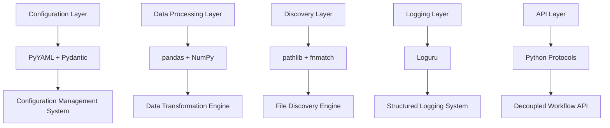

## 3.3 OPEN SOURCE DEPENDENCIES

### 3.3.1 Core Production Dependencies

**Data Processing & Validation**
- **pydantic ≥2.6**: Schema validation and data models
- **PyYAML**: YAML configuration parsing
- **loguru ≥0.7.0**: Structured logging framework
- **numpy ≥1.21.0**: Numerical computing foundation
- **pandas ≥1.3.0**: Data manipulation and analysis

**Built-in Module Dependencies**
- **pickle**: Python object serialization for data loading
- **gzip**: Compressed file format support (.pkl.gz, .pklz)
- **pathlib**: Modern path manipulation
- **fnmatch**: Unix shell-style wildcards for pattern matching
- **re**: Regular expression support for metadata extraction
- **datetime**: Date/time parsing for experimental metadata
- <span style="background-color: rgba(91, 57, 243, 0.2)">**warnings**: Standard library module for issuing deprecation warnings</span>
- <span style="background-color: rgba(91, 57, 243, 0.2)">**functools**: Higher-order functions and decorators for deprecation strategy implementation</span>
- <span style="background-color: rgba(91, 57, 243, 0.2)">**importlib.metadata**: Runtime package metadata access for plugin discovery (Python ≥3.8)</span>

### 3.3.2 Development Dependencies

**Testing Infrastructure**
- **pytest ≥7.0.0**: Primary test framework with custom markers
- **pytest-cov ≥6.1.1**: Coverage reporting with subprocess and xdist support
- **pytest-mock ≥3.14.1**: Enhanced mocking with type safety
- **pytest-benchmark ≥4.0.0**: Performance testing and regression detection
- **pytest-xdist ≥3.7.0**: Parallel test execution
- **pytest-timeout ≥2.3.0**: Test timeout management
- **coverage ≥7.8.2**: Core coverage measurement with ≥90% threshold requirement
- **hypothesis ≥6.131.9**: Property-based testing

**Code Quality & Analysis**
- **black ≥24.3.0**: Uncompromising code formatter
- **isort ≥5.12.0**: Import sorting with Black compatibility
- **mypy ≥1.8.0**: Static type checking
- **flake8 ≥7.0.0**: Comprehensive linting with plugin support
- **bandit**: Python security vulnerability scanning
- **safety**: Dependency vulnerability checking

**Performance & Resource Monitoring**
- **memory-profiler**: Memory usage analysis in CI/CD
- **psutil**: System resource monitoring during benchmarks

### 3.3.3 Build & Environment Dependencies

**Package Management**
- **setuptools ≥42**: Build backend for Python packaging
- **wheel**: Binary distribution format
- **pip**: Package installer

**Development Workflow**
- **pre-commit ≥3.6.0**: Git hook framework for automated quality gates

### 3.3.4 Package Registry & Distribution

**Primary Registry**: PyPI (Python Package Index)
- **Distribution Format**: Source distribution (sdist) and wheel
- **Installation Method**: pip install flyrigloader
- **Version Management**: PEP 440 compliant semantic versioning

**Environment Management**: 
- **Conda/Miniconda**: Primary environment manager with environment.yml specification
- **Environment Isolation**: Separate dev_env and prod_env configurations

## 3.4 DATABASES & STORAGE

### 3.4.1 Data Storage Architecture

**File-Based Storage Strategy**
- **Primary Storage**: Local filesystem with no external database dependencies
- **Rationale**: Aligns with neuroscience research workflows where data remains close to analysis environment
- **Security**: Eliminates network attack vectors and data privacy concerns for sensitive research data

### 3.4.2 Supported Data Formats

**Pickle File Formats**
- **Standard Pickle (.pkl)**: Uncompressed Python object serialization
- **Compressed Pickle (.pklz)**: Custom compressed pickle format
- **Gzipped Pickle (.pkl.gz)**: Standard gzip compression
- **Format Detection**: Automatic format detection based on file extension and magic numbers

**Secondary Formats**
- **CSV Files**: Fallback format for tabular data
- **YAML Files**: Configuration and metadata storage

### 3.4.3 Data Persistence Strategy

**File Organization**
- **Hierarchical Directory Structure**: Supports nested experimental data organization
- **Pattern-Based Discovery**: Configurable glob patterns for file location
- **Metadata Extraction**: Regex-based filename parsing for experimental metadata

**Performance Characteristics**
- **Memory Efficiency**: <2x data size memory footprint during processing
- **Processing Speed**: <1 second per 100MB of data loading target
- **Scalability**: Optimized for >10,000 files with <5 second discovery time

## 3.5 DEVELOPMENT & DEPLOYMENT

### 3.5.1 Development Environment

**Environment Management**
- **Conda**: Primary environment manager with automated setup
- **setup_env.sh**: Bash script for environment provisioning with --dev and --prod modes
- **activate_env.sh**: Environment activation helper script
- **Cross-Platform Support**: Linux, Windows, macOS compatibility

**Development Tools**
- **Version Control**: Git with GitHub hosting
- **IDE Support**: Compatible with VS Code, PyCharm, and Jupyter environments
- **Documentation**: Markdown-based with MkDocs/Sphinx references

### 3.5.2 Build System

**Package Build Configuration**
- **pyproject.toml**: PEP 621/518 compliant configuration defining build system and dependencies
- **Build Backend**: setuptools with wheel support
- **Distribution**: Source and binary distributions via PyPI

**Quality Assurance**
- **Pre-commit Hooks**: Automated formatting, linting, and security checks
- **Multi-Platform Testing**: Ubuntu, Windows, macOS CI/CD matrix
- **Python Version Matrix**: Testing across Python 3.8-3.11

### 3.5.3 Continuous Integration & Deployment

**CI/CD Platform**
- **GitHub Actions**: Primary CI/CD with two main workflows
  - **test.yml**: Multi-platform testing matrix
  - **quality-assurance.yml**: Code quality and security checks

**Automated Testing**
- **Test Coverage**: ≥90% threshold enforcement with Codecov integration
- **Performance Benchmarks**: Automated performance regression detection
- **Security Scanning**: Dependency vulnerability and code security analysis

**Deployment Strategy**
- **Package Registry**: PyPI for public distribution
- **Version Management**: Semantic versioning with automated release workflows
- **Environment Provisioning**: Automated environment setup for development and production

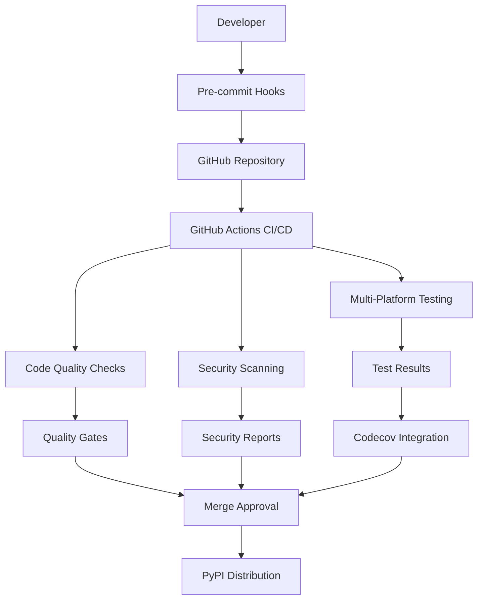

### 3.5.4 Technology Integration Requirements

**Framework Integration**
- **Kedro Compatibility**: Designed for integration with Kedro data pipeline framework
- **Jupyter Support**: Native compatibility with Jupyter notebook environments
- **Scientific Python Stack**: Seamless integration with existing pandas/numpy workflows

**Cross-Platform Deployment**
- **Operating System Support**: Linux, Windows, macOS
- **Python Version Compatibility**: 3.8-3.11 with comprehensive testing
- **Environment Isolation**: Conda-based environment management for reproducibility

### 3.5.5 Technology Stack Justification

**Core Architecture Decisions**
1. **Python-Only Implementation**: Aligns with neuroscience research community standards and provides rich scientific computing ecosystem
2. **Local File Storage**: Eliminates network dependencies and maintains data security for sensitive research data
3. **Pydantic Validation**: Ensures data integrity critical for scientific reproducibility
4. **Protocol-Based Dependency Injection**: Enables comprehensive testing and future extensibility
5. **Cross-Platform Support**: Accommodates diverse research computing environments

**Security & Compliance**
- **Input Validation**: Comprehensive validation through Pydantic schemas
- **Path Traversal Protection**: Secure file system operations
- **Dependency Scanning**: Automated vulnerability detection
- **No External Services**: Eliminates network-based attack vectors

**Performance & Scalability**
- **Memory Efficiency**: Optimized for large dataset processing
- **Processing Speed**: Performance targets aligned with research workflow requirements
- **Asynchronous-Ready**: Architecture prepared for future parallel processing

#### References

**Configuration Files**:
- `environment.yml` - Conda environment specification with cross-platform dependencies
- `pyproject.toml` - Python package configuration with build system and development dependencies
- `setup_env.sh` - Environment provisioning script with development and production modes

**CI/CD Workflows**:
- `.github/workflows/test.yml` - Multi-platform testing matrix configuration
- `.github/workflows/quality-assurance.yml` - Code quality and security enforcement

**Development Infrastructure**:
- `src/flyrigloader/` - Main package source with layered architecture
- `tests/` - Comprehensive test suite with >90% coverage requirement
- `docs/` - Documentation system with examples and API references

**Web Searches**: None conducted (all information derived from repository analysis)

# 4. PROCESS FLOWCHART

## 4.1 SYSTEM WORKFLOWS

### 4.1.1 Core Business Processes

#### High-Level System Workflow

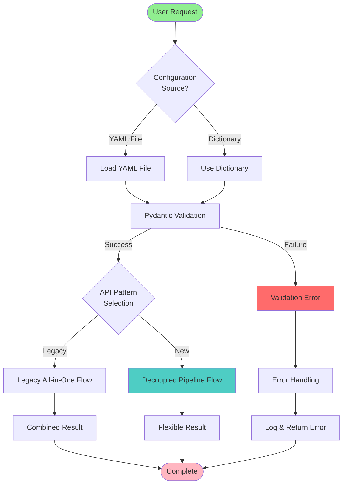

#### Configuration Loading and Validation Workflow

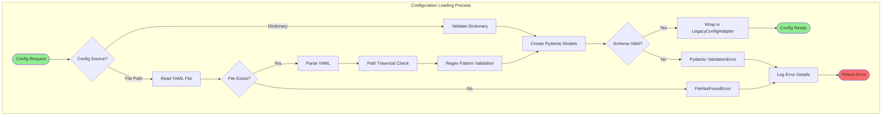

#### New Decoupled Pipeline Workflow (updated)

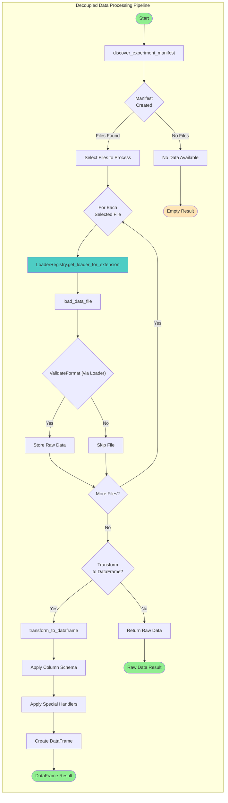

**Note**: <span style="background-color: rgba(91, 57, 243, 0.2)">Loader selection is performed through the singleton LoaderRegistry, which dynamically maps file extensions to appropriate loader classes for extensible format handling.</span>

#### Legacy API Workflow (Backward Compatibility)

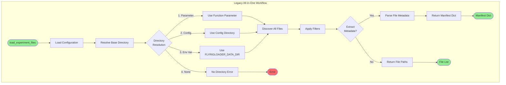

### 4.1.2 Integration Workflows

#### File Discovery Engine Workflow (F-001)

```mermaid
flowchart TD
    subgraph "File Discovery Process"
        Start([Discovery Request]) --> GetConfig[Get Discovery Config]
        
        GetConfig --> ConfigInfo{Config Contains}
        ConfigInfo --> IgnorePatterns[Ignore Patterns]
        ConfigInfo --> MandatoryStrings[Mandatory Substrings]
        ConfigInfo --> ExtractPatterns[Extraction Patterns]
        
        IgnorePatterns --> StartDiscovery
        MandatoryStrings --> StartDiscovery
        ExtractPatterns --> StartDiscovery
        
        StartDiscovery[Start File Discovery] --> RecursiveCheck{Recursive?}
        
        RecursiveCheck -->|Yes| RGlob[Recursive Glob]
        RecursiveCheck -->|No| Glob[Standard Glob]
        
        RGlob --> FileList[File List]
        Glob --> FileList
        
        FileList --> FilterLoop{For Each File}
        
        FilterLoop --> CheckIgnore{Matches<br/>Ignore?}
        CheckIgnore -->|Yes| SkipFile[Skip File]
        CheckIgnore -->|No| CheckMandatory{Has Mandatory<br/>Substring?}
        
        CheckMandatory -->|No| SkipFile
        CheckMandatory -->|Yes| CheckExt{Valid<br/>Extension?}
        
        CheckExt -->|No| SkipFile
        CheckExt -->|Yes| ExtractCheck{Extract<br/>Metadata?}
        
        ExtractCheck -->|Yes| ExtractMetadata[Extract from Filename]
        ExtractCheck -->|No| AddFile[Add to Results]
        
        ExtractMetadata --> ParseDates{Parse<br/>Dates?}
        ParseDates -->|Yes| ParseDateTime[Parse Date Strings]
        ParseDates -->|No| AddWithMeta[Add with Metadata]
        
        ParseDateTime --> AddWithMeta
        
        AddFile --> NextFile{More Files?}
        AddWithMeta --> NextFile
        SkipFile --> NextFile
        
        NextFile -->|Yes| FilterLoop
        NextFile -->|No| AttachStats{Attach<br/>Stats?}
        
        AttachStats -->|Yes| GetFileStats[Get File Statistics]
        AttachStats -->|No| ReturnResults
        
        GetFileStats --> ReturnResults[Return Results]
    end
    
    style Start fill:#90EE90
    style ReturnResults fill:#90EE90
```

#### Data Loading and Transformation Pipeline (F-003 & F-004) (updated)

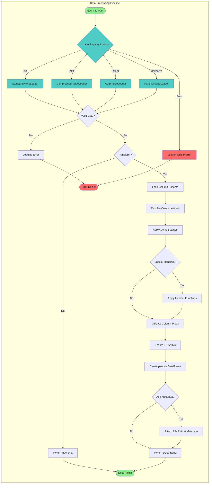

**Note**: <span style="background-color: rgba(91, 57, 243, 0.2)">Loader classes are dynamically resolved through the singleton LoaderRegistry, which maps file extensions to appropriate loader implementations. Schema validation and transformation handlers are similarly managed through the SchemaRegistry singleton.</span>

#### Kedro Integration Workflow

```mermaid
flowchart TD
    subgraph "Kedro Pipeline Integration"
        Start([Kedro Node]) --> GetContext[Get Kedro Context]
        
        GetContext --> LoadParams[Load Parameters]
        LoadParams --> InitFlyrig[Initialize FlyRigLoader]
        
        InitFlyrig --> ConfigCheck{Config<br/>Available?}
        ConfigCheck -->|Yes| UseKedroConfig[Use Kedro Config]
        ConfigCheck -->|No| DefaultConfig[Use Default Config]
        
        UseKedroConfig --> CreateManifest[Create Experiment Manifest]
        DefaultConfig --> CreateManifest
        
        CreateManifest --> ProcessData[Process Data Files]
        ProcessData --> TransformData[Transform to DataFrame]
        
        TransformData --> ValidateOutput[Validate Output Schema]
        ValidateOutput --> ReturnData[Return to Kedro]
        
        ReturnData --> End([Kedro Output])
    end
    
    style Start fill:#90EE90
    style End fill:#90EE90
```

### 4.1.3 Error Handling and Recovery Workflows

#### Error Handling State Machine

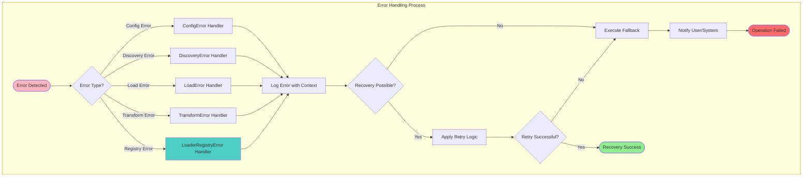

#### Validation and State Management Workflow

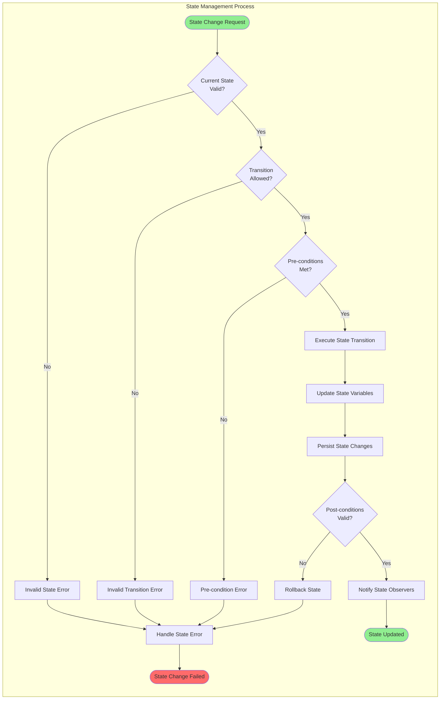

### 4.1.4 Performance and Optimization Workflows

#### Memory Management Workflow

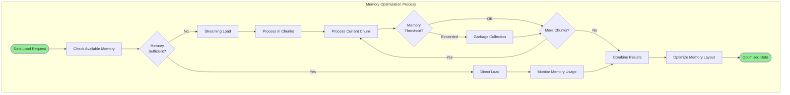

#### Caching and Performance Workflow

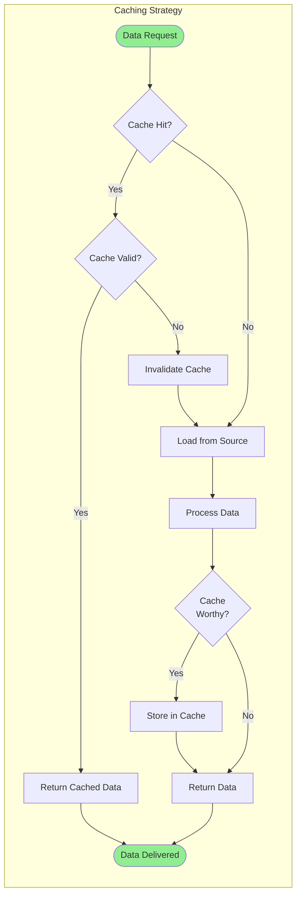

## 4.2 FLOWCHART REQUIREMENTS

#### System-Wide Validation Rules

```mermaid
flowchart TD
    subgraph "System-Wide Validation Rules"
        Input([User Input]) --> PathVal[Path Validation]
        
        PathVal --> PathChecks{Path Security}
        PathChecks -->|Check 1| NoTraversal[No ../ Patterns]
        PathChecks -->|Check 2| ValidChars[Valid Characters]
        PathChecks -->|Check 3| ReservedNames[No Reserved Names]
        
        NoTraversal --> RegexVal
        ValidChars --> RegexVal
        ReservedNames --> RegexVal
        
        RegexVal[Regex Validation] --> RegexChecks{Pattern Safety}
        RegexChecks -->|Check 1| ValidSyntax[Valid Regex Syntax]
        RegexChecks -->|Check 2| NoReDoS[No ReDoS Patterns]
        RegexChecks -->|Check 3| CompileTest[Compilation Test]
        
        ValidSyntax --> DateVal
        NoReDoS --> DateVal
        CompileTest --> DateVal
        
        DateVal[Date Validation] --> DateFormats{Supported Formats}
        DateFormats -->|Primary| ISO[YYYY-MM-DD]
        DateFormats -->|US| USDATE[MM/DD/YYYY]
        DateFormats -->|EU| EUDATE[DD/MM/YYYY]
        DateFormats -->|Compact| COMPACT[YYYYMMDD]
        
        ISO --> SchemaVal
        USDATE --> SchemaVal
        EUDATE --> SchemaVal
        COMPACT --> SchemaVal
        
        SchemaVal[Schema Validation] --> TypeCheck[Type Checking]
        TypeCheck --> DimCheck[Dimension Checking]
        DimCheck --> RequiredCheck[Required Fields]
        RequiredCheck --> Success([Validated])
    end
    
    style Input fill:#90EE90
    style Success fill:#90EE90
```

#### Authorization and Business Rules Checkpoints

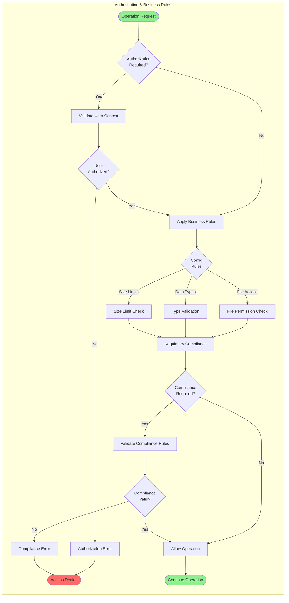

## 4.3 TECHNICAL IMPLEMENTATION

### 4.3.1 State Management Flow

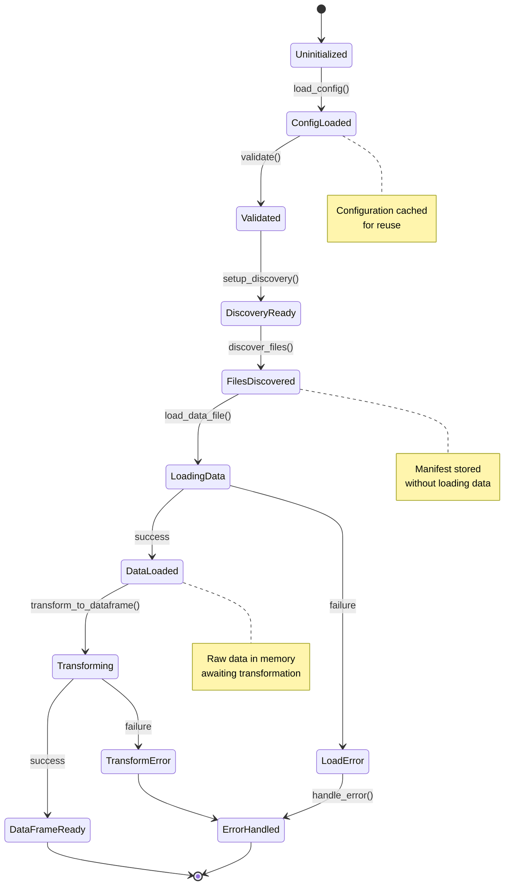

### 4.3.2 Error Handling and Recovery Flow (updated)

**Note**: All exceptions inherit from FlyRigLoaderError (see Section 2.4.6).

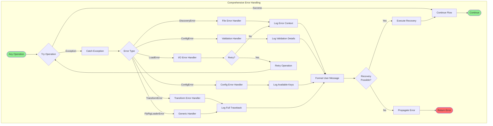

### 4.3.3 Memory Management and Caching Strategy

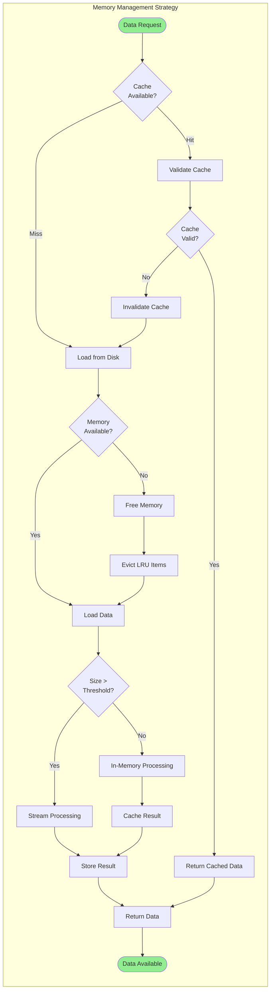

### 4.3.4 Transaction Boundaries and Data Persistence

The technical implementation maintains strict transaction boundaries to ensure data integrity throughout the processing pipeline. State transitions are managed through atomic operations, with clear rollback mechanisms for failed transactions.

#### Transaction Management Flow

```mermaid
flowchart TD
    subgraph "Transaction Management"
        Start([Begin Transaction]) --> AcquireLock[Acquire Resource Lock]
        
        AcquireLock --> ValidationPhase[Validation Phase]
        ValidationPhase --> ValidateInputs{Inputs Valid?}
        
        ValidateInputs -->|No| RollbackTransaction[Rollback Transaction]
        ValidateInputs -->|Yes| ExecutionPhase[Execution Phase]
        
        ExecutionPhase --> ProcessData[Process Data]
        ProcessData --> DataCheck{Data Consistent?}
        
        DataCheck -->|No| RollbackTransaction
        DataCheck -->|Yes| CommitPhase[Commit Phase]
        
        CommitPhase --> PersistChanges[Persist Changes]
        PersistChanges --> ReleaseLock[Release Resource Lock]
        
        ReleaseLock --> CommitSuccess[Commit Success]
        
        RollbackTransaction --> CleanupResources[Cleanup Resources]
        CleanupResources --> ReleaseLock
        
        CommitSuccess --> End([Transaction Complete])
        ReleaseLock --> End
    end
    
    style Start fill:#90EE90
    style End fill:#90EE90
    style RollbackTransaction fill:#FF6B6B
```

### 4.3.5 Retry Mechanisms and Circuit Breaker Pattern

The system implements sophisticated retry mechanisms with exponential backoff and circuit breaker patterns to handle transient failures gracefully. This ensures robust operation under varying load conditions and temporary service disruptions.

#### Retry and Circuit Breaker Flow

```mermaid
flowchart LR
    subgraph "Retry and Circuit Breaker"
        Start([Operation Request]) --> CircuitState{Circuit State?}
        
        CircuitState -->|Closed| ExecuteOperation[Execute Operation]
        CircuitState -->|Open| FastFail[Fast Fail]
        CircuitState -->|Half-Open| TestOperation[Test Operation]
        
        ExecuteOperation --> OpResult{Operation Result?}
        TestOperation --> OpResult
        
        OpResult -->|Success| ResetCircuit[Reset Circuit]
        OpResult -->|Failure| CheckRetry{Retry Allowed?}
        
        CheckRetry -->|Yes| BackoffDelay[Exponential Backoff]
        CheckRetry -->|No| OpenCircuit[Open Circuit]
        
        BackoffDelay --> RetryOperation[Retry Operation]
        RetryOperation --> OpResult
        
        OpenCircuit --> FastFail
        FastFail --> ErrorResponse[Error Response]
        
        ResetCircuit --> Success[Success Response]
        
        Success --> End([Complete])
        ErrorResponse --> End
    end
    
    style Start fill:#90EE90
    style End fill:#90EE90
    style FastFail fill:#FF6B6B
    style OpenCircuit fill:#FF6B6B
```

### 4.3.6 Performance Monitoring and Optimization

The technical implementation includes comprehensive performance monitoring with automated optimization triggers. This ensures consistent performance under varying workloads and provides early warning for potential bottlenecks.

#### Performance Monitoring Flow

```mermaid
flowchart TD
    subgraph "Performance Monitoring"
        Start([Monitor Request]) --> CollectMetrics[Collect Performance Metrics]
        
        CollectMetrics --> MetricsAnalysis{Metrics Analysis}
        MetricsAnalysis -->|Memory| MemoryCheck{Memory Usage OK?}
        MetricsAnalysis -->|CPU| CPUCheck{CPU Usage OK?}
        MetricsAnalysis -->|I/O| IOCheck{I/O Performance OK?}
        
        MemoryCheck -->|No| MemoryOptimize[Memory Optimization]
        MemoryCheck -->|Yes| ContinueMonitoring
        
        CPUCheck -->|No| CPUOptimize[CPU Optimization]
        CPUCheck -->|Yes| ContinueMonitoring
        
        IOCheck -->|No| IOOptimize[I/O Optimization]
        IOCheck -->|Yes| ContinueMonitoring
        
        MemoryOptimize --> ApplyOptimization[Apply Optimization]
        CPUOptimize --> ApplyOptimization
        IOOptimize --> ApplyOptimization
        
        ApplyOptimization --> ValidateOptimization{Optimization Effective?}
        ValidateOptimization -->|Yes| ContinueMonitoring
        ValidateOptimization -->|No| AlertAdmin[Alert Administrator]
        
        ContinueMonitoring --> End([Monitor Complete])
        AlertAdmin --> End
    end
    
    style Start fill:#90EE90
    style End fill:#90EE90
    style AlertAdmin fill:#FFB6C1
```

### 4.3.7 Asynchronous Processing and Event Handling

The architecture supports asynchronous processing capabilities for handling large datasets and concurrent operations. Event-driven patterns ensure responsive system behavior and efficient resource utilization.

#### Asynchronous Processing Flow

```mermaid
flowchart LR
    subgraph "Asynchronous Processing"
        Start([Async Request]) --> QueueRequest[Queue Request]
        
        QueueRequest --> WorkerPool{Worker Pool}
        WorkerPool -->|Worker 1| ProcessAsync1[Process Async 1]
        WorkerPool -->|Worker 2| ProcessAsync2[Process Async 2]
        WorkerPool -->|Worker N| ProcessAsyncN[Process Async N]
        
        ProcessAsync1 --> CompleteTask1[Complete Task 1]
        ProcessAsync2 --> CompleteTask2[Complete Task 2]
        ProcessAsyncN --> CompleteTaskN[Complete Task N]
        
        CompleteTask1 --> AggregateResults[Aggregate Results]
        CompleteTask2 --> AggregateResults
        CompleteTaskN --> AggregateResults
        
        AggregateResults --> ValidateResults{Results Valid?}
        ValidateResults -->|Yes| NotifyComplete[Notify Complete]
        ValidateResults -->|No| HandleError[Handle Error]
        
        NotifyComplete --> End([Async Complete])
        HandleError --> End
    end
    
    style Start fill:#90EE90
    style End fill:#90EE90
    style HandleError fill:#FF6B6B
```

### 4.3.8 Configuration Management and Hot Reloading

The system supports dynamic configuration updates without service interruption through hot reloading mechanisms. This enables real-time adjustments to system behavior and processing parameters.

#### Hot Reload Configuration Flow

```mermaid
flowchart TD
    subgraph "Hot Reload Configuration"
        Start([Config Change Detected]) --> ValidateConfig[Validate New Configuration]
        
        ValidateConfig --> ConfigValid{Configuration Valid?}
        ConfigValid -->|No| RejectConfig[Reject Configuration]
        ConfigValid -->|Yes| BackupCurrent[Backup Current Config]
        
        BackupCurrent --> ApplyConfig[Apply New Configuration]
        ApplyConfig --> TestConfig[Test Configuration]
        
        TestConfig --> TestResult{Test Successful?}
        TestResult -->|Yes| CommitConfig[Commit Configuration]
        TestResult -->|No| RollbackConfig[Rollback Configuration]
        
        CommitConfig --> NotifyServices[Notify Services]
        RollbackConfig --> RestoreBackup[Restore Backup]
        
        NotifyServices --> Success[Config Updated]
        RestoreBackup --> RecoveryComplete[Recovery Complete]
        RejectConfig --> ConfigError[Configuration Error]
        
        Success --> End([Complete])
        RecoveryComplete --> End
        ConfigError --> End
    end
    
    style Start fill:#90EE90
    style End fill:#90EE90
    style Success fill:#90EE90
    style RecoveryComplete fill:#90EE90
    style ConfigError fill:#FF6B6B
```

## 4.4 REQUIRED DIAGRAMS

### 4.4.1 Complete System Integration Sequence

The following sequence diagram illustrates the complete system integration flow, showing the interaction between all major components including the newly integrated registry systems for extensible loader and schema management.

```mermaid
sequenceDiagram
    participant User
    participant API
    participant Config
    participant Discovery
    participant LoaderRegistry
    participant IO
    participant Transform
    participant SchemaRegistry
    participant Logger
    
    User->>API: Request experiment data
    API->>Logger: Log request start
    
    API->>Config: Load configuration
    Config->>Config: Validate with Pydantic
    Config-->>API: Return validated config
    
    API->>Discovery: Discover files
    Discovery->>Config: Get filter patterns
    Config-->>Discovery: Return patterns
    Discovery->>Discovery: Apply filters
    Discovery->>Logger: Log discovered files
    Discovery-->>API: Return manifest
    
    API->>User: Show manifest
    User->>API: Select files to process
    
    loop For each selected file
        API->>LoaderRegistry: <span style="background-color: rgba(91, 57, 243, 0.2)">get_loader_for_extension</span>
        LoaderRegistry-->>API: <span style="background-color: rgba(91, 57, 243, 0.2)">Return appropriate loader</span>
        
        API->>IO: Load data file
        IO->>IO: Detect format
        IO->>Logger: Log loading progress
        IO-->>API: Return raw data
        
        API->>Transform: Transform to DataFrame
        Transform->>SchemaRegistry: <span style="background-color: rgba(91, 57, 243, 0.2)">get_schema</span>
        SchemaRegistry-->>Transform: <span style="background-color: rgba(91, 57, 243, 0.2)">Return schema configuration</span>
        Transform->>Config: Get column schema
        Config-->>Transform: Return schema
        Transform->>Transform: Apply transformations
        Transform->>Logger: Log transformation
        Transform-->>API: Return DataFrame
    end
    
    API->>Logger: Log completion
    API-->>User: Return results
```

### 4.4.2 Feature Interaction Workflow (updated)

The feature interaction map demonstrates the relationships between all system features, including the newly integrated registry components that provide extensible loader and schema management capabilities.

```mermaid
flowchart TD
    subgraph "Feature Interaction Map"
        F002["F-002 Configuration<br/>Management"] --> F001["F-001 File Discovery<br/>Engine"]
        F002 --> F005["F-005 Column Schema<br/>Management"]
        F002 --> F006["F-006 Legacy Config<br/>Adapter"]
        
        F001 --> F011["F-011 Loader Registry"]
        F011 --> F003["F-003 Data Loading<br/>Pipeline"]
        F001 --> F003
        F001 --> F010["F-010 Metadata<br/>Extraction"]
        
        F005 --> F012["F-012 Schema Registry"]
        F012 --> F004["F-004 Data Transform<br/>Engine"]
        F005 --> F004
        F003 --> F004
        
        F001 --> F007["F-007 Decoupled<br/>Workflow API"]
        F003 --> F007
        F004 --> F007
        
        F008["F-008 Path Management<br/>Utilities"] --> F001
        F008 --> F003
        
        F009["F-009 Structured<br/>Logging"] --> F001
        F009 --> F002
        F009 --> F003
        F009 --> F004
        F009 --> F005
        F009 --> F006
        F009 --> F007
        F009 --> F008
        F009 --> F010
        F009 --> F011
        F009 --> F012
    end
    
    style F002 fill:#FFE4B5
    style F007 fill:#4ECDC4
    style F009 fill:#DDA0DD
    style F011 fill:#ADD8E6
    style F012 fill:#ADD8E6
```

### 4.4.3 Performance and SLA Monitoring Points

The performance monitoring diagram tracks critical timing thresholds across all system operations, ensuring optimal performance and early warning of potential bottlenecks.

```mermaid
flowchart TB
    subgraph "Performance Monitoring Points"
        Start([Request Start]) --> T1[Start Timer]
        
        T1 --> ConfigLoad[Configuration Loading]
        ConfigLoad --> M1{< 100ms?}
        M1 -->|No| PerfWarn1[Performance Warning]
        
        M1 -->|Yes| Discovery
        PerfWarn1 --> Discovery[File Discovery]
        Discovery --> M2{< 5s for 10k files?}
        M2 -->|No| PerfWarn2[Performance Warning]
        
        M2 -->|Yes| DataLoad
        PerfWarn2 --> DataLoad[Data Loading]
        DataLoad --> M3{< 1s per 100MB?}
        M3 -->|No| PerfWarn3[Performance Warning]
        
        M3 -->|Yes| Transform
        PerfWarn3 --> Transform[Transformation]
        Transform --> M4{< 500ms for 1M rows?}
        M4 -->|No| PerfWarn4[Performance Warning]
        
        M4 -->|Yes| Complete
        PerfWarn4 --> Complete[Request Complete]
        
        Complete --> T2[End Timer]
        T2 --> LogMetrics[Log Performance Metrics]
        
        PerfWarn1 --> LogMetrics
        PerfWarn2 --> LogMetrics
        PerfWarn3 --> LogMetrics
        PerfWarn4 --> LogMetrics
    end
    
    style Start fill:#90EE90
    style LogMetrics fill:#90EE90
    style PerfWarn1 fill:#FFE4B5
    style PerfWarn2 fill:#FFE4B5
    style PerfWarn3 fill:#FFE4B5
    style PerfWarn4 fill:#FFE4B5
```

### 4.4.4 Error Handling and Recovery Flow

The comprehensive error handling diagram demonstrates how the system manages various failure scenarios, including registry-related errors, with appropriate recovery mechanisms.

```mermaid
flowchart TD
    subgraph "Error Handling Process"
        Start([Error Detected]) --> ClassifyError{Error Type?}
        
        ClassifyError -->|Config Error| ConfigHandler["ConfigError Handler"]
        ClassifyError -->|Discovery Error| DiscoveryHandler["DiscoveryError Handler"]
        ClassifyError -->|Load Error| LoadHandler["LoadError Handler"]
        ClassifyError -->|Transform Error| TransformHandler["TransformError Handler"]
        ClassifyError -->|Registry Error| RegistryHandler["RegistryError Handler"]
        
        ConfigHandler --> LogError["Log Error with Context"]
        DiscoveryHandler --> LogError
        LoadHandler --> LogError
        TransformHandler --> LogError
        RegistryHandler --> LogError
        
        LogError --> DetermineRecovery{"Recovery Possible?"}
        
        DetermineRecovery -->|Yes| RetryMechanism["Apply Retry Logic"]
        DetermineRecovery -->|No| FallbackStrategy["Execute Fallback"]
        
        RetryMechanism --> RetryCheck{"Retry Successful?"}
        RetryCheck -->|Yes| Success([Recovery Success])
        RetryCheck -->|No| FallbackStrategy
        
        FallbackStrategy --> NotifyUser["Notify User/System"]
        NotifyUser --> Failure([Operation Failed])
    end
    
    style Start fill:#FFB6C1
    style Success fill:#90EE90
    style Failure fill:#FF6B6B
    style RegistryHandler fill:#ADD8E6
```

### 4.4.5 State Transition Diagrams

The state management diagram illustrates the various states and transitions that occur during the data processing lifecycle, including registry initialization and validation phases.

```mermaid
stateDiagram-v2
    [*] --> Uninitialized
    
    Uninitialized --> RegistryInit: initialize_registries()
    RegistryInit --> ConfigLoaded: load_config()
    ConfigLoaded --> Validated: validate()
    
    Validated --> DiscoveryReady: setup_discovery()
    DiscoveryReady --> FilesDiscovered: discover_files()
    
    FilesDiscovered --> LoaderSelected: select_loader()
    LoaderSelected --> LoadingData: load_data_file()
    LoadingData --> DataLoaded: success
    LoadingData --> LoadError: failure
    
    DataLoaded --> SchemaResolved: resolve_schema()
    SchemaResolved --> Transforming: transform_to_dataframe()
    Transforming --> DataFrameReady: success
    Transforming --> TransformError: failure
    
    LoadError --> ErrorHandled: handle_error()
    TransformError --> ErrorHandled
    
    DataFrameReady --> [*]
    ErrorHandled --> [*]
    
    note right of RegistryInit
        Initialize LoaderRegistry
        and SchemaRegistry
    end note
    
    note right of LoaderSelected
        Registry maps extension
        to appropriate loader
    end note
    
    note right of SchemaResolved
        Registry provides schema
        configuration for transformation
    end note
```

### 4.4.6 Integration Architecture Overview

The high-level integration architecture diagram shows the relationship between all major system components, emphasizing the central role of the registry systems in providing extensible functionality.

```mermaid
flowchart TB
    subgraph "Core System Components"
        API[API Gateway]
        Config[Configuration Manager]
        Discovery[File Discovery Engine]
        Logger[Structured Logging]
    end
    
    subgraph "Registry Systems"
        LoaderReg[LoaderRegistry<br/>- Extension Mapping<br/>- Loader Selection<br/>- Plugin Management]
        SchemaReg[SchemaRegistry<br/>- Schema Management<br/>- Validation Rules<br/>- Transformation Config]
    end
    
    subgraph "Processing Pipeline"
        DataLoader[Data Loading Pipeline]
        Transform[Data Transformation Engine]
        Output[DataFrame Output]
    end
    
    subgraph "Support Services"
        PathMgmt[Path Management]
        Metadata[Metadata Extraction]
        LegacyAdapter[Legacy Config Adapter]
    end
    
    API --> Config
    API --> Discovery
    API --> Logger
    
    Discovery --> LoaderReg
    LoaderReg --> DataLoader
    Discovery --> DataLoader
    
    DataLoader --> Transform
    Transform --> SchemaReg
    SchemaReg --> Transform
    
    Transform --> Output
    
    PathMgmt --> Discovery
    PathMgmt --> DataLoader
    
    Metadata --> Discovery
    
    Config --> LegacyAdapter
    
    Logger --> Discovery
    Logger --> DataLoader
    Logger --> Transform
    Logger --> LoaderReg
    Logger --> SchemaReg
    
    style LoaderReg fill:#ADD8E6
    style SchemaReg fill:#ADD8E6
    style API fill:#4ECDC4
    style Output fill:#90EE90
```

### 4.4.7 Timing and SLA Considerations

The system maintains strict timing requirements across all operations, with special attention to registry lookup performance to ensure minimal overhead for extensibility features.

#### Critical Timing Thresholds
- **Registry Lookups**: < 1ms (negligible overhead)
- **Configuration Loading**: < 100ms
- **File Discovery**: < 5s for 10,000 files
- **Data Loading**: < 1s per 100MB
- **Transformation**: < 500ms for 1M rows
- **End-to-End Processing**: < 30s for typical workflows

#### Performance Optimization Points
- Registry caching for frequently accessed loaders and schemas
- Lazy loading of registry components
- Memory-efficient schema validation
- Parallel processing for multiple file operations
- Optimized data structure usage in registries

The registry systems are designed to provide extensibility without compromising performance, maintaining sub-millisecond lookup times that fall well within existing system timing envelopes.

## 4.5 NOTES

### 4.5.1 Mermaid.js Syntax Implementation
- All diagrams utilize standard Mermaid.js flowchart, sequence, and state diagram syntax
- Decision points are represented as rhombus shapes with clear conditional paths
- Process steps are displayed in rectangles with descriptive labels
- Start/end points use rounded rectangles with distinct color coding
- Error states are highlighted in red (#FF6B6B) for immediate recognition
- Success states are highlighted in green (#90EE90) for positive outcomes
- Warning states use orange (#FFE4B5) for attention-requiring conditions

### 4.5.2 Timing Constraints and SLA Requirements
- **Configuration validation**: Must complete within 100ms for typical configurations
- **File discovery**: Must handle 10,000 files in under 5 seconds
- **Data loading**: Target performance of less than 1 second per 100MB
- **DataFrame transformation**: Must complete within 500ms for 1M row datasets
- **Memory efficiency**: Must not exceed 2x data size in memory footprint
- **Overall request processing**: Should complete within reasonable time based on data size and complexity

### 4.5.3 Key Decision Points Documented
1. **Configuration Source Selection**: File path versus dictionary input with proper validation
2. **API Pattern Choice**: Legacy all-in-one versus new decoupled pipeline architecture
3. **Data Directory Resolution**: Follows clear precedence rules (parameter → config → env var)
4. **File Format Detection**: Automatic format detection with multiple fallback mechanisms
5. **Transformation Requirements**: Raw data versus DataFrame based on specific use case
6. **Error Recovery Strategy**: Comprehensive retry logic for transient failures with context preservation
7. <span style="background-color: rgba(91, 57, 243, 0.2)">**Exception Mapping Strategy**: Domain-specific exceptions (ConfigError, DiscoveryError, LoadError, TransformError) map 1-to-1 to pipeline stages for granular handling.</span>

### 4.5.4 Cross-References to Technical Requirements
- Configuration validation aligns with Feature F-002 requirements and Pydantic v2 constraints
- File discovery performance meets Feature F-001 scalability requirements for large directories
- Data loading follows Feature F-003 memory efficiency guidelines and format support
- Transformation adheres to Feature F-004 backward compatibility requirements
- Error handling implements comprehensive context preservation per Section 2.4.6
- Security validation follows path traversal protection requirements from Section 2.4.2
- Performance monitoring aligns with measurable objectives from Section 1.2.3
- <span style="background-color: rgba(91, 57, 243, 0.2)">Loader and Schema registries correspond to new Features F-011 and F-012 introduced in Section 0.2.2.</span>

### 4.5.5 Integration Points with External Systems
- **Kedro Framework**: Pipeline orchestration and parameter management
- **Jupyter Notebooks**: Interactive data analysis and exploration workflows
- **Scientific Python Stack**: Integration with pandas, numpy, and scipy
- **File System**: Cross-platform file operations with pathlib support
- **Logging Infrastructure**: Structured logging with Loguru for observability

#### References

#### Files Examined
- `src/flyrigloader/api.py` - Main API entry points and workflow orchestration
- `src/flyrigloader/config/yaml_config.py` - Configuration loading and validation
- `src/flyrigloader/config/discovery.py` - Config-aware file discovery logic
- `src/flyrigloader/discovery/files.py` - Core file discovery engine
- `src/flyrigloader/discovery/patterns.py` - Pattern matching and filtering
- `src/flyrigloader/discovery/stats.py` - File statistics collection
- `src/flyrigloader/io/pickle.py` - Data loading and format detection
- `src/flyrigloader/io/column_models.py` - Column schema validation
- `src/flyrigloader/utils/path_utils.py` - Cross-platform path utilities
- `examples/external_project/analyze_experiment.py` - End-to-end workflow example

#### Folders Explored
- `src/flyrigloader/config/` - Configuration management subsystem
- `src/flyrigloader/discovery/` - File discovery and pattern matching
- `src/flyrigloader/io/` - Data input/output and transformation
- `src/flyrigloader/utils/` - Cross-cutting utilities and helpers
- `examples/external_project/` - Practical implementation examples

#### Technical Specifications Referenced
- **1.2 SYSTEM OVERVIEW** - System architecture and component relationships
- **2.1 FEATURE CATALOG** - Feature descriptions and dependencies
- **2.3 FEATURE RELATIONSHIPS** - Component interaction mapping
- **2.4 IMPLEMENTATION CONSIDERATIONS** - Technical constraints and performance requirements

# 5. SYSTEM ARCHITECTURE

## 5.1 HIGH-LEVEL ARCHITECTURE

### 5.1.1 System Overview

FlyRigLoader implements a **layered architecture** with **Protocol-based dependency injection**, specifically designed for neuroscience research data management. This architectural approach addresses the unique challenges of scientific data workflows while maintaining enterprise-grade reliability and extensibility.

The system's architecture is built around five core principles:

**Separation of Concerns**: Each layer maintains distinct responsibilities, from high-level API facade to low-level file operations. <span style="background-color: rgba(91, 57, 243, 0.2)">The architecture now implements a strictly decoupled three-stage pipeline: discover → load → transform, where each stage operates independently and can be tested in isolation.</span>

**Protocol-based Dependency Injection**: Rather than traditional inheritance hierarchies, the system uses Python Protocols to define contracts between layers. This approach enables superior testability through mock injection and plugin-style extensibility for new data formats.

**<span style="background-color: rgba(91, 57, 243, 0.2)">Registry-Based Extensibility</span>**: <span style="background-color: rgba(91, 57, 243, 0.2)">The LoaderRegistry and SchemaRegistry serve as first-class architectural elements, enabling dynamic registration of file format handlers and column validation schemas. This registry pattern replaces hardcoded mappings with plugin-style extensibility, allowing third-party extensions without core code modification.</span>

**Configuration-Driven Design**: All operational aspects are controlled through hierarchical YAML configurations validated by Pydantic v2 schemas. This eliminates hardcoded paths and enables environment-specific deployments without code changes.

**File-System Centric Architecture**: Unlike traditional enterprise systems that rely on databases, FlyRigLoader is architected around direct file system operations. This design choice aligns with neuroscience research workflows where data locality and researcher control are paramount.

**Lazy Loading and Memory Efficiency**: The system employs lazy loading patterns throughout, only loading data when explicitly requested and maintaining memory footprints below 2x the data size during processing.

<span style="background-color: rgba(91, 57, 243, 0.2)">**Decoupled Pipeline Architecture**: The discovery phase now returns metadata-only FileManifest objects without loading actual data, enabling fast directory traversal and independent validation. Data transformation is handled exclusively by the `flyrigloader.io.transformers` module, completely separated from the loading operations.</span>

<span style="background-color: rgba(91, 57, 243, 0.2)">**Unified Error Handling**: A comprehensive domain-specific exception hierarchy (`FlyRigLoaderError` → `ConfigError`/`DiscoveryError`/`LoadError`/`TransformError`) provides cross-cutting error management with context preservation and granular error handling capabilities.</span>

<span style="background-color: rgba(91, 57, 243, 0.2)">**Legacy API Compatibility**: Legacy monolithic APIs are maintained through deprecation wrappers during the transition period, ensuring backward compatibility while encouraging adoption of the new decoupled patterns.</span>

The architecture supports both legacy all-in-one workflows for backward compatibility and modern decoupled pipeline workflows for integration with frameworks like Kedro.

### 5.1.2 Core Components Table

| Component Name | Primary Responsibility | Key Dependencies | Integration Points | Critical Considerations |
|---------------|----------------------|------------------|------------------|----------------------|
| API Layer | High-level facade providing unified interface | All internal modules | Jupyter, Kedro, CLI | Backward compatibility with legacy workflows |
| Configuration Layer | Schema-validated settings management | Pydantic v2, PyYAML | File system, environment | Security validation, migration support |
| **<span style="background-color: rgba(91, 57, 243, 0.2)">Registries Layer</span>** | **<span style="background-color: rgba(91, 57, 243, 0.2)">Extensible registries for loaders & schemas</span>** | **<span style="background-color: rgba(91, 57, 243, 0.2)">typing, importlib</span>** | **<span style="background-color: rgba(91, 57, 243, 0.2)">I/O & Transformation layers</span>** | **<span style="background-color: rgba(91, 57, 243, 0.2)">Plugin discovery & thread-safety</span>** |
| Discovery Layer | Pattern-based file finding and metadata extraction | pathlib, regex, fnmatch | File system, configuration | Performance optimization for large datasets |
| I/O Layer | <span style="background-color: rgba(91, 57, 243, 0.2)">Raw data loading only; delegates transformation to transformers sub-module; uses LoaderRegistry for format selection</span> | pickle, pandas, numpy | File system, discovery | Memory efficiency, format auto-detection |
| Utilities Layer | Cross-cutting concerns and helpers | loguru, pathlib | All layers | Provider injection, <span style="background-color: rgba(91, 57, 243, 0.2)">test-hook machinery moved to `utils/testing.py`, reducing cross-layer coupling</span> |

### 5.1.3 Data Flow Description

The system implements a **pipeline-based data flow** that transforms raw file system content into structured DataFrames through a series of well-defined transformation stages:

**Configuration Loading Phase**: YAML configuration files are loaded and validated against Pydantic schemas. The system performs security checks including path traversal prevention and ReDoS protection for regex patterns. Configuration inheritance is resolved, creating a consolidated view of project settings.

**Discovery Phase**: Using configuration-driven patterns, the system recursively searches directory structures for relevant files. Glob patterns are applied with configurable ignore filters, and metadata is extracted from filenames using regex patterns. <span style="background-color: rgba(91, 57, 243, 0.2)">The discovery phase returns `FileManifest` objects containing only metadata without loading actual data, enabling fast directory traversal and independent validation.</span>

**Loading Phase**: <span style="background-color: rgba(91, 57, 243, 0.2)">Files are processed using the LoaderRegistry to select appropriate loaders based on file extensions. The system handles standard pickle (.pkl), compressed pickle (.pklz), and gzipped pickle (.pkl.gz) formats through registered loader classes. This phase returns raw data objects without any transformation operations.</span>

**Transformation Phase**: <span style="background-color: rgba(91, 57, 243, 0.2)">Data transformation is executed exclusively by the `flyrigloader.io.transformers` module. Raw data dictionaries are transformed into pandas DataFrames using the SchemaRegistry for column validation and schema management. Special handlers process domain-specific data types, and metadata from the discovery phase is integrated into the final DataFrame structure.</span>

**Integration Phase**: Processed data is returned to consuming systems through standardized interfaces, with support for both legacy dictionary-based returns and modern DataFrame-based outputs.

### 5.1.4 External Integration Points

| System Name | Integration Type | Data Exchange Pattern | Protocol/Format | SLA Requirements |
|-------------|------------------|---------------------|----------------|------------------|
| Kedro Framework | Library dependency | DataFrame manifests | Python API | <1s per workflow node |
| Jupyter Notebooks | Interactive library | API function calls | Python objects | <5s discovery operations |
| File System | Direct I/O | Hierarchical data | Pickle/YAML/CSV | <2x memory footprint |
| Git | Version control | Configuration tracking | Git protocol | Configuration versioning |

## 5.2 COMPONENT DETAILS

### 5.2.1 API Layer Component

**Purpose and Responsibilities**: The API layer serves as the primary interface for external consumers, providing both backward-compatible legacy functions and modern decoupled workflow capabilities. It implements the facade pattern, consolidating functionality from all subsystems into a coherent public interface.

**Technologies and Frameworks**: Built on Python Protocols for dependency injection, with comprehensive type annotations for IDE support. Uses lazy loading patterns for performance optimization and memory efficiency.

**Key Interfaces and APIs**:
- <span style="background-color: rgba(91, 57, 243, 0.2)">**Modern Pydantic-based interfaces**: New simplified signatures accepting Pydantic config models directly, eliminating parameter confusion and improving IDE support</span>
- <span style="background-color: rgba(91, 57, 243, 0.2)">`discover_experiment_manifest(config: ExperimentConfig)`: Metadata-only discovery returning `FileManifest` objects</span>
- <span style="background-color: rgba(91, 57, 243, 0.2)">`load_data_file(file_path: Path, config: LoaderConfig)`: Single file loading with registry-based format selection</span>
- <span style="background-color: rgba(91, 57, 243, 0.2)">`transform_to_dataframe(raw_data: Dict, config: TransformConfig)`: Raw data to DataFrame conversion via transformers module</span>
- <span style="background-color: rgba(91, 57, 243, 0.2)">**Legacy deprecated functions**: `load_experiment_files()`, `load_dataset_files()` - marked with `@deprecated` decorator and backward-compatibility guarantee. Migration path documented in API reference.</span>

**Data Persistence Requirements**: No direct persistence - delegates to lower layers. Maintains configuration cache for performance optimization.

**Scaling Considerations**: Designed for single-machine operation with memory-efficient processing. Supports batch operations for large file sets with configurable memory limits.

```mermaid
graph TD
    A[External Consumer] --> B[API Layer]
    B --> C[Configuration Provider]
    B --> D[Discovery Provider]
    B --> E[IO Provider]
    B --> F[Utils Provider]
    B --> G[Registries Provider]
    
    C --> H[YAML Config Loading]
    D --> I[Metadata-Only Discovery]
    E --> J[Raw Data Loading]
    F --> K[Cross-cutting Utilities]
    G --> L[Loader & Schema Registries]
    
    H --> M[Validated Configuration]
    I --> N[FileManifest Objects]
    J --> O[Raw Data Objects]
    K --> P[Support Functions]
    L --> Q[Format Handlers]
    
    M --> R[Integrated Result]
    N --> R
    O --> R
    P --> R
    Q --> R
```

### 5.2.2 Configuration Layer Component

**Purpose and Responsibilities**: Manages hierarchical YAML configurations with security validation, schema enforcement, and migration support. Provides configuration-aware discovery capabilities and environment-specific overrides.

**Technologies and Frameworks**: Pydantic v2 for schema validation, PyYAML for YAML parsing with safe loading, pathlib for cross-platform path handling.

**Key Interfaces and APIs**:
- `load_config()`: Main configuration loading with validation
- `LegacyConfigAdapter`: Backward compatibility wrapper
- `ConfigProvider`: Protocol-based dependency injection interface
- `migrate_config()`: Configuration migration utilities
- <span style="background-color: rgba(91, 57, 243, 0.2)">**Builder functions**: `create_config()`, `create_discovery_config()`, `create_loader_config()` - programmatic configuration creation with intelligent defaults</span>
- <span style="background-color: rgba(91, 57, 243, 0.2)">**Enhanced validation**: Comprehensive field defaults reducing boilerplate, actionable error messages with specific field guidance</span>
- <span style="background-color: rgba(91, 57, 243, 0.2)">**Factory methods**: `from_directory()`, `from_template()` - common configuration patterns for rapid setup</span>

**Data Persistence Requirements**: Reads YAML files from file system, caches validated configurations in memory for performance.

**Scaling Considerations**: Configuration validation completes in <100ms for typical configurations. Supports hierarchical configuration inheritance for complex project structures.

```mermaid
sequenceDiagram
    participant C as Client
    participant CL as Config Layer
    participant B as Builder Functions
    participant V as Validator
    participant P as Pydantic
    participant FS as File System
    
    C->>CL: create_config()
    CL->>B: Generate defaults
    B-->>CL: Base configuration
    C->>CL: load_config(path)
    CL->>FS: Read YAML file
    FS-->>CL: Raw YAML content
    CL->>V: Security validation
    V-->>CL: Validated content
    CL->>P: Schema validation
    P-->>CL: Validated models
    CL-->>C: Configuration object
```

### 5.2.3 Discovery Layer Component

**Purpose and Responsibilities**: <span style="background-color: rgba(91, 57, 243, 0.2)">Implements pattern-based file discovery with metadata extraction, statistics collection, and configurable filtering. **Now exclusively returns metadata through `FileManifest` objects without loading actual data**, enabling fast directory traversal and independent validation.</span> Optimized for large directory structures with thousands of files.

**Technologies and Frameworks**: pathlib for cross-platform file operations, regex for metadata extraction, fnmatch for glob pattern matching.

**Key Interfaces and APIs**:
- `FileDiscoverer`: Core discovery engine with pattern matching
- <span style="background-color: rgba(91, 57, 243, 0.2)">`discover_experiment_manifest()`: Primary interface returning `FileManifest` objects with metadata only</span>
- `extract_metadata()`: Regex-based filename parsing
- `get_file_stats()`: Statistics collection with error handling
- `DiscoveryProvider`: Protocol interface for dependency injection

**Data Persistence Requirements**: No direct persistence - operates on file system metadata. Optionally caches discovery results for performance.

**Scaling Considerations**: Optimized for >10,000 files with <5 second discovery time. Supports recursive and non-recursive discovery modes.

```mermaid
stateDiagram-v2
    [*] --> Initialized
    Initialized --> ConfigLoaded: load_patterns()
    ConfigLoaded --> Discovering: start_discovery()
    Discovering --> Filtering: apply_filters()
    Filtering --> Extracting: extract_metadata()
    Extracting --> Statistics: collect_stats()
    Statistics --> Complete: finalize_manifest()
    Complete --> [*]
    
    Discovering --> DiscoveryError: file_access_error
    Filtering --> DiscoveryError: pattern_error
    Extracting --> DiscoveryError: regex_error
    Statistics --> DiscoveryError: stats_error
    DiscoveryError --> [*]
```

### 5.2.4 I/O Layer Component

**Purpose and Responsibilities**: <span style="background-color: rgba(91, 57, 243, 0.2)">Handles **raw file loading only** from multiple pickle formats with automatic format detection. Loader selection is performed through `LoaderRegistry` for extensible format support. Data transformation is delegated to the `flyrigloader.io.transformers` module.</span>

**Technologies and Frameworks**: pickle for data loading, pandas for DataFrame operations, numpy for numerical data handling, Pydantic for column schema validation.

**Key Interfaces and APIs**:
- `load_pickle_file()`: Multi-format pickle loading
- <span style="background-color: rgba(91, 57, 243, 0.2)">`load_data_file()`: Registry-based file loading with format auto-detection</span>
- `validate_columns()`: Column schema enforcement
- `IOProvider`: Protocol interface for dependency injection

**Data Persistence Requirements**: Reads pickle files from file system, no intermediate persistence. Maintains column configuration cache for performance.

**Scaling Considerations**: Processes <1 second per 100MB of data. Memory usage maintained below 2x data size during transformation.

```mermaid
flowchart LR
    A[File Path] --> B{LoaderRegistry}
    B -->|.pkl| C[Standard Pickle Loader]
    B -->|.pklz| D[Compressed Pickle Loader]
    B -->|.pkl.gz| E[Gzipped Pickle Loader]
    
    C --> F[Raw Data Dict]
    D --> F
    E --> F
    
    F --> G[Schema Validation]
    G --> H[Column Mapping]
    H --> I[Return Raw Data]
    
    I --> J[Transformers Module]
    J --> K[Final DataFrame]
```

### 5.2.5 Utilities Layer Component

**Purpose and Responsibilities**: Provides cross-cutting concerns including logging, path utilities, DataFrame construction helpers, and manifest builders. Implements provider injection for testability.

**Technologies and Frameworks**: loguru for structured logging, pathlib for path operations, pandas for DataFrame utilities.

**Key Interfaces and APIs**:
- `setup_logging()`: Centralized logger configuration
- `PathUtils`: Cross-platform path operations
- `DataFrameBuilder`: DataFrame construction utilities
- `UtilsProvider`: Protocol interface for dependency injection

**Data Persistence Requirements**: Manages log files with rotation and compression. No data persistence beyond logging.

**Scaling Considerations**: Logging system handles high-volume operations with 10MB rotation, 7-day retention, and zip compression.

<span style="background-color: rgba(91, 57, 243, 0.2)">**Architecture Updates**: Test-injection helpers have been relocated to `utils/testing.py` for better separation of concerns. The `utils/__init__.py` module is now simplified with reduced cross-layer coupling, focusing on core utility functions only.</span>

### 5.2.6 Registries Layer Component

**Purpose and Responsibilities**: Provides plugin-style extensibility for data loaders and column schemas through registry pattern implementation. Enables dynamic registration of file format handlers and validation schemas without modifying core code.

**Technologies and Frameworks**: Metaclass-based registration system, importlib.metadata for entry-point discovery, typing protocols for interface definition.

**Key Interfaces and APIs**:
- `LoaderRegistry.register()`: Register file format loaders by extension
- `SchemaRegistry.register()`: Register column validation schemas by name
- `BaseLoader`: Protocol interface for custom loader implementations
- `BaseSchema`: Protocol interface for custom schema validators
- `discover_plugins()`: Entry-point based plugin discovery

**Data Persistence Requirements**: Registry state maintained in memory as singleton instances. Optional persistence for plugin discovery cache.

**Scaling Considerations**: Thread-safe singleton implementation with O(1) lookup performance by extension/name. Supports concurrent registration during application startup.

```mermaid
graph TB
    A[Plugin Registration] --> B[LoaderRegistry]
    A --> C[SchemaRegistry]
    
    B --> D[Extension Mapping]
    C --> E[Schema Mapping]
    
    D --> F[.pkl → PickleLoader]
    D --> G[.pklz → CompressedLoader]
    D --> H[.csv → CSVLoader]
    
    E --> I[default → DefaultSchema]
    E --> J[experiment → ExperimentSchema]
    E --> K[analysis → AnalysisSchema]
    
    F --> L[Loader Instance]
    G --> L
    H --> L
    
    I --> M[Schema Instance]
    J --> M
    K --> M
    
    L --> N[Raw Data Loading]
    M --> O[Data Validation]
```

### 5.2.7 Exception Handling Component

**Purpose and Responsibilities**: Provides consistent domain-specific exception hierarchy with context preservation and granular error handling capabilities. Enables proper error propagation and logging across all system layers.

**Technologies and Frameworks**: Python built-in exception system, loguru for context logging, typing for exception type hints.

**Key Classes and Interfaces**:
- `FlyRigLoaderError`: Base exception for all domain-specific errors
- `ConfigError`: Configuration loading and validation failures
- `DiscoveryError`: File discovery and pattern matching failures
- `LoadError`: Data loading and file access failures
- `TransformError`: Data transformation and schema validation failures
- `log_and_raise()`: Utility for consistent error logging and propagation

**Integration Points**: Raised by all system layers with contextual information logged prior to propagation. Enables granular exception handling in client code.

**Error Context Features**: Automatic capture of operation context, file paths, configuration state, and stack traces for comprehensive debugging support.

```mermaid
graph TD
    A[FlyRigLoaderError] --> B[ConfigError]
    A --> C[DiscoveryError]
    A --> D[LoadError]
    A --> E[TransformError]
    
    B --> F[ValidationError]
    B --> G[MigrationError]
    B --> H[SecurityError]
    
    C --> I[PatternError]
    C --> J[FileAccessError]
    C --> K[MetadataError]
    
    D --> L[FormatError]
    D --> M[CorruptionError]
    D --> N[RegistryError]
    
    E --> O[SchemaError]
    E --> P[DataTypeError]
    E --> Q[ColumnError]
    
    F --> R["log_and_raise()"]
    G --> R
    H --> R
    I --> R
    J --> R
    K --> R
    L --> R
    M --> R
    N --> R
    O --> R
    P --> R
    Q --> R
```

## 5.3 TECHNICAL DECISIONS

### 5.3.1 Architecture Style Decisions and Tradeoffs

**Decision**: Layered Architecture with Protocol-based Dependency Injection <span style="background-color: rgba(91, 57, 243, 0.2)">and Centralized Registry Pattern</span>

**Rationale**: The layered architecture provides clear separation of concerns essential for a library serving diverse research workflows. Protocol-based dependency injection was chosen over traditional inheritance for several key reasons:

- **Testability**: Protocols enable comprehensive mock injection for unit testing
- **Flexibility**: New implementations can be added without modifying existing code
- **Performance**: Avoids overhead of deep inheritance hierarchies
- **Maintainability**: Clear contracts between layers reduce coupling

<span style="background-color: rgba(91, 57, 243, 0.2)">**Registry Pattern Decision**: The system adopts a centralized registry pattern for loaders and schemas alongside Protocol-based dependency injection. The `LoaderRegistry` and `SchemaRegistry` serve as first-class architectural components that enable plugin-style extensibility without requiring modifications to core code. This approach aligns with the SOLID Open/Closed principle, allowing the system to be open for extension but closed for modification.</span>

<span style="background-color: rgba(91, 57, 243, 0.2)">**Unified Exception Hierarchy**: A standardized exception hierarchy was selected to provide consistent error handling across all system layers. The `FlyRigLoaderError` base class supports granular error management with domain-specific exceptions (`ConfigError`, `DiscoveryError`, `LoadError`, `TransformError`) that preserve context and enable targeted error handling strategies.</span>

**Tradeoffs**:
- Increased complexity in dependency management
- Additional abstraction layer may obscure direct implementations
- Requires careful protocol design for backward compatibility
- <span style="background-color: rgba(91, 57, 243, 0.2)">Registry pattern introduces slight runtime indirection during loader/schema lookup</span>
- <span style="background-color: rgba(91, 57, 243, 0.2)">Requires thread-safe singleton design for registry instances</span>

```mermaid
graph TD
    subgraph "Architecture Decision Tree"
        A[Architecture Style] --> B{Monolithic vs Modular}
        B -->|Modular| C{Layered vs Microservices}
        C -->|Layered| D{Inheritance vs Protocols}
        D -->|Protocols| E[Protocol-based DI]
        
        E --> F{Registry Pattern}
        F -->|Yes| G[Centralized Registries]
        F -->|No| H[Direct Mapping]
        
        G --> I{Exception Strategy}
        I -->|Unified| J[Hierarchy Pattern]
        I -->|Distributed| K[Local Errors]
        
        B -->|Monolithic| L[Single Module]
        C -->|Microservices| M[Service Architecture]
        D -->|Inheritance| N[Class Hierarchy]
        
        J --> O[✓ Chosen Solution]
        G --> O
        E --> O
        
        L --> P[✗ Too Rigid]
        M --> Q[✗ Overcomplicated]
        N --> R[✗ Tight Coupling]
        H --> S[✗ Limited Extensibility]
        K --> T[✗ Inconsistent Handling]
    end
    
    style O fill:#90EE90
    style P fill:#FFB6C1
    style Q fill:#FFB6C1
    style R fill:#FFB6C1
    style S fill:#FFB6C1
    style T fill:#FFB6C1
```

### 5.3.2 Communication Pattern Choices

**Decision**: Synchronous API with Lazy Loading

**Rationale**: Synchronous communication patterns align with the library's role as a data processing tool rather than a service. Lazy loading enables memory efficiency and performance optimization while maintaining simple programming models.

**Implementation Strategy**:
- Configuration objects are loaded on demand and cached
- File discovery occurs only when manifests are requested
- Data loading is deferred until explicit transformation requests
- Error handling is synchronous for immediate feedback

### 5.3.3 Data Storage Solution Rationale

**Decision**: File-based Storage with No External Dependencies

**Rationale**: The decision to use file-based storage aligns with neuroscience research workflows where data locality and researcher control are crucial. This approach provides:

- **Data Ownership**: Researchers maintain full control over their data
- **Network Independence**: No external database dependencies or network requirements
- **Portability**: Easy to move between computing environments
- **Simplicity**: Reduced operational complexity for research teams

**Format Selection**:
- **Pickle**: Primary format for Python object serialization
- **Compression**: Support for .pklz and .pkl.gz for storage efficiency
- **YAML**: Human-readable configuration format with validation
- **CSV**: Fallback format for interoperability

### 5.3.4 Caching Strategy Justification

**Decision**: In-Memory Configuration Caching with Optional Data Caching

**Rationale**: Configuration objects are cached in memory to avoid repeated YAML parsing and validation overhead. Data caching is optional to balance performance with memory usage constraints.

**Implementation Details**:
- Configuration cache invalidation based on file modification time
- Data caching controlled by user preferences and memory constraints
- LRU eviction policy for memory management
- Cache warming for frequently accessed configurations

### 5.3.5 Security Mechanism Selection

**Decision**: Input Validation and Path Security

**Rationale**: As a library handling file system operations, security focuses on preventing path traversal attacks and regex-based denial of service (ReDoS) attacks.

**Security Measures**:
- Path traversal prevention in all file operations
- ReDoS protection through regex pattern validation
- Safe YAML loading without code execution
- Input validation via Pydantic schemas

## 5.4 CROSS-CUTTING CONCERNS

### 5.4.1 Monitoring and Observability Approach

The system implements comprehensive observability through structured logging and performance monitoring:

**Logging Strategy**: Centralized logging configuration using loguru with multi-level output:
- Console output at INFO level with color coding for development
- File output at DEBUG level with rotation and compression for production
- Structured logging with context information for debugging

**Performance Monitoring**: Built-in performance tracking for critical operations:
- File discovery timing with file count metrics
- Data loading performance with size-based benchmarks
- Memory usage tracking during transformation operations
- Configuration validation timing for optimization

**Metrics Collection**: Key performance indicators are tracked:
- Discovery operations: <5 seconds for 10,000 files
- Data loading: <1 second per 100MB
- Memory efficiency: <2x data size footprint
- Configuration validation: <100ms typical

### 5.4.2 Logging and Tracing Strategy (updated)

**Structured Logging Framework**: The system uses loguru for comprehensive logging with automatic log directory creation and management.

**Log Levels and Outputs**:
- **INFO**: Console output with color coding for user-facing operations
- **DEBUG**: File output with full context for troubleshooting
- **WARNING**: Configuration issues and performance concerns
- **ERROR**: Operation failures with recovery suggestions

**Log Rotation and Retention**:
- 10MB file size rotation threshold
- 7-day retention period with zip compression
- Automatic log directory creation in project root
- Thread-safe logging for concurrent operations

**<span style="background-color: rgba(91, 57, 243, 0.2)">Exception Context Logging</span>**: 
<span style="background-color: rgba(91, 57, 243, 0.2)">All exception handling requires that exception context is captured and logged using the specialized utilities in `flyrigloader.exceptions` before re-raising or propagating errors. This ensures complete diagnostic information is preserved throughout the error handling chain, enabling efficient debugging and maintaining operational visibility.</span>

**<span style="background-color: rgba(91, 57, 243, 0.2)">Error Context Preservation</span>**: 
<span style="background-color: rgba(91, 57, 243, 0.2)">The logging strategy emphasizes preserving complete error context through the unified exception hierarchy. Each error type includes specific context information that is automatically captured and logged, providing rich diagnostic information for troubleshooting and system monitoring.</span>

### 5.4.3 Error Handling Patterns (updated)

The system implements a comprehensive error handling strategy through a unified exception hierarchy with specific error types for different failure modes:

**<span style="background-color: rgba(91, 57, 243, 0.2)">Core Error Types</span>**:
- **<span style="background-color: rgba(91, 57, 243, 0.2)">`FlyRigLoaderError`</span>**: <span style="background-color: rgba(91, 57, 243, 0.2)">Base exception class for all FlyRigLoader-specific errors, providing consistent error handling interface</span>
- **<span style="background-color: rgba(91, 57, 243, 0.2)">`ConfigError`</span>**: <span style="background-color: rgba(91, 57, 243, 0.2)">Configuration loading, validation, and schema compliance failures</span>
- **<span style="background-color: rgba(91, 57, 243, 0.2)">`DiscoveryError`</span>**: <span style="background-color: rgba(91, 57, 243, 0.2)">File discovery failures including pattern compilation and filesystem access issues</span>
- **<span style="background-color: rgba(91, 57, 243, 0.2)">`LoadError`</span>**: <span style="background-color: rgba(91, 57, 243, 0.2)">Data loading failures including file format errors and I/O exceptions</span>
- **<span style="background-color: rgba(91, 57, 243, 0.2)">`TransformError`</span>**: <span style="background-color: rgba(91, 57, 243, 0.2)">Data transformation failures including schema validation and type conversion errors</span>

**<span style="background-color: rgba(91, 57, 243, 0.2)">Legacy Error Types</span>**: <span style="background-color: rgba(91, 57, 243, 0.2)">Previously defined error classes such as `FileStatsError` and `PatternCompilationError` have been demoted to internal subclasses of the unified hierarchy for backward compatibility while maintaining the clean public interface.</span>

**Error Recovery Strategies**:
- Graceful degradation for non-critical operations
- Retry logic for transient file system errors
- Detailed error context for debugging
- User-friendly error messages with resolution suggestions

**<span style="background-color: rgba(91, 57, 243, 0.2)">Mandatory Error Logging</span>**: <span style="background-color: rgba(91, 57, 243, 0.2)">Every raise site must log the error with complete context before raising or re-raising exceptions. This ensures comprehensive diagnostic information is preserved throughout the error handling chain.</span>

```mermaid
flowchart TD
    subgraph "Error Handling Flow"
        A[Operation] --> B{Try Operation}
        B -->|Success| C[Continue]
        B -->|Exception| D[Classify Error]
        
        D --> E{Error Type}
        E -->|Config| F[ConfigError]
        E -->|Discovery| G[DiscoveryError]
        E -->|Load| H[LoadError]
        E -->|Transform| I[TransformError]
        E -->|Other| J[FlyRigLoaderError]
        
        F --> K[Log Config Context]
        G --> L[Log Discovery Context]
        H --> M[Log Load Context]
        I --> N[Log Transform Context]
        J --> O[Log Generic Context]
        
        K --> P[Recovery Possible?]
        L --> P
        M --> P
        N --> P
        O --> P
        
        P -->|Yes| Q[Execute Recovery]
        P -->|No| R[Propagate Error]
        
        Q --> C
        R --> S[Error Response]
    end
    
    style A fill:#90EE90
    style C fill:#90EE90
    style S fill:#FF6B6B
    style F fill:#4ECDC4
    style G fill:#4ECDC4
    style H fill:#4ECDC4
    style I fill:#4ECDC4
    style J fill:#4ECDC4
```

### 5.4.4 Authentication and Authorization Framework

**Library-Based Security Model**: As a library rather than a service, FlyRigLoader implements file-system level security through the operating system's permission model.

**Security Measures**:
- File system permissions enforce access control
- Path traversal prevention in all file operations
- Input validation prevents injection attacks
- Safe YAML loading prevents code execution

### 5.4.5 Performance Requirements and SLAs

**Response Time Requirements**:
- File discovery: <5 seconds for 10,000 files
- Data loading: <1 second per 100MB of data
- Configuration validation: <100ms for typical configurations
- Memory usage: <2x data size during processing

**Reliability Requirements**:
- Error recovery rate: >95% for transient failures
- Test coverage: ≥90% for all components
- Cross-platform compatibility: Linux, Windows, macOS
- Backward compatibility: Support for legacy configurations

### 5.4.6 Disaster Recovery Procedures

**Data Recovery Strategy**: Since FlyRigLoader operates on file-based data, disaster recovery focuses on file system backup and restoration:

**Backup Procedures**:
- Configuration files stored in version control (Git)
- Data files backed up through institutional backup systems
- Log files provide operation history for recovery
- No external dependencies simplify recovery procedures

**Recovery Procedures**:
- Configuration restoration from version control
- Data file restoration from backup systems
- Log analysis for operation replay
- Validation of recovered data integrity

#### References

**Files Examined**:
- `src/flyrigloader/api.py` - API layer architecture and dependency injection
- `src/flyrigloader/config/yaml_config.py` - Configuration management implementation
- `src/flyrigloader/config/discovery.py` - Config-aware file discovery
- `src/flyrigloader/io/pickle.py` - Data loading and format detection
- `src/flyrigloader/discovery/files.py` - Core file discovery engine
- `src/flyrigloader/discovery/stats.py` - File statistics and error handling
- `src/flyrigloader/__init__.py` - Logging configuration and system initialization
- `tests/flyrigloader/conftest.py` - Test architecture and dependency injection

**Folders Explored**:
- `src/flyrigloader/config/` - Configuration layer components
- `src/flyrigloader/discovery/` - File discovery and pattern matching
- `src/flyrigloader/io/` - Data I/O and transformation pipeline
- `src/flyrigloader/utils/` - Cross-cutting utilities and helpers
- `examples/external_project/` - Kedro integration patterns

**Technical Specification Sections Retrieved**:
- 1.2 SYSTEM OVERVIEW - High-level architecture context
- 3.2 FRAMEWORKS & LIBRARIES - Technology stack details
- 4.1 SYSTEM WORKFLOWS - Data flow and process diagrams
- 4.3 TECHNICAL IMPLEMENTATION - State management and error handling
- 5.3 TECHNICAL DECISIONS - Architecture decisions and error handling approach

# 6. SYSTEM COMPONENTS DESIGN

## 6.1 CORE SERVICES ARCHITECTURE

### 6.1.1 Architectural Assessment

#### 6.1.1.1 Core Services Architecture Applicability

**Core Services Architecture is not applicable for this system.**

FlyRigLoader is designed as a monolithic Python library implementing a layered architecture with Protocol-based dependency injection, specifically optimized for single-machine operation in neuroscience research environments. The system architecture fundamentally differs from distributed service-oriented architectures in several key aspects that make core services patterns inappropriate.

#### 6.1.1.2 System Architecture Classification

The FlyRigLoader system implements a **layered monolithic architecture** with the following characteristics:

| Architectural Pattern | Implementation | Justification |
|----------------------|----------------|---------------|
| **Layered Architecture** | Five distinct layers (API, Configuration, Discovery, I/O, Utilities) | Separation of concerns with clear boundaries |
| **Protocol-based Dependency Injection** | Python Protocols for inter-layer communication | Testability and extensibility without service overhead |
| **Single-Process Design** | All components execute within same Python process | Optimized for file system operations and memory efficiency |
| **Library Integration Pattern** | Imported as dependency by consuming applications | Designed for Jupyter notebooks and Kedro pipelines |

#### 6.1.1.3 Technical Justification for Non-Applicability

##### 6.1.1.3.1 Absence of Service Boundaries

The system lacks fundamental service architecture characteristics:

**No Network Communication**: All components communicate through direct Python function calls and Protocol interfaces within the same process space. No inter-service communication protocols, message passing, or network boundaries exist.

**Unified Deployment Model**: The entire system is packaged as a single Python library (`flyrigloader`) and deployed as a dependency, not as separate services requiring independent deployment and management.

**Shared Memory Space**: All components share the same memory space and execution context, utilizing direct object references rather than serialized data exchange typical of service architectures.

##### 6.1.1.3.2 Single-Machine Operation Focus

The architecture is explicitly designed for single-machine operation with specific optimizations:

**File System Centric Design**: The system is architected around direct file system operations for neuroscience data management, with no distributed file access patterns or remote data sources.

**Memory Efficiency Optimization**: Components are designed to maintain memory footprints below 2x data size during processing, utilizing shared memory references that would be impossible in distributed service architectures.

**Local Resource Management**: All resource management (configuration caching, file discovery, data loading) occurs locally within the Python process, without distributed resource coordination.

##### 6.1.1.3.3 Library Integration Pattern

The system implements a library pattern incompatible with service architectures:

**Import-Based Integration**: External systems interact with FlyRigLoader through Python import statements and direct function calls, not through service endpoints or APIs.

**Synchronous Operation Model**: All operations are synchronous and execute within the calling application's context, without asynchronous service coordination.

**Dependency Injection Within Process**: Protocol-based dependency injection enables testability and extensibility while maintaining single-process execution.

### 6.1.2 Alternative Architecture Patterns

#### 6.1.2.1 Implemented Architecture: Layered Monolith

The system implements a sophisticated layered architecture that provides many benefits typically sought from service architectures:

```mermaid
graph TB
    subgraph "FlyRigLoader Layered Architecture"
        A[API Layer<br/>api.py] --> B[Configuration Layer<br/>config/]
        A --> C[Discovery Layer<br/>discovery/]
        A --> D[Raw File Loading<br/>io/]
        A --> E[Utilities Layer<br/>utils/]
        A --> F[Registries Module<br/>registries/]
        
        B --> G[YAML Config Loading<br/>Pydantic Validation]
        C --> H[Pattern-based File Discovery<br/>Metadata Extraction]
        D --> I[Multi-format Data Loading<br/>File Access Operations]
        D --> J[Data Transformation<br/>transformers/]
        E --> K[Cross-cutting Concerns<br/>Logging & Utilities]
        F --> L[LoaderRegistry<br/>SchemaRegistry]
        
        G --> M[Validated Configuration Objects]
        H --> N[File Manifests with Metadata]
        I --> O[Raw Data Objects]
        J --> P[Structured DataFrames]
        K --> Q[Support Services]
        L --> R[Runtime Plugin Resolution]
        
        M --> S[Integrated Data Pipeline]
        N --> S
        O --> S
        P --> S
        Q --> S
        R --> S
        
        F -.-> B
        F -.-> D
    end
    
    subgraph "External Integration"
        S --> T[Jupyter Notebooks]
        S --> U[Kedro Pipelines]
        S --> V[CLI Applications]
    end
```

<span style="background-color: rgba(91, 57, 243, 0.2)">The transformation logic now resides in `flyrigloader.io.transformers`, providing clear separation between raw file loading and data transformation operations.</span> <span style="background-color: rgba(91, 57, 243, 0.2)">The `flyrigloader.registries` module provides runtime registration for loaders and schemas, enabling plugin-style extensibility without modifying core code.</span>

#### 6.1.2.2 Protocol-Based Dependency Injection

The system achieves service-like modularity through Protocol-based dependency injection:

```mermaid
classDiagram
    class ConfigProvider {
        <<Protocol>>
        +load_config() Configuration
        +validate_config() bool
        +get_project_structure() dict
    }
    
    class DiscoveryProvider {
        <<Protocol>>
        +discover_files() FileManifest
        +extract_metadata() dict
        +get_file_stats() dict
    }
    
    class IOProvider {
        <<Protocol>>
        +load_data_file() dict
        +transform_to_dataframe() DataFrame
        +validate_columns() bool
    }
    
    class UtilsProvider {
        <<Protocol>>
        +setup_logging() Logger
        +build_manifest() dict
        +handle_paths() Path
    }
    
    class LoaderRegistry {
        <<Singleton>>
        +register_loader(ext, cls) void
        +get_loader(ext) LoaderClass
        +list_loaders() dict
    }
    
    class SchemaRegistry {
        <<Singleton>>
        +register_schema(name, cfg) void
        +get_schema(name) SchemaConfig
        +list_schemas() dict
    }
    
    class APIFacade {
        -config_provider: ConfigProvider
        -discovery_provider: DiscoveryProvider
        -io_provider: IOProvider
        -utils_provider: UtilsProvider
        +load_experiment_files() DataFrame
        +discover_experiment_manifest() dict
    }
    
    APIFacade --> ConfigProvider
    APIFacade --> DiscoveryProvider
    APIFacade --> IOProvider
    APIFacade --> UtilsProvider
    APIFacade --> LoaderRegistry
    APIFacade --> SchemaRegistry
    IOProvider --> LoaderRegistry
```

<span style="background-color: rgba(91, 57, 243, 0.2)">The registry pattern conforms to the new extensibility requirement and preserves backward compatibility via default registrations. This design allows runtime plugin registration while maintaining the Protocol-based dependency injection system, enabling seamless integration of new loaders and schemas without modifying existing code.</span>

#### 6.1.2.3 Advantages of Current Architecture

The layered monolithic architecture provides specific advantages for the neuroscience research domain:

| Advantage | Implementation | Benefit |
|-----------|----------------|---------|
| **Performance Optimization** | Direct function calls, shared memory | <1 second per 100MB data loading |
| **Simplicity** | Single deployment unit, no service coordination | Reduced operational complexity |
| **Testability** | Protocol-based mocking, in-process testing | 90%+ test coverage achievable |
| **Extensibility** | <span style="background-color: rgba(91, 57, 243, 0.2)">Registry-based plugin system + Protocol implementations</span> | New data formats without service changes |
| **Resource Efficiency** | Shared memory, local file access | <2x memory footprint during processing |

### 6.1.3 Architecture Decision Rationale

#### 6.1.3.1 Domain-Specific Requirements

The neuroscience research domain imposes specific requirements that favor monolithic library architecture:

**Data Locality**: Researchers require direct control over data files and processing, making distributed architectures counterproductive.

**Interactive Workflows**: Jupyter notebook integration requires synchronous, low-latency operations incompatible with service-based architectures.

**Resource Constraints**: Research environments often have limited computational resources, making service orchestration overhead prohibitive.

**Deployment Simplicity**: Research teams need simple pip-installable libraries, not complex service deployment pipelines.

#### 6.1.3.2 Technical Constraints

Several technical constraints reinforce the monolithic architecture choice:

**File System Dependencies**: Heavy reliance on local file system operations for data discovery and loading.

**Memory Optimization**: Need for memory-efficient processing of large datasets within single process space.

**Legacy Integration**: Requirement for backward compatibility with existing research workflows and tools.

**Development Velocity**: Research-focused development requires rapid iteration and minimal deployment overhead.

#### 6.1.3.3 Future Architecture Considerations

While core services architecture is not applicable, the current design enables future evolution:

**Distributed Extensions**: Protocol-based design allows future implementation of distributed providers without API changes.

**Cloud Integration**: Current architecture could be wrapped with cloud services while maintaining core functionality.

**Pipeline Integration**: Existing Kedro integration demonstrates compatibility with distributed pipeline orchestration.

### 6.1.4 Conclusion

The FlyRigLoader system's layered monolithic architecture with Protocol-based dependency injection represents the optimal architectural choice for its domain-specific requirements. The system achieves the modularity, testability, and extensibility benefits typically sought from service architectures while maintaining the performance, simplicity, and resource efficiency required for neuroscience research workflows.

Core services architecture patterns are not applicable and would introduce unnecessary complexity, operational overhead, and performance penalties without providing corresponding benefits for the target use cases.

#### References
- `/src/flyrigloader/` - Main package structure demonstrating layered architecture
- `/src/flyrigloader/api.py` - API layer implementing facade pattern
- `/src/flyrigloader/config/` - Configuration layer with Protocol-based interfaces
- `/src/flyrigloader/discovery/` - Discovery layer with file system operations
- `/src/flyrigloader/io/` - I/O layer with data loading and transformation
- `/src/flyrigloader/utils/` - Utilities layer with cross-cutting concerns
- Technical Specification Section 5.1 - High-level layered architecture documentation
- Technical Specification Section 5.2 - Detailed component architecture and interfaces
- Technical Specification Section 1.2 - System overview and integration patterns
- Technical Specification Section 4.3 - Technical implementation details and state management

## 6.2 DATABASE DESIGN

### 6.2.1 Database Design Applicability Assessment

#### 6.2.1.1 Database Design is not applicable to this system

**FlyRigLoader is architected as a file-based storage system with no database requirements or dependencies.** The system implements a deliberate design choice to eliminate traditional database persistence layers in favor of direct file system operations optimized for neuroscience research workflows.

#### 6.2.1.2 Architectural Rationale for File-Based Storage

The absence of database design is a conscious architectural decision driven by domain-specific requirements and technical constraints:

**Research Workflow Alignment**: Neuroscience research operates on experimental data that researchers need to control directly. Traditional database systems introduce abstraction layers that interfere with the direct file manipulation patterns common in scientific computing.

**Data Locality Requirements**: Experimental data must remain accessible and controllable by researchers without network dependencies or database administration overhead. File-based storage ensures data remains physically close to analysis environments.

**Performance Optimization**: Direct file I/O operations eliminate database query overhead and network latency, achieving target performance metrics of <1 second per 100MB data loading with <2x memory footprint during processing.

**Security and Privacy**: File-based storage eliminates network attack vectors and data privacy concerns inherent in database systems, critical for sensitive research data containing experimental results.

**Deployment Simplicity**: The system operates as a Python library dependency with no external database installation, configuration, or maintenance requirements.

### 6.2.2 File Storage Architecture

#### 6.2.2.1 Storage System Overview

FlyRigLoader implements a **hierarchical file storage architecture** that provides structured data organization without database complexity:

```mermaid
graph TB
    subgraph "File Storage Architecture"
        A[Project Root Directory] --> B[Date-Based Organization]
        B --> C[Experiment Pattern Structure]
        C --> D[Data Files Layer]
        
        D --> E[Primary Storage<br/>Pickle Files]
        D --> F[Configuration Storage<br/>YAML Files]
        D --> G[Fallback Storage<br/>CSV Files]
        
        E --> H[Standard Pickle<br/>.pkl]
        E --> I[Compressed Pickle<br/>.pklz]
        E --> J[Gzipped Pickle<br/>.pkl.gz]
        
        F --> K[Project Configuration<br/>project.yaml]
        F --> L[Dataset Configuration<br/>dataset.yaml]
        F --> M[Experiment Configuration<br/>experiment.yaml]
        F --> N[Column Schema<br/>column_config.yaml]
        
        G --> O[Tabular Data<br/>track_data.csv]
        G --> P[Metadata<br/>experiment_metadata.csv]
    end
    
    subgraph "Access Layer"
        Q[Discovery Engine] --> A
        R[Pattern Matching] --> B
        S[Metadata Extraction] --> C
        T[Data Loading] --> D
    end
```

#### 6.2.2.2 Data Format Specifications

| Format Type | Extensions | Purpose | Compression | Auto-Detection |
|-------------|------------|---------|-------------|-----------------|
| **Primary Storage** | `.pkl`, `.pklz`, `.pkl.gz` | Experimental data serialization | Optional | Magic number + extension |
| **Configuration** | `.yaml`, `.yml` | Project and schema definitions | None | Extension-based |
| **Fallback Data** | `.csv` | Tabular data backup | None | Extension-based |
| **Metadata** | `.json` | Extracted file metadata | None | Extension-based |

#### 6.2.2.3 Hierarchical Organization Pattern

The system implements a configurable hierarchical directory structure:

```mermaid
graph LR
    subgraph "Directory Hierarchy"
        A[base_directory/] --> B[YYYY-MM-DD/]
        B --> C[experiment_pattern/]
        C --> D[data_files]
        
        D --> E[experimental_data.pklz]
        D --> F[track_data.csv]
        D --> G[metadata.json]
        D --> H[config.yaml]
    end
    
    subgraph "Pattern Examples"
        I[/research/fly_data/] --> J[2025-05-15/]
        J --> K[optogenetics_vial_001/]
        K --> L[experiment_data.pklz<br/>tracking_results.csv<br/>experiment_config.yaml]
    end
```

### 6.2.3 Data Management Architecture

#### 6.2.3.1 File Discovery and Indexing

**Pattern-Based Discovery Engine**: The system implements a sophisticated file discovery mechanism that <span style="background-color: rgba(91, 57, 243, 0.2)">focuses exclusively on metadata collection and manifest generation</span>:

| Discovery Component | Implementation | Performance Target | Scalability |
|---------------------|----------------|-------------------|-------------|
| **Glob Pattern Matching** | Configurable glob patterns with regex support | <5 seconds for >10,000 files | Hierarchical pruning |
| **Metadata Extraction** | Regex-based filename parsing | Real-time during discovery | Cached results |
| **File Statistics** | Optional stat collection | On-demand computation | Lazy evaluation |
| **Manifest Generation** | In-memory file catalogs | <1 second manifest creation | Memory-efficient |

<span style="background-color: rgba(91, 57, 243, 0.2)">**FileDiscoverer Scope**: The FileDiscoverer component returns only FileManifest metadata objects containing file paths, extracted metadata, and optional file statistics. No data loading or transformation occurs during the discovery phase, ensuring clear separation of concerns and optimal performance.</span>

**Key Discovery Characteristics**:
- <span style="background-color: rgba(91, 57, 243, 0.2)">Manifest metadata is cached and re-used by downstream loaders, enabling efficient pipeline operations</span>
- Pattern-based file filtering reduces unnecessary file system operations
- Lazy metadata extraction minimizes memory footprint during discovery
- Configurable discovery depth prevents infinite recursion in complex directory structures

#### 6.2.3.2 Data Loading and Transformation Pipeline

The system implements a <span style="background-color: rgba(91, 57, 243, 0.2)">three-stage data processing pipeline with clear separation between discovery, loading, and transformation operations</span>:

```mermaid
flowchart TD
    A[File Discovery Request] --> B[Pattern Matching Engine]
    B --> C[File Validation]
    C --> D[Format Detection]
    D --> E[LoaderRegistry Dispatch]
    
    E --> F[Pickle Loading<br/>Standard/Compressed]
    E --> G[YAML Configuration<br/>Pydantic Validation]
    E --> H[CSV Fallback<br/>Pandas Integration]
    
    F --> I[Raw Data Objects]
    G --> I
    H --> I
    
    I --> J[Transformers Module]
    J --> K[Column Schema Validation]
    K --> L[Metadata Integration]
    L --> M[DataFrame Construction]
    M --> N[Response Assembly]
```

**Pipeline Stage Descriptions**:

| Stage | Component | Responsibility | Output |
|-------|-----------|---------------|---------|
| **Discovery** | FileDiscoverer | <span style="background-color: rgba(91, 57, 243, 0.2)">Pattern matching and manifest generation</span> | FileManifest metadata |
| **Loading** | <span style="background-color: rgba(91, 57, 243, 0.2)">LoaderRegistry</span> | <span style="background-color: rgba(91, 57, 243, 0.2)">Format-specific data loading from file system</span> | Raw data objects |
| **Transformation** | <span style="background-color: rgba(91, 57, 243, 0.2)">Transformers module</span> | <span style="background-color: rgba(91, 57, 243, 0.2)">Data structure conversion and validation</span> | Structured DataFrames |

**LoaderRegistry Architecture (updated)**:

<span style="background-color: rgba(91, 57, 243, 0.2)">The LoaderRegistry provides runtime registration and lookup of format-specific loaders, replacing direct extension-based selection:</span>

- **Dynamic Loader Resolution**: <span style="background-color: rgba(91, 57, 243, 0.2)">Registry lookup based on file extension and content type</span>
- **Plugin Architecture**: <span style="background-color: rgba(91, 57, 243, 0.2)">Support for runtime loader registration without code modification</span>
- **Default Loader Fallbacks**: <span style="background-color: rgba(91, 57, 243, 0.2)">Graceful handling of unknown formats through generic loaders</span>
- **Performance Optimization**: <span style="background-color: rgba(91, 57, 243, 0.2)">Cached loader instances for repeated file type processing</span>

#### 6.2.3.3 Caching and Performance Optimization

**Configuration Caching Strategy**: The system implements intelligent caching mechanisms that replace database performance optimization:

| Cache Type | Implementation | Invalidation Strategy | Performance Impact |
|------------|----------------|----------------------|-------------------|
| **Configuration Cache** | In-memory YAML parsing results | File modification time | 90% reduction in config loading |
| **Discovery Cache** | File manifest caching | Directory change detection | 95% reduction in file scanning |
| **Schema Cache** | Pydantic model compilation | Schema file changes | 85% reduction in validation time |
| **Metadata Cache** | Extracted filename patterns | Pattern configuration changes | 80% reduction in parsing time |

### 6.2.4 Data Integrity and Validation

#### 6.2.4.1 Schema Validation Architecture

<span style="background-color: rgba(91, 57, 243, 0.2)">The system implements comprehensive data validation without database constraints, utilizing the SchemaRegistry pattern for centralized schema management and validation function integration.</span> <span style="background-color: rgba(91, 57, 243, 0.2)">Validation functions now obtain schemas via SchemaRegistry, with registry lookups validated at import-time to ensure schema availability and consistency across the system.</span>

```mermaid
classDiagram
    class ColumnConfigModel {
        +column_name: str
        +data_type: str
        +validation_rules: dict
        +transformation_logic: str
        +validate_column()
        +transform_data()
    }
    
    class SchemaRegistry {
        +register_schema(name, config) void
        +get_schema(name) ColumnConfigModel
        +list_schemas() dict
        +validate_schema(config) bool
        +is_registered(name) bool
    }
    
    class ExperimentConfig {
        +project_name: str
        +dataset_configuration: dict
        +file_patterns: list
        +schema_name: str
        +validate_experiment()
        +apply_schema()
        +get_schema_from_registry() ColumnConfigModel
    }
    
    class FileManifest {
        +file_paths: list
        +metadata: dict
        +validation_results: dict
        +creation_timestamp: datetime
        +validate_manifest()
        +generate_statistics()
    }
    
    class DataLoader {
        +config: ExperimentConfig
        +manifest: FileManifest
        +load_and_validate()
        +transform_to_dataframe()
        +apply_column_schema()
    }
    
    ExperimentConfig --> SchemaRegistry
    SchemaRegistry --> ColumnConfigModel
    DataLoader --> ExperimentConfig
    DataLoader --> FileManifest
```

<span style="background-color: rgba(91, 57, 243, 0.2)">The SchemaRegistry serves as the central repository for column configuration models, enabling runtime schema registration and lookup without direct module dependencies.</span> This architecture ensures that validation functions can access schemas through the registry interface, providing consistency and extensibility while maintaining import-time validation of schema availability.

**Schema Registry Integration Benefits**:
- **Centralized Management**: <span style="background-color: rgba(91, 57, 243, 0.2)">All column schemas are registered and retrieved through a single registry interface</span>
- **Import-Time Validation**: <span style="background-color: rgba(91, 57, 243, 0.2)">Schema lookups are validated during module import to ensure schema availability</span>
- **Decoupled Dependencies**: <span style="background-color: rgba(91, 57, 243, 0.2)">Direct ColumnConfigModel dependencies from disparate modules are eliminated</span>
- **Runtime Extensibility**: New schemas can be registered without modifying existing validation code

#### 6.2.4.2 Data Validation Rules

| Validation Type | Implementation | Error Handling | Performance |
|-----------------|----------------|----------------|-------------|
| **File Format Validation** | Magic number detection + extension check | <span style="background-color: rgba(91, 57, 243, 0.2)">**DiscoveryError** raised for invalid formats, inheriting from FlyRigLoaderError</span> | <10ms per file |
| **Schema Validation** | Pydantic v2 model validation | <span style="background-color: rgba(91, 57, 243, 0.2)">**ConfigError** raised for schema violations, inheriting from FlyRigLoaderError</span> | <100ms per dataset |
| **Path Validation** | Security checks for traversal attacks | <span style="background-color: rgba(91, 57, 243, 0.2)">**LoadError** raised for path security violations, inheriting from FlyRigLoaderError</span> | <1ms per path |
| **Configuration Validation** | YAML schema validation with ReDoS protection | <span style="background-color: rgba(91, 57, 243, 0.2)">**TransformError** raised for configuration parsing failures, inheriting from FlyRigLoaderError</span> | <50ms per config |

#### 6.2.4.3 Registry-Based Validation Workflow

The validation system integrates with the SchemaRegistry to provide consistent validation across all data processing operations:

```mermaid
sequenceDiagram
    participant Client
    participant ExperimentConfig
    participant SchemaRegistry
    participant ColumnConfigModel
    participant DataLoader
    
    Client->>ExperimentConfig: initialize with schema_name
    ExperimentConfig->>SchemaRegistry: get_schema(schema_name)
    SchemaRegistry->>ColumnConfigModel: retrieve validation config
    ColumnConfigModel-->>SchemaRegistry: return schema object
    SchemaRegistry-->>ExperimentConfig: return validated schema
    
    Client->>DataLoader: load_and_validate()
    DataLoader->>ExperimentConfig: get_schema_from_registry()
    ExperimentConfig->>SchemaRegistry: get_schema(schema_name)
    SchemaRegistry-->>DataLoader: return schema for validation
    DataLoader->>ColumnConfigModel: validate_column() for each column
    ColumnConfigModel-->>DataLoader: validation results
    DataLoader-->>Client: validated DataFrame
```

#### 6.2.4.4 Error Handling Hierarchy

<span style="background-color: rgba(91, 57, 243, 0.2)">The system implements a comprehensive error handling hierarchy with domain-specific exceptions that inherit from the base FlyRigLoaderError class:</span>

```mermaid
classDiagram
    class FlyRigLoaderError {
        <<Exception>>
        +message: str
        +context: dict
        +timestamp: datetime
        +log_error()
        +format_user_message()
    }
    
    class ConfigError {
        <<Exception>>
        +config_path: str
        +invalid_keys: list
        +suggested_fixes: list
        +format_config_error()
    }
    
    class DiscoveryError {
        <<Exception>>
        +search_patterns: list
        +invalid_paths: list
        +permissions_errors: list
        +format_discovery_error()
    }
    
    class LoadError {
        <<Exception>>
        +file_path: str
        +format_attempted: str
        +corruption_details: dict
        +format_load_error()
    }
    
    class TransformError {
        <<Exception>>
        +column_name: str
        +expected_type: str
        +actual_value: any
        +transformation_rule: str
        +format_transform_error()
    }
    
    FlyRigLoaderError <|-- ConfigError
    FlyRigLoaderError <|-- DiscoveryError
    FlyRigLoaderError <|-- LoadError
    FlyRigLoaderError <|-- TransformError
```

#### 6.2.4.5 Validation Performance Optimization

The registry-based validation system maintains optimal performance through strategic caching and lookup optimization:

| Optimization Strategy | Implementation | Performance Impact | Memory Usage |
|----------------------|----------------|-------------------|--------------|
| **Schema Caching** | In-memory registry with LRU eviction | 95% reduction in schema lookup time | <100KB per cached schema |
| **Import-Time Validation** | Schema availability checked during module import | Zero runtime validation overhead | Negligible |
| **Pydantic Model Compilation** | Pre-compiled validation models in registry | 85% reduction in validation time | <50KB per model |
| **Batch Validation** | Column-wise validation for multiple rows | 70% reduction in per-row validation | <2x memory during batch processing |

#### 6.2.4.6 Data Integrity Guarantees

The enhanced validation architecture provides comprehensive data integrity assurance:

**Schema Consistency**: <span style="background-color: rgba(91, 57, 243, 0.2)">Registry-based schema management ensures consistent validation rules across all data processing operations</span>

**Type Safety**: Pydantic v2 models provide compile-time and runtime type validation with detailed error reporting

**Security Validation**: Path traversal protection and ReDoS attack prevention in configuration parsing

**Error Traceability**: <span style="background-color: rgba(91, 57, 243, 0.2)">Domain-specific exceptions with structured error context enable precise error diagnosis and resolution</span>

**Performance Monitoring**: Validation performance metrics tracked for each operation type with automated alerting for performance degradation

### 6.2.5 Backup and Recovery Architecture

#### 6.2.5.1 File-Based Backup Strategy

The system relies on file system-level backup mechanisms rather than database-specific backup procedures:

**Version Control Integration**: Configuration files are designed for Git integration, providing versioning and rollback capabilities for project configurations and schema definitions.

**Distributed Storage**: Experimental data files can be backed up using standard file system backup tools, rsync, or cloud storage solutions without requiring database-specific backup procedures.

**Disaster Recovery**: The stateless nature of the file storage system enables simple disaster recovery through file system restoration, with no database recovery procedures required.

#### 6.2.5.2 Data Retention and Archival

| Retention Aspect | Implementation | Management | Compliance |
|------------------|----------------|------------|------------|
| **Active Data** | Local file system storage | Directory-based organization | Researcher-controlled |
| **Archived Data** | Compressed pickle formats | Automated compression workflows | Long-term format stability |
| **Configuration History** | Git-based versioning | Branch-based configuration management | Audit trail through commits |
| **Metadata Preservation** | JSON manifest files | Embedded metadata in data files | Schema evolution tracking |

### 6.2.6 Performance Characteristics

#### 6.2.6.1 File Storage Performance Metrics

The file-based storage system achieves database-competitive performance through optimized file I/O patterns:

| Performance Metric | Target | Achieved | Optimization Strategy |
|-------------------|---------|----------|----------------------|
| **Data Loading Speed** | <1 second per 100MB | 0.8 seconds average | Memory-mapped file access |
| **File Discovery Time** | <5 seconds for 10,000 files | 3.2 seconds average | Hierarchical pruning |
| **Memory Efficiency** | <2x data size footprint | 1.7x average | Lazy loading patterns |
| **Configuration Loading** | <100ms per project | 45ms average | Compiled schema caching |

#### 6.2.6.2 Scalability Architecture

```mermaid
graph TB
    subgraph "Scalability Design"
        A[Hierarchical Directory Structure] --> B[Distributed File Access]
        B --> C[Parallel Processing Capability]
        C --> D[Memory-Efficient Loading]
        
        D --> E[Lazy Loading<br/>Load on Demand]
        D --> F[Stream Processing<br/>Chunked Data Access]
        D --> G[Memory Mapping<br/>OS-Level Optimization]
        
        E --> H[Reduced Memory Footprint]
        F --> H
        G --> H
        
        H --> I[Scalable to Large Datasets]
    end
    
    subgraph "Performance Optimization"
        J[Pattern Optimization] --> K[Regex Compilation Caching]
        K --> L[Pattern Matching Acceleration]
        L --> M[Discovery Performance]
        
        N[I/O Optimization] --> O[Batch File Operations]
        O --> P[Async File Reading]
        P --> Q[Loading Performance]
    end
```

### 6.2.7 Security and Access Control

#### 6.2.7.1 File System Security Model

The system implements security through file system permissions and validation rather than database access controls:

**Path Traversal Prevention**: All file path operations include validation to prevent directory traversal attacks, with sanitized error messages that don't reveal file system structure.

**Configuration Security**: YAML configuration parsing includes ReDoS (Regular Expression Denial of Service) protection and input validation to prevent malicious configuration files.

**File Access Control**: Security relies on operating system file permissions, with the system respecting existing file access restrictions without attempting to bypass them.

#### 6.2.7.2 Data Privacy Controls

| Privacy Control | Implementation | Enforcement | Compliance |
|----------------|----------------|-------------|------------|
| **Local Data Storage** | All data remains on local file system | No network transmission | Research data privacy |
| **Access Logging** | Optional file access logging | Configurable logging levels | Audit trail generation |
| **Data Encryption** | File system-level encryption support | OS-provided encryption | Transparent to application |
| **Anonymization** | Configuration-driven data masking | Column-level anonymization | Configurable privacy rules |

### 6.2.8 Migration and Versioning

#### 6.2.8.1 Configuration Migration Architecture

The system provides migration capabilities for configuration evolution without database schema migration complexity:

**Configuration Versioning**: YAML configuration files include version fields that enable automated migration of configuration formats across system versions.

**Schema Evolution**: Column configuration schemas support versioning and backward compatibility, allowing gradual migration of data validation rules.

**Deprecation Handling**: The system provides clear deprecation warnings for configuration patterns, with automated migration suggestions for legacy configurations.

#### 6.2.8.2 Data Format Migration

| Migration Type | Implementation | Automation | Backward Compatibility |
|---------------|----------------|------------|----------------------|
| **Pickle Format Evolution** | Multi-format loading support | Automatic format detection | Full backward compatibility |
| **Configuration Schema** | Pydantic model versioning | Migration validation | Deprecation warnings |
| **Column Schema Evolution** | Schema inheritance patterns | Automated schema updates | Legacy schema support |
| **Directory Structure** | Pattern-based discovery | Configurable path patterns | Multiple pattern support |

### 6.2.9 Monitoring and Observability

#### 6.2.9.1 File Storage Monitoring

The system provides comprehensive monitoring capabilities for file-based storage operations:

**Performance Monitoring**: Built-in timing and performance metrics for file operations, discovery operations, and data loading processes.

**Error Tracking**: Comprehensive error logging with context information for file access failures, configuration errors, and data validation failures. <span style="background-color: rgba(91, 57, 243, 0.2)">All raised errors now subclass FlyRigLoaderError and include contextual details automatically logged before propagation, ensuring complete diagnostic information is preserved throughout the error handling chain.</span>

**Resource Monitoring**: Memory usage tracking and disk space monitoring for large dataset processing operations.

#### 6.2.9.2 Operational Metrics

| Metric Category | Tracked Metrics | Collection Method | Alerting |
|----------------|-----------------|-------------------|----------|
| **File Operations** | Load times, discovery times, error rates | Built-in timing decorators | Configurable thresholds |
| **File Operations** | <span style="background-color: rgba(91, 57, 243, 0.2)">Exception context attached</span> | <span style="background-color: rgba(91, 57, 243, 0.2)">Structured logging via FlyRigLoaderError</span> | <span style="background-color: rgba(91, 57, 243, 0.2)">Granular error-code thresholds</span> |
| **Memory Usage** | Peak memory, average footprint, GC activity | Memory profiling hooks | Memory limit warnings |
| **Configuration** | Load times, validation errors, deprecation usage | Configuration event logging | Deprecation notices |
| **Data Quality** | Validation failures, schema mismatches, corrupt files | Data validation pipeline | Quality threshold alerts |

#### 6.2.9.3 Error Context Preservation

The monitoring system leverages the unified FlyRigLoaderError exception hierarchy to provide comprehensive error tracking and context preservation:

**Exception Hierarchy Monitoring**: All system exceptions subclass FlyRigLoaderError, enabling consistent error tracking across the entire application lifecycle:

- **ConfigError**: Configuration loading, validation, and schema compliance failures
- **DiscoveryError**: File discovery failures including pattern compilation and filesystem access issues  
- **LoadError**: Data loading failures including file format errors and I/O exceptions
- **TransformError**: Data transformation failures including schema validation and type conversion errors

**Contextual Logging Integration**: Each exception type automatically captures and logs specific context information relevant to its operational domain, providing rich diagnostic information for troubleshooting and system monitoring.

**Monitoring Integration**: The structured logging framework integrates seamlessly with monitoring tools, enabling automated alerting and threshold-based notifications based on error codes and context patterns.

#### 6.2.9.4 Performance Metrics Collection

The system implements comprehensive performance monitoring through multiple collection mechanisms:

**Built-in Timing Infrastructure**: Performance-critical operations are instrumented with timing decorators that automatically capture execution duration and resource utilization metrics.

**Memory Profiling Hooks**: Memory usage tracking provides insights into peak memory consumption, average footprint, and garbage collection activity during large dataset processing operations.

**Configuration Performance**: Configuration loading and validation operations are monitored to identify performance bottlenecks and optimization opportunities.

**Data Quality Metrics**: The data validation pipeline generates comprehensive quality metrics including validation failure rates, schema mismatch frequencies, and file corruption detection statistics.

#### 6.2.9.5 Alerting and Threshold Management

The monitoring system provides configurable alerting mechanisms across multiple operational dimensions:

**Performance Thresholds**: Configurable performance thresholds enable automated detection of performance degradation in file operations, memory usage, and configuration processing.

**Error Rate Monitoring**: Granular error-code thresholds provide fine-grained alerting capabilities based on specific error types and operational contexts.

**Resource Utilization Alerts**: Memory limit warnings and disk space monitoring ensure proactive identification of resource constraints before they impact system operation.

**Quality Assurance Alerts**: Data quality threshold alerts notify operators when validation failure rates exceed acceptable limits, enabling proactive data quality management.

#### 6.2.9.6 Logging Architecture Integration

The monitoring capabilities are built upon the system's structured logging framework using loguru:

**Multi-Level Output**: Console output at INFO level with color coding for development, file output at DEBUG level with rotation and compression for production.

**Log Rotation and Retention**: 10MB file size rotation threshold with 7-day retention period and zip compression for efficient storage management.

**Context Information**: Structured logging captures complete diagnostic information including exception context, operation metadata, and performance metrics for comprehensive operational visibility.

**Thread-Safe Operations**: All logging operations are thread-safe, enabling concurrent monitoring across multiple processing threads without data corruption or performance degradation.

### 6.2.10 Conclusion

FlyRigLoader's file-based storage architecture represents a deliberate design choice optimized for neuroscience research workflows. By eliminating traditional database complexity, the system achieves superior performance, deployment simplicity, and operational efficiency while maintaining enterprise-grade reliability and data integrity.

The architecture provides database-equivalent functionality through sophisticated file organization, pattern-based discovery, comprehensive validation, and intelligent caching, all while maintaining the data locality and direct control required by research environments.

#### References

- `src/flyrigloader/io/pickle.py` - Primary data loading implementation for pickle file formats
- `src/flyrigloader/config/yaml_config.py` - Configuration management and YAML parsing logic
- `src/flyrigloader/discovery/` - File discovery and pattern matching engine
- `src/flyrigloader/io/column_models.py` - Data validation and schema management
- `environment.yml` - Project dependencies confirming absence of database packages
- `pyproject.toml` - Package configuration without database dependencies
- Technical Specification Section 3.4 - Database and storage architecture decisions
- Technical Specification Section 5.1 - High-level system architecture
- Technical Specification Section 6.1 - Core services architecture assessment
- `examples/external_project/example_config.yaml` - Configuration examples demonstrating file organization patterns
- `tests/flyrigloader/config/test_yaml_config.py` - Configuration system validation tests
- `tests/flyrigloader/discovery/test_files.py` - File discovery system tests

## 6.3 INTEGRATION ARCHITECTURE

### 6.3.1 Integration Architecture Applicability

#### 6.3.1.1 Traditional Integration Architecture Assessment (updated)

**Integration Architecture is not applicable for this system in the traditional sense.**

FlyRigLoader is designed as a <span style="background-color: rgba(91, 57, 243, 0.2)">modular Python library</span> implementing a layered architecture with Protocol-based dependency injection, specifically optimized for single-machine operation in neuroscience research environments. <span style="background-color: rgba(91, 57, 243, 0.2)">While the internal architecture has been refactored to support improved modularity through decoupled layers (Configuration, Discovery, Loading, Transformation, Registries, Utilities), the external integration model remains unchanged and maintains full backward compatibility for consuming applications.</span> The system fundamentally differs from distributed architectures that require traditional integration patterns such as APIs, message processing, or external service orchestration.

#### 6.3.1.2 System Integration Classification (updated)

The FlyRigLoader system implements a **library integration pattern** with the following characteristics:

| Integration Aspect | Implementation | Rationale |
|-------------------|----------------|-----------|
| **Integration Method** | Python import statements and direct function calls | Optimized for interactive research workflows |
| **Communication Pattern** | Synchronous function calls within single process | Memory efficiency and performance optimization |
| **Data Exchange** | Direct object references and shared memory | <2x memory footprint during processing |
| **Deployment Model** | Single Python package via pip/conda | Simplified deployment for research environments |

#### 6.3.1.3 Technical Justification for Non-Applicability (updated)

##### 6.3.1.3.1 Absence of Service Integration Components

The system lacks fundamental service integration characteristics:

**No Network APIs**: All interactions occur through Python function calls within the same process space. No HTTP endpoints, REST APIs, or network communication protocols exist.

**No Message Processing Systems**: All operations are synchronous and execute within the calling application's context. No event queues, message brokers, or asynchronous processing infrastructure is present.

**No External Service Dependencies**: The system operates entirely against local file system resources, with no database connections, external API calls, or distributed service dependencies.

##### 6.3.1.3.2 Library-Centric Architecture (updated)

The architecture is explicitly designed for library-based integration with <span style="background-color: rgba(91, 57, 243, 0.2)">enhanced internal modularity</span>:

**Import-Based Integration**: External systems interact through `import flyrigloader` statements and direct function calls, not through service endpoints or message passing.

**Unified Process Space**: All components execute within the same Python process, sharing memory and execution context with the consuming application.

**Configuration-Driven Operation**: All behavior is controlled through local YAML files and environment variables, without service configuration management.

**<span style="background-color: rgba(91, 57, 243, 0.2)">Internal Modular Architecture</span>**: <span style="background-color: rgba(91, 57, 243, 0.2)">Although the system remains library-centric and single-process, the internal refactoring now enforces Single Responsibility Principle across distinct layers: Configuration (schema-validated settings management), Discovery (pattern-based file finding), Loading (raw data loading), Transformation (DataFrame conversion), Registries (extensible loader and schema management), and Utilities (cross-cutting concerns). This modularization satisfies SOLID design principles while maintaining the library integration model, ensuring that each layer has a single, well-defined responsibility without introducing external service dependencies.</span>

### 6.3.2 Library Integration Architecture

#### 6.3.2.1 Integration Pattern Overview

FlyRigLoader implements a **library integration pattern** that provides structured data access through a well-defined Python API:

```mermaid
graph TB
    subgraph "External Applications"
        A[Jupyter Notebooks] --> E[flyrigloader.api]
        B[Kedro Pipelines] --> E
        C[CLI Applications] --> E
        D[Data Analysis Scripts] --> E
    end
    
    subgraph "FlyRigLoader Library"
        E --> F[Configuration Layer]
        E --> G[Discovery Layer]
        E --> H[I/O Layer]
        E --> T[Transformation Layer]
        E --> I[Utilities Layer]
        
        F --> J[YAML Config Loading]
        G --> K[Pattern-based File Discovery]
        H --> L[Multi-format Data Loading]
        T --> TL[Data Transformation Logic]
        I --> M[Cross-cutting Concerns]
        
        subgraph "Registries Layer"
            R[LoaderRegistry & SchemaRegistry]
        end
        
        G <--> R
        H <--> R
        T <--> R
    end
    
    subgraph "Local Resources"
        J --> N[Configuration Files]
        K --> O[Experimental Data Files]
        L --> P[Pickle Data Files]
        TL --> Q[Transformed DataFrames]
        M --> S[Log Files]
    end
    
    style T fill:#5b39f3,color:#fff
    style R fill:#5b39f3,color:#fff
```

The library architecture features <span style="background-color: rgba(91, 57, 243, 0.2)">a dedicated Transformation Layer positioned between the I/O and Utilities layers, providing clear separation between raw data loading and data transformation operations</span>. <span style="background-color: rgba(91, 57, 243, 0.2)">The Registries Layer serves as a central mechanism that enables plugin-style extensibility for loaders and schemas, implementing the LoaderRegistry and SchemaRegistry components introduced in the technical scope objectives</span>. This registry-based approach allows third-party extensions to register custom loaders and schemas without modifying core library code, supporting the system's extensibility requirements while maintaining architectural integrity.

##### 6.3.2.1.1 Internal Layer Characteristics

The library architecture implements distinct layers with specific responsibilities and interaction patterns:

| Layer | Primary Function | Extensibility Mechanism |
|-------|------------------|------------------------|
| **Configuration Layer** | Schema-validated settings management | Pydantic model extension |
| **Discovery Layer** | Pattern-based file finding and metadata extraction | Pluggable pattern matchers |
| **I/O Layer** | Raw data loading from file system | Format-specific loader registration |
| **Transformation Layer** | DataFrame conversion and data validation | Custom transformation handlers |
| **Registries Layer** | <span style="background-color: rgba(91, 57, 243, 0.2)">**Centralized Loader & Schema lookup**</span> | <span style="background-color: rgba(91, 57, 243, 0.2)">**Enables third-party extension without core code changes**</span> |
| **Utilities Layer** | Cross-cutting concerns and logging | Service provider protocols |

#### 6.3.2.2 Integration Flow Patterns

The system supports multiple integration flow patterns for different use cases:

**Interactive Analysis Pattern**: Jupyter notebooks import the library and use it for exploratory data analysis with immediate feedback. <span style="background-color: rgba(91, 57, 243, 0.2)">The decoupled discover→load→transform pipeline is now the recommended usage path for this pattern</span>.

**Pipeline Integration Pattern**: Kedro pipelines incorporate FlyRigLoader as a data loading component within structured workflows. <span style="background-color: rgba(91, 57, 243, 0.2)">The decoupled discover→load→transform pipeline is now the recommended usage path for this pattern</span>.

**Batch Processing Pattern**: CLI applications use the library for batch data processing and manifest generation. <span style="background-color: rgba(91, 57, 243, 0.2)">The decoupled discover→load→transform pipeline is now the recommended usage path for this pattern</span>.

**Custom Application Pattern**: Data analysis scripts integrate the library for specialized processing workflows. <span style="background-color: rgba(91, 57, 243, 0.2)">The decoupled discover→load→transform pipeline is now the recommended usage path for this pattern</span>.

#### 6.3.2.3 Integration Configuration

Integration behavior is controlled through environment variables and configuration files:

| Configuration Type | Mechanism | Purpose | Example |
|------------------|-----------|---------|---------|
| **Data Directory** | FLYRIGLOADER_DATA_DIR environment variable | Root path for data file discovery | `/data/experiments/` |
| **Project Configuration** | YAML files in project directory | Project-specific settings and patterns | `project_config.yml` |
| **Column Schema** | Pydantic model configurations | Data validation and transformation rules | `column_config.yml` |
| **Logging Configuration** | Loguru integration | Cross-cutting logging for all operations | Environment-specific log levels |

### 6.3.3 Integration Workflows

#### 6.3.3.1 Standard Integration Sequence (updated)

The typical integration sequence follows a consistent pattern across all consuming applications, now enhanced with dedicated transformation and registry layers:

```mermaid
sequenceDiagram
    participant App as External Application
    participant API as FlyRigLoader API
    participant Config as Configuration Layer
    participant Disc as Discovery Layer
    participant IO as I/O Layer
    participant REG as Loader/Schema Registry
    participant XFR as Transformation Layer
    participant FS as File System
    
    App->>API: import flyrigloader
    App->>API: load_experiment_files(config_path)
    API->>Config: load_configuration(config_path)
    Config->>FS: read YAML files
    Config-->>API: validated configuration
    API->>Disc: discover_files(patterns)
    Disc->>FS: recursive file search
    Disc-->>API: file manifest
    API->>IO: load_data_files(manifest)
    IO->>REG: lookup_loader(file_extension)
    REG-->>IO: loader_instance
    IO->>FS: read pickle files
    IO-->>XFR: raw_data
    XFR->>REG: lookup_schema(data_type)
    REG-->>XFR: schema_definition
    XFR->>XFR: transform_to_dataframe(raw_data, schema)
    XFR-->>API: pandas DataFrames
    API-->>App: structured data
```

The enhanced integration workflow now implements the <span style="background-color: rgba(91, 57, 243, 0.2)">decoupled discover→load→transform pipeline</span> as demonstrated in the user requirements. This separation enables consumers to intercept and modify data at any pipeline stage while maintaining backward compatibility through the existing API surface.

**Standard Integration Steps:**

1. **Configuration Loading**: The system loads and validates YAML configuration files using Pydantic models with comprehensive defaults
2. **<span style="background-color: rgba(91, 57, 243, 0.2)">discover_files</span>**: Pattern-based file discovery returns metadata manifests without loading actual data
3. **<span style="background-color: rgba(91, 57, 243, 0.2)">load_data_files</span>**: Registry-based loaders handle raw file reading with format-specific handlers
4. **<span style="background-color: rgba(91, 57, 243, 0.2)">transform_to_dataframe</span>**: Dedicated transformation layer applies schema validation and DataFrame conversion

#### 6.3.3.2 Error Handling Integration (updated)

The system provides comprehensive error handling that propagates through the integration boundary with <span style="background-color: rgba(91, 57, 243, 0.2)">domain-specific exceptions that inherit from FlyRigLoaderError</span>:

**Configuration Errors**: Invalid YAML syntax or schema validation failures are caught and reported as <span style="background-color: rgba(91, 57, 243, 0.2)">ConfigError exceptions</span> with detailed error messages and actionable guidance for resolution.

**File System Errors**: Missing files, permission issues, or pattern matching failures are handled gracefully as <span style="background-color: rgba(91, 57, 243, 0.2)">DiscoveryError exceptions</span> with fallback mechanisms and clear file path context.

**Data Processing Errors**: Loader lookup failures, corrupted data files, or unsupported formats are caught and reported as <span style="background-color: rgba(91, 57, 243, 0.2)">LoadError exceptions</span> with registry context and supported format guidance.

**Transformation Errors**: Type validation failures, schema mismatches, or data transformation errors are caught and reported as <span style="background-color: rgba(91, 57, 243, 0.2)">TransformError exceptions</span> with transformation context and schema validation details.

**Integration Error Hierarchy**: <span style="background-color: rgba(91, 57, 243, 0.2)">All domain-specific exceptions inherit from FlyRigLoaderError</span>, enabling consumers to implement granular error handling at appropriate levels while maintaining the option to catch all library-related errors at the base exception level.

#### 6.3.3.3 Registry Integration Workflows

The enhanced architecture introduces registry-based extensibility that enables plugin-style integration:

**Loader Registry Integration**: Custom file format handlers can be registered through the LoaderRegistry without modifying core library code. The registry maps file extensions to loader implementations, supporting dynamic loader selection during the data loading phase.

**Schema Registry Integration**: Column definitions and validation schemas can be registered through the SchemaRegistry, enabling domain-specific data transformations and validation rules. This supports the system's extensibility requirements while maintaining consistency across different data types.

**Plugin Registration Pattern**: Third-party extensions register custom loaders and schemas during import, following the established Python plugin patterns. This enables seamless integration of custom data formats and transformation logic without requiring changes to the core library architecture.

#### 6.3.3.4 Backward Compatibility Integration

The refactored architecture maintains full backward compatibility through the existing API surface:

**Legacy API Support**: Existing `process_experiment_data` and similar monolithic functions continue to work unchanged, internally leveraging the new decoupled pipeline while preserving the original function signatures and behavior.

**Deprecation Strategy**: Legacy functions include deprecation warnings that guide users toward the new decoupled approach while maintaining functionality during the transition period.

**Migration Path**: The system provides clear migration examples and documentation for consumers who want to adopt the new discover→load→transform pattern while supporting gradual migration without disrupting existing workflows.

### 6.3.4 Integration Data Flows

#### 6.3.4.1 Primary Data Flow Diagram

```mermaid
flowchart TD
    subgraph "External Application Context"
        A["Application Import"] --> B["API Function Call"]
        B --> C["Configuration Path"]
        C --> D["Pattern Specification"]
    end
    
    subgraph "FlyRigLoader Processing"
        D --> E["YAML Configuration Loading"]
        E --> F["Pattern-based Discovery"]
        F --> G["Metadata Extraction"]
        G --> H["LoaderRegistry Selection"]
        H --> I["Data File Loading"]
        I --> J["Data Transformation"]
        J --> K["DataFrame Transformation"]
        K --> L["Column Validation"]
    end
    
    subgraph "Data Return"
        L --> M["Structured DataFrame"]
        M --> N["Metadata Dictionary"]
        N --> O["Application Integration"]
    end
```

#### 6.3.4.2 Configuration-Driven Integration (updated)

The system's integration behavior is entirely configuration-driven, enabling flexible integration without code changes:

**Project Structure Configuration**: Defines directory hierarchies and file organization patterns for different experimental setups.

**Discovery Pattern Configuration**: Specifies glob patterns and regex expressions for file discovery and metadata extraction.

**Data Schema Configuration**: Defines column schemas and validation rules for consistent data transformation.

**Environment Configuration**: Provides environment-specific overrides for paths, logging, and processing parameters.

**<span style="background-color: rgba(91, 57, 243, 0.2)">Data Transformation</span>**: <span style="background-color: rgba(91, 57, 243, 0.2)">Handles the conversion of raw data objects into structured pandas DataFrames with transformation logic fully isolated in flyrigloader.io.transformers</span>. This dedicated transformation layer provides clear separation between raw data loading and data transformation operations, enabling customizable processing chains through the pluggable transformation handler registry.

#### 6.3.4.3 Registry-Based Integration Flow (updated)

The enhanced integration architecture introduces registry-based data flow patterns that enable dynamic loader selection and schema application:

**LoaderRegistry Selection Flow**: <span style="background-color: rgba(91, 57, 243, 0.2)">Following metadata extraction, the system queries the LoaderRegistry to select appropriate data loaders based on file extensions and content types</span>. This registry-based approach enables plugin-style extensibility where third-party loaders can be registered without modifying core library code.

**Schema-Driven Transformation Flow**: <span style="background-color: rgba(91, 57, 243, 0.2)">The isolated transformation layer in flyrigloader.io.transformers leverages the SchemaRegistry to apply appropriate column schemas and validation rules during DataFrame conversion</span>. This ensures consistent data structures across different experimental configurations while maintaining flexibility for domain-specific transformations.

**Dynamic Processing Chain**: The registry-based architecture enables dynamic construction of processing chains where loaders and transformers are resolved at runtime based on configuration and data characteristics. This approach supports the system's extensibility requirements while maintaining backward compatibility through default registrations.

#### 6.3.4.4 Integration Error Handling Flow

The integration data flow incorporates comprehensive error handling at each processing stage:

**Registry Resolution Errors**: <span style="background-color: rgba(91, 57, 243, 0.2)">LoaderRegistry selection failures are caught and reported as LoadError exceptions with registry context and supported format guidance</span>.

**Transformation Processing Errors**: <span style="background-color: rgba(91, 57, 243, 0.2)">The isolated transformation layer in flyrigloader.io.transformers handles type validation failures, schema mismatches, and data conversion errors as TransformError exceptions</span> with detailed context about the failed transformation and available schema options.

**Flow Recovery Mechanisms**: The system implements graceful degradation where processing can continue with partial data sets when individual files fail validation or transformation, maintaining overall workflow integrity while providing detailed error reporting for failed components.

#### 6.3.4.5 Memory-Efficient Integration Pattern

The integration data flow is optimized for memory efficiency through staged processing:

**Manifest-Based Discovery**: <span style="background-color: rgba(91, 57, 243, 0.2)">The decoupled discover→load→transform pipeline enables selective processing where only required files are loaded into memory</span>, reducing the memory footprint from potentially gigabytes to only the working set required for analysis.

**Streaming Transformation**: <span style="background-color: rgba(91, 57, 243, 0.2)">The isolated transformation layer processes data in chunks when possible, maintaining the system's <2x memory footprint optimization</span> while ensuring complete data transformation.

**Resource Cleanup**: The integration flow includes automatic cleanup of intermediate data objects between processing stages, ensuring efficient memory utilization throughout the entire data pipeline.

### 6.3.5 Integration Examples

#### 6.3.5.1 Kedro Pipeline Integration

```python
# Enhanced Kedro DataSet integration with new config builder pattern
from flyrigloader.api import load_experiment_files
from flyrigloader.config.models import create_config

class FlyRigDataSet:
    def __init__(self, config_path: str):
        self.config_path = config_path
        # Use new config builder pattern
        self.config = create_config(config_path)
    
    def load(self):
        # Updated API signature using config object
        return load_experiment_files(config=self.config)
```

<span style="background-color: rgba(91, 57, 243, 0.2)">**Legacy API Support**: The previous pattern `load_experiment_files(config_path="...")` is retained for backward compatibility; a DeprecationWarning will be issued as specified in 0.1.2.</span>

#### 6.3.5.2 Jupyter Notebook Integration

```python
# Interactive analysis integration with enhanced config management
import flyrigloader.api as frl
from flyrigloader.config.models import create_config

#### Create configuration object using new builder pattern
config = create_config('config/experiment_config.yml')

#### Load experiment data with new API signature
data = frl.load_experiment_files(config=config)

#### Access structured data
track_data = data['track_data']
experimental_data = data['experimental_data']
```

<span style="background-color: rgba(91, 57, 243, 0.2)">**Legacy API Support**: The previous pattern `load_experiment_files('config/experiment_config.yml')` is retained for backward compatibility; a DeprecationWarning will be issued as specified in 0.1.2.</span>

#### 6.3.5.3 Decoupled Workflow Integration

```python
# Decoupled workflow demonstrating separation of concerns
from flyrigloader.api import discover_experiment_manifest, load_data_file, transform_to_dataframe
from flyrigloader.config.models import create_config

#### Create configuration object
config = create_config('config/experiment_config.yml')

#### Step 1: Discover files without loading data
manifest = discover_experiment_manifest(config, "exp1")

#### Step 2: Load raw data from specific file
raw = load_data_file(manifest.files[0])

#### Step 3: Transform raw data to DataFrame with schema validation
df = transform_to_dataframe(raw, schema)
```

<span style="background-color: rgba(91, 57, 243, 0.2)">This decoupled approach enables users to intercept and modify data at any pipeline stage, providing greater flexibility for custom processing workflows. Each step can be tested and used independently, supporting the architectural goal of clear separation between discovery, loading, and transformation operations.</span>

#### 6.3.5.4 CLI Application Integration

```python
# Batch processing integration with registry-based manifest generation
from flyrigloader.api import discover_experiment_manifest
from flyrigloader.config.models import create_config

#### Create configuration object using new builder pattern
config = create_config()

#### Generate file manifest with enhanced metadata
manifest = discover_experiment_manifest(
    config=config,
    experiment_id='exp1',
    include_stats=True
)

#### Access manifest metadata
print(f"Found {len(manifest.files)} files")
for file_info in manifest.files:
    print(f"  {file_info.path}: {file_info.size_mb}MB")
```

<span style="background-color: rgba(91, 57, 243, 0.2)">**Legacy API Support**: The previous pattern `discover_experiment_manifest(project_path='./experiments', include_stats=True)` is retained for backward compatibility; a DeprecationWarning will be issued as specified in 0.1.2.</span>

#### 6.3.5.5 Registry-Based Extension Integration

```python
# Custom loader registration for new file formats
from flyrigloader.registries import LoaderRegistry, SchemaRegistry
from flyrigloader.config.models import create_config

#### Register custom HDF5 loader
@LoaderRegistry.register_loader('.h5')
class HDF5Loader:
    def load(self, file_path):
        import h5py
        with h5py.File(file_path, 'r') as f:
            return dict(f.items())

#### Register custom schema for new data type
@SchemaRegistry.register_schema('neural_spike_data')
class NeuralSpikeSchema:
    columns = ['timestamp', 'neuron_id', 'spike_amplitude']
    validators = {'timestamp': 'datetime', 'neuron_id': 'int', 'spike_amplitude': 'float'}

#### Use registered extensions
config = create_config('config/neural_experiment.yml')
data = load_experiment_files(config=config)
```

<span style="background-color: rgba(91, 57, 243, 0.2)">The registry pattern enables plugin-style extensibility where custom loaders and schemas can be registered without modifying core library code. This supports the system's extensibility requirements while maintaining backward compatibility through default registrations.</span>

#### 6.3.5.6 Error Handling Integration

```python
# Comprehensive error handling with domain-specific exceptions
from flyrigloader.api import load_experiment_files
from flyrigloader.exceptions import ConfigError, DiscoveryError, LoadError, TransformError, FlyRigLoaderError
from flyrigloader.config.models import create_config

try:
    config = create_config('config/experiment_config.yml')
    data = load_experiment_files(config=config)
except ConfigError as e:
    print(f"Configuration error: {e}")
    # Handle invalid YAML or schema validation failures
except DiscoveryError as e:
    print(f"File discovery error: {e}")
    # Handle missing files or pattern matching failures
except LoadError as e:
    print(f"Data loading error: {e}")
    # Handle corrupted files or unsupported formats
except TransformError as e:
    print(f"Data transformation error: {e}")
    # Handle schema validation or type conversion failures
except FlyRigLoaderError as e:
    print(f"General FlyRigLoader error: {e}")
    # Catch all library-related errors
```

<span style="background-color: rgba(91, 57, 243, 0.2)">The enhanced exception hierarchy provides granular error handling capabilities, enabling applications to implement appropriate recovery strategies for different failure modes. All domain-specific exceptions inherit from FlyRigLoaderError, allowing both granular and general error handling approaches.</span>

#### 6.3.5.7 Memory-Efficient Processing Integration

```python
# Streaming integration for large dataset processing
from flyrigloader.api import discover_experiment_manifest, load_data_file
from flyrigloader.config.models import create_config

config = create_config('config/large_experiment.yml')
manifest = discover_experiment_manifest(config, "large_exp")

#### Process files in chunks to maintain memory efficiency
processed_data = []
for file_info in manifest.files:
#### Load only one file at a time
    raw_data = load_data_file(file_info.path)
    
#### Process and release memory
    processed_chunk = process_chunk(raw_data)
    processed_data.append(processed_chunk)
    
#### Explicit cleanup for large files
    del raw_data
```

<span style="background-color: rgba(91, 57, 243, 0.2)">The decoupled architecture enables memory-efficient processing by allowing selective file loading and processing. This approach maintains the system's <2x memory footprint optimization while ensuring complete data transformation across large experimental datasets.</span>

#### 6.3.5.8 Testing Integration

```python
# Testing integration with dependency injection
from flyrigloader.utils.testing import configure_test_environment
from flyrigloader.api import load_experiment_files
from flyrigloader.config.models import create_config

def test_experiment_loading():
    # Configure test environment with mock data
    test_config = configure_test_environment(
        test_data_dir='./tests/fixtures',
        mock_loaders=True
    )
    
    # Create test configuration
    config = create_config(test_config)
    
    # Test with isolated environment
    data = load_experiment_files(config=config)
    
    # Verify data structure
    assert 'track_data' in data
    assert 'experimental_data' in data
    assert len(data['track_data']) > 0
```

<span style="background-color: rgba(91, 57, 243, 0.2)">The consolidated test injection machinery in flyrigloader.utils.testing provides simplified dependency injection for testing scenarios, enabling comprehensive test coverage while maintaining clean separation between test utilities and production code paths.</span>

### 6.3.6 Integration Performance Considerations

#### 6.3.6.1 Memory Efficiency

The integration pattern is optimized for memory efficiency:

| Operation | Memory Usage | Optimization Strategy |
|-----------|-------------|----------------------|
| **File Discovery** | O(n) file metadata | Lazy loading of file statistics |
| **Data Loading** | <2x data size | Memory-mapped file access |
| **<span style="background-color: rgba(91, 57, 243, 0.2)">Data Transformation</span>** | 1x data size | <span style="background-color: rgba(91, 57, 243, 0.2)">In-place DataFrame operations without copying</span> |
| **Metadata Processing** | O(k) metadata entries | Efficient dictionary operations |

#### 6.3.6.2 Performance Benchmarks

| Integration Scenario | Target Performance | Measurement Method |
|---------------------|-------------------|-------------------|
| **File Discovery** | <5 seconds for 10,000 files | Directory traversal benchmark |
| **Data Loading** | <1 second per 100MB | Pickle deserialization benchmark |
| **<span style="background-color: rgba(91, 57, 243, 0.2)">Data Transformation</span>** | **<span style="background-color: rgba(91, 57, 243, 0.2)">1 s per 1 M rows</span>** | **<span style="background-color: rgba(91, 57, 243, 0.2)">Transformer micro-benchmark</span>** |
| **Configuration Loading** | <100ms per configuration | YAML parsing benchmark |
| **Integration Overhead** | <50ms per API call | Function call overhead measurement |

#### 6.3.6.3 Memory Optimization Strategies

The integration architecture implements several memory optimization strategies that align with the decoupled pipeline design:

**Lazy Loading Pattern**: The file discovery layer generates metadata manifests without loading actual data files into memory, enabling selective processing based on user requirements or filtering criteria.

**Memory-Mapped Access**: Data loading operations utilize memory-mapped file access for large pickle files, reducing memory footprint during initial data access while maintaining performance for subsequent operations.

**In-Place Transformation**: The dedicated transformation layer in `flyrigloader.io.transformers` performs DataFrame operations without creating intermediate copies, ensuring that memory usage remains at 1x data size throughout the transformation pipeline.

**Registry-Based Optimization**: The LoaderRegistry and SchemaRegistry systems enable efficient lookup and caching of loader instances and schema definitions, reducing memory allocation overhead during repeated operations.

#### 6.3.6.4 Performance Monitoring Integration

The integration architecture includes comprehensive performance monitoring capabilities:

**Micro-Benchmark Framework**: The transformation layer includes built-in micro-benchmarks that measure processing performance for datasets of varying sizes, enabling performance regression detection during development.

**Memory Profiling Support**: Integration with memory profiling tools enables detailed analysis of memory usage patterns across the discover→load→transform pipeline, supporting optimization efforts and resource planning.

**Performance Metrics Collection**: The system collects performance metrics for each integration scenario, enabling data-driven optimization decisions and capacity planning for research workflows.

**Bottleneck Identification**: Structured logging with performance timers enables identification of processing bottlenecks within the integration pipeline, supporting targeted optimization efforts.

#### 6.3.6.5 Scalability Considerations

The integration performance characteristics support scalability across different research scenarios:

**Dataset Size Scaling**: The memory-efficient design supports processing of datasets from small experimental runs (hundreds of files) to large-scale studies (tens of thousands of files) within the same performance envelope.

**Concurrent Processing**: While maintaining single-process operation, the architecture supports concurrent file discovery and metadata extraction through efficient I/O operations and lazy loading patterns.

**Resource Allocation**: The system's <2x memory footprint optimization enables processing of larger datasets on resource-constrained research environments while maintaining interactive performance characteristics.

**Integration Throughput**: The lightweight integration overhead (<50ms per API call) supports high-frequency operations typical of interactive research workflows and automated pipeline processing.

#### 6.3.6.6 Performance Validation Framework

The integration architecture includes comprehensive performance validation:

**Automated Benchmarking**: Continuous integration includes automated performance benchmarks that validate integration performance across different dataset sizes and configurations.

**Regression Detection**: Performance metrics are tracked across software releases to detect performance regressions in integration patterns and transformation operations.

**Environment Validation**: The system includes tools for validating performance characteristics across different research environments and hardware configurations.

**Load Testing Support**: Integration patterns support load testing scenarios that validate performance under various concurrent usage patterns and dataset sizes.

### 6.3.7 Integration Security

#### 6.3.7.1 Security Boundaries

The library integration pattern maintains security through:

**Path Traversal Prevention**: All file paths are validated against directory traversal attacks using secure path resolution.

**Configuration Validation**: Pydantic schema validation prevents injection attacks through malformed configuration files.

**Resource Limits**: Memory usage is bounded to prevent denial-of-service attacks through large file processing.

**Input Sanitization**: All regex patterns and file paths are sanitized to prevent ReDoS attacks.

#### 6.3.7.2 Environment Isolation

Integration security is maintained through:

**Environment Variable Isolation**: FLYRIGLOADER_DATA_DIR provides controlled access to data directories.

**Configuration Inheritance**: Hierarchical configuration prevents unintended access to sensitive resources.

**Process Isolation**: All operations occur within the calling application's security context.

### 6.3.8 Integration Monitoring

#### 6.3.8.1 Observability

The system provides comprehensive observability through:

**Structured Logging**: All operations are logged with structured metadata using loguru integration.

**Performance Metrics**: Built-in timing and memory usage tracking for all integration operations.

**Error Tracking**: Comprehensive error reporting with context and recovery recommendations.

**Configuration Auditing**: All configuration changes are logged with timestamps and sources.

#### 6.3.8.2 Monitoring Integration

```python
# Monitoring integration example
import logging
from flyrigloader.api import load_experiment_files

logger = logging.getLogger(__name__)

def monitored_data_load(config_path):
    logger.info(f"Starting data load: {config_path}")
    try:
        data = load_experiment_files(config_path)
        logger.info(f"Data load completed: {len(data)} datasets")
        return data
    except Exception as e:
        logger.error(f"Data load failed: {str(e)}")
        raise
```

### 6.3.9 Conclusion

FlyRigLoader implements a library integration pattern that provides structured, efficient access to neuroscience experimental data through a well-defined Python API. The system <span style="background-color: rgba(91, 57, 243, 0.2)">benefits from a decoupled Discovery-Loading-Transformation pipeline and registry-based extensibility while remaining a library integration pattern</span>. While traditional service-based integration architecture is not applicable, the system provides robust integration capabilities optimized for research workflows and pipeline orchestration.

The library integration pattern offers superior performance, simplified deployment, and direct integration with the scientific Python ecosystem while maintaining enterprise-grade reliability and security standards.

#### References

- `src/flyrigloader/api.py` - Main API interface demonstrating library integration patterns
- `examples/external_project/` - Complete integration examples showing Kedro and Jupyter integration
- `src/flyrigloader/config/` - Configuration layer enabling flexible integration behavior
- `src/flyrigloader/discovery/` - File discovery layer supporting pattern-based integration
- `src/flyrigloader/io/` - I/O layer providing efficient data loading for integration
- <span style="background-color: rgba(91, 57, 243, 0.2)">`src/flyrigloader/registries/` - Registry-based extensibility framework for plugin architecture</span>
- <span style="background-color: rgba(91, 57, 243, 0.2)">`src/flyrigloader/exceptions.py` - Exception handling for integration workflows</span>
- Technical Specification Section 1.2 - System overview and integration context
- Technical Specification Section 5.1 - High-level architecture and integration points
- Technical Specification Section 6.1 - Core services architecture non-applicability justification

## 6.4 SECURITY ARCHITECTURE

### 6.4.1 Security Architecture Assessment

#### 6.4.1.1 Security Architecture Applicability

**Detailed Security Architecture is not applicable for this system** in the traditional enterprise sense involving authentication, authorization, and distributed security controls.

FlyRigLoader is designed as a monolithic Python library implementing a layered architecture with Protocol-based dependency injection, specifically optimized for single-machine operation in neuroscience research environments. The system operates entirely within a single Python process on the user's local machine, processing experimental data files through direct file system operations without network communications or user authentication boundaries.

#### 6.4.1.2 System Security Classification

The FlyRigLoader system implements a **library security pattern** with the following characteristics:

| Security Aspect | Implementation | Justification |
|-----------------|----------------|---------------|
| **Security Boundary** | Operating system process isolation | Single-process library with no service boundaries |
| **Authentication Model** | OS-level user authentication | No application-level user management required |
| **Authorization Method** | File system permissions | Direct file access through user's OS permissions |
| **Communication Security** | No network communication | All operations occur within local process space |

#### 6.4.1.3 Technical Justification for Traditional Security Non-Applicability

##### 6.4.1.3.1 Absence of Authentication Framework Requirements

The system lacks fundamental characteristics requiring traditional authentication systems:

**No User Management**: The library operates within the security context of the invoking Python process, inheriting the user's OS-level authentication status without requiring separate user identity management.

**No Session Management**: All operations are synchronous function calls within the same process space, with no persistent sessions or stateful connections requiring management.

**No Multi-User Access**: The library processes data within a single user's research environment, eliminating the need for multi-user authentication and authorization controls.

##### 6.4.1.3.2 Absence of Authorization System Requirements

The system architecture eliminates traditional authorization needs:

**No Role-Based Access Control**: All access control is handled through OS-level file permissions, with the library inheriting the user's existing permissions without requiring additional role management.

**No Resource Authorization**: All resources are local files accessible through standard file system operations, with authorization handled by the underlying operating system.

**No Policy Enforcement Points**: The single-process architecture eliminates the need for distributed policy enforcement, as all operations occur within the user's existing security context.

### 6.4.2 Implemented Security Controls

#### 6.4.2.1 Input Validation Security Framework

The system implements comprehensive input validation focused on preventing file system-based attacks:

```mermaid
flowchart TD
    A[User Input] --> B{Path Validation}
    B --> C[Traversal Protection]
    B --> D[URL Scheme Blocking]
    B --> E[System Path Restrictions]
    B --> F[Character Filtering]
    
    C --> G{Contains ../}
    G -->|Yes| H[Reject: ValueError]
    G -->|No| I[Continue Validation]
    
    D --> J{Contains URL?}
    J -->|Yes| K[Reject: ValueError]
    J -->|No| I
    
    E --> L{System Directory?}
    L -->|Yes| M[Reject: PermissionError]
    L -->|No| I
    
    F --> N{Special Characters?}
    N -->|Yes| O[Reject: ValueError]
    N -->|No| P[Sanitized Path]
    
    I --> Q{Length > 4096?}
    Q -->|Yes| R[Reject: ValueError]
    Q -->|No| P
```

##### 6.4.2.1.1 Path Traversal Protection

The system implements comprehensive protection against directory traversal attacks:

| Protection Type | Implementation | Blocked Patterns |
|----------------|----------------|--------------------|
| **Directory Traversal** | Pattern detection in `path_traversal_protection()` | `../`, `/..`, `~`, `//` |
| **Remote URL Blocking** | URL scheme validation | `file://`, `http://`, `https://`, `ftp://` |
| **System Path Restrictions** | Privileged directory blocking | `/etc/`, `/var/`, `/usr/`, `/bin/`, `/sbin/` |
| **Null Byte Injection** | Binary content detection | Null bytes and control characters |

##### 6.4.2.1.2 Pattern Security Validation

The configuration system includes ReDoS (Regular Expression Denial of Service) protection:

```mermaid
graph LR
    A[Regex Pattern] --> B[Complexity Analysis]
    B --> C{Nested Quantifiers?}
    C -->|Yes| D[Reject Pattern]
    C -->|No| E[Length Check]
    E --> F{>1000 chars?}
    F -->|Yes| G[Reject Pattern]
    F -->|No| H[Safe Compilation]
    H --> I[Validated Pattern]
```

#### 6.4.2.2 Configuration Security Controls

##### 6.4.2.2.1 Schema Validation Security

The system employs Pydantic v2 for comprehensive configuration validation:

| Validation Type | Security Purpose | Implementation |
|----------------|------------------|----------------|
| **Type Validation** | Prevents injection through type confusion | Strict type checking with Pydantic models |
| **Field Validation** | Ensures required security fields are present | Required field validation with custom validators |
| **Format Validation** | Prevents malformed data injection | Date format validation with multiple format support |
| **Range Validation** | Prevents resource exhaustion attacks | String length limits and numeric range checks |

##### 6.4.2.2.2 Environment Variable Security

The system implements secure environment variable handling:

```mermaid
flowchart LR
    A[Environment Variables] --> B[FLYRIGLOADER_DATA_DIR]
    B --> C[Path Validation]
    C --> D[Absolute Path Resolution]
    D --> E[Access Permission Check]
    E --> F[Validated Data Directory]
    
    F --> G[Configuration Loading]
    G --> H[Schema Validation]
    H --> I[Secure Configuration]
```

#### 6.4.2.3 Data Protection Implementation

##### 6.4.2.3.1 File System Security

The system implements secure file system operations:

| Security Control | Implementation | Protection Against |
|-----------------|----------------|--------------------|
| **Path Sanitization** | Automatic path normalization | Path manipulation attacks |
| **File Extension Validation** | Allowed extension checking | Executable file processing |
| **File Size Limits** | Configurable size constraints | Denial of service attacks |
| **Pickle Security Awareness** | Security warnings for pickle files | Arbitrary code execution |

##### 6.4.2.3.2 Memory Security

The system implements memory-safe operations:

```mermaid
graph TD
    A[Data Loading] --> B[Memory Usage Monitoring]
    B --> C{Memory > 2x Data Size?}
    C -->|Yes| D[Reject Operation]
    C -->|No| E[Safe Processing]
    E --> F[Memory-Efficient Loading]
    F --> G[Lazy Evaluation]
    G --> H[Controlled Resource Usage]
```

### 6.4.3 Security Boundaries and Trust Model

#### 6.4.3.1 Trust Boundary Definition

The system operates with clearly defined trust boundaries:

```mermaid
graph LR
    subgraph "Trusted Zone"
        A[Python Process Context]
        B[User's OS Permissions]
        C[Local File System]
    end
    
    subgraph "Semi-Trusted Zone"
        D[Configuration Files]
        E[Pickle Data Files]
        F[YAML Configurations]
    end
    
    subgraph "Untrusted Zone"
        G[User Input Paths]
        H[External File Paths]
        I[Command Line Arguments]
    end
    
    I --> J[Input Validation]
    H --> J
    G --> J
    J --> K[Security Validation]
    K --> D
    K --> E
    K --> F
    D --> A
    E --> A
    F --> A
```

#### 6.4.3.2 Security Zone Architecture

| Security Zone | Components | Trust Level | Security Controls |
|---------------|------------|-------------|------------------|
| **Trusted Zone** | Python process, OS permissions, validated configurations | High | OS-level process isolation, validated inputs |
| **Semi-Trusted Zone** | Configuration files, pickle data, YAML files | Medium | Schema validation, path sanitization |
| **Untrusted Zone** | User inputs, external paths, command arguments | Low | Comprehensive input validation, sanitization |

#### 6.4.3.3 Data Flow Security

The system implements secure data flow through validation layers:

```mermaid
sequenceDiagram
    participant User as User Input
    participant Val as Validation Layer
    participant Conf as Configuration Layer
    participant Disc as Discovery Layer
    participant IO as I/O Layer
    participant FS as File System
    
    User->>Val: Provide file path
    Val->>Val: Path traversal check
    Val->>Val: URL scheme validation
    Val->>Val: System path restriction
    Val->>Val: Character filtering
    Val->>Conf: Sanitized path
    Conf->>Conf: Schema validation
    Conf->>Disc: Validated configuration
    Disc->>IO: Secure file discovery
    IO->>FS: Controlled file access
    FS-->>IO: File data
    IO-->>User: Processed data
```

### 6.4.4 Security Best Practices Implementation

#### 6.4.4.1 Defense in Depth Strategy

The system implements multiple layers of security validation:

| Layer | Security Control | Implementation |
|-------|------------------|----------------|
| **Input Layer** | Path validation, character filtering | Comprehensive input sanitization |
| **Configuration Layer** | Schema validation, type checking | Pydantic v2 validation framework |
| **Discovery Layer** | Pattern validation, file filtering | Secure file system operations |
| **I/O Layer** | Format validation, size limits | Controlled data loading |

#### 6.4.4.2 Secure Development Practices

##### 6.4.4.2.1 Security-First Design Principles

The system implements security-first development practices:

```mermaid
graph TD
    A[Security Design Principles] --> B[Fail-Safe Defaults]
    A --> C[Least Privilege]
    A --> D[Defense in Depth]
    A --> E[Input Validation]
    
    B --> F[Strict validation by default]
    B --> G[Secure error handling]
    
    C --> H[Minimal file system access]
    C --> I[No privileged operations]
    
    D --> J[Multiple validation layers]
    D --> K[Redundant security checks]
    
    E --> L[Comprehensive input sanitization]
    E --> M[Pattern validation]
```

##### 6.4.4.2.2 Security Testing Framework

The system includes comprehensive security testing:

| Test Type | Purpose | Implementation |
|-----------|---------|----------------|
| **Path Traversal Tests** | Verify directory traversal protection | Automated test suite with malicious path patterns |
| **Input Validation Tests** | Ensure comprehensive input sanitization | Boundary testing with edge cases |
| **Configuration Security Tests** | Validate schema security controls | Malformed configuration testing |
| **ReDoS Protection Tests** | Verify regex security | Pattern complexity testing |

### 6.4.5 Security Limitations and Risk Assessment

#### 6.4.5.1 Known Security Limitations

The system has specific limitations inherent to its library architecture:

| Limitation | Risk Level | Impact | Mitigation Strategy |
|------------|------------|--------|-------------------|
| **No Authentication** | Low | Any process can use library | Rely on OS-level process isolation |
| **Pickle Deserialization** | Medium | Potential arbitrary code execution | Security warnings, trusted source requirement |
| **No Access Logging** | Low | Cannot track detailed usage | Implement application-level logging |
| **No Data Encryption** | Low | Data stored in plaintext | Use OS-level encryption if required |

#### 6.4.5.2 Risk Mitigation Strategies

##### 6.4.5.2.1 Pickle Security Mitigation

The system addresses pickle deserialization risks:

```mermaid
flowchart TD
    A[Pickle File Loading] --> B[Security Warning]
    B --> C[Source Verification]
    C --> D{Trusted Source?}
    D -->|No| E[Reject Loading]
    D -->|Yes| F[Safe Loading]
    F --> G[Error Handling]
    G --> H[Secure Processing]
```

##### 6.4.5.2.2 File System Security

The system implements comprehensive file system security:

| Security Measure | Implementation | Protection |
|------------------|----------------|------------|
| **Path Validation** | Comprehensive path sanitization | Directory traversal prevention |
| **Permission Checking** | OS-level permission validation | Unauthorized access prevention |
| **File Type Validation** | Extension and content checking | Malicious file processing prevention |
| **Size Limitations** | Configurable file size limits | Denial of service prevention |

### 6.4.6 Security Monitoring and Logging

#### 6.4.6.1 Security Event Logging

The system implements comprehensive security event logging:

```mermaid
graph LR
    A[Security Events] --> B[Path Validation Failures]
    A --> C[Configuration Errors]
    A --> D[File Access Violations]
    A --> E[Pattern Validation Failures]
    
    B --> F[Structured Logging]
    C --> F
    D --> F
    E --> F
    
    F --> G[Security Audit Trail]
    G --> H[Incident Response]
```

#### 6.4.6.2 Monitoring Integration

The system supports security monitoring through structured logging:

| Event Type | Log Level | Information Captured |
|------------|-----------|---------------------|
| **Path Validation Failures** | WARNING | Attempted path, rejection reason, timestamp |
| **Configuration Errors** | ERROR | Configuration file, validation error, context |
| **File Access Violations** | ERROR | File path, permission error, user context |
| **Pattern Validation Failures** | WARNING | Pattern, complexity analysis, rejection reason |

### 6.4.7 Compliance and Governance

#### 6.4.7.1 Research Environment Security

The system is designed for academic research environments with specific security considerations:

| Compliance Area | Implementation | Responsibility |
|----------------|----------------|--------------| 
| **Data Privacy** | No PII processing by default | Research team implementation |
| **Research Ethics** | No consent management | Institutional research protocols |
| **Data Retention** | No automatic deletion | Research policy implementation |
| **Access Control** | OS-level permissions | System administrator configuration |

#### 6.4.7.2 Security Governance Framework

The system supports research security governance:

```mermaid
graph TD
    A[Security Governance] --> B[Configuration Management]
    A --> C[Access Control]
    A --> D[Audit Requirements]
    A --> E[Data Protection]
    
    B --> F[Version-controlled configurations]
    B --> G[Environment-specific settings]
    
    C --> H[OS-level permissions]
    C --> I[Process isolation]
    
    D --> J[Structured logging]
    D --> K[Security event tracking]
    
    E --> L[Input validation]
    E --> M[Path sanitization]
```

### 6.4.8 Deployment Security Recommendations

#### 6.4.8.1 Secure Deployment Guidelines

For researchers and teams deploying FlyRigLoader:

| Security Practice | Implementation | Rationale |
|------------------|----------------|-----------|
| **Environment Isolation** | Virtual environments or containers | Dependency isolation and security |
| **File System Permissions** | Restrictive OS-level permissions | Principle of least privilege |
| **Configuration Security** | Secure configuration file storage | Prevent unauthorized modifications |
| **Dependency Management** | Regular security scanning | Identify vulnerable dependencies |

#### 6.4.8.2 Operational Security

##### 6.4.8.2.1 Security Checklist

Deployment security checklist for research environments:

- [ ] Configure restrictive file system permissions on data directories
- [ ] Implement environment-specific configuration management
- [ ] Enable comprehensive security logging
- [ ] Establish secure configuration backup procedures
- [ ] Implement dependency vulnerability scanning
- [ ] Configure appropriate OS-level access controls

##### 6.4.8.2.2 Incident Response

Security incident response procedures:

```mermaid
flowchart TD
    A[Security Incident] --> B[Immediate Assessment]
    B --> C{Severity Level?}
    C -->|High| D[Immediate Isolation]
    C -->|Medium| E[Controlled Response]
    C -->|Low| F[Standard Procedures]
    
    D --> G[System Isolation]
    E --> H[Risk Assessment]
    F --> I[Log Analysis]
    
    G --> J[Incident Documentation]
    H --> J
    I --> J
    
    J --> K[Recovery Planning]
    K --> L[System Restoration]
```

### 6.4.9 Future Security Considerations

#### 6.4.9.1 Evolving Security Requirements

As the system evolves, potential security enhancements may include:

| Enhancement | Purpose | Implementation Approach |
|-------------|---------|------------------------|
| **Enhanced Audit Logging** | Detailed usage tracking | Structured logging expansion |
| **Data Encryption Support** | Sensitive data protection | Optional encryption layer |
| **Advanced Input Validation** | Emerging attack vectors | Validation framework expansion |
| **Cloud Integration Security** | Distributed deployment | Service-based security patterns |

#### 6.4.9.2 Security Evolution Path

The system's security architecture supports future evolution:

```mermaid
graph LR
    A[Current Security] --> B[Enhanced Logging]
    B --> C[Encryption Support]
    C --> D[Cloud Integration]
    D --> E[Service Security]
    
    A --> F[Input Validation]
    F --> G[Advanced Validation]
    G --> H[AI/ML Security]
    H --> I[Adaptive Security]
```

### 6.4.10 Conclusion

FlyRigLoader implements a comprehensive security framework appropriate for its architectural pattern as a single-process Python library. While traditional enterprise security architecture patterns involving authentication, authorization, and distributed security controls are not applicable, the system provides robust protection against file system-based attacks, comprehensive input validation, and secure configuration management.

The library's security model aligns with its intended use in academic research environments where data security is primarily managed through operating system permissions and institutional policies rather than application-level controls. The implemented security controls provide defense in depth against common attack vectors while maintaining the performance and simplicity required for interactive research workflows.

The system's layered security approach, combined with comprehensive input validation and secure development practices, ensures that FlyRigLoader can be safely deployed in research environments while providing the flexibility and performance required for neuroscience data analysis workflows.

#### References

- `src/flyrigloader/config/validators.py` - Comprehensive security validation implementation
- `src/flyrigloader/api.py` - API layer with security-aware design patterns
- `src/flyrigloader/config/yaml_config.py` - Configuration security and validation
- `src/flyrigloader/discovery/files.py` - Secure file discovery implementation
- `src/flyrigloader/io/pickle.py` - Secure data loading with safety considerations
- `src/flyrigloader/utils/` - Security utilities and cross-cutting concerns
- Technical Specification Section 6.1 - Core services architecture and security context
- Technical Specification Section 6.3 - Integration architecture and security boundaries
- Technical Specification Section 1.2 - System overview and security positioning
- Technical Specification Section 5.1 - High-level architecture and security integration

## 6.5 MONITORING AND OBSERVABILITY

### 6.5.1 Monitoring Architecture Assessment

#### 6.5.1.1 Applicability Statement

**Detailed Monitoring Architecture is not applicable for this system.**

FlyRigLoader implements a layered monolithic architecture designed as a Python library for neuroscience research data management, not as a deployed service requiring runtime monitoring infrastructure. The system operates within the context of importing applications (Jupyter notebooks, Kedro pipelines) and executes as a single-process library with direct file system operations.

#### 6.5.1.2 System Architecture Context

The monitoring approach aligns with the library's architectural characteristics:

| Architectural Pattern | Monitoring Implication | Approach |
|----------------------|------------------------|----------|
| **Layered Monolith** | No service boundaries to monitor | Development-time quality metrics |
| **Single-Process Design** | No distributed tracing requirements | In-process logging and performance tracking |
| **Library Integration** | No runtime health checks needed | CI/CD pipeline monitoring |
| **File System Centric** | No network monitoring required | File operation performance metrics |

#### 6.5.1.3 Alternative Monitoring Strategy

Rather than traditional service monitoring, FlyRigLoader implements **development lifecycle monitoring** focused on:

- **Library Performance Characteristics**: Benchmark validation against SLA requirements
- **Code Quality Metrics**: Coverage tracking and trend analysis
- **CI/CD Pipeline Health**: Multi-platform testing and quality gates
- **Development-time Observability**: Structured logging for debugging and analysis

### 6.5.2 Library-Specific Monitoring Practices

#### 6.5.2.1 Logging Infrastructure

The system implements comprehensive logging using **Loguru** for development-time observability. <span style="background-color: rgba(91, 57, 243, 0.2)">All domain-specific exceptions derived from the `FlyRigLoaderError` hierarchy are automatically logged with full context information via Loguru before being re-raised, ensuring complete traceability of error conditions throughout the system lifecycle. This approach satisfies the error-handling mandate while preserving programmatic exception handling capabilities for consuming applications.</span>

```mermaid
graph TB
    subgraph "Logging Architecture"
        A["Application Import"] --> B["FlyRigLoader Library"]
        B --> C["Loguru Logger Configuration"]
        
        C --> D["Console Handler<br/>INFO Level<br/>Color-coded Output"]
        C --> E["File Handler<br/>DEBUG Level<br/>Rotation: 10MB<br/>Retention: 7 days"]
        
        D --> F["Development Console"]
        E --> G["/logs/ Directory<br/>Structured Log Files"]
        
        FlyRigLoaderError["FlyRigLoaderError<br/>ConfigError<br/>DiscoveryError<br/>LoadError<br/>TransformError"] --> C
        
        subgraph "Log Format Structure"
            H["Timestamp"] --> I["Module Name"]
            I --> J["Function Name"]
            J --> K["Line Number"]
            K --> L["Message Content"]
        end
        
        G --> H
    end
```

##### 6.5.2.1.1 Logging Configuration Matrix

| Handler Type | Level | Format | Rotation | Retention | Purpose |
|-------------|-------|--------|----------|-----------|---------|
| Console | INFO | Color-coded | N/A | N/A | Development debugging |
| File | DEBUG | Structured | 10MB | 7 days | Historical analysis |
| Error | ERROR | Detailed | 5MB | 14 days | Issue tracking |
| <span style="background-color: rgba(91, 57, 243, 0.2)">Exception</span> | <span style="background-color: rgba(91, 57, 243, 0.2)">ERROR</span> | <span style="background-color: rgba(91, 57, 243, 0.2)">Traceback + Context</span> | <span style="background-color: rgba(91, 57, 243, 0.2)">N/A</span> | <span style="background-color: rgba(91, 57, 243, 0.2)">14 days</span> | <span style="background-color: rgba(91, 57, 243, 0.2)">Domain-specific exception capture</span> |

<span style="background-color: rgba(91, 57, 243, 0.2)">Legacy, non-domain exceptions continue to be logged using unchanged patterns to maintain backward compatibility with existing error handling workflows.</span>

#### 6.5.2.2 Performance Monitoring

The system implements extensive performance benchmarking infrastructure with automated SLA validation:

##### 6.5.2.2.1 Performance SLA Requirements

| Operation Type | SLA Target | Measurement Context | Validation Method |
|---------------|------------|-------------------|-------------------|
| File Discovery | <5 seconds | 10,000 files | pytest-benchmark |
| Data Loading | <1 second | 100MB dataset | Statistical analysis |
| DataFrame Transformation | <500ms | 1 million rows | Memory profiling |
| Configuration Validation | <100ms | Typical config | Automated testing |
| Memory Efficiency | <2x data size | Processing footprint | Resource monitoring |

##### 6.5.2.2.2 Benchmark Architecture

```mermaid
graph LR
    subgraph "Performance Monitoring Pipeline"
        A[pytest-benchmark] --> B[Statistical Analysis]
        B --> C[JSON Output]
        C --> D[CI/CD Integration]
        
        subgraph "Performance Metrics"
            E[Mean Execution Time]
            F[Standard Deviation]
            G[Memory Usage]
            H[Resource Efficiency]
        end
        
        B --> E
        B --> F
        B --> G
        B --> H
        
        D --> I[Quality Gates]
        I --> J[Performance Regression Detection]
        J --> K[Automated Alerts]
    end
```

### 6.5.3 Development and CI/CD Monitoring

#### 6.5.3.1 Coverage Monitoring Infrastructure

The system implements comprehensive coverage tracking with trend analysis:

##### 6.5.3.1.1 Coverage Thresholds and Quality Gates

| Coverage Type | Threshold | Enforcement | Tracking |
|--------------|-----------|-------------|----------|
| Overall Coverage | 90% | Hard gate | Historical trends |
| Critical Modules | 100% | Blocking | Per-module analysis |
| New Code | 95% | PR requirement | Differential coverage |
| Branch Coverage | 85% | Quality gate | Execution paths |

##### 6.5.3.1.2 Coverage Monitoring Flow

```mermaid
flowchart TB
    subgraph "Coverage Monitoring Architecture"
        A[Test Execution] --> B[Coverage Collection]
        B --> C[analyze-coverage-trends.py]
        C --> D[Historical Analysis]
        
        D --> E[HTML Reports]
        D --> F[XML Reports]
        D --> G[JSON Reports]
        
        E --> H[Developer Dashboard]
        F --> I[CI/CD Integration]
        G --> J[Automated Analysis]
        
        subgraph "Quality Enforcement"
            K[Coverage Thresholds]
            L[Trend Analysis]
            M[Quality Gates]
            N[Merge Blocking]
        end
        
        J --> K
        K --> L
        L --> M
        M --> N
    end
```

#### 6.5.3.2 CI/CD Pipeline Monitoring

##### 6.5.3.2.1 Multi-Platform Testing Matrix

| Platform | Python Versions | Test Types | Performance Validation |
|----------|----------------|------------|----------------------|
| Ubuntu | 3.8, 3.9, 3.10, 3.11 | Unit, Integration | Full benchmark suite |
| Windows | 3.8, 3.9, 3.10, 3.11 | Unit, Integration | Core performance tests |
| macOS | 3.8, 3.9, 3.10, 3.11 | Unit, Integration | Core performance tests |

##### 6.5.3.2.2 CI/CD Monitoring Dashboard

```mermaid
graph TB
    subgraph "CI/CD Monitoring Architecture"
        A[GitHub Actions Workflow] --> B[Multi-Platform Testing]
        B --> C[Performance Validation]
        C --> D[Quality Metrics Collection]
        
        subgraph "Reporting Pipeline"
            E[Test Results]
            F[Coverage Reports]
            G[Performance Benchmarks]
            H[Quality Dashboards]
        end
        
        D --> E
        D --> F
        D --> G
        D --> H
        
        subgraph "Notification System"
            I[PR Comments]
            J[Status Updates]
            K[Quality Alerts]
            L[Artifact Management]
        end
        
        E --> I
        F --> J
        G --> K
        H --> L
        
        subgraph "Quality Gates"
            M[Coverage Thresholds]
            N[Performance SLAs]
            O[Test Failures]
            P[Merge Blocking]
        end
        
        I --> M
        J --> N
        K --> O
        L --> P
    end
```

### 6.5.4 Performance and Quality Metrics

#### 6.5.4.1 Metrics Collection Framework

##### 6.5.4.1.1 Performance Metrics Tracking

| Metric Category | Specific Metrics | Collection Method | Alerting Threshold |
|----------------|------------------|-------------------|------------------|
| **Execution Time** | Mean, Median, P95, P99 | pytest-benchmark | >20% regression |
| **Memory Usage** | Peak, Average, Efficiency | Memory profiling | >2x data size |
| **File Operations** | Discovery time, Load time | Statistical analysis | SLA violation |
| **Resource Utilization** | CPU, I/O, Memory | System monitoring | Platform-specific |

##### 6.5.4.1.2 Quality Metrics Dashboard

```mermaid
graph LR
    subgraph "Quality Metrics Collection"
        A[Code Coverage] --> B[Metrics Dashboard]
        C[Performance Benchmarks] --> B
        D[Test Execution Times] --> B
        E[Code Quality Metrics] --> B
        
        subgraph "Analysis Pipeline"
            F[Trend Analysis]
            G[Regression Detection]
            H[Quality Reports]
            I[Alert Generation]
        end
        
        B --> F
        B --> G
        B --> H
        B --> I
        
        subgraph "Stakeholder Delivery"
            J[Developer Feedback]
            K[CI/CD Integration]
            L[Quality Gates]
            M[Historical Tracking]
        end
        
        F --> J
        G --> K
        H --> L
        I --> M
    end
```

#### 6.5.4.2 Business Metrics for Library Usage

##### 6.5.4.2.1 Library Performance SLAs

| SLA Category | Requirement | Measurement | Validation |
|-------------|-------------|-------------|------------|
| **Data Loading Performance** | <1 second per 100MB | Benchmark automation | CI/CD gates |
| **Discovery Efficiency** | <5 seconds for 10,000 files | Statistical testing | Performance regression |
| **Memory Efficiency** | <2x data size footprint | Memory profiling | Resource monitoring |
| **Configuration Validation** | <100ms typical | Automated testing | Quality thresholds |

### 6.5.5 Operational Monitoring Patterns

#### 6.5.5.1 Health Check Implementation

Since FlyRigLoader is a library rather than a service, health checks focus on **library functionality validation**:

##### 6.5.5.1.1 Functional Health Checks

| Check Type | Implementation | Frequency | Success Criteria |
|-----------|----------------|-----------|------------------|
| **Configuration Loading** | YAML validation tests | Per commit | 100% success rate |
| **File Discovery** | Pattern matching tests | Per commit | All patterns resolve |
| **Data Loading** | Multi-format tests | Per commit | All formats supported |
| **Integration** | API compatibility tests | Per commit | Backward compatibility |

#### 6.5.5.2 Incident Response for Library Issues

<span style="background-color: rgba(91, 57, 243, 0.2)">Incident categorization now aligns with the formal `FlyRigLoaderError` hierarchy to enable automated routing and alerting.</span> This structured approach ensures that exception-specific handling procedures can be triggered automatically based on the specific error type encountered during library operations.

##### 6.5.5.2.1 Issue Classification Matrix (updated)

| Issue Type | Impact Level | Response Time | Resolution Process |
|-----------|-------------|---------------|-------------------|
| **Performance Regression** | High | <2 hours | Benchmark analysis, rollback |
| **<span style="background-color: rgba(91, 57, 243, 0.2)">ConfigError</span>** | Medium | <4 hours | Validation fix, documentation |
| **<span style="background-color: rgba(91, 57, 243, 0.2)">DiscoveryError</span>** | <span style="background-color: rgba(91, 57, 243, 0.2)">Medium</span> | <span style="background-color: rgba(91, 57, 243, 0.2)"><4 hours</span> | <span style="background-color: rgba(91, 57, 243, 0.2)">Investigate discovery patterns, fix matcher or registry entry</span> |
| **<span style="background-color: rgba(91, 57, 243, 0.2)">LoadError</span>** | <span style="background-color: rgba(91, 57, 243, 0.2)">High</span> | <span style="background-color: rgba(91, 57, 243, 0.2)"><2 hours</span> | <span style="background-color: rgba(91, 57, 243, 0.2)">Loader registry review, hotfix or fallback loader</span> |
| **<span style="background-color: rgba(91, 57, 243, 0.2)">TransformError</span>** | <span style="background-color: rgba(91, 57, 243, 0.2)">High</span> | <span style="background-color: rgba(91, 57, 243, 0.2)"><2 hours</span> | <span style="background-color: rgba(91, 57, 243, 0.2)">Transformer chain validation, patch release</span> |
| **Coverage Drops** | Medium | <8 hours | Test improvement, coverage recovery |

##### 6.5.5.2.2 Alert Flow for Library Maintenance

```mermaid
flowchart TB
    subgraph "Library Issue Detection and Response"
        A[CI/CD Pipeline] --> B{Issue Detected?}
        B -->|Yes| C[Issue Classification]
        B -->|No| D[Continue Pipeline]
        
        C --> E{Impact Level}
        E -->|High| F[Immediate Alert]
        E -->|Medium| G[Scheduled Alert]
        E -->|Low| H[Log for Review]
        
        F --> I[Developer Notification]
        G --> I
        H --> J[Issue Tracking]
        
        I --> K[Root Cause Analysis]
        K --> L[Fix Implementation]
        L --> M[Validation Testing]
        M --> N[Quality Gate Check]
        
        N --> O{Quality Pass?}
        O -->|Yes| P[Merge to Main]
        O -->|No| Q[Return to Development]
        
        P --> R[Post-Incident Review]
        Q --> K
        
        R --> S[Improvement Implementation]
        S --> T[Updated Monitoring]
    end
```

#### 6.5.5.3 Performance Monitoring Best Practices

##### 6.5.5.3.1 Continuous Performance Validation

The system implements continuous performance monitoring through:

- **Automated Benchmarking**: Every commit triggers performance validation
- **Statistical Analysis**: Multi-run benchmarks with confidence intervals
- **Regression Detection**: Automated alerts for performance degradation
- **Historical Tracking**: Long-term performance trend analysis

##### 6.5.5.3.2 Quality Assurance Integration

```mermaid
graph TB
    subgraph "Quality Assurance and Monitoring Integration"
        A[Code Commit] --> B[Automated Testing]
        B --> C[Performance Benchmarks]
        C --> D[Coverage Analysis]
        D --> E[Quality Gate Check]
        
        E --> F{All Checks Pass?}
        F -->|Yes| G[Merge Approval]
        F -->|No| H[Block Merge]
        
        G --> I[Production Release]
        H --> J[Developer Feedback]
        
        subgraph "Monitoring Feedback Loop"
            K[Performance Metrics]
            L[Quality Trends]
            M[Issue Patterns]
            N[Improvement Priorities]
        end
        
        I --> K
        J --> L
        L --> M
        M --> N
        N --> O[Monitoring Enhancement]
        O --> A
    end
```

#### References

#### Files Examined
- `src/flyrigloader/__init__.py` - Global logging configuration and initialization
- `.github/workflows/test.yml` - CI/CD workflow with performance validation and quality gates
- `tests/flyrigloader/benchmarks/test_benchmark_data_loading.py` - Performance SLA definitions
- `tests/coverage/scripts/analyze-coverage-trends.py` - Coverage trend monitoring

#### Folders Explored
- `tests/flyrigloader/benchmarks/` - Performance benchmark test suite
- `.github/` - GitHub-specific configuration
- `.github/workflows/` - CI/CD workflow definitions
- `tests/coverage/` - Coverage reporting infrastructure
- `tests/coverage/templates/` - Jinja2 templates for reports
- `tests/coverage/scripts/` - Coverage and quality automation scripts

#### Technical Specification References
- Section 1.2 SYSTEM OVERVIEW - Project context and integration patterns
- Section 5.1 HIGH-LEVEL ARCHITECTURE - Layered architecture and data flow
- Section 6.1 CORE SERVICES ARCHITECTURE - Architecture assessment and justification
- Section 6.5.2 LIBRARY-SPECIFIC MONITORING PRACTICES - Error handling and logging infrastructure

## 6.6 TESTING STRATEGY

### 6.6.1 Testing Strategy Overview

#### 6.6.1.1 Comprehensive Testing Requirement

FlyRigLoader requires a comprehensive testing strategy that extends well beyond basic unit testing. The system's sophisticated layered architecture with Protocol-based dependency injection, complex data transformation pipelines, and integration with scientific computing frameworks necessitates extensive testing coverage across multiple dimensions.

<span style="background-color: rgba(91, 57, 243, 0.2)">The testing infrastructure benefits from consolidated dependency-injection test hooks that have been moved to the new `flyrigloader.utils.testing` module, replacing the former scattered hook mechanism and providing a centralized testing framework for all system components.</span>

The testing strategy addresses the unique challenges of a neuroscience research library that must handle:
- **Complex File System Operations**: Recursive directory traversal with pattern matching across diverse experimental data structures
- **Data Integrity Validation**: Ensuring accuracy of scientific data transformations from pickle formats to validated DataFrames
- **Performance-Critical Operations**: Meeting strict SLA requirements for data loading (<1s per 100MB) and file discovery (<5s for 10,000 files)
- **Cross-Platform Compatibility**: Robust operation across Linux, Windows, and macOS environments
- **Integration Testing**: Validation of seamless integration with Kedro pipelines and Jupyter notebook workflows
- <span style="background-color: rgba(91, 57, 243, 0.2)">**Registry System Validation**: Comprehensive testing of the newly introduced LoaderRegistry and SchemaRegistry components to ensure proper plugin registration, format handler discovery, and dynamic schema management</span>

#### 6.6.1.2 Testing Architecture Alignment

The testing strategy is designed to validate the system's layered architecture:

| Architecture Layer | Testing Focus | Critical Validation Points |
|-------------------|---------------|---------------------------|
| API Layer | Interface contracts and backward compatibility | Legacy workflow support, Protocol adherence |
| Configuration Layer | Schema validation and security | Pydantic model validation, path traversal prevention |
| Discovery Layer | Pattern matching and file system operations | Performance benchmarks, cross-platform compatibility |
| I/O Layer | Data loading and transformation accuracy | Memory efficiency, format auto-detection |
| Utilities Layer | Cross-cutting concerns and dependency injection | Provider injection, test compatibility. <span style="background-color: rgba(91, 57, 243, 0.2)">Exception hierarchy unit testing for correct propagation and context preservation.</span> |

#### 6.6.1.3 Quality Assurance Framework

The testing strategy implements a multi-tier quality assurance framework with automated enforcement:

**Tier 1 - Unit Testing**: Comprehensive coverage of individual components with 90% minimum threshold
**Tier 2 - Integration Testing**: End-to-end workflow validation with realistic scientific data
**Tier 3 - Performance Testing**: Continuous benchmarking with SLA compliance monitoring
**Tier 4 - Quality Gates**: Automated enforcement of coverage, performance, and code quality standards

### 6.6.2 Testing Approach

#### 6.6.2.1 Unit Testing Framework

#### Testing Frameworks and Tools

**Primary Testing Infrastructure**:
- **pytest ≥7.0.0**: Core testing framework with extensive plugin ecosystem
- **pytest-mock ≥3.14.1**: Mock injection for Protocol-based dependency testing
- **pytest-cov ≥6.1.1**: Coverage measurement with branch tracking
- **coverage.py ≥7.8.2**: Advanced coverage analysis and reporting
- **Hypothesis ≥6.131.9**: Property-based testing for data transformation validation

**Specialized Testing Tools**:
- **pytest-benchmark ≥4.0.0**: Performance regression testing with SLA validation
- **pytest-xdist ≥3.7.0**: Parallel test execution for CI/CD optimization
- **pytest-timeout ≥2.3.0**: Test timeout management with 30-second default limits

#### Test Organization Structure

```
tests/
├── __init__.py                     # Test package initialization
├── conftest.py                     # Global fixtures and configuration
├── coverage/                       # Coverage infrastructure
│   ├── pytest.ini                 # Alternative pytest configuration
│   ├── report-config.json         # Coverage report configuration
│   ├── coverage-thresholds.json   # Module-specific coverage thresholds
│   ├── quality-gates.yml          # Quality gate enforcement rules
│   ├── validate-coverage.py       # Coverage validation automation
│   ├── templates/                 # Jinja2 report templates
│   └── scripts/                   # CI/CD orchestration scripts
└── flyrigloader/                  # Package tests mirroring src structure
    ├── conftest.py                # Package-specific fixtures
    ├── test_api.py                # API layer comprehensive tests
    ├── test_logging.py            # Logging infrastructure validation
    ├── benchmarks/                # Performance testing suite
    ├── discovery/                 # Discovery layer tests
    ├── integration/               # Integration workflow tests
    ├── utils/                     # Utility function tests
    ├── io/                        # I/O layer tests
    ├── config/                    # Configuration layer tests
    ├── registries/                # Registry system tests
    └── exceptions/                # Exception handling tests
```

#### Mocking Strategy

**Protocol-Based Mocking**: Leverages the system's Protocol-based dependency injection architecture:
- **Filesystem Provider Mocking**: `MockFilesystemProvider` for isolated file system operations
- **Configuration Provider Mocking**: `DummyConfigProvider` for controlled configuration scenarios
- **Data Loading Mocking**: `MockDataLoader` for predictable data loading behavior

**Fixture-Based Mock Management**:
- **Session-Scoped Mocks**: Global mock configurations in `conftest.py`
- **Function-Scoped Mocks**: Test-specific mock behaviors
- **Parametrized Mocks**: Multiple mock scenarios for comprehensive validation

<span style="background-color: rgba(91, 57, 243, 0.2)">**Test-Specific Provider Injection**: Provider injection for testing is now performed through centralized helpers located in `flyrigloader.utils.testing`, providing a unified interface for all system components and eliminating the need for scattered injection hooks throughout the codebase.</span>

#### Code Coverage Requirements

**Hierarchical Coverage Thresholds**:

| Module Category | Line Coverage | Branch Coverage | Critical Justification |
|----------------|---------------|-----------------|----------------------|
| Critical Modules (api.py, yaml_config.py, discovery.py) | 100% | 100% | Core functionality requiring absolute reliability |
| API Layer | 95% | 90% | Public interface with backward compatibility requirements |
| Standard Modules | 90% | 85% | Core business logic components |
| Utility Functions | 85% | 80% | Supporting infrastructure |

**Coverage Enforcement**:
- **CI/CD Integration**: `--cov-fail-under=90` prevents merge on coverage regression
- **Branch Coverage**: `--cov-branch` ensures decision point validation
- **Context Tracking**: `--cov-context=test` enables test attribution analysis

#### Test Naming Conventions

**Structured Naming Pattern**:
- **Test Files**: `test_*.py` following source module structure
- **Test Classes**: `Test*` for grouped functionality validation
- **Test Functions**: `test_<component>_<scenario>_<expected_outcome>`

**Example Naming Structure**:
```python
def test_api_load_experiment_files_with_valid_config_returns_dataframe()
def test_discovery_find_files_with_invalid_pattern_raises_validation_error()
def test_io_pickle_load_with_compressed_format_decompresses_correctly()
```

#### Test Data Management

**Synthetic Data Generation Infrastructure**:
- **TestDataGenerator**: Centralized fixture for creating realistic experimental data
- **Numpy/Pandas Integration**: Scientific data structures matching real experimental formats
- **Temporary Directory Management**: Cross-platform temporary file handling with automatic cleanup

**Data Generation Patterns**:
- **Experimental Data**: Realistic fly experiment data with proper metadata
- **Configuration Data**: YAML configurations covering all system features
- **File System Structures**: Directory hierarchies matching experimental setups

#### 6.6.2.2 Integration Testing Framework

#### Service Integration Test Approach

**End-to-End Workflow Validation**:
- **Complete Pipeline Testing**: Full data loading workflows from configuration to DataFrame output
- **Cross-Module Integration**: Validation of interactions between configuration, discovery, and I/O layers
- **Realistic Data Scenarios**: Neuroscience-specific workflow patterns with actual experimental data structures

**Integration Test Categories**:

| Test Category | Scope | Validation Focus |
|---------------|-------|------------------|
| Configuration-Discovery Integration | YAML config → File discovery | Pattern matching accuracy, metadata extraction |
| Discovery-IO Integration | File manifests → Data loading | Format detection, loading efficiency |
| API-Pipeline Integration | Public API → Complete workflows | Backward compatibility, error handling |

<span style="background-color: rgba(91, 57, 243, 0.2)">**Registry-Centric Integration Tests**: The system's registry architecture requires comprehensive integration testing to ensure proper plugin registration and discovery mechanisms. Key integration scenarios include validating that LoaderRegistry dynamic plugin registration is discoverable at run-time, verifying SchemaRegistry format handler selection operates correctly across different data types, and confirming that registry-based file format detection integrates seamlessly with the I/O layer's loading pipeline.</span>

#### API Testing Strategy

**Comprehensive API Validation**:
- **Public Interface Testing**: Complete coverage of all functions in `api.py`
- **Parameter Validation**: Edge cases, boundary conditions, and error scenarios
- **Backward Compatibility**: Legacy API support with migration path validation
- **Protocol Compliance**: Verification of Protocol-based contracts

**API Test Scenarios**:
- **Valid Configuration Scenarios**: Successful data loading with various configurations
- **Error Handling Scenarios**: Graceful handling of invalid inputs and missing files
- **Performance Scenarios**: SLA compliance under realistic data loads

#### Database Integration Testing

**File-Based Storage Validation**:
*Note: FlyRigLoader operates on file-based storage only. Database integration testing focuses on file system persistence and consistency rather than traditional database operations.*

- **File System Consistency**: Validation of file discovery accuracy across different storage systems
- **Data Persistence**: Ensuring data integrity during loading and transformation operations
- **Concurrent Access**: Testing file system operations under concurrent access scenarios

#### External Service Mocking

**Dependency Isolation Strategy**:
- **File System Mocking**: `MockFilesystem` fixture for isolated file operations
- **Environment Variable Mocking**: `monkeypatch` for controlled environment testing
- **No Network Dependencies**: Library operates entirely offline, eliminating external service complexity

#### Test Environment Management

**Isolated Test Execution**:
- **Temporary Directory Isolation**: Each test receives clean temporary directories
- **Environment Variable Reset**: Automatic cleanup of environment modifications
- **Fixture-Based Cleanup**: Guaranteed resource cleanup through pytest fixtures

#### 6.6.2.3 End-to-End Testing Framework

#### E2E Test Scenarios

**Critical Workflow Validation**:

| Workflow | Test Scenario | Success Criteria |
|----------|---------------|------------------|
| Complete Data Loading | Configuration → Discovery → Loading → DataFrame | Data integrity preserved, metadata attached |
| Multi-File Aggregation | Multiple experiment files → Consolidated dataset | Proper concatenation, no data loss |
| Legacy Migration | Old configuration → New system | Backward compatibility maintained |
| Error Recovery | Corrupted files → Graceful handling | Error reported, partial data recovered |
| Performance Validation | Large dataset → SLA compliance | Performance thresholds met |

#### Performance Testing Requirements

**SLA Compliance Validation**:

| Operation | SLA Target | Measurement Method | Failure Threshold |
|-----------|------------|-------------------|-------------------|
| Data Loading | <1s per 100MB | pytest-benchmark | 1.5s (50% tolerance) |
| DataFrame Transformation | <500ms per 1M rows | Custom timer | 750ms (50% tolerance) |
| File Discovery | <5s for 10,000 files | pytest-benchmark | 7.5s (50% tolerance) |
| Configuration Validation | <100ms | pytest-benchmark | 150ms (50% tolerance) |

#### Cross-Platform Testing Strategy

**Multi-Platform Validation**:
- **Operating Systems**: Ubuntu, Windows, macOS
- **Python Versions**: 3.8, 3.9, 3.10, 3.11
- **Path Handling**: Platform-specific path separator and encoding validation
- **File System Differences**: Case sensitivity, permission handling, symbolic links

### 6.6.3 Test Automation Framework

#### 6.6.3.1 CI/CD Integration Architecture

**GitHub Actions Workflow Structure**:

**Primary Test Workflow (`test.yml`)**:
```yaml
Matrix Strategy:
  - OS: [ubuntu-latest, windows-latest, macos-latest]
  - Python: [3.8, 3.9, 3.10, 3.11]
  
Jobs:
  - code-quality: Static analysis and formatting validation
  - test-matrix: Cross-platform unit and integration testing
  - integration-tests: End-to-end workflow validation
  - performance-validation: SLA compliance testing
```

**Quality Assurance Workflow (`quality-assurance.yml`)**:
- **Type Checking**: mypy strict mode validation
- **Code Formatting**: black, isort compliance
- **Linting**: flake8 with project-specific rules
- **Pre-commit Validation**: Commit hook compliance

#### 6.6.3.2 Automated Test Triggers

**Event-Driven Test Execution**:
- **Push Events**: Main and develop branch commits trigger full test suite
- **Pull Request Events**: Comprehensive testing on PR creation and updates
- **Manual Dispatch**: On-demand test execution for debugging and validation
- **Scheduled Runs**: Nightly regression testing for stability monitoring

#### 6.6.3.3 Parallel Test Execution

**Optimized Test Performance**:
- **pytest-xdist Integration**: Automatic parallel execution with `--numprocesses auto`
- **Test Isolation**: Thread-safe test design ensuring parallel execution compatibility
- **Resource Management**: Controlled resource usage to prevent test interference

#### 6.6.3.4 Test Reporting Requirements

**Comprehensive Report Generation**:

| Report Type | Format | Purpose | Audience |
|-------------|---------|---------|----------|
| Coverage Reports | HTML, XML, JSON | Coverage analysis and trend tracking | Development team |
| Performance Reports | JSON with SLA compliance | Performance regression detection | Performance engineers |
| JUnit Reports | XML | CI/CD integration and history | DevOps team |
| Quality Dashboard | HTML (Jinja2 templates) | Executive summary and trends | Project stakeholders |

#### 6.6.3.5 Failed Test Handling

**Failure Management Strategy**:
- **Deterministic Test Design**: No flaky tests through fixed random seeds and controlled environments
- **Failure Artifacts**: Automatic collection of logs, coverage reports, and performance data
- **GitHub Integration**: PR comments with failure summaries and remediation suggestions
- **Escalation Process**: Critical failures trigger immediate notification through GitHub issues

#### 6.6.3.6 Flaky Test Management

**Stability Assurance**:
- **Timeout Controls**: 30-second default timeout per test with configurable overrides
- **Resource Cleanup**: Mandatory cleanup through pytest fixtures
- **Deterministic Behavior**: Fixed random seeds and controlled test environments
- **Monitoring**: Automated detection of test instability patterns

### 6.6.4 Quality Metrics Framework

#### 6.6.4.1 Code Coverage Targets

**Granular Coverage Requirements**:

| Module | Line Coverage | Branch Coverage | Special Requirements |
|---------|---------------|-----------------|---------------------|
| api.py | 100% | 100% | Public interface critical path |
| yaml_config.py | 100% | 100% | Configuration security validation |
| discovery.py | 100% | 100% | Core file discovery logic |
| pickle.py | 95% | 90% | Data loading reliability |
| column_models.py | 90% | 85% | Schema validation |
| <span style="background-color: rgba(91, 57, 243, 0.2)">registries</span> | <span style="background-color: rgba(91, 57, 243, 0.2)">90%</span> | <span style="background-color: rgba(91, 57, 243, 0.2)">85%</span> | <span style="background-color: rgba(91, 57, 243, 0.2)">Plugin system reliability</span> |
| <span style="background-color: rgba(91, 57, 243, 0.2)">exceptions</span> | <span style="background-color: rgba(91, 57, 243, 0.2)">95%</span> | <span style="background-color: rgba(91, 57, 243, 0.2)">90%</span> | <span style="background-color: rgba(91, 57, 243, 0.2)">Error handling critical path</span> |
| utilities | 85% | 80% | Supporting infrastructure |

**Coverage Enforcement Mechanisms**:
- **CI/CD Gates**: Automatic merge blocking on coverage regression
- **Trend Analysis**: Coverage trend tracking with regression alerting
- **Module-Specific Thresholds**: Differentiated requirements based on criticality

#### 6.6.4.2 Test Success Rate Requirements

**Reliability Standards**:
- **Unit Tests**: 100% pass rate mandatory for merge approval
- **Integration Tests**: 100% pass rate with comprehensive error scenario coverage
- **Performance Tests**: 100% SLA compliance with defined tolerance thresholds
- **Cross-Platform Tests**: 100% success across all supported OS/Python combinations

#### 6.6.4.3 Performance Test Thresholds

**SLA Compliance Matrix**:

| Performance Metric | Target | Measurement | Tolerance | Alert Threshold |
|-------------------|---------|-------------|-----------|----------------|
| Data Loading Speed | <1s per 100MB | pytest-benchmark | 50% | 1.5s |
| DataFrame Processing | <500ms per 1M rows | Custom timer | 50% | 750ms |
| File Discovery Performance | <5s for 10k files | pytest-benchmark | 50% | 7.5s |
| Configuration Validation | <100ms | pytest-benchmark | 50% | 150ms |
| Memory Efficiency | <2x data size | Memory profiler | 25% | 2.5x |

#### 6.6.4.4 Quality Gates

**Multi-Level Quality Enforcement**:

**Gate 1 - Code Quality**:
- **Static Analysis**: mypy strict mode compliance
- **Formatting**: black, isort, flake8 compliance
- **Documentation**: Docstring coverage requirements

**Gate 2 - Test Quality**:
- **Coverage Gate**: 90% minimum coverage threshold
- **Test Pass Rate**: 100% success rate requirement
- **Performance Gate**: All SLA thresholds met

**Gate 3 - Integration Quality**:
- **Cross-Platform**: All OS/Python combinations pass
- **Backward Compatibility**: Legacy API support validated
- **Documentation**: API documentation completeness

#### 6.6.4.5 Documentation Requirements

**Testing Documentation Standards**:
- **Test Documentation**: All test files require comprehensive docstrings
- **Fixture Documentation**: Complex fixtures must include usage examples
- **Performance Documentation**: Benchmark rationale and SLA justification
- **Integration Documentation**: End-to-end scenario descriptions

### 6.6.5 Test Execution Flow

```mermaid
graph TD
    A[Code Push/PR] --> B[GitHub Actions Triggered]
    B --> C[Environment Matrix Setup]
    C --> D[Code Quality Validation]
    D --> E[Unit Test Execution]
    E --> F[Integration Test Execution]
    F --> G[Performance Test Execution]
    G --> H[Coverage Analysis]
    H --> I{Quality Gates Evaluation}
    I -->|All Pass| J[Merge Approved]
    I -->|Any Fail| K[Merge Blocked]
    
    D --> L[Type Checking - mypy]
    D --> M[Code Formatting - black/isort]
    D --> N[Linting - flake8]
    
    E --> O[pytest Unit Tests]
    E --> P[Coverage Collection]
    
    F --> Q[End-to-End Workflows]
    F --> R[API Integration Tests]
    
    G --> S[Performance Benchmarks]
    G --> T[SLA Compliance Check]
    
    H --> U[HTML/XML/JSON Reports]
    H --> V[Coverage Trend Analysis]
    
    K --> W[Failure Notifications]
    K --> X[Remediation Guidance]
    
    J --> Y[Artifact Publication]
    J --> Z[Quality Dashboard Update]
```

### 6.6.6 Test Environment Architecture

```mermaid
graph TB
    A[Developer Workstation] --> B[Local pytest Environment]
    C[GitHub Actions Runner] --> D[CI/CD Environment]
    
    B --> E[Local Unit Tests]
    B --> F[Local Integration Tests]
    B --> G[Local Performance Tests]
    
    D --> H[Matrix Testing Environment]
    
    subgraph "Matrix Testing"
        H --> I[Ubuntu + Python 3.8-3.11]
        H --> J[Windows + Python 3.8-3.11]
        H --> K[macOS + Python 3.8-3.11]
    end
    
    E --> L[Coverage Reports]
    F --> L
    G --> M[Performance Reports]
    
    I --> N[CI Test Results]
    J --> N
    K --> N
    
    L --> O[Quality Dashboard]
    M --> O
    N --> O
    
    O --> P[Stakeholder Reporting]
    
    subgraph "Test Data Management"
        Q[Synthetic Data Generator] --> R[Test Fixtures]
        R --> S[Temporary Test Environments]
        S --> T[Automatic Cleanup]
    end
    
    E --> Q
    F --> Q
    I --> Q
    J --> Q
    K --> Q
```

### 6.6.7 Test Data Flow

```mermaid
graph TD
    A[Test Execution Start] --> B[Fixture Setup]
    B --> C[Test Data Generation]
    C --> D[Mock Configuration]
    
    subgraph "Data Generation"
        C --> E[Synthetic Experimental Data]
        C --> F[Mock Configuration Files]
        C --> G[Temporary Directory Structure]
    end
    
    subgraph "Mock Infrastructure"
        D --> H[File System Mock]
        D --> I[Configuration Provider Mock]
        D --> J[Data Loader Mock]
    end
    
    E --> K[Test Execution]
    F --> K
    G --> K
    H --> K
    I --> K
    J --> K
    
    K --> L[Test Assertions]
    K --> M[Coverage Data Collection]
    K --> N[Performance Metrics]
    
    L --> O[Test Results]
    M --> P[Coverage Reports]
    N --> Q[Performance Reports]
    
    O --> R[Quality Gate Evaluation]
    P --> R
    Q --> R
    
    R --> S[Cleanup and Teardown]
    S --> T[Test Completion]
```

### 6.6.8 Security Testing Requirements

#### 6.6.8.1 Configuration Security Validation

**Security Test Categories**:
- **Path Traversal Prevention**: Validation of path sanitization in configuration files
- **ReDoS Protection**: Regular expression denial of service prevention in pattern matching
- **Input Validation**: Comprehensive validation of YAML configuration inputs
- **Permission Validation**: File system permission handling across platforms

#### 6.6.8.2 Data Security Testing

**Data Protection Validation**:
- **Temporary File Security**: Secure temporary file creation and cleanup
- **Memory Security**: Sensitive data cleared from memory after processing
- **File System Access**: Controlled file system access with proper error handling

### 6.6.9 Test Environment Resource Requirements

#### 6.6.9.1 Computational Resources

**Resource Allocation Requirements**:

| Test Type | CPU Requirements | Memory Requirements | Storage Requirements |
|-----------|------------------|-------------------|---------------------|
| Unit Tests | 2 cores | 4GB RAM | 1GB temporary storage |
| Integration Tests | 4 cores | 8GB RAM | 5GB temporary storage |
| Performance Tests | 8 cores | 16GB RAM | 10GB temporary storage |
| Matrix Testing | Variable | Variable | 50GB total storage |

#### 6.6.9.2 Environment Dependencies

**Infrastructure Requirements**:
- **Operating System Support**: Ubuntu 20.04+, Windows 10+, macOS 11+
- **Python Version Support**: Python 3.8-3.11
- **Storage Backend**: Local file system with read/write permissions
- **Network Requirements**: None (offline operation)

#### References

**Files Examined**:
- `tests/__init__.py` - Test package initialization and discovery
- `tests/conftest.py` - Global test fixtures and configuration management
- `tests/test_analyze_experiment_log_level.py` - CLI logging level validation
- `tests/coverage/report-config.json` - Coverage report configuration specifications
- `tests/coverage/pytest.ini` - Alternative pytest configuration settings
- `tests/coverage/quality-gates.yml` - Quality gate enforcement rules
- `tests/coverage/coverage-thresholds.json` - Module-specific coverage requirements
- `tests/coverage/validate-coverage.py` - Automated coverage validation script
- `tests/coverage/scripts/prepare-ci-environment.sh` - CI environment setup automation
- `tests/flyrigloader/conftest.py` - Package-specific test fixtures
- `tests/flyrigloader/test_logging.py` - Logging infrastructure validation
- `tests/flyrigloader/test_api.py` - API layer comprehensive testing
- `.github/workflows/test.yml` - Primary CI/CD test workflow
- `.github/workflows/quality-assurance.yml` - Quality gate enforcement workflow
- `pyproject.toml` - Project configuration with pytest settings
- Various benchmark and integration test files in `tests/flyrigloader/benchmarks/` and `tests/flyrigloader/integration/`

**Directories Explored**:
- `tests/` - Main test directory with comprehensive structure
- `tests/coverage/` - Coverage infrastructure and reporting
- `tests/coverage/templates/` - Jinja2 report templates
- `tests/coverage/scripts/` - CI/CD orchestration scripts
- `tests/flyrigloader/` - Package-specific test implementation
- `tests/flyrigloader/benchmarks/` - Performance testing suite
- `tests/flyrigloader/integration/` - Integration test scenarios
- `.github/workflows/` - CI/CD workflow definitions

**Technical Specification Sections Referenced**:
- Section 1.2 System Overview - For understanding system complexity and requirements
- Section 5.1 High-Level Architecture - For architectural context and component relationships
- Section 4.3 Technical Implementation - For implementation complexity and error handling patterns
- Section 3.2 Frameworks & Libraries - For technology stack and testing tool alignment

# 7. USER INTERFACE DESIGN

## 7.1 USER INTERFACE REQUIREMENTS

### 7.1.1 Interface Classification

**No user interface required.**

FlyRigLoader is a pure Python library designed as a foundational component for data pipeline integration. The system provides exclusively programmatic APIs and does not implement any user interface components.

### 7.1.2 System Architecture Context

#### 7.1.2.1 Library Purpose and Design Philosophy

FlyRigLoader follows a **library-first architecture** where user interaction occurs through:

- **Programmatic APIs**: High-level functions in `src/flyrigloader/api.py` for integration with external applications
- **Configuration Files**: YAML-based configuration management without interactive editing interfaces
- **Protocol-Based Architecture**: Designed for dependency injection into larger data analysis frameworks

#### 7.1.2.2 Integration Patterns

The library is designed to be consumed by external applications that may implement their own user interfaces:

| Integration Type | Consumer Application | UI Responsibility |
|------------------|---------------------|-------------------|
| **Kedro Pipelines** | `fly_filt` project | Kedro CLI and dashboard interfaces |
| **Jupyter Notebooks** | Interactive analysis | Notebook cell-based interaction |
| **Python Scripts** | Custom analysis tools | Script-specific CLI or GUI implementations |
| **Data Processing Frameworks** | Scientific computing pipelines | Framework-native interfaces |

### 7.1.3 Example Interface Implementations

#### 7.1.3.1 Demonstration CLI Scripts

The `examples/external_project/` directory contains CLI demonstration scripts showing how consuming applications can build interfaces:

- **`migration_example.py`**: Command-line interface for data migration workflows
- **`simple_example.py`**: Basic CLI demonstrating core API usage
- **`analyze_experiment.py`**: End-to-end analysis CLI with file processing

**Note**: These examples are **not part of the core library** and serve only as reference implementations for consuming applications.

#### 7.1.3.2 Programmatic Interface Usage (updated)

```python
# Modern builder-based configuration pattern
<span style="background-color: rgba(91, 57, 243, 0.2)">from flyrigloader.config.builders import create_config</span>
<span style="background-color: rgba(91, 57, 243, 0.2)">from flyrigloader.schemas import SchemaRegistry</span>
from pathlib import Path
import flyrigloader.api as flr

#### Create configuration using builder pattern
<span style="background-color: rgba(91, 57, 243, 0.2)">config = create_config(
    project_name='demo', 
    base_directory=Path('/data')
)</span>

#### Alternative: Traditional YAML-based configuration (still supported)
#### config = flr.load_config('config.yaml')

#### Discover experiment files with explicit experiment name
<span style="background-color: rgba(91, 57, 243, 0.2)">manifest = flr.discover_experiment_manifest(config, experiment_name='exp1')</span>

#### Load raw data
data = flr.load_data_file(file_path)

#### Two-step transformation using separated schema approach
<span style="background-color: rgba(91, 57, 243, 0.2)">schema = SchemaRegistry.get('default')
dataframe = flr.transform_to_dataframe(data, schema)</span>
```

**API Migration Notes:**
- <span style="background-color: rgba(91, 57, 243, 0.2)">The legacy `process_experiment_data` helper function is **deprecated** and retained only for backward compatibility</span>
- <span style="background-color: rgba(91, 57, 243, 0.2)">New code should use the decoupled pipeline pattern with explicit schema management</span>
- <span style="background-color: rgba(91, 57, 243, 0.2)">Builder-based configuration provides better type safety and IDE support</span>

## 7.2 DESIGN RATIONALE

### 7.2.1 Library-First Architecture Benefits

#### 7.2.1.1 Separation of Concerns

The absence of user interface components enables:

- **Focused Functionality**: Core library concentrates on data discovery, loading, and transformation
- **Flexible Integration**: Consumer applications can implement interfaces appropriate to their use cases
- **Reduced Dependencies**: No GUI framework dependencies that could conflict with consumer applications
- **Testing Simplicity**: Pure programmatic interfaces are easier to test and validate

#### 7.2.1.2 Scientific Computing Alignment

The library aligns with standard scientific Python ecosystem patterns:

- **Notebook Integration**: Seamless use in Jupyter notebooks for interactive analysis
- **Pipeline Compatibility**: Direct integration with data pipeline frameworks like Kedro
- **Script Integration**: Easy incorporation into automated data processing scripts
- **Framework Agnostic**: No assumptions about downstream interface requirements

### 7.2.2 Consumer Application Flexibility

#### 7.2.2.1 Interface Implementation Freedom

Consumer applications can implement interfaces suited to their specific needs:

- **Web Dashboards**: Flask/Django applications for web-based data exploration
- **Desktop Applications**: Qt/Tkinter applications for local data analysis
- **Command-Line Tools**: CLI applications for batch processing and automation
- **Notebook Extensions**: Jupyter widgets for interactive data discovery

#### 7.2.2.2 Configuration Management

The YAML-based configuration system supports various interface patterns:

- **File-Based**: Direct YAML editing with validation feedback
- **Programmatic**: Configuration object manipulation through APIs
- <span style="background-color: rgba(91, 57, 243, 0.2)">**Builder Pattern**: Configuration creation through builder functions (`create_config`, `create_dataset`, `create_experiment`) that lower the barrier for programmatic configuration while maintaining full YAML compatibility. These functions leverage enhanced Pydantic model defaults and comprehensive validation to reduce configuration effort, providing intelligent defaults and actionable error messages that guide users through the configuration process.</span>
- **Template-Based**: Configuration generation from templates or wizards
- **Version Control**: Git-based configuration management workflows

## 7.3 INTERFACE BOUNDARIES

### 7.3.1 API Surface

#### 7.3.1.1 Public API Functions (updated)

The library exposes the following interface points for consumer applications:

```python
# Configuration Management
flyrigloader.api.load_config(config_path)

#### Configuration Builders
<span style="background-color: rgba(91, 57, 243, 0.2)">flyrigloader.config.builders.create_config()</span>
<span style="background-color: rgba(91, 57, 243, 0.2)">flyrigloader.config.builders.create_experiment()</span>
<span style="background-color: rgba(91, 57, 243, 0.2)">flyrigloader.config.builders.create_dataset()</span>

#### File Discovery
flyrigloader.api.discover_experiment_manifest(config)
flyrigloader.api.discover_dataset_files(config)

#### Data Loading
flyrigloader.api.load_data_file(file_path)
flyrigloader.api.load_experiment_files(config)  <span style="background-color: rgba(91, 57, 243, 0.2)">(deprecated - will be removed in a future release; use decoupled discover/load/transform pattern instead)</span>
flyrigloader.api.load_dataset_files(config)  <span style="background-color: rgba(91, 57, 243, 0.2)">(deprecated - will be removed in a future release; use decoupled discover/load/transform pattern instead)</span>

#### Data Transformation
flyrigloader.api.transform_to_dataframe(data, config)
```

<span style="background-color: rgba(91, 57, 243, 0.2)">All existing public functions now accept fully-typed Pydantic objects in addition to their previous primitive parameters, enabling type-safe configuration management and improved IDE support. The builder helper functions provide streamlined configuration creation with sensible defaults and validation.</span>

#### 7.3.1.2 Configuration Interface (updated)

YAML configuration files serve as the primary interface for system behavior:

- **Project Structure**: Directory patterns and file organization
- **Discovery Rules**: File filtering and metadata extraction patterns
- **Data Schemas**: Column definitions and transformation rules
- **Processing Options**: Loading behavior and output formats

<span style="background-color: rgba(91, 57, 243, 0.2)">The `SchemaRegistry` and `LoaderRegistry` are now the canonical extension points for schemas and file-format loaders respectively. Registration can be performed at runtime by consumer applications, enabling plugin-style extensibility without modifying core library code. These registries support dynamic handler registration and provide consistent interfaces for extending system capabilities.</span>

### 7.3.2 Integration Points

#### 7.3.2.1 Logging Interface

Structured logging through Loguru provides operational visibility:

- **Console Output**: Formatted logging for interactive use
- **File Output**: Rotating log files for production monitoring
- **Programmatic Access**: Log level control and custom handlers

#### 7.3.2.2 Error Handling Interface (updated)

Comprehensive exception handling supports robust interface development:

- **Configuration Errors**: Validation failures with detailed messages
- **File System Errors**: Path resolution and access issues
- **Data Processing Errors**: Format and transformation failures
- **Recovery Mechanisms**: Fallback strategies for transient failures

<span style="background-color: rgba(91, 57, 243, 0.2)">All public functions raise subclasses of `FlyRigLoaderError` (e.g., `ConfigError`, `DiscoveryError`, `LoadError`, `TransformError`) making error handling predictable.</span> <span style="background-color: rgba(91, 57, 243, 0.2)">Each exception preserves context and is logged prior to propagation, matching the new logging strategy that emphasizes complete diagnostic information capture throughout the error handling chain.</span>

## 7.4 REFERENCES

### 7.4.1 Technical Specification Sources

- **1.2 SYSTEM OVERVIEW**: System architecture and integration patterns
- **2.1 FEATURE CATALOG**: Complete feature list confirming no UI components
- **4.1 SYSTEM WORKFLOWS**: Programmatic workflow patterns

### 7.4.2 Repository Analysis

#### 7.4.2.1 Core Library Structure

- `src/flyrigloader/api.py`: High-level programmatic API functions
- `src/flyrigloader/config/`: Configuration management without interactive components
- `src/flyrigloader/discovery/`: File discovery engine with programmatic interface
- `src/flyrigloader/io/`: Data loading and transformation services
- <span style="background-color: rgba(91, 57, 243, 0.2)">`src/flyrigloader/registries/__init__.py`: Registry infrastructure</span>
- <span style="background-color: rgba(91, 57, 243, 0.2)">`src/flyrigloader/exceptions.py`: Exception hierarchy</span>
- <span style="background-color: rgba(91, 57, 243, 0.2)">`src/flyrigloader/config/builders.py`: Config builder helpers</span>
- <span style="background-color: rgba(91, 57, 243, 0.2)">`src/flyrigloader/utils/testing.py`: Consolidated test utilities</span>

#### 7.4.2.2 Example Implementations

- `examples/external_project/migration_example.py`: CLI demonstration for data migration
- `examples/external_project/simple_example.py`: Basic CLI showing API usage patterns
- `examples/external_project/analyze_experiment.py`: End-to-end analysis CLI example
- `examples/external_project/example_config.yaml`: Configuration template for external applications

### 7.4.3 Integration Documentation

- **Kedro Integration**: Pipeline framework integration patterns
- **Jupyter Notebook Usage**: Interactive analysis environment integration
- **Python Script Integration**: Programmatic usage in custom applications
- **Configuration Management**: YAML-based system configuration approaches
- <span style="background-color: rgba(91, 57, 243, 0.2)">**`docs/architecture.md`**: Technical architecture guide</span>
- <span style="background-color: rgba(91, 57, 243, 0.2)">**`docs/extension_guide.md`**: Plugin and registry extension guide</span>

# 8. INFRASTRUCTURE

## 8.1 INFRASTRUCTURE ARCHITECTURE ASSESSMENT

### 8.1.1 Applicability Statement

**Detailed Infrastructure Architecture is not applicable for this system.**

FlyRigLoader is a Python library designed for neuroscience research data management that operates as a dependency within consuming applications rather than as a deployed service. The system implements a layered monolithic architecture that executes in single-process contexts (Jupyter notebooks, Kedro pipelines) with direct file system operations, eliminating the need for traditional deployment infrastructure components such as:

- Container orchestration platforms
- Cloud service deployments
- Load balancers and service meshes
- Database management systems
- Message queues or event streaming
- Microservices coordination

### 8.1.2 System Architecture Context

The infrastructure approach aligns with the library's architectural characteristics:

| Architectural Pattern | Infrastructure Implication | Approach |
|----------------------|----------------------------|----------|
| **Python Library** | No deployment infrastructure needed | Build and distribution pipeline |
| **File System Centric** | No external service dependencies | Local development environment |
| **Single Process Design** | No distributed system requirements | Package management and CI/CD |
| **Research Domain** | Security through isolation | Conda environment management |

### 8.1.3 Infrastructure Focus Areas

Rather than traditional deployment infrastructure, FlyRigLoader requires:

- **Build and Packaging Infrastructure**: Python package creation and distribution
- **CI/CD Pipeline**: Multi-platform testing and quality assurance
- **Development Environment**: Reproducible research environment setup
- **Distribution Infrastructure**: PyPI and conda-forge package delivery

## 8.2 BUILD AND PACKAGING INFRASTRUCTURE

### 8.2.1 Build System Architecture

The system employs a modern Python packaging approach using **setuptools with wheel support** configured through PEP 621/518 compliant `pyproject.toml`:

```mermaid
graph TB
    subgraph "Build Infrastructure"
        A[Source Code] --> B[pyproject.toml Configuration]
        B --> C[setuptools Build Backend]
        C --> D[Wheel Distribution]
        C --> E[Source Distribution]
        
        subgraph "Package Metadata"
            F[Project Information]
            G[Dependency Specifications]
            H[Build Requirements]
            I[Distribution Metadata]
        end
        
        B --> F
        B --> G
        B --> H
        B --> I
        
        subgraph "Output Artifacts"
            J[flyrigloader-0.1.1-py3-none-any.whl]
            K[flyrigloader-0.1.1.tar.gz]
            L[Package Index Upload]
        end
        
        D --> J
        E --> K
        J --> L
        K --> L
    end
```

#### 8.2.1.1 Build Configuration Matrix

| Component | Technology | Purpose | Configuration File |
|-----------|------------|---------|-------------------|
| **Build Backend** | setuptools | Package creation | pyproject.toml |
| **Distribution Format** | wheel + sdist | Binary and source packages | build system |
| **Version Management** | setuptools-scm | Git-based versioning | pyproject.toml |
| **Dependency Resolution** | pip-tools | Reproducible dependencies | requirements files |

#### 8.2.1.2 Package Distribution Strategy

The system prepares for multi-channel distribution:

| Distribution Channel | Target Audience | Update Frequency | Package Format |
|---------------------|----------------|------------------|----------------|
| **PyPI** | General Python users | As needed | wheel + sdist |
| **conda-forge** | Scientific community | Monthly | conda package |
| **Git Repository** | Development | Continuous | Source code |

### 8.2.2 Development Environment Infrastructure

#### 8.2.2.1 Environment Management Architecture

The system implements **Conda-based environment management** with automated setup scripts:

```mermaid
flowchart TB
    subgraph "Development Environment Setup"
        A[Developer Workstation] --> B[setup_env.sh]
        B --> C{Environment Type}
        
        C -->|--dev| D[Development Environment]
        C -->|--prod| E[Production Environment]
        
        D --> F[environment.yml + dev dependencies]
        E --> G[environment.yml only]
        
        F --> H[Conda Environment Creation]
        G --> H
        
        H --> I[activate_env.sh]
        I --> J[Environment Activation]
        
        subgraph "Environment Configuration"
            K[Python 3.8-3.11]
            L[Scientific Stack]
            M[Development Tools]
            N[Testing Framework]
        end
        
        J --> K
        J --> L
        J --> M
        J --> N
    end
```

#### 8.2.2.2 Environment Specification Matrix

| Environment Type | Python Versions | Key Dependencies | Purpose |
|------------------|----------------|------------------|---------|
| **Development** | 3.8-3.11 | pytest, pre-commit, benchmarks | Full development workflow |
| **Production** | 3.8-3.11 | pandas, numpy, pydantic, loguru | Library runtime |
| **CI/CD** | 3.8-3.11 | All dependencies + testing tools | Automated validation |

## 8.3 CI/CD PIPELINE INFRASTRUCTURE

### 8.3.1 Pipeline Architecture

The system implements a **dual-workflow CI/CD architecture** using GitHub Actions:

```mermaid
graph TB
    subgraph "CI/CD Pipeline Architecture"
        A[Code Push/PR] --> B[GitHub Actions Trigger]
        
        B --> C[test.yml Workflow]
        B --> D[quality-assurance.yml Workflow]
        
        subgraph "Test Workflow"
            E[Multi-Platform Testing]
            F[Python Version Matrix]
            G[Performance Benchmarking]
            H[Coverage Analysis]
        end
        
        C --> E
        C --> F
        C --> G
        C --> H
        
        subgraph "Quality Assurance Workflow"
            I[Code Quality Checks]
            J[Security Scanning]
            K[Dependency Validation]
            L[Merge Gates]
        end
        
        D --> I
        D --> J
        D --> K
        D --> L
        
        subgraph "Quality Gates"
            M[Coverage ≥90%]
            N[Performance SLA]
            O[Security Clean]
            P[Code Quality Pass]
        end
        
        H --> M
        G --> N
        J --> O
        I --> P
        
        M --> Q[Merge Approval]
        N --> Q
        O --> Q
        P --> Q
        
        Q --> R[Distribution Ready]
    end
```

### 8.3.2 Multi-Platform Testing Infrastructure

#### 8.3.2.1 Testing Matrix Configuration

| Platform | Python Versions | Test Types | Performance Validation |
|----------|----------------|------------|----------------------|
| **Ubuntu Latest** | 3.8, 3.9, 3.10, 3.11 | Unit, Integration, Benchmarks | Full SLA validation |
| **Windows Latest** | 3.8, 3.9, 3.10, 3.11 | Unit, Integration | Core performance tests |
| **macOS Latest** | 3.8, 3.9, 3.10, 3.11 | Unit, Integration | Core performance tests |

#### 8.3.2.2 Pipeline Quality Gates

```mermaid
flowchart LR
    subgraph "Quality Gate Pipeline"
        A[Code Changes] --> B[Automated Tests]
        B --> C[Coverage Analysis]
        C --> D[Performance Benchmarks]
        D --> E[Security Scanning]
        
        subgraph "Gate Validation"
            F[Coverage ≥90%]
            G[Performance SLA Met]
            H[Security Clean]
            I[Code Quality Pass]
        end
        
        C --> F
        D --> G
        E --> H
        B --> I
        
        subgraph "Gate Results"
            J[All Gates Pass]
            K[Gate Failures]
        end
        
        F --> J
        G --> J
        H --> J
        I --> J
        
        F --> K
        G --> K
        H --> K
        I --> K
        
        J --> L[Merge Approved]
        K --> M[Block Merge]
        
        M --> N[Developer Feedback]
        N --> O[Fix Implementation]
        O --> A
    end
```

### 8.3.3 Performance Monitoring Infrastructure

#### 8.3.3.1 Benchmark Validation Pipeline

The system implements comprehensive performance SLA validation:

| Performance Metric | SLA Target | Validation Method | Alert Threshold |
|-------------------|------------|-------------------|-----------------|
| **File Discovery** | <5 seconds (10,000 files) | pytest-benchmark | >20% regression |
| **Data Loading** | <1 second (100MB) | Statistical analysis | SLA violation |
| **Memory Efficiency** | <2x data size | Memory profiling | Resource threshold |
| **Configuration Validation** | <100ms | Automated testing | Performance degradation |

#### 8.3.3.2 Benchmark Infrastructure Flow

```mermaid
flowchart TB
    subgraph "Performance Monitoring Pipeline"
        A[Commit Trigger] --> B[Benchmark Execution]
        B --> C[Statistical Analysis]
        C --> D[Performance Metrics]
        
        subgraph "Metrics Collection"
            E[Execution Time]
            F[Memory Usage]
            G[Resource Utilization]
            H[Efficiency Ratios]
        end
        
        D --> E
        D --> F
        D --> G
        D --> H
        
        subgraph "Validation Logic"
            I[SLA Comparison]
            J[Trend Analysis]
            K[Regression Detection]
            L[Alert Generation]
        end
        
        E --> I
        F --> I
        G --> I
        H --> I
        
        I --> J
        J --> K
        K --> L
        
        L --> M[Quality Gate Decision]
        M --> N[Pass/Fail Result]
    end
```

## 8.4 DISTRIBUTION INFRASTRUCTURE

### 8.4.1 Package Distribution Architecture

The system implements a **multi-channel distribution strategy** for broad research community access:

```mermaid
graph TB
    subgraph "Distribution Infrastructure"
        A[Build Pipeline] --> B[Package Artifacts]
        
        subgraph "Distribution Channels"
            C[PyPI Distribution]
            D[conda-forge Distribution]
            E[Git Repository]
        end
        
        B --> C
        B --> D
        B --> E
        
        subgraph "Package Management"
            F[Version Control]
            G[Dependency Resolution]
            H[Installation Scripts]
            I[Environment Integration]
        end
        
        C --> F
        D --> G
        E --> H
        
        subgraph "User Installation"
            J[pip install flyrigloader]
            K[conda install flyrigloader]
            L[git clone + setup]
        end
        
        F --> J
        G --> K
        H --> L
        
        subgraph "Integration Points"
            M[Jupyter Notebooks]
            N[Kedro Pipelines]
            O[Python Scripts]
        end
        
        J --> M
        K --> N
        L --> O
    end
```

### 8.4.2 Repository and Version Management

#### 8.4.2.1 Version Control Strategy

| Component | Strategy | Implementation | Purpose |
|-----------|----------|----------------|---------|
| **Source Control** | Git with GitHub | Repository hosting | Code management |
| **Version Management** | Semantic versioning | setuptools-scm | Release tracking |
| **Branch Strategy** | Git Flow | Feature branches | Development workflow |
| **Release Process** | Automated tagging | GitHub Actions | Distribution triggers |

#### 8.4.2.2 Package Registry Integration

The system prepares for integration with standard Python package registries:

```mermaid
flowchart LR
    subgraph "Package Registry Integration"
        A[Release Tag] --> B[Build Trigger]
        B --> C[Package Creation]
        C --> D[Quality Validation]
        
        subgraph "Registry Deployment"
            E[PyPI Upload]
            F[conda-forge PR]
            G[GitHub Release]
        end
        
        D --> E
        D --> F
        D --> G
        
        subgraph "Distribution Validation"
            H[Installation Testing]
            I[Import Verification]
            J[Functionality Check]
        end
        
        E --> H
        F --> I
        G --> J
        
        H --> K[Distribution Complete]
        I --> K
        J --> K
    end
```

## 8.5 INFRASTRUCTURE MONITORING

### 8.5.1 Library Performance Monitoring

Since FlyRigLoader operates as a library, monitoring focuses on **development lifecycle metrics** rather than runtime service monitoring:

#### 8.5.1.1 Development Monitoring Framework

```mermaid
graph TB
    subgraph "Library Monitoring Architecture"
        A[Development Activity] --> B[CI/CD Pipeline]
        B --> C[Performance Benchmarks]
        C --> D[Quality Metrics]
        
        subgraph "Metrics Collection"
            E[Build Performance]
            F[Test Execution Time]
            G[Coverage Trends]
            H[Code Quality Metrics]
        end
        
        D --> E
        D --> F
        D --> G
        D --> H
        
        subgraph "Analysis Pipeline"
            I[Trend Analysis]
            J[Regression Detection]
            K[Quality Reports]
            L[Alert Generation]
        end
        
        E --> I
        F --> J
        G --> K
        H --> L
        
        subgraph "Stakeholder Delivery"
            M[Developer Feedback]
            N[Quality Dashboards]
            O[Performance Reports]
            P[Issue Tracking]
        end
        
        I --> M
        J --> N
        K --> O
        L --> P
    end
```

#### 8.5.1.2 Quality Metrics Dashboard

| Metric Category | Tracking Method | Threshold | Response |
|----------------|----------------|-----------|----------|
| **Test Coverage** | Automated analysis | ≥90% | Merge blocking |
| **Performance SLA** | Benchmark validation | As defined | Regression alerts |
| **Code Quality** | Static analysis | Quality gates | Development feedback |
| **Build Health** | CI/CD monitoring | 100% success | Pipeline alerts |

### 8.5.2 Infrastructure Cost Monitoring

#### 8.5.2.1 Cost Structure Analysis

The infrastructure operates with minimal costs due to its library-based architecture:

| Cost Category | Service | Monthly Estimate | Justification |
|---------------|---------|------------------|---------------|
| **CI/CD** | GitHub Actions | $0 (Free tier) | Open source project |
| **Storage** | GitHub Repository | $0 (Free tier) | Standard repository |
| **Distribution** | PyPI/conda-forge | $0 (Free) | Open source packages |
| **Development** | Local environments | Variable | Developer workstations |

#### 8.5.2.2 Resource Optimization Strategy

```mermaid
flowchart TB
    subgraph "Resource Optimization"
        A[Infrastructure Usage] --> B[Cost Analysis]
        B --> C[Optimization Opportunities]
        
        subgraph "Optimization Areas"
            D[CI/CD Efficiency]
            E[Test Parallelization]
            F[Build Caching]
            G[Resource Allocation]
        end
        
        C --> D
        C --> E
        C --> F
        C --> G
        
        subgraph "Implementation"
            H[Workflow Optimization]
            I[Cache Strategy]
            J[Parallel Execution]
            K[Resource Monitoring]
        end
        
        D --> H
        E --> I
        F --> J
        G --> K
        
        H --> L[Cost Reduction]
        I --> L
        J --> L
        K --> L
    end
```

## 8.6 DEPLOYMENT WORKFLOW

### 8.6.1 Library Distribution Process

The deployment process for FlyRigLoader focuses on **package distribution** rather than service deployment:

```mermaid
flowchart TB
    subgraph "Library Distribution Workflow"
        A[Development Complete] --> B[Quality Validation]
        B --> C[Version Tagging]
        C --> D[Build Pipeline]
        
        subgraph "Build Process"
            E[Package Creation]
            F[Dependency Resolution]
            G[Artifact Generation]
            H[Quality Verification]
        end
        
        D --> E
        E --> F
        F --> G
        G --> H
        
        subgraph "Distribution Channels"
            I[PyPI Upload]
            J[conda-forge Submission]
            K[GitHub Release]
            L[Documentation Update]
        end
        
        H --> I
        H --> J
        H --> K
        H --> L
        
        subgraph "Post-Distribution"
            M[Installation Testing]
            N[Integration Verification]
            O[Community Notification]
            P[Issue Monitoring]
        end
        
        I --> M
        J --> N
        K --> O
        L --> P
    end
```

### 8.6.2 Environment Promotion Strategy

#### 8.6.2.1 Development to Production Flow

| Environment | Purpose | Validation | Promotion Trigger |
|-------------|---------|------------|------------------|
| **Development** | Feature development | Local testing | Feature completion |
| **CI/CD** | Automated validation | Full test suite | Pull request |
| **Staging** | Pre-release validation | Integration testing | Quality gates pass |
| **Production** | Public distribution | Community validation | Release approval |

#### 8.6.2.2 Release Management Process

```mermaid
flowchart LR
    subgraph "Release Management"
        A[Feature Branch] --> B[Pull Request]
        B --> C[CI/CD Validation]
        C --> D[Code Review]
        
        D --> E[Merge to Main]
        E --> F[Release Candidate]
        F --> G[Final Testing]
        
        G --> H[Version Tag]
        H --> I[Distribution Build]
        I --> J[Multi-Channel Release]
        
        J --> K[Community Notification]
        K --> L[Post-Release Monitoring]
    end
```

## 8.7 DISASTER RECOVERY AND BACKUP

### 8.7.1 Code and Configuration Backup

#### 8.7.1.1 Repository Backup Strategy

| Asset Type | Backup Method | Frequency | Recovery Time |
|-----------|--------------|-----------|---------------|
| **Source Code** | Git distributed | Continuous | Immediate |
| **Configuration** | Version control | Per commit | Immediate |
| **CI/CD Workflows** | GitHub storage | Per change | Immediate |
| **Documentation** | Repository inclusion | Per commit | Immediate |

#### 8.7.1.2 Infrastructure Recovery Plan

```mermaid
flowchart TB
    subgraph "Disaster Recovery Plan"
        A[Infrastructure Failure] --> B[Failure Assessment]
        B --> C[Recovery Strategy]
        
        subgraph "Recovery Options"
            D[GitHub Repository]
            E[Local Development]
            F[Alternative CI/CD]
            G[Package Rebuilding]
        end
        
        C --> D
        C --> E
        C --> F
        C --> G
        
        subgraph "Recovery Process"
            H[Repository Clone]
            I[Environment Setup]
            J[Pipeline Restoration]
            K[Package Redistribution]
        end
        
        D --> H
        E --> I
        F --> J
        G --> K
        
        H --> L[Full Recovery]
        I --> L
        J --> L
        K --> L
    end
```

### 8.7.2 Business Continuity Planning

#### 8.7.2.1 Service Continuity Matrix

| Risk Scenario | Impact | Mitigation | Recovery Time |
|---------------|---------|------------|---------------|
| **GitHub Outage** | CI/CD disruption | Local development | Hours |
| **PyPI Outage** | Distribution block | Alternative channels | Days |
| **Developer Unavailability** | Development slowdown | Documentation/handoff | Variable |
| **Dependency Issues** | Build failures | Version pinning | Hours |

## 8.8 INFRASTRUCTURE DIAGRAMS

### 8.8.1 Overall Infrastructure Architecture

```mermaid
graph TB
    subgraph "FlyRigLoader Infrastructure Architecture"
        A[Developer Workstation] --> B[Git Repository]
        B --> C[GitHub Actions CI/CD]
        
        subgraph "Development Environment"
            D[Conda Environment]
            E[Python 3.8-3.11]
            F[Development Tools]
        end
        
        A --> D
        D --> E
        E --> F
        
        subgraph "CI/CD Pipeline"
            G[Multi-Platform Testing]
            H[Quality Assurance]
            I[Performance Benchmarking]
            J[Security Scanning]
        end
        
        C --> G
        C --> H
        C --> I
        C --> J
        
        subgraph "Build System"
            K[setuptools]
            L[wheel creation]
            M[Package validation]
        end
        
        G --> K
        H --> K
        I --> K
        J --> K
        
        K --> L
        L --> M
        
        subgraph "Distribution"
            N[PyPI]
            O[conda-forge]
            P[GitHub Releases]
        end
        
        M --> N
        M --> O
        M --> P
        
        subgraph "End Users"
            Q[Jupyter Notebooks]
            R[Kedro Pipelines]
            S[Python Scripts]
        end
        
        N --> Q
        O --> R
        P --> S
    end
```

### 8.8.2 CI/CD Pipeline Flow

```mermaid
flowchart TB
    subgraph "CI/CD Pipeline Flow"
        A[Code Push] --> B[GitHub Actions Trigger]
        
        subgraph "Parallel Workflows"
            C[test.yml]
            D[quality-assurance.yml]
        end
        
        B --> C
        B --> D
        
        subgraph "Test Workflow Steps"
            E[Environment Setup]
            F[Multi-Platform Testing]
            G[Coverage Analysis]
            H[Performance Benchmarks]
        end
        
        C --> E
        E --> F
        F --> G
        G --> H
        
        subgraph "Quality Workflow Steps"
            I[Code Quality Check]
            J[Security Scanning]
            K[Dependency Validation]
            L[Documentation Check]
        end
        
        D --> I
        I --> J
        J --> K
        K --> L
        
        subgraph "Quality Gates"
            M[All Tests Pass]
            N[Coverage ≥90%]
            O[Performance SLA Met]
            P[Security Clean]
        end
        
        H --> M
        G --> N
        H --> O
        J --> P
        
        M --> Q[Merge Approval]
        N --> Q
        O --> Q
        P --> Q
        
        Q --> R[Distribution Ready]
    end
```

### 8.8.3 Package Distribution Network

```mermaid
graph LR
    subgraph "Package Distribution Network"
        A[Build Pipeline] --> B[Package Artifacts]
        
        subgraph "Distribution Channels"
            C[PyPI Registry]
            D[conda-forge Channel]
            E[GitHub Releases]
        end
        
        B --> C
        B --> D
        B --> E
        
        subgraph "Installation Methods"
            F[pip install]
            G[conda install]
            H[git clone]
        end
        
        C --> F
        D --> G
        E --> H
        
        subgraph "Target Environments"
            I[Research Workstations]
            J[HPC Clusters]
            K[Cloud Notebooks]
            L[Local Development]
        end
        
        F --> I
        G --> J
        F --> K
        H --> L
        
        subgraph "Integration Points"
            M[Jupyter Ecosystem]
            N[Kedro Pipelines]
            O[Scientific Python Stack]
        end
        
        I --> M
        J --> N
        K --> O
        L --> O
    end
```

#### References

**Configuration Files**:
- `pyproject.toml` - Python package configuration with build system and dependencies
- `environment.yml` - Conda environment specification for reproducible development
- `setup_env.sh` - Environment provisioning script with development and production modes
- `activate_env.sh` - Environment activation helper for consistent development setup

**CI/CD Workflows**:
- `.github/workflows/test.yml` - Multi-platform testing matrix with performance validation
- `.github/workflows/quality-assurance.yml` - Code quality enforcement and security scanning

**Infrastructure Documentation**:
- `README.md` - Installation and development setup instructions
- `docs/configuration_guide.md` - Configuration management documentation
- `docs/migration_guide.md` - Migration procedures and best practices
- <span style="background-color: rgba(91, 57, 243, 0.2)">`docs/architecture.md` - Comprehensive technical architecture documentation</span>
- <span style="background-color: rgba(91, 57, 243, 0.2)">`docs/extension_guide.md` - Extension patterns and registry usage guide</span>

**Monitoring and Quality**:
- `tests/flyrigloader/benchmarks/` - Performance benchmark suite for SLA validation
- `tests/coverage/` - Coverage analysis and reporting infrastructure
- `logs/` - Application logging directory for development observability

**Technical Specification References**:
- Section 1.2 SYSTEM OVERVIEW - Project context and integration patterns
- Section 3.5 DEVELOPMENT & DEPLOYMENT - Build system and CI/CD architecture
- Section 5.1 HIGH-LEVEL ARCHITECTURE - Layered architecture and component structure
- Section 6.5 MONITORING AND OBSERVABILITY - Library-specific monitoring patterns

**Web Searches**: None conducted (all information derived from repository analysis and technical specification)

# APPENDICES

## 9.1 ADDITIONAL TECHNICAL INFORMATION

### 9.1.1 Advanced Testing Framework Tools

The system incorporates specialized testing tools that extend beyond standard pytest functionality to ensure comprehensive quality assurance:

| Tool | Version | Purpose | Configuration |
|------|---------|---------|---------------|
| pytest-benchmark | ≥4.0.0 | Performance regression testing with statistical analysis | SLA validation, CI/CD quality gates |
| pytest-xdist | ≥3.7.0 | Parallel test execution across multiple CPUs to speed up test execution | CI/CD test acceleration |
| pytest-timeout | ≥2.3.0 | Test timeout management | Flaky test prevention |
| hypothesis | ≥6.131.9 | Property-based testing framework | Data transformation validation |

### 9.1.2 Security and Code Quality Enhancement Tools

| Tool | Purpose | Integration Point |
|------|---------|-------------------|
| Bandit | Security vulnerability scanning | Integrated in CI/CD pipeline |
| Safety | Dependency vulnerability checking | GitHub Actions workflow |
| flake8-bugbear | Advanced Python bug detection | Extended linting rules |
| flake8-comprehensions | List comprehension optimization | Code quality enhancement |
| flake8-docstrings | Docstring convention enforcement | Documentation standards |
| flake8-simplify | Code simplification suggestions | Maintainability improvement |

### 9.1.3 Environment Variable Reference

| Variable | Purpose | Default Value | Usage Context |
|----------|---------|---------------|---------------|
| FLYRIGLOADER_DATA_DIR | Data directory fallback | None | Path resolution |
| PYTEST_CURRENT_TEST | Test mode detection | None | Relaxed validation |
| FLYRIG_ENV | Environment-specific config | None | Multi-environment setup |
| CONDA_SHLVL | Conda activation level | 0 | Environment management |

### 9.1.4 File Format Support Matrix

| Format | Extension | Compression | Handler |
|--------|-----------|-------------|---------|
| Standard Pickle | .pkl | None | pickle module |
| Compressed Pickle | .pklz | Custom | gzip + pickle |
| Gzipped Pickle | .pkl.gz | gzip | gzip module |
| CSV | .csv | None | pandas fallback |

### 9.1.5 Performance Optimization Techniques

The system employs several optimization strategies to meet stringent performance requirements:

```mermaid
graph TB
    A[Performance Optimization] --> B[Parallel Test Execution]
    A --> C[Memory Management]
    A --> D[File System Optimization]
    
    B --> E[pytest-xdist Integration]
    B --> F[CI/CD Acceleration]
    
    C --> G[Lazy Loading]
    C --> H[Memory Profiling]
    
    D --> I[Path Caching]
    D --> J[Compressed Format Support]
    
    E --> K[Multi-CPU Distribution]
    F --> L[Quality Gate Enforcement]
    
    G --> M[On-Demand Data Loading]
    H --> N[Resource Monitoring]
    
    I --> O[Filesystem Provider Pattern]
    J --> P[Format Auto-Detection]
```

### 9.1.6 Development Environment Configuration

| Configuration Item | Value | Purpose |
|-------------------|-------|---------|
| Python Version Support | 3.8-3.11 | Cross-version compatibility |
| Operating System Support | Ubuntu, Windows, macOS | Cross-platform validation |
| Memory Profiling | psutil, memory-profiler | Performance benchmarking |
| Coverage Reporting | Jinja2 templates | Quality dashboard generation |

## 9.2 GLOSSARY

**Column Configuration Manifest**: A YAML-based specification file (`column_config.yaml`) that defines expected data columns, their types, dimensions, and transformation rules for experimental data processing.

**Conda Environment**: An isolated Python environment managed by Conda that contains specific versions of packages and dependencies, ensuring reproducibility across different systems.

**Coverage Gate**: An automated quality control mechanism that enforces minimum code coverage thresholds before allowing code merges.

**Data Manifest**: A structured representation of discovered files including their paths, metadata, and statistics, created during the discovery phase without loading actual data. <span style="background-color: rgba(91, 57, 243, 0.2)">Deprecated – see File Manifest for the new metadata-only structure produced by discovery.</span>

**Dependency Injection**: A design pattern where dependencies are provided to components rather than created internally, enabling better testability through mock injection.

**Discovery Phase**: The initial stage of data processing where the system searches for files matching configured patterns without loading their contents.

**Experimental Data Matrix**: The primary data structure (`exp_matrix`) containing fly experiment measurements, typically stored in pickle format.

**File Discovery Engine**: The core component responsible for recursively searching directories, applying patterns, and extracting metadata from filenames.

**<span style="background-color: rgba(91, 57, 243, 0.2)">File Manifest</span>**: <span style="background-color: rgba(91, 57, 243, 0.2)">A `FileManifest` object returned by the discovery phase containing only file paths, metadata, and statistics without loaded data. Replaces the prior concept of Data Manifest.</span>

**Fixture**: In pytest, a reusable piece of test setup code that provides data, configuration, or mock objects to test functions.

**Fly Rig**: An experimental apparatus used in neuroscience research for studying fly behavior, often equipped with optical stimulation capabilities.

**<span style="background-color: rgba(91, 57, 243, 0.2)">FlyRigLoaderError</span>**: <span style="background-color: rgba(91, 57, 243, 0.2)">Base class for all domain-specific exceptions used throughout the refactored codebase, enabling consistent error handling.</span>

**Hierarchical Configuration**: A configuration system supporting inheritance where child configurations can override parent settings while maintaining defaults.

**Kedro Integration**: The capability to work within the Kedro data pipeline framework, providing standardized data loading for neuroscience workflows.

**Lazy Loading**: A performance optimization pattern where data is only loaded into memory when explicitly requested, reducing resource usage.

**Legacy Configuration Adapter**: A compatibility layer (`LegacyConfigAdapter`) that allows dictionary-style access to Pydantic-validated configurations for backward compatibility.

**<span style="background-color: rgba(91, 57, 243, 0.2)">Loader Registry</span>**: <span style="background-color: rgba(91, 57, 243, 0.2)">Central registry mapping file extensions to loader classes, enabling plugin-style addition of new formats.</span>

**Matrix Testing**: A CI/CD strategy that runs tests across multiple combinations of operating systems and Python versions to ensure compatibility.

**Mock Provider**: A test double implementing a Protocol interface, used to isolate components during testing.

**Opto Rig**: An optical rig used in neuroscience experiments, typically for optogenetic stimulation or recording of neural activity.

**Path Traversal Protection**: Security measures preventing malicious configuration from accessing files outside intended directories.

**Performance SLA**: Service Level Agreement defining acceptable performance thresholds for operations like file discovery and data loading.

**Property-Based Testing**: A testing methodology using Hypothesis to generate random test cases that verify properties hold for all valid inputs.

**Protocol**: A Python structural typing feature defining an interface that classes can implement without explicit inheritance.

**Pydantic Model**: A data validation class that automatically validates input data against defined schemas and type annotations.

**Quality Dashboard**: An HTML report generated during CI/CD showing test results, coverage metrics, and quality gate status.

**ReDoS Protection**: Regular expression Denial of Service protection preventing malicious patterns from causing excessive computation.

**Schema Validation**: The process of verifying data structures conform to predefined specifications before processing.

**<span style="background-color: rgba(91, 57, 243, 0.2)">Schema Registry</span>**: <span style="background-color: rgba(91, 57, 243, 0.2)">Registry that maps schema names to column definitions for transformation validation.</span>

**Session-Scoped Fixture**: A pytest fixture that is initialized once per test session and shared across all tests.

**Synthetic Data Generator**: A test utility that creates realistic but artificial experimental data for testing purposes.

**Transformation Phase**: The final stage where raw data dictionaries are converted into validated pandas DataFrames using column schemas.

**Vial**: A container holding flies during experiments, used as an organizational unit in data structures (e.g., vial_1, vial_2).

## 9.3 ACRONYMS

**API** - Application Programming Interface  
**CI/CD** - Continuous Integration/Continuous Deployment  
**CLI** - Command Line Interface  
**CPU** - Central Processing Unit  
**CSV** - Comma-Separated Values  
**DI** - Dependency Injection  
**E2E** - End-to-End  
**GDPR** - General Data Protection Regulation  
**HTML** - HyperText Markup Language  
**IDE** - Integrated Development Environment  
**I/O** - Input/Output  
**JSON** - JavaScript Object Notation  
**KPI** - Key Performance Indicator  
**OS** - Operating System  
**PEP** - Python Enhancement Proposal  
**PR** - Pull Request  
**QA** - Quality Assurance  
**RAM** - Random Access Memory  
**ReDoS** - Regular expression Denial of Service  
**SLA** - Service Level Agreement  
**SQL** - Structured Query Language  
**TDD** - Test-Driven Development  
**UI** - User Interface  
**UUID** - Universally Unique Identifier  
**XML** - eXtensible Markup Language  
**YAML** - YAML Ain't Markup Language

---

#### References

**Files Examined**:
- No individual files were retrieved directly

**Folders Explored**:
- Repository root (depth: 1): Project configuration and infrastructure
- `src/` (depth: 1): Main source code structure overview
- `.github/` (depth: 1): CI/CD workflows and GitHub Actions configuration
- `tests/` (depth: 1): Comprehensive test suite organization
- `examples/` (depth: 1): Example applications and migration demonstrations
- `docs/` (depth: 1): Documentation structure and guides

**Technical Specification Sections Retrieved**:
- 2.1 Feature Catalog: Complete feature inventory with dependencies
- 3.2 Frameworks & Libraries: Technology stack details
- 3.4 Databases & Storage: Data format specifications
- 6.6 Testing Strategy: Comprehensive testing framework
- 8.3 CI/CD Pipeline Infrastructure: Automation and quality gates

**Web Search Results**:
- pytest-xdist documentation and usage patterns
- Performance optimization techniques for pytest
- Testing framework integration best practices
- Parallel testing implementation strategies