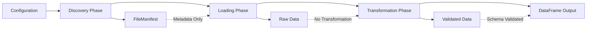

# FlyRigLoader Architecture Guide

## Overview

FlyRigLoader implements a **layered architecture** with **Protocol-based dependency injection**, specifically designed for neuroscience research data management. This architectural approach addresses the unique challenges of scientific data workflows while maintaining enterprise-grade reliability and extensibility.

The system is built around five core architectural principles that enable robust, maintainable, and extensible data processing pipelines for experimental neuroscience data.

## Core Architectural Principles

### 1. Separation of Concerns

The architecture implements a **strictly decoupled three-stage pipeline**: `discover → load → transform`, where each stage operates independently and can be tested in isolation. This separation enables users to intercept and modify data at any pipeline stage, providing unprecedented flexibility in data processing workflows.

**Key Benefits:**
- Independent testing of each pipeline stage
- Granular control over memory usage and processing
- Ability to cache intermediate results
- Clear debugging and troubleshooting boundaries

### 2. Protocol-Based Dependency Injection

Rather than traditional inheritance hierarchies, the system uses Python `Protocol` interfaces to define contracts between layers. This approach enables superior testability through mock injection and plugin-style extensibility for new data formats.

**Architecture Integration:**
```python
from typing import Protocol, runtime_checkable
from pydantic import BaseModel
from pandas import DataFrame

@runtime_checkable
class ConfigProvider(Protocol):
    def load_config(self, config_path: Path) -> BaseModel:
        ...

@runtime_checkable
class TransformationHandler(Protocol):
    def can_handle(self, data_type: str, column_config: Any) -> bool:
        ...
    def transform(self, data: Any, config: Any) -> DataFrame:
        ...
```

### 3. Registry-Based Extensibility

The `LoaderRegistry` and `SchemaRegistry` serve as first-class architectural elements, enabling dynamic registration of file format handlers and column validation schemas. This registry pattern replaces hardcoded mappings with plugin-style extensibility, allowing third-party extensions without core code modification.

**Registry Architecture:**
- Thread-safe singleton implementation with O(1) lookup performance
- Priority-based ordering for format handlers
- Automatic plugin discovery through entry points
- Runtime registration support for third-party extensions

### 4. Configuration-Driven Design

All operational aspects are controlled through hierarchical YAML configurations validated by `Pydantic` v2 schemas. This eliminates hardcoded paths and enables environment-specific deployments without code changes.

**Configuration Hierarchy:**
```python
from flyrigloader.config.models import ProjectConfig

# Enhanced Pydantic models with comprehensive defaults
config = ProjectConfig(
    base_directory="/path/to/data",
    datasets=[...],
    # Builder functions provide intelligent defaults
)
```

### 5. Unified Error Handling

A comprehensive domain-specific exception hierarchy (`FlyRigLoaderError` → `ConfigError`/`DiscoveryError`/`LoadError`/`TransformError`) provides cross-cutting error management with context preservation and granular error handling capabilities.

## Component Architecture

### API Layer

**Purpose:** High-level facade providing unified interface for external consumers

**Key Components:**
- `flyrigloader.api.py` - Primary entry point with simplified function signatures
- Modern Pydantic-based interfaces accepting config models directly
- Legacy deprecated functions with backward-compatibility guarantees

**Modern API Pattern:**
```python
from flyrigloader.api import discover_experiment_manifest, load_data_file, transform_to_dataframe

# Decoupled pipeline workflow
manifest = discover_experiment_manifest(config, experiment_name)
raw_data = load_data_file(manifest.files[0].path)
df = transform_to_dataframe(raw_data, schema_config)
```

**Integration Points:**
- Jupyter notebooks for interactive research
- Kedro pipelines for production workflows
- CLI tools for batch processing

### Configuration Layer

**Purpose:** Schema-validated settings management with migration support

**Key Components:**
- `flyrigloader.config.models.ProjectConfig` - Top-level project configuration
- Builder functions for programmatic configuration creation
- Enhanced validation with actionable error messages

**Builder Pattern Implementation:**
```python
from flyrigloader.config.models import ProjectConfig

# Intelligent defaults reduce boilerplate
config = ProjectConfig.create_config(
    project_name="neuroscience_experiment",
    base_directory="/data/experiments",
    # Comprehensive defaults applied automatically
)
```

### Discovery Layer

**Purpose:** Pattern-based file discovery with metadata extraction

**Key Components:**
- `flyrigloader.discovery.files.FileDiscoverer` - Core discovery engine
- `flyrigloader.discovery.files.FileManifest` - Metadata-only results container
- Pattern matching with configurable ignore filters

**Metadata-Only Architecture:**
```python
from flyrigloader.discovery.files import FileDiscoverer

discoverer = FileDiscoverer(config)
# Returns metadata only, no data loading
manifest = discoverer.discover_files(experiment_pattern)

# FileManifest contains FileInfo objects with metadata
for file_info in manifest.files:
    print(f"File: {file_info.path}, Size: {file_info.size}")
```

**Performance Characteristics:**
- Optimized for >10,000 files with <5 second discovery time
- Supports recursive and non-recursive discovery modes
- Memory-efficient metadata extraction

### Registries Layer

**Purpose:** Plugin-style extensibility for loaders and schemas

**Key Components:**
- `flyrigloader.registries.LoaderRegistry` - File format handler registry
- `flyrigloader.registries.SchemaRegistry` - Column validation schema registry
- Protocol-based interfaces for extensibility

**LoaderRegistry Pattern:**
```python
from flyrigloader.registries import LoaderRegistry, BaseLoader

# Register custom loader
class CustomLoader(BaseLoader):
    def load(self, path: Path) -> Any:
        # Custom loading logic
        return load_custom_format(path)
    
    def supports_extension(self, extension: str) -> bool:
        return extension == '.custom'
    
    @property
    def priority(self) -> int:
        return 10

# Registration
registry = LoaderRegistry()
registry.register_loader('.custom', CustomLoader, priority=10)
```

**SchemaRegistry Pattern:**
```python
from flyrigloader.registries import SchemaRegistry, BaseSchema

# Register custom schema
class ExperimentSchema(BaseSchema):
    def validate(self, data: Any) -> Dict[str, Any]:
        # Schema validation logic
        return validated_data
    
    @property
    def schema_name(self) -> str:
        return "experiment"
    
    @property
    def supported_types(self) -> List[str]:
        return ["experiment_data", "trial_data"]

# Registration
registry = SchemaRegistry()
registry.register_schema('experiment', ExperimentSchema)
```

### I/O Layer

**Purpose:** Raw data loading with registry-based format selection

**Key Components:**
- `flyrigloader.io.loaders.load_data_file()` - Centralized loading function
- Registry-based format auto-detection
- Separation of loading from transformation logic

**Registry-Based Loading:**
```python
from flyrigloader.io.loaders import load_data_file
from pathlib import Path

# Automatic format detection via LoaderRegistry
data = load_data_file(Path('experiment.pkl'))  # Uses PickleLoader
data = load_data_file(Path('data.custom'))     # Uses CustomLoader if registered
```

**Memory Management:**
- Processes <1 second per 100MB of data
- Memory usage maintained below 2x data size
- Lazy loading patterns throughout

### Transformation Layer

**Purpose:** Data transformation with schema validation

**Key Components:**
- `flyrigloader.io.transformers.transform_to_dataframe()` - Central transformation function
- Schema-driven validation through SchemaRegistry
- Pluggable transformation handlers

**Transformation Pipeline:**
```python
from flyrigloader.io.transformers import transform_to_dataframe

# Raw data to DataFrame conversion
df = transform_to_dataframe(raw_data, schema_config)

# Uses SchemaRegistry for validation
from flyrigloader.registries import SchemaRegistry
schema = SchemaRegistry().get_schema('experiment')
validated_data = schema.validate(raw_data)
```

## Error Handling Hierarchy

### Exception Architecture

The system implements a comprehensive domain-specific exception hierarchy that enables granular error handling and context preservation:

```python
from flyrigloader.exceptions import (
    FlyRigLoaderError,  # Base exception
    ConfigError,        # Configuration validation failures
    DiscoveryError,     # File discovery failures
    LoadError,          # Data loading failures
    TransformError      # Data transformation failures
)
```

### Error Context Preservation

**Context-Aware Exceptions:**
```python
from flyrigloader.exceptions import TransformError

try:
    df = transform_to_dataframe(raw_data, schema)
except ValueError as e:
    # Context preservation with method chaining
    raise TransformError("Schema validation failed").with_context({
        "original_error": str(e),
        "data_shape": raw_data.shape,
        "schema_name": schema.schema_name,
        "transformation_step": "column_validation"
    })
```

### Error Codes for Programmatic Handling

**Structured Error Handling:**
```python
from flyrigloader.exceptions import DiscoveryError

try:
    manifest = discover_experiment_manifest(config, experiment)
except DiscoveryError as e:
    if e.error_code == "DISCOVERY_003":
        # Handle pattern compilation error
        logger.warning("Invalid pattern, using default")
        pattern = DEFAULT_PATTERN
    elif e.error_code == "DISCOVERY_001":
        # Handle file system access denied
        logger.error("Access denied to data directory")
```

## Data Flow and Pipeline Stages

### Three-Stage Pipeline Architecture

The system implements a **pipeline-based data flow** that transforms raw file system content into structured DataFrames through well-defined stages:



### Pipeline Stage Details

**1. Discovery Phase:**
- Input: Configuration patterns and directory paths
- Process: Recursive file system traversal with pattern matching
- Output: `FileManifest` containing metadata-only `FileInfo` objects
- Performance: Fast directory traversal, no data loading

**2. Loading Phase:**
- Input: File paths from discovery manifest
- Process: Registry-based loader selection and raw data loading
- Output: Raw data objects (typically dictionaries)
- Performance: <1 second per 100MB, memory-efficient

**3. Transformation Phase:**
- Input: Raw data objects and schema configuration
- Process: Schema validation and DataFrame construction
- Output: Validated pandas DataFrames
- Performance: Schema-driven validation with error context

### Memory Management Strategy

**Lazy Loading Implementation:**
- Configuration cached for performance optimization
- Discovery results cached without loading data
- Data loading on-demand with configurable memory limits
- Transformation with streaming support for large datasets

## Integration Points

### Kedro Framework Integration

**Pipeline Node Compatibility:**
```python
from kedro.pipeline import Pipeline, node
from flyrigloader.api import discover_experiment_manifest, load_data_file

def create_pipeline(**kwargs):
    return Pipeline([
        node(
            func=discover_experiment_manifest,
            inputs=["config", "experiment_name"],
            outputs="file_manifest",
            name="discover_files"
        ),
        node(
            func=load_data_file,
            inputs="file_manifest",
            outputs="raw_data",
            name="load_data"
        )
    ])
```

### Jupyter Notebook Integration

**Interactive Research Workflows:**
```python
# Cell 1: Configuration
from flyrigloader.config.models import ProjectConfig
config = ProjectConfig.create_config(
    project_name="experiment_analysis",
    base_directory="/data/neuroscience"
)

# Cell 2: Discovery
from flyrigloader.api import discover_experiment_manifest
manifest = discover_experiment_manifest(config, "motor_cortex")
print(f"Found {len(manifest.files)} files")

# Cell 3: Data Loading
from flyrigloader.api import load_data_file
data = load_data_file(manifest.files[0].path)

# Cell 4: Transformation
from flyrigloader.api import transform_to_dataframe
df = transform_to_dataframe(data, schema_config)
```

### File System Integration

**Direct I/O Operations:**
- Hierarchical directory structure support
- Cross-platform path handling via `pathlib`
- Configurable ignore patterns and filters
- Metadata extraction with regex patterns

## Extension Patterns

### Custom Loader Development

**Implementing BaseLoader Protocol:**
```python
from flyrigloader.registries import BaseLoader, register_loader
from pathlib import Path
import json

class JSONLoader(BaseLoader):
    """Custom loader for JSON files."""
    
    def load(self, path: Path) -> Any:
        with open(path, 'r') as f:
            return json.load(f)
    
    def supports_extension(self, extension: str) -> bool:
        return extension.lower() == '.json'
    
    @property
    def priority(self) -> int:
        return 5

# Registration
register_loader('.json', JSONLoader, priority=5)
```

### Custom Schema Development

**Implementing BaseSchema Protocol:**
```python
from flyrigloader.registries import BaseSchema, register_schema
from typing import Dict, Any, List

class TrialDataSchema(BaseSchema):
    """Schema for trial-based experimental data."""
    
    def validate(self, data: Any) -> Dict[str, Any]:
        # Validate trial data structure
        if not isinstance(data, dict):
            raise ValueError("Trial data must be dictionary")
        
        required_keys = ['trial_id', 'timestamps', 'signals']
        for key in required_keys:
            if key not in data:
                raise ValueError(f"Missing required key: {key}")
        
        return data
    
    @property
    def schema_name(self) -> str:
        return "trial_data"
    
    @property
    def supported_types(self) -> List[str]:
        return ["trial_data", "behavioral_data"]

# Registration
register_schema('trial_data', TrialDataSchema)
```

### Plugin Development

**Entry Point Registration:**
```python
# setup.py or pyproject.toml
entry_points = {
    'flyrigloader.loaders': [
        'json = mypackage.loaders:JSONLoader',
        'hdf5 = mypackage.loaders:HDF5Loader',
    ],
    'flyrigloader.schemas': [
        'trial_data = mypackage.schemas:TrialDataSchema',
        'neural_data = mypackage.schemas:NeuralDataSchema',
    ]
}
```

## Performance Considerations

### Scalability Characteristics

**Discovery Performance:**
- Optimized for >10,000 files with <5 second discovery time
- Configurable recursion depth for large directory trees
- Memory-efficient metadata extraction

**Loading Performance:**
- <1 second per 100MB of data processing
- Memory usage maintained below 2x data size
- Concurrent loading support for multiple files

**Transformation Performance:**
- Schema validation with O(1) lookup through registries
- Streaming transformation for large datasets
- Configurable memory limits and batch processing

### Memory Management

**Lazy Loading Strategy:**
- Configuration cached with intelligent invalidation
- Discovery results cached without data loading
- On-demand data loading with configurable limits
- Transformation with streaming support

## Testing and Validation

### Protocol-Based Testing

**Dependency Injection for Testing:**
```python
from flyrigloader.api import ConfigProvider
from unittest.mock import Mock

# Mock configuration provider
mock_config = Mock(spec=ConfigProvider)
mock_config.load_config.return_value = test_config

# Inject mock for testing
with pytest.monkeypatch.context() as m:
    m.setattr('flyrigloader.api.config_provider', mock_config)
    result = discover_experiment_manifest(config, experiment)
```

### Registry Testing

**Registry State Management:**
```python
from flyrigloader.registries import LoaderRegistry

def test_custom_loader():
    registry = LoaderRegistry()
    registry.clear()  # Clean state for testing
    
    # Register test loader
    registry.register_loader('.test', TestLoader)
    
    # Verify registration
    assert registry.get_loader_for_extension('.test') == TestLoader
```

## Migration and Backward Compatibility

### Legacy API Support

**Deprecation Strategy:**
```python
import warnings
from functools import wraps

def deprecated(reason: str, version: str, alternative: str):
    def decorator(func):
        @wraps(func)
        def wrapper(*args, **kwargs):
            warnings.warn(
                f"{func.__name__} is deprecated since {version}. {reason}. "
                f"Use {alternative} instead.",
                DeprecationWarning,
                stacklevel=2
            )
            return func(*args, **kwargs)
        return wrapper
    return decorator

# Legacy function with deprecation warning
@deprecated("Monolithic API replaced", "v2.0", "discover_experiment_manifest")
def process_experiment_data(config, experiment):
    # Legacy implementation with backward compatibility
    pass
```

### Configuration Migration

**LegacyConfigAdapter Pattern:**
```python
from flyrigloader.config.models import LegacyConfigAdapter

# Automatic migration from dict to Pydantic models
legacy_config = {"major_data_directory": "/old/path"}
adapter = LegacyConfigAdapter(legacy_config)

# Provides dict-like access while using Pydantic validation
assert adapter['major_data_directory'] == "/old/path"
```

## Summary

FlyRigLoader's architecture provides a robust, extensible foundation for neuroscience data processing through:

1. **Layered separation of concerns** enabling independent testing and development
2. **Protocol-based dependency injection** for superior testability and extensibility
3. **Registry-based plugin system** for dynamic format and schema registration
4. **Comprehensive error handling** with context preservation and granular control
5. **Memory-efficient pipeline processing** with lazy loading and streaming support
6. **Backward compatibility** ensuring smooth migration from legacy implementations

This architecture enables both simple single-file processing and complex multi-experiment workflows while maintaining performance, reliability, and extensibility for neuroscience research applications.