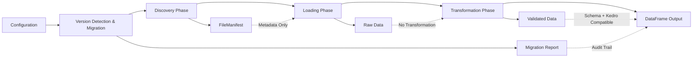

# FlyRigLoader Architecture Guide

## Overview

FlyRigLoader implements a **layered, protocol-based architecture** with **first-class Kedro integration** and **comprehensive version management**, specifically designed for neuroscience research data management. This architectural approach addresses the unique challenges of scientific data workflows while maintaining enterprise-grade reliability and extensibility for 1.0-level production readiness.

The system is built around six core architectural principles that enable robust, maintainable, and extensible data processing pipelines for experimental neuroscience data, with enhanced support for configuration migration and plugin-style extensibility.

```python
# Core architectural imports demonstrating enhanced capabilities
from flyrigloader.kedro import FlyRigLoaderDataSet, create_flyrigloader_catalog_entry
from flyrigloader.migration import ConfigMigrator, CURRENT_VERSION
from flyrigloader.registries import RegistryPriority
from flyrigloader.config.models import ProjectConfig
from semantic_version import Version
```

## Core Architectural Principles

### 1. Separation of Concerns

The architecture implements a **strictly decoupled three-stage pipeline**: `discover → load → transform`, where each stage operates independently and can be tested in isolation. This separation enables users to intercept and modify data at any pipeline stage, providing unprecedented flexibility in data processing workflows.

**Key Benefits:**
- Independent testing of each pipeline stage
- Granular control over memory usage and processing
- Ability to cache intermediate results
- Clear debugging and troubleshooting boundaries

### 2. Protocol-Based Dependency Injection

Rather than traditional inheritance hierarchies, the system uses Python `Protocol` interfaces to define contracts between layers. This approach enables superior testability through mock injection and plugin-style extensibility for new data formats.

**Architecture Integration:**
```python
from typing import Protocol, runtime_checkable
from pydantic import BaseModel
from pandas import DataFrame

@runtime_checkable
class ConfigProvider(Protocol):
    def load_config(self, config_path: Path) -> BaseModel:
        ...

@runtime_checkable
class TransformationHandler(Protocol):
    def can_handle(self, data_type: str, column_config: Any) -> bool:
        ...
    def transform(self, data: Any, config: Any) -> DataFrame:
        ...
```

### 3. Registry-Based Extensibility

The `LoaderRegistry` and `SchemaRegistry` serve as first-class architectural elements, enabling dynamic registration of file format handlers and column validation schemas. This registry pattern replaces hardcoded mappings with plugin-style extensibility, allowing third-party extensions without core code modification.

**Enhanced Registry Architecture:**
- **Enforced singleton pattern** with thread-safe `RLock` for concurrent access
- **Priority enumeration system**: `BUILTIN < USER < PLUGIN < OVERRIDE` resolution
- **Automatic entry-point discovery** via `importlib.metadata` for zero-configuration plugins  
- **Comprehensive capability introspection** with loader/schema metadata exposure
- **Decorator-based registration** including new `@auto_register` for streamlined plugin development

```python
from flyrigloader.registries import RegistryPriority, auto_register

@auto_register(registry_type="loader", priority=RegistryPriority.PLUGIN.value)
class CustomLoader:
    def load(self, path: Path) -> Any:
        # Implementation with automatic registration
        pass
```

### 4. Configuration-Driven Design

All operational aspects are controlled through hierarchical YAML configurations validated by `Pydantic` v2 schemas. This eliminates hardcoded paths and enables environment-specific deployments without code changes.

**Configuration Hierarchy:**
```python
from flyrigloader.config.models import ProjectConfig

# Enhanced Pydantic models with comprehensive defaults
config = ProjectConfig(
    base_directory="/path/to/data",
    datasets=[...],
    # Builder functions provide intelligent defaults
)
```

### 5. Unified Error Handling

A comprehensive domain-specific exception hierarchy (`FlyRigLoaderError` → `ConfigError`/`DiscoveryError`/`LoadError`/`TransformError`) provides cross-cutting error management with context preservation and granular error handling capabilities. **Enhanced with new exception types**: `RegistryError`, `VersionError`, and `KedroIntegrationError` for comprehensive coverage.

### 6. Version-Aware Configuration Management

The **Migration Layer** implements automatic configuration schema version detection and seamless migration capabilities, ensuring zero breaking changes during system upgrades while preserving research workflow continuity.

**Migration Infrastructure:**
- **Embedded schema versioning** with `schema_version` fields in all Pydantic models
- **Automatic version detection** and compatibility validation using semantic versioning
- **Migration execution engine** with rollback capabilities and audit trail generation
- **LegacyConfigAdapter integration** for transparent backward compatibility

```python
from flyrigloader.migration import ConfigMigrator, CURRENT_VERSION
from flyrigloader.config.models import ProjectConfig

# Automatic version detection and migration
config = ProjectConfig.create_config(schema_version=CURRENT_VERSION)
migrator = ConfigMigrator()
migrated_config, report = migrator.migrate(legacy_config, "0.1.0", "1.0.0")
```

## Component Architecture

### API Layer

**Purpose:** High-level facade providing unified interface for external consumers with enhanced **pure functional API** surface

**Key Components:**
- `flyrigloader.api.py` - Primary entry point with simplified function signatures
- **Enhanced Pydantic-based interfaces** accepting config models directly with comprehensive validation
- **Pure functional design** for maximum testability through stateless operations
- **Kedro factory functions** for seamless pipeline integration
- Legacy deprecated functions with backward-compatibility guarantees and deprecation warnings

**Modern API Pattern with Kedro Integration:**
```python
from flyrigloader.api import (
    discover_experiment_manifest, load_data_file, transform_to_dataframe,
    create_kedro_dataset, validate_manifest, get_registered_loaders
)

# Enhanced decoupled pipeline workflow
manifest = discover_experiment_manifest(config, experiment_name)
validated_manifest = validate_manifest(manifest)  # Pure function validation
raw_data = load_data_file(manifest.files[0].path)
df = transform_to_dataframe(raw_data, schema_config)

# Kedro integration
kedro_dataset = create_kedro_dataset(
    config_path="config/experiment.yaml",
    experiment_name="baseline_study"
)
```

**Enhanced Integration Points:**
- **Native Kedro catalog integration** through `FlyRigLoaderDataSet` 
- **Registry introspection APIs** for capability discovery
- Jupyter notebooks for interactive research
- CLI tools for batch processing with manifest validation

### Configuration Layer

**Purpose:** Schema-validated settings management with **comprehensive migration support** and **version-aware builder patterns**

**Key Components:**
- `flyrigloader.config.models.ProjectConfig` - **Enhanced with embedded `schema_version` fields** for automatic version detection
- **Comprehensive builder functions** with factory helpers for type-safe configuration construction
- **Migration-aware configuration loading** with automatic version detection and upgrades
- Enhanced validation with actionable error messages and deprecation warnings

**Enhanced Builder Pattern with Version Management:**
```python
from flyrigloader.config.models import ProjectConfig
from flyrigloader.migration import CURRENT_VERSION

# Version-aware configuration with automatic migration
config = ProjectConfig.create_config(
    project_name="neuroscience_experiment", 
    base_directory="/data/experiments",
    schema_version=CURRENT_VERSION,  # Embedded version tracking
    # Comprehensive defaults applied automatically
)

# Automatic legacy configuration migration
legacy_config = {"project": {"major_data_directory": "/old/path"}}
migrated = ProjectConfig.model_validate(legacy_config)  # Auto-migrates with warnings
```

### Discovery Layer

**Purpose:** Pattern-based file discovery with metadata extraction

**Key Components:**
- `flyrigloader.discovery.files.FileDiscoverer` - Core discovery engine
- `flyrigloader.discovery.files.FileManifest` - Metadata-only results container
- Pattern matching with configurable ignore filters

**Metadata-Only Architecture:**
```python
from flyrigloader.discovery.files import FileDiscoverer

discoverer = FileDiscoverer(config)
# Returns metadata only, no data loading
manifest = discoverer.discover_files(experiment_pattern)

# FileManifest contains FileInfo objects with metadata
for file_info in manifest.files:
    print(f"File: {file_info.path}, Size: {file_info.size}")
```

**Performance Characteristics:**
- Optimized for >10,000 files with <5 second discovery time
- Supports recursive and non-recursive discovery modes
- Memory-efficient metadata extraction

### Migration Layer

**Purpose:** **Configuration version detection and automatic migration infrastructure** for seamless system upgrades

**Key Components:**
- `flyrigloader.migration.ConfigMigrator` - **Main migration engine** with registry and audit capabilities
- `flyrigloader.migration.versions.ConfigVersion` - **Enumeration of supported schema versions** with semantic versioning
- `flyrigloader.migration.versions.CURRENT_VERSION` - **Current configuration schema version** constant for compatibility tracking
- **Migration report generation** with comprehensive audit trails and rollback information

**Migration Architecture Implementation:**
```python
from flyrigloader.migration import ConfigMigrator, CURRENT_VERSION
from semantic_version import Version

# Automatic migration with comprehensive reporting
migrator = ConfigMigrator()
config_dict = {"project": {"directories": {}}, "experiments": {}}

# Execute migration with version validation
migrated_config, report = migrator.migrate(config_dict, "0.1.0", CURRENT_VERSION)
print(f"Migration successful: {len(report.errors) == 0}")

# Version comparison and compatibility checking  
current_version = Version.parse(CURRENT_VERSION)
if current_version.compare("1.0.0") >= 0:
    print("Using production-ready configuration schema")
```

**Migration Integration Points:**
- **Automatic version detection** from configuration files and Pydantic models
- **LegacyConfigAdapter integration** for transparent backward compatibility
- **Configuration loading pipeline** with automatic migration triggers
- **Deprecation warning system** with clear upgrade paths

### Registries Layer

**Purpose:** **Enhanced plugin-style extensibility** with enforced singleton pattern and priority-based resolution

**Key Components:**
- `flyrigloader.registries.LoaderRegistry` - **Thread-safe file format handler registry** with O(1) lookup
- `flyrigloader.registries.SchemaRegistry` - **Enhanced column validation schema registry** with capability introspection
- `flyrigloader.registries.RegistryPriority` - **Priority enumeration system** for conflict resolution
- **Protocol-based interfaces** with comprehensive validation for extensibility

**Enhanced LoaderRegistry Pattern with Priority System:**
```python
from flyrigloader.registries import LoaderRegistry, BaseLoader, RegistryPriority, auto_register

# Enhanced custom loader with automatic registration
@auto_register(registry_type="loader", key=".custom", priority_enum=RegistryPriority.PLUGIN)
class CustomLoader(BaseLoader):
    def load(self, path: Path) -> Any:
        # Custom loading logic with enhanced error handling
        return load_custom_format(path)
    
    def supports_extension(self, extension: str) -> bool:
        return extension == '.custom'
    
    @property
    def priority(self) -> int:
        return RegistryPriority.PLUGIN.value

# Enhanced registration with priority enumeration
registry = LoaderRegistry()
registry.register_loader(
    '.custom', 
    CustomLoader, 
    priority_enum=RegistryPriority.PLUGIN,
    source="api"
)

# Registry introspection capabilities
all_loaders = registry.get_all_loader_capabilities()
custom_caps = registry.get_loader_capabilities('.custom')
```

**SchemaRegistry Pattern:**
```python
from flyrigloader.registries import SchemaRegistry, BaseSchema

# Register custom schema
class ExperimentSchema(BaseSchema):
    def validate(self, data: Any) -> Dict[str, Any]:
        # Schema validation logic
        return validated_data
    
    @property
    def schema_name(self) -> str:
        return "experiment"
    
    @property
    def supported_types(self) -> List[str]:
        return ["experiment_data", "trial_data"]

# Registration
registry = SchemaRegistry()
registry.register_schema('experiment', ExperimentSchema)
```

### Kedro Integration Layer

**Purpose:** **First-class Kedro pipeline and catalog integration** for production data workflows

**Key Components:**
- `flyrigloader.kedro.datasets.FlyRigLoaderDataSet` - **Native AbstractDataset implementation** for complete Kedro compatibility
- `flyrigloader.kedro.datasets.FlyRigManifestDataSet` - **Lightweight manifest-only dataset** for discovery workflows  
- `flyrigloader.kedro.catalog.create_flyrigloader_catalog_entry` - **Catalog configuration helper** for programmatic catalog construction
- **Factory functions** for streamlined dataset creation with parameter validation

**Kedro Integration Architecture:**
```python
from flyrigloader.kedro import FlyRigLoaderDataSet, create_flyrigloader_catalog_entry

# Native Kedro AbstractDataset implementation
dataset = FlyRigLoaderDataSet(
    filepath="config/experiment.yaml",
    experiment_name="baseline_study",
    recursive=True,
    extract_metadata=True
)

# Kedro pipeline integration
data = dataset.load()  # Returns processed DataFrame with Kedro-compatible metadata
exists = dataset.exists()  # Checks configuration file existence
description = dataset.describe()  # Provides dataset metadata

# Programmatic catalog entry generation
catalog_entry = create_flyrigloader_catalog_entry(
    dataset_name="experiment_data",
    config_path="/data/config/experiment.yaml",
    experiment_name="baseline_study",
    recursive=True,
    validate_entry=True
)
```

**Catalog.yml Integration Example:**
```yaml
experiment_data:
  type: flyrigloader.FlyRigLoaderDataSet
  filepath: "${base_dir}/config/experiment_config.yaml"
  experiment_name: "baseline_study"
  recursive: true
  extract_metadata: true
  parse_dates: true
```

**Kedro Pipeline Integration Points:**
- **Catalog YAML configuration** with native FlyRigLoader dataset types
- **Pipeline node compatibility** with proper data structure conversion
- **Kedro versioning support** with dataset lifecycle management
- **Parameter injection** for dynamic experimental configurations

### I/O Layer

**Purpose:** Raw data loading with registry-based format selection

**Key Components:**
- `flyrigloader.io.loaders.load_data_file()` - Centralized loading function
- Registry-based format auto-detection
- Separation of loading from transformation logic

**Registry-Based Loading:**
```python
from flyrigloader.io.loaders import load_data_file
from pathlib import Path

# Automatic format detection via LoaderRegistry
data = load_data_file(Path('experiment.pkl'))  # Uses PickleLoader
data = load_data_file(Path('data.custom'))     # Uses CustomLoader if registered
```

**Memory Management:**
- Processes <1 second per 100MB of data
- Memory usage maintained below 2x data size
- Lazy loading patterns throughout

### Transformation Layer

**Purpose:** Data transformation with schema validation

**Key Components:**
- `flyrigloader.io.transformers.transform_to_dataframe()` - Central transformation function
- Schema-driven validation through SchemaRegistry
- Pluggable transformation handlers

**Transformation Pipeline:**
```python
from flyrigloader.io.transformers import transform_to_dataframe

# Raw data to DataFrame conversion
df = transform_to_dataframe(raw_data, schema_config)

# Uses SchemaRegistry for validation
from flyrigloader.registries import SchemaRegistry
schema = SchemaRegistry().get_schema('experiment')
validated_data = schema.validate(raw_data)
```

## Error Handling Hierarchy

### Exception Architecture

The system implements a comprehensive domain-specific exception hierarchy that enables granular error handling and context preservation:

```python
from flyrigloader.exceptions import (
    FlyRigLoaderError,  # Base exception
    ConfigError,        # Configuration validation failures
    DiscoveryError,     # File discovery failures
    LoadError,          # Data loading failures
    TransformError      # Data transformation failures
)
```

### Error Context Preservation

**Context-Aware Exceptions:**
```python
from flyrigloader.exceptions import TransformError

try:
    df = transform_to_dataframe(raw_data, schema)
except ValueError as e:
    # Context preservation with method chaining
    raise TransformError("Schema validation failed").with_context({
        "original_error": str(e),
        "data_shape": raw_data.shape,
        "schema_name": schema.schema_name,
        "transformation_step": "column_validation"
    })
```

### Error Codes for Programmatic Handling

**Structured Error Handling:**
```python
from flyrigloader.exceptions import DiscoveryError

try:
    manifest = discover_experiment_manifest(config, experiment)
except DiscoveryError as e:
    if e.error_code == "DISCOVERY_003":
        # Handle pattern compilation error
        logger.warning("Invalid pattern, using default")
        pattern = DEFAULT_PATTERN
    elif e.error_code == "DISCOVERY_001":
        # Handle file system access denied
        logger.error("Access denied to data directory")
```

## Data Flow and Pipeline Stages

### Enhanced Five-Stage Pipeline Architecture

The system implements an **enhanced pipeline-based data flow** with **version-aware configuration management** that transforms raw file system content into structured DataFrames through well-defined stages:



### Enhanced Pipeline Stage Details

**1. Configuration Phase:**
- Input: YAML files, Pydantic models, or legacy dictionary configurations
- Process: Configuration loading with security validation and environment overrides
- Output: Validated configuration objects with embedded version information
- Performance: Fast validation with intelligent caching

**2. Version Detection & Migration Phase:** *(New)*
- Input: Configuration objects with potential version mismatches
- Process: **Automatic schema version detection** and **migration execution** with comprehensive compatibility validation
- Output: **Current-version configuration** with migration reports and deprecation warnings
- Performance: **Immediate migration** for simple schemas, moderate time for complex migrations

**3. Discovery Phase:** *(Enhanced)*
- Input: **Version-validated configuration** patterns and directory paths
- Process: **Kedro-aware recursive file system traversal** with pattern matching and metadata extraction
- Output: `FileManifest` containing **Kedro-compatible metadata** and `FileInfo` objects
- Performance: Fast directory traversal with **<10% Kedro metadata overhead**

**4. Loading Phase:** *(Enhanced)*
- Input: File paths from discovery manifest
- Process: **Enhanced registry-based loader selection** with priority resolution and capability introspection
- Output: Raw data objects with **enforced registry lookup** eliminating direct instantiation
- Performance: **O(1) registry lookup** with <1 second per 100MB loading

**5. Transformation Phase:** *(Enhanced)*
- Input: Raw data objects and schema configuration
- Process: **Schema validation with Kedro compatibility enforcement** and DataFrame construction
- Output: **Kedro-compatible validated pandas DataFrames** with mandatory metadata columns
- Performance: Schema-driven validation with **Kedro metadata injection** overhead

### Memory Management Strategy

**Lazy Loading Implementation:**
- Configuration cached for performance optimization
- Discovery results cached without loading data
- Data loading on-demand with configurable memory limits
- Transformation with streaming support for large datasets

## Integration Points

### Enhanced Kedro Framework Integration

**Native Catalog Integration with AbstractDataset:**
```python
from kedro.pipeline import Pipeline, node
from flyrigloader.kedro import FlyRigLoaderDataSet
from flyrigloader.api import discover_experiment_manifest, load_data_file

# Native Kedro catalog integration
def create_pipeline(**kwargs):
    return Pipeline([
        node(
            func=lambda dataset: dataset.load(),  # Uses FlyRigLoaderDataSet
            inputs="experiment_data",  # Defined in catalog.yml
            outputs="processed_data",
            name="load_experiment_data"
        ),
        node(
            func=discover_experiment_manifest,
            inputs=["config", "experiment_name"],
            outputs="file_manifest",
            name="discover_files"
        ),
        node(
            func=load_data_file,
            inputs="file_manifest",
            outputs="raw_data",
            name="load_data"
        )
    ])

# Enhanced catalog.yml configuration
"""
experiment_data:
  type: flyrigloader.FlyRigLoaderDataSet
  filepath: "${base_dir}/config/experiment_config.yaml"
  experiment_name: "baseline_study"
  recursive: true
  extract_metadata: true
  parse_dates: true

manifest_data:
  type: flyrigloader.FlyRigManifestDataSet
  filepath: "${base_dir}/config/experiment_config.yaml"
  experiment_name: "discovery_only"
"""
```

### Jupyter Notebook Integration

**Interactive Research Workflows:**
```python
# Cell 1: Configuration
from flyrigloader.config.models import ProjectConfig
config = ProjectConfig.create_config(
    project_name="experiment_analysis",
    base_directory="/data/neuroscience"
)

# Cell 2: Discovery
from flyrigloader.api import discover_experiment_manifest
manifest = discover_experiment_manifest(config, "motor_cortex")
print(f"Found {len(manifest.files)} files")

# Cell 3: Data Loading
from flyrigloader.api import load_data_file
data = load_data_file(manifest.files[0].path)

# Cell 4: Transformation
from flyrigloader.api import transform_to_dataframe
df = transform_to_dataframe(data, schema_config)
```

### File System Integration

**Direct I/O Operations:**
- Hierarchical directory structure support
- Cross-platform path handling via `pathlib`
- Configurable ignore patterns and filters
- Metadata extraction with regex patterns

## Extension Patterns

### Custom Loader Development

**Implementing BaseLoader Protocol:**
```python
from flyrigloader.registries import BaseLoader, register_loader
from pathlib import Path
import json

class JSONLoader(BaseLoader):
    """Custom loader for JSON files."""
    
    def load(self, path: Path) -> Any:
        with open(path, 'r') as f:
            return json.load(f)
    
    def supports_extension(self, extension: str) -> bool:
        return extension.lower() == '.json'
    
    @property
    def priority(self) -> int:
        return 5

# Registration
register_loader('.json', JSONLoader, priority=5)
```

### Custom Schema Development

**Implementing BaseSchema Protocol:**
```python
from flyrigloader.registries import BaseSchema, register_schema
from typing import Dict, Any, List

class TrialDataSchema(BaseSchema):
    """Schema for trial-based experimental data."""
    
    def validate(self, data: Any) -> Dict[str, Any]:
        # Validate trial data structure
        if not isinstance(data, dict):
            raise ValueError("Trial data must be dictionary")
        
        required_keys = ['trial_id', 'timestamps', 'signals']
        for key in required_keys:
            if key not in data:
                raise ValueError(f"Missing required key: {key}")
        
        return data
    
    @property
    def schema_name(self) -> str:
        return "trial_data"
    
    @property
    def supported_types(self) -> List[str]:
        return ["trial_data", "behavioral_data"]

# Registration
register_schema('trial_data', TrialDataSchema)
```

### Enhanced Plugin Development

**Auto-Registration with Priority System:**
```python
from flyrigloader.registries import auto_register, RegistryPriority

# Enhanced auto-registration with zero-configuration plugin development
@auto_register(registry_type="loader", key=".h5", priority_enum=RegistryPriority.PLUGIN)
class HDF5Loader:
    def load(self, path: Path) -> Any:
        import h5py
        return h5py.File(path, 'r')
    
    def supports_extension(self, extension: str) -> bool:
        return extension.lower() in ['.h5', '.hdf5']
    
    @property
    def priority(self) -> int:
        return RegistryPriority.PLUGIN.value

@auto_register()  # Auto-detects type and extension
class JSONLoader:
    def load(self, path: Path) -> Any:
        import json
        with open(path, 'r') as f:
            return json.load(f)
    
    def supports_extension(self, extension: str) -> bool:
        return extension.lower() == '.json'
    
    @property
    def priority(self) -> int:
        return RegistryPriority.USER.value
```

**Entry Point Registration with Priority Support:**
```python
# setup.py or pyproject.toml
entry_points = {
    'flyrigloader.loaders': [
        'json = mypackage.loaders:JSONLoader',
        'hdf5 = mypackage.loaders:HDF5Loader',
        'parquet = mypackage.loaders:ParquetLoader',
    ],
    'flyrigloader.schemas': [
        'trial_data = mypackage.schemas:TrialDataSchema',
        'neural_data = mypackage.schemas:NeuralDataSchema',
        'kedro_compatible = mypackage.schemas:KedroSchema',
    ]
}

# Enhanced plugin metadata with priority
[tool.setuptools.entry-points."flyrigloader.loaders"]
hdf5 = "mypackage.loaders:HDF5Loader"
# Plugin priority automatically resolved via RegistryPriority.PLUGIN
```

## Performance Considerations

### Scalability Characteristics

**Discovery Performance:**
- Optimized for >10,000 files with <5 second discovery time
- Configurable recursion depth for large directory trees
- Memory-efficient metadata extraction

**Loading Performance:**
- <1 second per 100MB of data processing
- Memory usage maintained below 2x data size
- Concurrent loading support for multiple files

**Transformation Performance:**
- Schema validation with O(1) lookup through registries
- Streaming transformation for large datasets
- Configurable memory limits and batch processing

### Memory Management

**Lazy Loading Strategy:**
- Configuration cached with intelligent invalidation
- Discovery results cached without data loading
- On-demand data loading with configurable limits
- Transformation with streaming support

## Testing and Validation

### Protocol-Based Testing

**Dependency Injection for Testing:**
```python
from flyrigloader.api import ConfigProvider
from unittest.mock import Mock

# Mock configuration provider
mock_config = Mock(spec=ConfigProvider)
mock_config.load_config.return_value = test_config

# Inject mock for testing
with pytest.monkeypatch.context() as m:
    m.setattr('flyrigloader.api.config_provider', mock_config)
    result = discover_experiment_manifest(config, experiment)
```

### Registry Testing

**Registry State Management:**
```python
from flyrigloader.registries import LoaderRegistry

def test_custom_loader():
    registry = LoaderRegistry()
    registry.clear()  # Clean state for testing
    
    # Register test loader
    registry.register_loader('.test', TestLoader)
    
    # Verify registration
    assert registry.get_loader_for_extension('.test') == TestLoader
```

## Enhanced Migration and Backward Compatibility

### Comprehensive Version Management Infrastructure

**Automatic Migration System:**
```python
from flyrigloader.migration import ConfigMigrator, ConfigVersion, CURRENT_VERSION
from flyrigloader.config.models import ProjectConfig
from semantic_version import Version

# Comprehensive migration with version detection
migrator = ConfigMigrator()
legacy_config = {
    'project': {'major_data_directory': '/data'},
    'experiments': {'exp1': {'date_range': ['2024-01-01', '2024-01-31']}}
}

# Automatic version detection and migration execution
detected_version = migrator.detect_config_version(legacy_config)
migrated_config, report = migrator.migrate(legacy_config, detected_version, CURRENT_VERSION)

print(f"Migration from {report.from_version} to {report.to_version}")
print(f"Applied migrations: {', '.join(report.applied_migrations)}")
print(f"Warnings: {len(report.warnings)} issues detected")

# Version compatibility validation
current = Version.parse(CURRENT_VERSION)
is_compatible = migrator.validate_migration_path(detected_version, CURRENT_VERSION)
```

### Enhanced Legacy API Support

**Deprecation Strategy with Migration Guidance:**
```python
import warnings
from functools import wraps
from flyrigloader.migration import CURRENT_VERSION

def deprecated(reason: str, version: str, alternative: str, migration_guide: str = None):
    def decorator(func):
        @wraps(func)
        def wrapper(*args, **kwargs):
            message = (
                f"{func.__name__} is deprecated since {version}. {reason}. "
                f"Use {alternative} instead."
            )
            if migration_guide:
                message += f" Migration guide: {migration_guide}"
            
            warnings.warn(message, DeprecationWarning, stacklevel=2)
            return func(*args, **kwargs)
        return wrapper
    return decorator

# Enhanced legacy function with migration guidance
@deprecated(
    "Dictionary configs replaced by Pydantic models", 
    "v1.0", 
    "ProjectConfig.create_config()",
    "https://flyrigloader.readthedocs.io/migration/v1.0"
)
def process_experiment_data(config, experiment):
    # Legacy implementation with automatic migration
    if isinstance(config, dict):
        migrator = ConfigMigrator()
        config, _ = migrator.migrate(config, "0.1.0", CURRENT_VERSION)
    return discover_experiment_manifest(config, experiment)
```

### Enhanced Configuration Migration

**Advanced LegacyConfigAdapter with Version Awareness:**
```python
from flyrigloader.config.models import LegacyConfigAdapter, ProjectConfig
from flyrigloader.migration import ConfigMigrator, CURRENT_VERSION

# Enhanced automatic migration with version detection
legacy_config = {"major_data_directory": "/old/path", "schema_version": "0.1.0"}
adapter = LegacyConfigAdapter(legacy_config)

# Automatic version detection and migration
if adapter.needs_migration():
    migrator = ConfigMigrator()
    migrated_config, report = migrator.migrate(
        legacy_config, 
        adapter.detected_version, 
        CURRENT_VERSION
    )
    
    # Convert to modern Pydantic model
    modern_config = ProjectConfig.model_validate(migrated_config)
    
    # Log migration details for audit trail
    print(f"Configuration migrated from {report.from_version} to {report.to_version}")
    for warning in report.warnings:
        print(f"Migration warning: {warning}")

# Provides dict-like access while using Pydantic validation
assert adapter['major_data_directory'] == "/old/path"
assert adapter.schema_version == CURRENT_VERSION  # After migration
```

## Summary

FlyRigLoader's **enhanced 1.0 architecture** provides a comprehensive, production-ready foundation for neuroscience data processing through:

1. **Enhanced layered separation of concerns** with dedicated **Migration Layer** enabling independent testing, development, and seamless system upgrades
2. **Protocol-based dependency injection** for superior testability and extensibility with **pure functional API** surface
3. **Advanced registry-based plugin system** with **enforced singleton pattern**, **priority enumeration**, and **automatic entry-point discovery** for dynamic format and schema registration  
4. **Comprehensive error handling** with context preservation, granular control, and **enhanced exception hierarchy** including `RegistryError`, `VersionError`, and `KedroIntegrationError`
5. **Memory-efficient pipeline processing** with lazy loading, streaming support, and **Kedro-compatible DataFrame outputs**
6. **Complete backward compatibility** with **automatic configuration migration**, **version-aware adaptation**, and **deprecation warning systems** ensuring smooth migration from legacy implementations
7. **First-class Kedro integration** through **native AbstractDataset implementations**, **catalog configuration helpers**, and **production pipeline support**
8. **Version-aware configuration management** with **automatic schema version detection**, **migration execution**, and **audit trail generation** for zero-breaking-change upgrades

### Architecture Scalability and Production Readiness

**Performance Characteristics:**
- **Configuration Migration**: Immediate execution for simple schemas, <5 seconds for complex configurations
- **Registry Operations**: Maintained O(1) lookup with enhanced capability introspection adding <1ms overhead
- **Kedro Integration**: <10% performance overhead for catalog integration with full AbstractDataset compliance
- **Plugin Discovery**: Automatic entry-point discovery with comprehensive error handling and audit logging

**Enterprise Integration Points:**  
- **Kedro Catalog YAML**: Native dataset type registration with parameter validation
- **Migration Infrastructure**: Semantic versioning compliance with rollback capabilities
- **Plugin Ecosystem**: Thread-safe priority-based registration with comprehensive lifecycle management
- **Audit and Compliance**: Migration reports, deprecation warnings, and operational logging for research reproducibility

This **production-ready architecture** enables both simple single-file processing and complex multi-experiment workflows while maintaining performance, reliability, and extensibility for neuroscience research applications. The enhanced plugin system, version management, and Kedro integration position FlyRigLoader as a comprehensive data management solution for modern research computing environments.