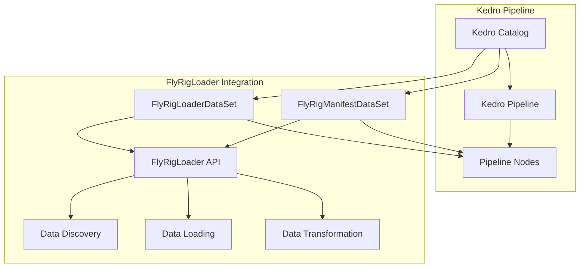

# FlyRigLoader Kedro Integration Guide

## Table of Contents

1. [Introduction](#introduction)
2. [Installation & Setup](#installation--setup)
3. [Dataset Classes](#dataset-classes)
4. [Catalog Configuration](#catalog-configuration)
5. [API Factory Functions](#api-factory-functions)
6. [End-to-End Pipeline Workflows](#end-to-end-pipeline-workflows)
7. [Catalog Template Generation](#catalog-template-generation)
8. [Advanced Configuration](#advanced-configuration)
9. [Best Practices](#best-practices)
10. [Troubleshooting](#troubleshooting)

## Introduction

FlyRigLoader provides seamless integration with [Kedro](https://kedro.org), enabling neuroscience researchers to incorporate experimental data loading capabilities directly into production data pipelines. This integration supports Kedro's catalog system, data lineage tracking, and parallel execution patterns while maintaining FlyRigLoader's powerful file discovery and transformation capabilities.

### Key Features

- **Native AbstractDataset Implementation**: Full compliance with Kedro's dataset interface
- **Drop-in Catalog Integration**: Direct `catalog.yml` configuration support
- **Dual Dataset Types**: Both full data loading and lightweight manifest operations
- **Factory Functions**: Programmatic dataset creation with `create_kedro_dataset()`
- **Template Generation**: Automated catalog creation for common experimental workflows
- **Metadata Compatibility**: Kedro-compatible DataFrame outputs with required metadata columns

### Architecture Overview



## Installation & Setup

### Prerequisites

- Python 3.8+
- FlyRigLoader 1.0.0+
- Kedro 0.18.0+

### Installation

Install FlyRigLoader with Kedro support:

```bash
# Install with optional Kedro dependencies
pip install flyrigloader[kedro]

# Or install separately
pip install flyrigloader kedro>=0.18.0
```

### Project Setup

1. **Initialize Kedro Project** (if not already done):
   ```bash
   kedro new --starter=pandas-iris
   cd your-kedro-project
   ```

2. **Install FlyRigLoader in Project**:
   ```bash
   pip install flyrigloader[kedro]
   ```

3. **Verify Integration**:
   ```python
   # Test import in Python console
   from flyrigloader.kedro import FlyRigLoaderDataSet, FlyRigManifestDataSet
   from flyrigloader.api import create_kedro_dataset
   print("✓ FlyRigLoader Kedro integration ready")
   ```

## Dataset Classes

### FlyRigLoaderDataSet

The `FlyRigLoaderDataSet` provides full data loading capabilities with FlyRigLoader's complete discovery and transformation pipeline.

#### Class Overview

```python
from flyrigloader.kedro.datasets import FlyRigLoaderDataSet

class FlyRigLoaderDataSet(AbstractDataset[None, pd.DataFrame]):
    """
    Kedro AbstractDataset implementation for FlyRigLoader with full data loading.
    
    Returns: pandas.DataFrame with Kedro-compatible metadata columns
    """
```

#### Key Features

- **Full Data Loading**: Complete file discovery, loading, and DataFrame transformation
- **Thread-Safe Operations**: Safe for Kedro's parallel execution patterns  
- **Metadata Integration**: Automatic injection of Kedro-compatible metadata columns
- **Comprehensive Error Handling**: Structured error reporting with context preservation
- **Configuration Caching**: Optimized performance through configuration and manifest caching

#### Usage Examples

**Basic Usage:**
```python
from flyrigloader.kedro.datasets import FlyRigLoaderDataSet

# Direct instantiation
dataset = FlyRigLoaderDataSet(
    filepath="config/experiment_config.yaml",
    experiment_name="baseline_study"
)

# Load data
dataframe = dataset.load()
print(f"Loaded {len(dataframe)} rows with columns: {list(dataframe.columns)}")
```

**Advanced Configuration:**
```python
dataset = FlyRigLoaderDataSet(
    filepath="config/experiments.yaml",
    experiment_name="behavioral_analysis",
    recursive=True,
    extract_metadata=True,
    parse_dates=True,
    date_range=["2024-01-01", "2024-01-31"],
    rig_names=["rig1", "rig2"],
    transform_options={
        "include_kedro_metadata": True,
        "experiment_name": "behavioral_analysis"
    }
)
```

#### AbstractDataset Interface Compliance

The `FlyRigLoaderDataSet` implements all required AbstractDataset methods:

```python
# Required interface methods
def _load(self) -> pd.DataFrame:
    """Load experiment data and return Kedro-compatible DataFrame."""
    
def _save(self, data: pd.DataFrame) -> None:
    """Not supported - raises NotImplementedError (read-only dataset)."""
    
def _exists(self) -> bool:
    """Check if configuration file exists and is readable."""
    
def _describe(self) -> Dict[str, Any]:
    """Return comprehensive dataset metadata for Kedro lineage tracking."""
```

### FlyRigManifestDataSet

The `FlyRigManifestDataSet` provides lightweight file discovery operations without loading actual data, optimized for manifest-based workflows.

#### Class Overview

```python
from flyrigloader.kedro.datasets import FlyRigManifestDataSet

class FlyRigManifestDataSet(AbstractDataset[None, Any]):
    """
    Kedro AbstractDataset implementation for manifest-only operations.
    
    Returns: FileManifest object with discovered file metadata
    """
```

#### Key Features

- **Lightweight Operations**: File discovery without data loading for memory efficiency
- **Fast Execution**: Optimized for <100ms response times
- **File Metadata**: Comprehensive file statistics and discovery information
- **Selective Processing**: Enable processing of file subsets based on manifest
- **Preview Capabilities**: Examine experiment contents before full data loading

#### Usage Examples

**Basic Manifest Discovery:**
```python
from flyrigloader.kedro.datasets import FlyRigManifestDataSet

# Create manifest dataset
manifest_dataset = FlyRigManifestDataSet(
    filepath="config/experiment_config.yaml",
    experiment_name="baseline_study"
)

# Load manifest
manifest = manifest_dataset.load()
print(f"Discovered {len(manifest.files)} files")

# Examine file metadata
for file_info in manifest.files:
    print(f"File: {file_info.path}, Size: {file_info.size_bytes}")
```

**Selective Processing Workflow:**
```python
# Discover manifest
manifest = manifest_dataset.load()

# Filter for large files
large_files = [f for f in manifest.files if f.size_bytes > 1000000]
print(f"Found {len(large_files)} large files for processing")

# Use manifest for selective processing downstream
for file_info in large_files:
    print(f"Processing: {file_info.path}")
```

## Catalog Configuration

### Basic Catalog Entries

FlyRigLoader datasets can be configured directly in Kedro's `catalog.yml` file using standard YAML syntax.

#### FlyRigLoaderDataSet Configuration

```yaml
# conf/base/catalog.yml

experiment_data:
  type: flyrigloader.kedro.datasets.FlyRigLoaderDataSet
  filepath: "${base_dir}/config/experiment_config.yaml"
  experiment_name: "baseline_study"
  recursive: true
  extract_metadata: true
  parse_dates: true

behavioral_analysis:
  type: flyrigloader.kedro.datasets.FlyRigLoaderDataSet
  filepath: "${base_dir}/config/experiments.yaml"
  experiment_name: "behavioral_analysis"
  recursive: true
  extract_metadata: true
  date_range: ["2024-01-01", "2024-01-31"]
  rig_names: ["rig1", "rig2"]
  transform_options:
    include_kedro_metadata: true
    experiment_name: "behavioral_analysis"
```

#### FlyRigManifestDataSet Configuration

```yaml
# conf/base/catalog.yml

experiment_manifest:
  type: flyrigloader.FlyRigManifestDataSet
  filepath: "${base_dir}/config/experiment_config.yaml"  
  experiment_name: "baseline_study"
  recursive: true
  include_stats: true
  extract_metadata: true

plume_tracking_manifest:
  type: flyrigloader.FlyRigManifestDataSet
  filepath: "${base_dir}/config/experiments.yaml"
  experiment_name: "plume_navigation"
  recursive: true
  include_stats: true
  parse_dates: true
```

### Multi-Experiment Catalog Configuration

For projects with multiple experiments, you can define catalog entries for each experiment:

```yaml
# conf/base/catalog.yml

# Baseline experiment
baseline_data:
  type: flyrigloader.kedro.datasets.FlyRigLoaderDataSet
  filepath: "${base_dir}/config/experiments.yaml"
  experiment_name: "baseline"
  recursive: true
  extract_metadata: true
  transform_options:
    include_kedro_metadata: true
    experiment_name: "baseline"

baseline_manifest:
  type: flyrigloader.FlyRigManifestDataSet
  filepath: "${base_dir}/config/experiments.yaml"
  experiment_name: "baseline"
  recursive: true
  include_stats: true

# Treatment experiment
treatment_data:
  type: flyrigloader.kedro.datasets.FlyRigLoaderDataSet
  filepath: "${base_dir}/config/experiments.yaml"
  experiment_name: "treatment_1"
  recursive: true
  extract_metadata: true
  transform_options:
    include_kedro_metadata: true
    experiment_name: "treatment_1"

treatment_manifest:
  type: flyrigloader.FlyRigManifestDataSet
  filepath: "${base_dir}/config/experiments.yaml" 
  experiment_name: "treatment_1"
  recursive: true
  include_stats: true

# Control experiment
control_data:
  type: flyrigloader.kedro.datasets.FlyRigLoaderDataSet
  filepath: "${base_dir}/config/experiments.yaml"
  experiment_name: "control"
  recursive: true
  extract_metadata: true
  transform_options:
    include_kedro_metadata: true
    experiment_name: "control"
```

### Parameter Injection

Use Kedro's parameter system for dynamic configuration:

```yaml
# conf/base/parameters.yml
flyrigloader:
  base_config_path: "${base_dir}/config/experiments.yaml"
  default_options:
    recursive: true
    extract_metadata: true
    parse_dates: true
  experiments:
    - baseline
    - treatment_1
    - treatment_2
    - control

# conf/base/catalog.yml
baseline_data:
  type: flyrigloader.kedro.datasets.FlyRigLoaderDataSet
  filepath: "${flyrigloader.base_config_path}"
  experiment_name: "baseline"
  recursive: "${flyrigloader.default_options.recursive}"
  extract_metadata: "${flyrigloader.default_options.extract_metadata}"
  parse_dates: "${flyrigloader.default_options.parse_dates}"
```

## API Factory Functions

### create_kedro_dataset Function

The `create_kedro_dataset()` factory function provides programmatic dataset creation for dynamic pipeline generation and advanced workflow patterns.

#### Function Signature

```python
from flyrigloader.api import create_kedro_dataset

def create_kedro_dataset(
    config_path: Union[str, Path],
    experiment_name: str,
    dataset_type: str = "data",  # "data" or "manifest"
    **options: Any
) -> Union[FlyRigLoaderDataSet, FlyRigManifestDataSet]:
    """Factory function for creating Kedro datasets."""
    pass
```

#### Usage Examples

**Basic Dataset Creation:**
```python
from flyrigloader.api import create_kedro_dataset

# Create data loading dataset
data_dataset = create_kedro_dataset(
    config_path="config/experiments.yaml",
    experiment_name="baseline_study",
    dataset_type="data"
)

# Create manifest dataset
manifest_dataset = create_kedro_dataset(
    config_path="config/experiments.yaml", 
    experiment_name="baseline_study",
    dataset_type="manifest"
)
```

**Advanced Configuration:**
```python
# Create dataset with custom parameters
dataset = create_kedro_dataset(
    config_path="config/experiments.yaml",
    experiment_name="behavioral_analysis",
    dataset_type="data",
    recursive=True,
    extract_metadata=True,
    parse_dates=True,
    date_range=["2024-01-01", "2024-01-31"],
    transform_options={
        "include_kedro_metadata": True,
        "experiment_name": "behavioral_analysis"
    }
)
```

**Dynamic Pipeline Generation:**
```python
from kedro.pipeline import Pipeline, node
from flyrigloader.api import create_kedro_dataset

def create_experiment_pipeline(experiment_name: str) -> Pipeline:
    """Create a Kedro pipeline for a specific experiment."""
    
    # Create dataset programmatically
    dataset = create_kedro_dataset(
        config_path="config/experiments.yaml",
        experiment_name=experiment_name,
        dataset_type="data"
    )
    
    return Pipeline([
        node(
            func=process_experiment_data,
            inputs=dataset,
            outputs=f"{experiment_name}_processed",
            name=f"process_{experiment_name}_node"
        )
    ])

# Generate pipelines for multiple experiments
experiments = ["baseline", "treatment_1", "treatment_2"]
pipelines = [create_experiment_pipeline(exp) for exp in experiments]
```

## End-to-End Pipeline Workflows

### Basic Experiment Processing Pipeline

This example demonstrates a complete Kedro pipeline using FlyRigLoader datasets:

```python
# src/your_project/pipelines/experiment_processing/nodes.py

import pandas as pd
from typing import Any, Dict
import logging

logger = logging.getLogger(__name__)

def analyze_experiment_data(data: pd.DataFrame, parameters: Dict[str, Any]) -> pd.DataFrame:
    """
    Analyze experimental data loaded by FlyRigLoader.
    
    Args:
        data: DataFrame from FlyRigLoaderDataSet with experiment data
        parameters: Analysis parameters from conf/base/parameters.yml
        
    Returns:
        DataFrame with analysis results
    """
    logger.info(f"Analyzing experiment data with shape: {data.shape}")
    
    # Example analysis operations
    analysis_results = data.copy()
    
    # Add analysis columns
    analysis_results['mean_velocity'] = data.groupby('trial_id')['velocity'].transform('mean')
    analysis_results['max_acceleration'] = data.groupby('trial_id')['acceleration'].transform('max')
    
    # Apply statistical analysis based on parameters
    if parameters.get('normalize_data', False):
        numeric_columns = data.select_dtypes(include=['number']).columns
        analysis_results[numeric_columns] = (data[numeric_columns] - data[numeric_columns].mean()) / data[numeric_columns].std()
    
    logger.info(f"Analysis complete. Output shape: {analysis_results.shape}")
    return analysis_results

def compare_experiments(baseline: pd.DataFrame, treatment: pd.DataFrame) -> pd.DataFrame:
    """
    Compare baseline and treatment experiment data.
    
    Args:
        baseline: Baseline experiment DataFrame from FlyRigLoaderDataSet
        treatment: Treatment experiment DataFrame from FlyRigLoaderDataSet
        
    Returns:
        DataFrame with comparison statistics
    """
    logger.info("Comparing baseline and treatment experiments")
    
    # Calculate summary statistics for comparison
    baseline_stats = baseline.groupby('trial_id').agg({
        'velocity': ['mean', 'std', 'max'],
        'acceleration': ['mean', 'std', 'max']
    }).round(3)
    baseline_stats.columns = ['_'.join(col) for col in baseline_stats.columns]
    baseline_stats['experiment_type'] = 'baseline'
    
    treatment_stats = treatment.groupby('trial_id').agg({
        'velocity': ['mean', 'std', 'max'],
        'acceleration': ['mean', 'std', 'max']
    }).round(3)
    treatment_stats.columns = ['_'.join(col) for col in treatment_stats.columns]
    treatment_stats['experiment_type'] = 'treatment'
    
    # Combine results
    comparison_results = pd.concat([baseline_stats, treatment_stats], ignore_index=True)
    
    logger.info(f"Comparison complete. Results shape: {comparison_results.shape}")
    return comparison_results

def generate_experiment_report(analysis_data: pd.DataFrame, comparison_data: pd.DataFrame) -> Dict[str, Any]:
    """
    Generate comprehensive experiment report.
    
    Args:
        analysis_data: Analysis results from analyze_experiment_data
        comparison_data: Comparison results from compare_experiments
        
    Returns:
        Dictionary with report data
    """
    logger.info("Generating experiment report")
    
    report = {
        'summary_statistics': {
            'total_trials': len(analysis_data['trial_id'].unique()),
            'total_data_points': len(analysis_data),
            'mean_trial_duration': analysis_data.groupby('trial_id')['timestamp'].count().mean()
        },
        'experiment_comparison': {
            'baseline_mean_velocity': comparison_data[comparison_data['experiment_type'] == 'baseline']['velocity_mean'].mean(),
            'treatment_mean_velocity': comparison_data[comparison_data['experiment_type'] == 'treatment']['velocity_mean'].mean(),
            'velocity_change_percent': 0.0  # Calculate percentage change
        },
        'data_quality': {
            'missing_values': analysis_data.isnull().sum().to_dict(),
            'data_completeness': (1 - analysis_data.isnull().sum() / len(analysis_data)).to_dict()
        }
    }
    
    # Calculate velocity change percentage
    baseline_velocity = report['experiment_comparison']['baseline_mean_velocity']
    treatment_velocity = report['experiment_comparison']['treatment_mean_velocity']
    if baseline_velocity != 0:
        change_percent = ((treatment_velocity - baseline_velocity) / baseline_velocity) * 100
        report['experiment_comparison']['velocity_change_percent'] = round(change_percent, 2)
    
    logger.info("Report generation complete")
    return report
```

```python
# src/your_project/pipelines/experiment_processing/pipeline.py

from kedro.pipeline import Pipeline, node, pipeline
from .nodes import analyze_experiment_data, compare_experiments, generate_experiment_report

def create_pipeline(**kwargs) -> Pipeline:
    """Create the experiment processing pipeline."""
    
    return pipeline([
        node(
            func=analyze_experiment_data,
            inputs=["baseline_data", "params:analysis_parameters"],
            outputs="baseline_analyzed",
            name="analyze_baseline_node"
        ),
        node(
            func=analyze_experiment_data,
            inputs=["treatment_data", "params:analysis_parameters"],
            outputs="treatment_analyzed",
            name="analyze_treatment_node"
        ),
        node(
            func=compare_experiments,
            inputs=["baseline_analyzed", "treatment_analyzed"],
            outputs="experiment_comparison",
            name="compare_experiments_node"
        ),
        node(
            func=generate_experiment_report,
            inputs=["baseline_analyzed", "experiment_comparison"],
            outputs="experiment_report",
            name="generate_report_node"
        )
    ])
```

```yaml
# conf/base/catalog.yml

# Input datasets using FlyRigLoader
baseline_data:
  type: flyrigloader.kedro.datasets.FlyRigLoaderDataSet
  filepath: "${base_dir}/config/experiments.yaml"
  experiment_name: "baseline"
  recursive: true
  extract_metadata: true
  transform_options:
    include_kedro_metadata: true
    experiment_name: "baseline"

treatment_data:
  type: flyrigloader.kedro.datasets.FlyRigLoaderDataSet
  filepath: "${base_dir}/config/experiments.yaml"
  experiment_name: "treatment_1"
  recursive: true
  extract_metadata: true
  transform_options:
    include_kedro_metadata: true
    experiment_name: "treatment_1"

# Intermediate datasets
baseline_analyzed:
  type: pandas.ParquetDataset
  filepath: "${base_dir}/intermediate/baseline_analyzed.parquet"

treatment_analyzed:
  type: pandas.ParquetDataset
  filepath: "${base_dir}/intermediate/treatment_analyzed.parquet"

experiment_comparison:
  type: pandas.CSVDataset
  filepath: "${base_dir}/results/experiment_comparison.csv"
  save_args:
    index: false

# Output datasets
experiment_report:
  type: json.JSONDataset
  filepath: "${base_dir}/results/experiment_report.json"
```

### Manifest-Based Selective Processing Pipeline

This advanced workflow uses manifest datasets for selective processing based on file characteristics:

```python
# src/your_project/pipelines/selective_processing/nodes.py

from typing import List, Any, Dict
import pandas as pd
from pathlib import Path
import logging

logger = logging.getLogger(__name__)

def filter_files_by_criteria(manifest: Any, parameters: Dict[str, Any]) -> List[str]:
    """
    Filter files based on size, date, or other criteria.
    
    Args:
        manifest: FileManifest from FlyRigManifestDataSet
        parameters: Filtering criteria from parameters.yml
        
    Returns:
        List of file paths that meet criteria
    """
    logger.info(f"Filtering {len(manifest.files)} files based on criteria")
    
    filtered_files = []
    min_size = parameters.get('min_file_size_bytes', 0)
    max_size = parameters.get('max_file_size_bytes', float('inf'))
    file_extensions = parameters.get('allowed_extensions', ['.pkl', '.pklz'])
    
    for file_info in manifest.files:
        # Size filtering
        if not (min_size <= file_info.size_bytes <= max_size):
            continue
            
        # Extension filtering
        if file_extensions and file_info.path.suffix not in file_extensions:
            continue
            
        filtered_files.append(str(file_info.path))
    
    logger.info(f"Filtered to {len(filtered_files)} files meeting criteria")
    return filtered_files

def load_selective_data(file_paths: List[str], config_path: str, experiment_name: str) -> pd.DataFrame:
    """
    Load data from selected files only.
    
    Args:
        file_paths: List of file paths to load
        config_path: Path to FlyRigLoader configuration
        experiment_name: Name of experiment
        
    Returns:
        DataFrame with data from selected files only
    """
    from flyrigloader.api import load_data_file, transform_to_dataframe
    from flyrigloader.config.yaml_config import load_config
    
    logger.info(f"Loading data from {len(file_paths)} selected files")
    
    # Load configuration
    config = load_config(config_path)
    
    # Load data from selected files
    loaded_data = []
    for file_path in file_paths:
        try:
            raw_data = load_data_file(file_path)
            loaded_data.append(raw_data)
            logger.debug(f"Loaded data from {file_path}")
        except Exception as e:
            logger.warning(f"Failed to load {file_path}: {e}")
            continue
    
    if not loaded_data:
        logger.warning("No data successfully loaded")
        return pd.DataFrame()
    
    # Transform to DataFrame
    dataframe = transform_to_dataframe(
        data=loaded_data,
        include_kedro_metadata=True,
        experiment_name=experiment_name
    )
    
    logger.info(f"Selective loading complete. DataFrame shape: {dataframe.shape}")
    return dataframe

def analyze_file_distribution(manifest: Any) -> Dict[str, Any]:
    """
    Analyze the distribution of files in the manifest.
    
    Args:
        manifest: FileManifest from FlyRigManifestDataSet
        
    Returns:
        Dictionary with file distribution statistics
    """
    logger.info("Analyzing file distribution")
    
    # Calculate statistics
    file_sizes = [f.size_bytes for f in manifest.files if f.size_bytes]
    file_extensions = [f.path.suffix for f in manifest.files]
    
    distribution = {
        'total_files': len(manifest.files),
        'total_size_bytes': sum(file_sizes),
        'size_statistics': {
            'mean': sum(file_sizes) / len(file_sizes) if file_sizes else 0,
            'min': min(file_sizes) if file_sizes else 0,
            'max': max(file_sizes) if file_sizes else 0
        },
        'extension_counts': {},
        'directory_counts': {}
    }
    
    # Count extensions
    for ext in set(file_extensions):
        distribution['extension_counts'][ext] = file_extensions.count(ext)
    
    # Count directories
    directories = [str(f.path.parent) for f in manifest.files]
    for dir_path in set(directories):
        distribution['directory_counts'][dir_path] = directories.count(dir_path)
    
    logger.info("File distribution analysis complete")
    return distribution
```

```python
# src/your_project/pipelines/selective_processing/pipeline.py

from kedro.pipeline import Pipeline, node, pipeline
from .nodes import filter_files_by_criteria, load_selective_data, analyze_file_distribution

def create_pipeline(**kwargs) -> Pipeline:
    """Create the selective processing pipeline."""
    
    return pipeline([
        node(
            func=analyze_file_distribution,
            inputs="experiment_manifest",
            outputs="file_distribution_stats",
            name="analyze_file_distribution_node"
        ),
        node(
            func=filter_files_by_criteria,
            inputs=["experiment_manifest", "params:file_filtering"],
            outputs="selected_file_paths", 
            name="filter_files_node"
        ),
        node(
            func=load_selective_data,
            inputs=["selected_file_paths", "params:config_path", "params:experiment_name"],
            outputs="selective_experiment_data",
            name="load_selective_data_node"
        )
    ])
```

## Catalog Template Generation

FlyRigLoader provides powerful catalog template generation utilities for rapid setup of common experimental workflow patterns.

### generate_catalog_template Function

The `generate_catalog_template()` function from `flyrigloader.kedro.catalog` creates catalog templates for standard research configurations.

#### Function Usage

```python
from flyrigloader.kedro.catalog import generate_catalog_template

# Generate multi-experiment template
template = generate_catalog_template(
    template_type="multi_experiment",
    experiments=["baseline", "treatment_1", "treatment_2"],
    dataset_prefix="fly_behavior",
    output_format="yaml"
)

print(template)
```

#### Template Types

**1. Single Experiment Template**
```python
template = generate_catalog_template(
    template_type="single_experiment",
    base_config_path="config/experiment_config.yaml",
    experiments=["baseline_study"],
    dataset_prefix="experiment",
    output_format="yaml"
)
```

Output:
```yaml
experiment_baseline_study:
  type: flyrigloader.kedro.datasets.FlyRigLoaderDataSet
  filepath: config/experiment_config.yaml
  experiment_name: baseline_study
  recursive: true
  extract_metadata: true
  parse_dates: true
```

**2. Multi-Experiment Template**
```python
template = generate_catalog_template(
    template_type="multi_experiment",
    base_config_path="config/experiments.yaml",
    experiments=["baseline", "treatment_1", "treatment_2"],
    dataset_prefix="fly_behavior",
    output_format="yaml"
)
```

Output:
```yaml
fly_behavior_baseline:
  type: flyrigloader.kedro.datasets.FlyRigLoaderDataSet
  filepath: config/experiments.yaml
  experiment_name: baseline
  recursive: true
  extract_metadata: true
  parse_dates: true
  transform_options:
    include_kedro_metadata: true
    experiment_name: baseline

fly_behavior_treatment_1:
  type: flyrigloader.kedro.datasets.FlyRigLoaderDataSet
  filepath: config/experiments.yaml
  experiment_name: treatment_1
  recursive: true
  extract_metadata: true
  parse_dates: true
  transform_options:
    include_kedro_metadata: true
    experiment_name: treatment_1

fly_behavior_treatment_2:
  type: flyrigloader.kedro.datasets.FlyRigLoaderDataSet
  filepath: config/experiments.yaml
  experiment_name: treatment_2
  recursive: true
  extract_metadata: true
  parse_dates: true
  transform_options:
    include_kedro_metadata: true
    experiment_name: treatment_2
```

**3. Complete Workflow Template**
```python
template = generate_catalog_template(
    template_type="workflow",
    base_config_path="config/experiments.yaml",
    experiments=["baseline", "treatment"],
    dataset_prefix="experiment",
    output_format="yaml"
)
```

Output:
```yaml
experiment_baseline_raw:
  type: flyrigloader.kedro.datasets.FlyRigLoaderDataSet
  filepath: config/experiments.yaml
  experiment_name: baseline
  recursive: true
  extract_metadata: true
  parse_dates: true

experiment_baseline_manifest:
  type: flyrigloader.FlyRigManifestDataSet
  filepath: config/experiments.yaml
  experiment_name: baseline
  recursive: true
  include_stats: true

experiment_baseline_processed:
  type: pandas.CSVDataset
  filepath: "${base_dir}/processed/baseline_processed.csv"
  save_args:
    index: false

experiment_treatment_raw:
  type: flyrigloader.kedro.datasets.FlyRigLoaderDataSet
  filepath: config/experiments.yaml
  experiment_name: treatment
  recursive: true
  extract_metadata: true
  parse_dates: true

experiment_treatment_manifest:
  type: flyrigloader.FlyRigManifestDataSet
  filepath: config/experiments.yaml
  experiment_name: treatment
  recursive: true
  include_stats: true

experiment_treatment_processed:
  type: pandas.CSVDataset
  filepath: "${base_dir}/processed/treatment_processed.csv"
  save_args:
    index: false
```

### create_multi_experiment_catalog Function

For more advanced multi-experiment setups with validation:

```python
from flyrigloader.kedro.catalog import create_multi_experiment_catalog

# Create validated multi-experiment catalog
catalog = create_multi_experiment_catalog(
    base_config_path="config/experiments.yaml",
    experiments=["baseline", "treatment_1", "treatment_2"],
    dataset_prefix="fly_behavior",
    include_manifests=True,
    validate_experiments=True,
    output_format="dict"
)

print(f"Created catalog with {len(catalog)} entries")
```

### Practical Template Usage

**1. Save Template to File**
```python
import yaml
from flyrigloader.kedro.catalog import generate_catalog_template

# Generate template
template_yaml = generate_catalog_template(
    template_type="multi_experiment",
    experiments=["baseline", "treatment_1", "treatment_2"],
    dataset_prefix="experiment",
    output_format="yaml"
)

# Save to catalog file
with open("conf/base/catalog.yml", "w") as f:
    f.write(template_yaml)

print("✓ Catalog template saved to conf/base/catalog.yml")
```

**2. Merge with Existing Catalog**
```python
import yaml
from flyrigloader.kedro.catalog import generate_catalog_template

# Load existing catalog
with open("conf/base/catalog.yml", "r") as f:
    existing_catalog = yaml.safe_load(f)

# Generate new template as dictionary
new_entries = generate_catalog_template(
    template_type="multi_experiment",
    experiments=["new_experiment_1", "new_experiment_2"],
    dataset_prefix="new_study",
    output_format="dict"
)

# Merge catalogs
existing_catalog.update(new_entries)

# Save merged catalog
with open("conf/base/catalog.yml", "w") as f:
    yaml.safe_dump(existing_catalog, f, default_flow_style=False)

print("✓ Catalog entries merged and saved")
```

## Advanced Configuration

### ProjectConfig Integration

FlyRigLoader datasets work seamlessly with FlyRigLoader's ProjectConfig schema versioning system:

```python
# Example showing schema_version compatibility
from flyrigloader.config.models import ProjectConfig

# Project configuration with version tracking
project_config = ProjectConfig(
    schema_version="1.0.0",
    directories={
        "major_data_directory": "/data/experiments"
    },
    experiments={
        "baseline": {...},
        "treatment_1": {...}
    }
)
```

### Parameter Validation and Injection

Use Kedro's parameter system for dynamic configuration with validation:

```yaml
# conf/base/parameters.yml
flyrigloader_config:
  base_config_path: "${base_dir}/config/experiments.yaml"
  default_recursive: true
  default_extract_metadata: true
  default_parse_dates: true
  
  experiments:
    baseline:
      date_range: ["2024-01-01", "2024-01-31"]
      rig_names: ["rig1", "rig2"]
    treatment_1:
      date_range: ["2024-02-01", "2024-02-28"]
      rig_names: ["rig3", "rig4"]

# conf/base/catalog.yml
baseline_data:
  type: flyrigloader.kedro.datasets.FlyRigLoaderDataSet
  filepath: "${flyrigloader_config.base_config_path}"
  experiment_name: "baseline"
  recursive: "${flyrigloader_config.default_recursive}"
  extract_metadata: "${flyrigloader_config.default_extract_metadata}"
  parse_dates: "${flyrigloader_config.default_parse_dates}"
  date_range: "${flyrigloader_config.experiments.baseline.date_range}"
  rig_names: "${flyrigloader_config.experiments.baseline.rig_names}"
```

### Environment-Specific Configuration

Configure different settings for development, testing, and production:

```yaml
# conf/base/catalog.yml - Base configuration
experiment_data_base: &experiment_data_base
  type: flyrigloader.kedro.datasets.FlyRigLoaderDataSet
  recursive: true
  extract_metadata: true
  parse_dates: true

baseline_data:
  <<: *experiment_data_base
  filepath: "${base_dir}/config/experiments.yaml"
  experiment_name: "baseline"

# conf/local/catalog.yml - Development overrides
baseline_data:
  filepath: "/Users/researcher/dev/config/experiments.yaml"
  experiment_name: "baseline_dev"
  transform_options:
    include_kedro_metadata: true
    debug_mode: true

# conf/prod/catalog.yml - Production overrides  
baseline_data:
  filepath: "/data/production/config/experiments.yaml"
  experiment_name: "baseline"
  transform_options:
    include_kedro_metadata: true
    optimize_memory: true
```

## Best Practices

### 1. Dataset Naming Convention

Use consistent naming patterns for FlyRigLoader datasets:

```yaml
# Recommended naming patterns:
# {experiment_name}_{data_type}

# Data loading datasets
baseline_data:
  type: flyrigloader.kedro.datasets.FlyRigLoaderDataSet
  
treatment_1_data:
  type: flyrigloader.kedro.datasets.FlyRigLoaderDataSet

# Manifest datasets  
baseline_manifest:
  type: flyrigloader.FlyRigManifestDataSet
  
treatment_1_manifest:
  type: flyrigloader.FlyRigManifestDataSet

# Processed outputs
baseline_processed:
  type: pandas.ParquetDataset
  
treatment_1_processed:
  type: pandas.ParquetDataset
```

### 2. Configuration Management

**Centralize Configuration Files:**
```
project/
├── conf/
│   ├── base/
│   │   ├── catalog.yml
│   │   ├── parameters.yml
│   │   └── flyrigloader/
│   │       └── experiments.yaml  # FlyRigLoader config
│   ├── local/
│   └── prod/
```

**Use Template Variables:**
```yaml
# conf/base/catalog.yml
baseline_data:
  type: flyrigloader.kedro.datasets.FlyRigLoaderDataSet
  filepath: "${base_dir}/conf/base/flyrigloader/experiments.yaml"
  experiment_name: "${experiment_names.baseline}"
  recursive: "${flyrigloader_defaults.recursive}"
```

### 3. Error Handling and Validation

**Implement Dataset Validation:**
```python
# src/your_project/hooks.py
from kedro.framework.hooks import hook_impl
from flyrigloader.kedro.catalog import validate_catalog_config
import logging

logger = logging.getLogger(__name__)

class FlyRigLoaderValidationHooks:
    
    @hook_impl
    def before_pipeline_run(self, run_params, pipeline, catalog):
        """Validate FlyRigLoader datasets before pipeline execution."""
        
        for dataset_name, dataset in catalog._data_sets.items():
            if 'flyrigloader' in str(type(dataset)):
                logger.info(f"Validating FlyRigLoader dataset: {dataset_name}")
                
                # Check dataset exists
                if not dataset._exists():
                    logger.warning(f"Dataset {dataset_name} configuration file not found")
                
                # Get dataset description for validation
                description = dataset._describe()
                logger.debug(f"Dataset {dataset_name} metadata: {description}")
```

**Handle Dataset Errors Gracefully:**
```python
# src/your_project/pipelines/experiment_processing/nodes.py

def safe_load_experiment_data(dataset_name: str, catalog) -> pd.DataFrame:
    """
    Safely load experiment data with error handling.
    
    Args:
        dataset_name: Name of dataset in catalog
        catalog: Kedro data catalog
        
    Returns:
        DataFrame with experiment data or empty DataFrame if loading fails
    """
    try:
        data = catalog.load(dataset_name)
        logger.info(f"Successfully loaded {dataset_name}: {data.shape}")
        return data
        
    except Exception as e:
        logger.error(f"Failed to load {dataset_name}: {e}")
        # Return empty DataFrame with expected columns for pipeline continuity
        return pd.DataFrame({
            'experiment_name': [],
            'trial_id': [],
            'timestamp': [],
            'velocity': [],
            'acceleration': []
        })
```

### 4. Performance Optimization

**Use Manifest Datasets for Large File Sets:**
```python
# For large experiments, use manifest first for selective processing
def optimize_large_experiment_loading(manifest_dataset, parameters):
    """Load only files that meet specific criteria."""
    
    # Load manifest to inspect files
    manifest = manifest_dataset.load()
    
    # Filter files based on size, date, or other criteria
    selected_files = [
        f for f in manifest.files 
        if f.size_bytes < parameters['max_file_size']
        and f.modified_time > parameters['min_date']
    ]
    
    logger.info(f"Selected {len(selected_files)} of {len(manifest.files)} files")
    return selected_files
```

**Configure Memory-Efficient Loading:**
```yaml
# conf/base/catalog.yml
large_experiment_data:
  type: flyrigloader.kedro.datasets.FlyRigLoaderDataSet
  filepath: "${base_dir}/config/experiments.yaml"
  experiment_name: "large_experiment"
  recursive: true
  extract_metadata: true
  transform_options:
    include_kedro_metadata: true
    memory_efficient: true
    chunk_size: 10000  # Process in smaller chunks
```

### 5. Testing Integration

**Create Test Fixtures for FlyRigLoader Datasets:**
```python
# tests/test_experiment_processing.py

import pytest
import pandas as pd
from unittest.mock import MagicMock
from flyrigloader.kedro.datasets import FlyRigLoaderDataSet

@pytest.fixture
def mock_flyrigloader_dataset():
    """Mock FlyRigLoaderDataSet for testing."""
    
    # Create mock dataset
    mock_dataset = MagicMock(spec=FlyRigLoaderDataSet)
    
    # Configure mock to return test data
    test_data = pd.DataFrame({
        'experiment_name': ['test_experiment'] * 100,
        'trial_id': list(range(100)),
        'timestamp': pd.date_range('2024-01-01', periods=100, freq='1H'),
        'velocity': [1.0] * 100,
        'acceleration': [0.5] * 100,
        'dataset_source': ['flyrigloader'] * 100,
        'load_timestamp': ['2024-01-01T00:00:00'] * 100
    })
    
    mock_dataset.load.return_value = test_data
    mock_dataset._exists.return_value = True
    mock_dataset._describe.return_value = {
        'dataset_type': 'FlyRigLoaderDataSet',
        'experiment_name': 'test_experiment',
        'kedro_metadata': {'data_type': 'pandas.DataFrame'}
    }
    
    return mock_dataset

def test_experiment_analysis_with_flyrigloader(mock_flyrigloader_dataset):
    """Test experiment analysis with mocked FlyRigLoader data."""
    
    from your_project.pipelines.experiment_processing.nodes import analyze_experiment_data
    
    # Get test data from mock
    test_data = mock_flyrigloader_dataset.load()
    test_parameters = {'normalize_data': True}
    
    # Run analysis
    result = analyze_experiment_data(test_data, test_parameters)
    
    # Verify results
    assert isinstance(result, pd.DataFrame)
    assert len(result) == len(test_data)
    assert 'mean_velocity' in result.columns
    assert 'max_acceleration' in result.columns
```

## Troubleshooting

### Common Issues and Solutions

#### Issue 1: Dataset Not Found in Catalog

**Symptoms:**
```
DatasetNotFoundError: Dataset 'experiment_data' not found in catalog
```

**Solutions:**
1. **Check Dataset Name:** Verify the dataset name matches exactly in `catalog.yml`
2. **Validate YAML Syntax:** Ensure proper YAML indentation and structure
3. **Check File Path:** Verify the configuration file path exists and is accessible

```yaml
# Correct format in catalog.yml
experiment_data:  # Must match exactly in pipeline
  type: flyrigloader.kedro.datasets.FlyRigLoaderDataSet
  filepath: "${base_dir}/config/experiments.yaml"  # Check this path exists
  experiment_name: "baseline"
```

#### Issue 2: Configuration File Not Found

**Symptoms:**
```
ConfigError: Configuration file not found: /path/to/config/experiments.yaml
```

**Solutions:**
1. **Verify File Path:** Check the absolute path resolves correctly
2. **Use Template Variables:** Ensure `${base_dir}` and other variables resolve properly
3. **Check Permissions:** Verify read permissions on configuration files

```python
# Debug configuration path resolution
from kedro.config import ConfigLoader

config_loader = ConfigLoader(conf_source="conf")
catalog = config_loader.get("catalog.yml")
print(f"Resolved filepath: {catalog['experiment_data']['filepath']}")
```

#### Issue 3: Experiment Not Found in Configuration

**Symptoms:**
```
ValueError: Experiment 'experiment_name' not found in configuration
```

**Solutions:**
1. **Check Experiment Names:** Verify experiment exists in FlyRigLoader configuration
2. **Case Sensitivity:** Ensure exact case match between catalog and configuration
3. **Configuration Format:** Verify FlyRigLoader configuration structure

```yaml
# FlyRigLoader config file (experiments.yaml)
project:
  directories:
    major_data_directory: "/data"

experiments:
  baseline:  # Must match experiment_name in catalog exactly
    date_range: ["2024-01-01", "2024-01-31"]
  treatment_1:  # Case sensitive
    date_range: ["2024-02-01", "2024-02-28"]
```

#### Issue 4: Memory Issues with Large Datasets

**Symptoms:**
```
MemoryError: Unable to allocate array with shape and data type
```

**Solutions:**
1. **Use Manifest Datasets:** Load manifest first, then process selectively
2. **Configure Chunking:** Enable memory-efficient processing options
3. **Filter Early:** Apply filters in FlyRigLoader configuration before loading

```python
# Memory-efficient loading pattern
def load_large_experiment_efficiently(catalog):
    # Load manifest first
    manifest = catalog.load("experiment_manifest")
    
    # Filter to reasonable size
    small_files = [f for f in manifest.files if f.size_bytes < 100_000_000]
    
    # Load selectively using filtered paths
    # Implementation depends on your specific use case
```

#### Issue 5: Kedro Metadata Columns Missing

**Symptoms:**
```
KeyError: 'experiment_name' column not found in DataFrame
```

**Solutions:**
1. **Enable Kedro Metadata:** Set `include_kedro_metadata: true` in transform options
2. **Check Transform Options:** Verify transform_options are properly configured
3. **Update FlyRigLoader Version:** Ensure you're using version 1.0.0+

```yaml
# Correct catalog configuration with Kedro metadata
experiment_data:
  type: flyrigloader.kedro.datasets.FlyRigLoaderDataSet
  filepath: "${base_dir}/config/experiments.yaml"
  experiment_name: "baseline"
  transform_options:
    include_kedro_metadata: true  # Essential for Kedro compatibility
    experiment_name: "baseline"
```

#### Issue 6: Plugin Import Errors

**Symptoms:**
```
ImportError: cannot import name 'FlyRigLoaderDataSet' from 'flyrigloader.kedro'
```

**Solutions:**
1. **Install Kedro Dependencies:** Use `pip install flyrigloader[kedro]`
2. **Check Version Compatibility:** Ensure Kedro >= 0.18.0
3. **Verify Installation:** Test imports in Python console

```bash
# Install with Kedro dependencies
pip install flyrigloader[kedro]

# Verify installation
python -c "from flyrigloader.kedro import FlyRigLoaderDataSet; print('✓ Import successful')"
```

### Debugging Tips

#### Enable Debug Logging

```python
# src/your_project/settings.py or in notebook
import logging

# Enable debug logging for FlyRigLoader
logging.getLogger('flyrigloader').setLevel(logging.DEBUG)
logging.basicConfig(level=logging.INFO)
```

#### Validate Dataset Configuration

```python
# Test dataset configuration before pipeline run
from flyrigloader.kedro.datasets import FlyRigLoaderDataSet

# Test dataset instantiation
try:
    dataset = FlyRigLoaderDataSet(
        filepath="config/experiments.yaml",
        experiment_name="baseline"
    )
    
    # Test existence check
    exists = dataset._exists()
    print(f"Dataset exists: {exists}")
    
    # Test description
    description = dataset._describe()
    print(f"Dataset description: {description}")
    
    # Test small load (comment out for large datasets)
    # data = dataset.load()
    # print(f"Data shape: {data.shape}")
    
except Exception as e:
    print(f"Dataset configuration error: {e}")
```

#### Check Kedro Catalog Resolution

```python
# Debug Kedro catalog configuration
from kedro.framework.session import KedroSession
from kedro.framework.startup import bootstrap_project

# Bootstrap Kedro project
bootstrap_project("/path/to/your/kedro/project")

with KedroSession.create() as session:
    catalog = session._get_catalog()
    
    # List all datasets
    print("Available datasets:")
    for name in catalog.list():
        print(f"  - {name}")
    
    # Check specific FlyRigLoader datasets
    flyrig_datasets = [name for name in catalog.list() if 'flyrigloader' in str(catalog._data_sets[name])]
    print(f"\nFlyRigLoader datasets: {flyrig_datasets}")
    
    # Describe specific dataset
    if flyrig_datasets:
        dataset_name = flyrig_datasets[0]
        dataset = catalog._data_sets[dataset_name]
        print(f"\nDataset {dataset_name} description:")
        print(dataset._describe())
```

### Getting Help

For additional support with FlyRigLoader Kedro integration:

1. **Check Documentation:** Review FlyRigLoader main documentation for core concepts
2. **GitHub Issues:** Search existing issues or create new ones on the FlyRigLoader repository
3. **Kedro Documentation:** Consult Kedro's documentation for pipeline and catalog concepts
4. **Community Support:** Join discussions in relevant neuroscience data processing communities

---

This comprehensive guide covers all aspects of FlyRigLoader's Kedro integration. The combination of native AbstractDataset implementations, catalog template generation, and comprehensive error handling provides a robust foundation for neuroscience data pipeline workflows. With these tools and best practices, researchers can seamlessly integrate experimental data loading into production Kedro pipelines while maintaining data integrity and pipeline reliability.