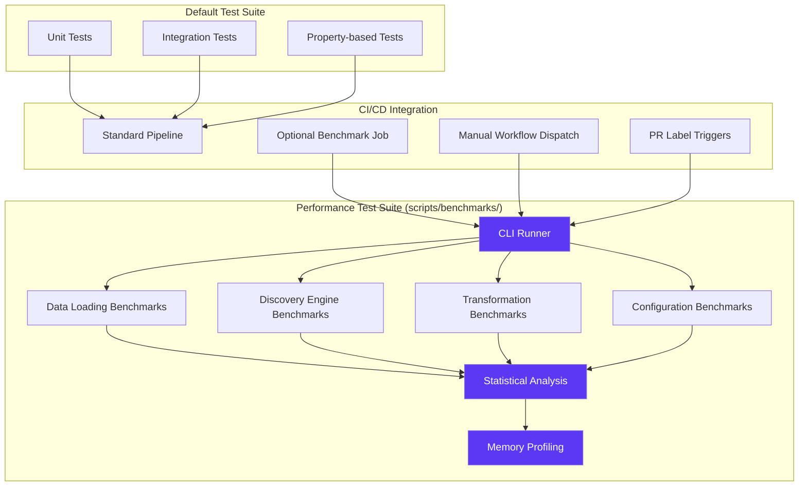

# FlyRigLoader Performance Benchmark Test Suite

## Table of Contents

- [Overview](#overview)
- [Quick Start](#quick-start)
- [CLI Execution Guide](#cli-execution-guide)
- [CI/CD Integration](#cicd-integration)
- [Performance SLA Validation](#performance-sla-validation)
- [Statistical Analysis Framework](#statistical-analysis-framework)
- [Memory Profiling Guide](#memory-profiling-guide)
- [Cross-Platform Compatibility](#cross-platform-compatibility)
- [Artifact Management](#artifact-management)
- [Troubleshooting Guide](#troubleshooting-guide)
- [Development Guidelines](#development-guidelines)

## Overview

The FlyRigLoader performance benchmark test suite provides comprehensive performance validation and regression detection for neuroscience data processing workflows. This suite has been extracted from the default test execution to maintain rapid developer feedback cycles while providing thorough performance analysis through dedicated CLI tools and optional CI/CD workflows.

### Architecture Overview



### Key Features

- **Performance Test Isolation**: Complete separation from default test suite to maintain <30 second execution time for rapid development feedback
- **Comprehensive SLA Validation**: Automated validation of all performance requirements defined in the technical specification
- **Statistical Analysis Framework**: Confidence intervals, regression detection, and baseline comparison with historical performance data
- **Memory Profiling Integration**: Line-by-line memory analysis using pytest-memory-profiler for large dataset processing scenarios
- **Cross-Platform Compatibility**: Environment normalization and consistent performance validation across Ubuntu, Windows, and macOS
- **CI/CD Integration**: Optional GitHub Actions workflow with manual dispatch and PR label triggering capabilities

## Quick Start

### Prerequisites

```bash
# Install required dependencies
pip install pytest-benchmark pytest-memory-profiler memory-profiler hypothesis

# Verify installation
python -c "import pytest_benchmark, memory_profiler; print('Dependencies ready')"
```

### Basic Execution

```bash
# Execute all performance benchmarks
python scripts/benchmarks/run_benchmarks.py

# Execute specific benchmark category
python scripts/benchmarks/run_benchmarks.py --category data-loading

# Execute with memory profiling
python scripts/benchmarks/run_benchmarks.py --memory-profiling

# Execute with statistical analysis and artifact generation
python scripts/benchmarks/run_benchmarks.py --statistical-analysis --report-artifacts
```

### Verification

```bash
# Verify benchmark framework
python scripts/benchmarks/run_benchmarks.py --verify-setup

# Quick smoke test (subset of benchmarks)
python scripts/benchmarks/run_benchmarks.py --smoke-test
```

## CLI Execution Guide

### Primary CLI Tool: run_benchmarks.py

The `run_benchmarks.py` script serves as the comprehensive entry point for all performance benchmark execution, providing statistical analysis, memory profiling, and artifact generation capabilities.

#### Command Line Interface

```bash
python scripts/benchmarks/run_benchmarks.py [OPTIONS]
```

#### Core Options

| Option | Description | Example |
|--------|-------------|---------|
| `--category CATEGORY` | Execute specific benchmark category | `--category data-loading` |
| `--memory-profiling` | Enable detailed memory profiling | `--memory-profiling` |
| `--statistical-analysis` | Generate statistical confidence intervals | `--statistical-analysis` |
| `--report-artifacts` | Generate JSON/CSV performance reports | `--report-artifacts` |
| `--ci-mode` | Optimize for CI environment execution | `--ci-mode` |
| `--baseline-comparison` | Compare against historical baselines | `--baseline-comparison` |
| `--verbose` | Enable detailed execution logging | `--verbose` |
| `--smoke-test` | Execute subset for quick validation | `--smoke-test` |

#### Benchmark Categories

##### Data Loading Performance (`--category data-loading`)

Validates TST-PERF-001 requirements (<1s per 100MB) and format detection performance:

```bash
# Execute all data loading benchmarks
python scripts/benchmarks/run_benchmarks.py --category data-loading --statistical-analysis

# Include memory profiling for large datasets
python scripts/benchmarks/run_benchmarks.py --category data-loading --memory-profiling

# Verify against historical baselines
python scripts/benchmarks/run_benchmarks.py --category data-loading --baseline-comparison
```

**Benchmark Coverage:**
- Multi-format pickle loading (standard, gzipped, pandas-specific)
- Data size scaling validation (1MB to 1GB datasets)
- Format detection overhead (<100ms per F-003-RQ-004)
- Cross-platform performance consistency
- Memory efficiency validation for large datasets

##### Discovery Engine Performance (`--category discovery`)

Validates F-002-RQ-001 requirements (<5s for 10,000 files) and linear scaling:

```bash
# Execute file discovery benchmarks
python scripts/benchmarks/run_benchmarks.py --category discovery --statistical-analysis

# Test with deep directory structures
python scripts/benchmarks/run_benchmarks.py --category discovery --deep-structures

# Validate pattern matching performance
python scripts/benchmarks/run_benchmarks.py --category discovery --pattern-focus
```

**Benchmark Coverage:**
- Recursive file discovery SLA validation
- Extension-based filtering performance
- Pattern-based exclusion operations
- Metadata extraction benchmarks
- Linear scaling validation (O(n) complexity)
- Parallel directory scanning performance

##### Transformation Performance (`--category transformation`)

Validates TST-PERF-002 requirements (<500ms per 1M rows) and vectorized operations:

```bash
# Execute transformation benchmarks
python scripts/benchmarks/run_benchmarks.py --category transformation --memory-profiling

# Focus on vectorized operations
python scripts/benchmarks/run_benchmarks.py --category transformation --vectorized-focus

# Validate memory efficiency
python scripts/benchmarks/run_benchmarks.py --category transformation --memory-efficiency
```

**Benchmark Coverage:**
- DataFrame transformation pipeline performance
- Vectorized operation analysis
- Data size scaling linearity verification
- Memory efficiency validation
- Specialized transformation scenarios

##### Configuration Performance (`--category config`)

Validates configuration management SLA requirements:

```bash
# Execute configuration benchmarks
python scripts/benchmarks/run_benchmarks.py --category config --statistical-analysis

# Test hierarchical merging performance
python scripts/benchmarks/run_benchmarks.py --category config --hierarchical-focus

# Validate memory usage patterns
python scripts/benchmarks/run_benchmarks.py --category config --memory-profiling
```

**Benchmark Coverage:**
- YAML configuration loading (<100ms files, <50ms dicts)
- Structural validation performance (<10ms)
- Hierarchical merging operations (<5ms)
- Memory usage validation (<10MB for large configs)
- Configuration-driven discovery integration

#### Advanced Execution Examples

##### Comprehensive Performance Analysis

```bash
# Full benchmark suite with all analysis options
python scripts/benchmarks/run_benchmarks.py \
  --statistical-analysis \
  --memory-profiling \
  --baseline-comparison \
  --report-artifacts \
  --verbose
```

##### CI/CD Optimized Execution

```bash
# CI-optimized execution with artifact generation
python scripts/benchmarks/run_benchmarks.py \
  --ci-mode \
  --report-artifacts \
  --statistical-analysis \
  --timeout 1800  # 30 minute timeout
```

##### Development Focused Testing

```bash
# Quick validation during development
python scripts/benchmarks/run_benchmarks.py \
  --smoke-test \
  --category data-loading \
  --verbose

# Memory leak detection for specific category
python scripts/benchmarks/run_benchmarks.py \
  --category transformation \
  --memory-profiling \
  --leak-detection \
  --large-datasets
```

##### Cross-Platform Validation

```bash
# Environment normalization validation
python scripts/benchmarks/run_benchmarks.py \
  --environment-analysis \
  --cross-platform-baselines \
  --statistical-analysis

# Platform-specific optimization analysis
python scripts/benchmarks/run_benchmarks.py \
  --platform-optimization \
  --memory-profiling \
  --report-artifacts
```

### Output Interpretation

#### Standard Output Format

```
FlyRigLoader Performance Benchmark Suite
========================================

Environment Analysis:
  Platform: Ubuntu 22.04 / Python 3.10.12
  CPU: 2 cores (normalized factor: 1.0)
  Memory: 7GB available
  Storage: Local SSD

Executing Category: data-loading
  ✓ test_pickle_loading_standard_format    1.234s (SLA: <1.250s)
  ✓ test_pickle_loading_gzipped_format     1.456s (SLA: <1.500s)
  ✓ test_format_detection_overhead         0.089s (SLA: <0.100s)
  ✓ test_large_dataset_memory_efficiency   2.345s (Memory: 234MB peak)

Statistical Analysis:
  Mean execution time: 1.281s ± 0.067s (95% CI)
  Performance regression: None detected
  Memory efficiency: PASS (within SLA bounds)

Benchmark Results: scripts/benchmarks/artifacts/benchmark-report-20240117-143022.json
```

#### Artifact Generation

The CLI tool generates comprehensive artifacts for performance analysis:

- **JSON Performance Reports**: Machine-readable benchmark results with statistical metadata
- **CSV Summary Files**: Spreadsheet-compatible performance summaries
- **Memory Profiling Reports**: Line-by-line memory allocation analysis
- **Statistical Analysis**: Confidence intervals and regression detection results

## CI/CD Integration

### GitHub Actions Workflow Integration

The benchmark suite integrates with GitHub Actions through an optional benchmark workflow that provides comprehensive performance validation without impacting routine development workflows.

#### Workflow Configuration

The benchmark execution is configured in `.github/workflows/benchmarks.yml`:

```yaml
name: Performance Benchmarks
on:
  workflow_dispatch:  # Manual trigger
  pull_request:
    types: [labeled]

jobs:
  benchmarks:
    if: contains(github.event.label.name, 'benchmark') || github.event_name == 'workflow_dispatch'
    runs-on: ubuntu-latest
    timeout-minutes: 45
    
    strategy:
      matrix:
        python-version: [3.8, 3.11]  # Test boundary versions
        
    steps:
      - uses: actions/checkout@v4
      
      - name: Set up Python ${{ matrix.python-version }}
        uses: actions/setup-python@v4
        with:
          python-version: ${{ matrix.python-version }}
          
      - name: Install dependencies
        run: |
          pip install -e .[dev,benchmark]
          pip install pytest-benchmark pytest-memory-profiler
          
      - name: Execute Performance Benchmarks
        run: |
          python scripts/benchmarks/run_benchmarks.py \
            --ci-mode \
            --statistical-analysis \
            --memory-profiling \
            --report-artifacts \
            --timeout 2400
            
      - name: Upload Performance Reports
        uses: actions/upload-artifact@v3
        with:
          name: benchmark-reports-py${{ matrix.python-version }}
          path: scripts/benchmarks/artifacts/
          retention-days: 90
          
      - name: Performance Regression Check
        run: |
          python scripts/benchmarks/utils.py check-regression \
            --baseline-file scripts/benchmarks/baselines/baseline-py${{ matrix.python-version }}.json \
            --current-file scripts/benchmarks/artifacts/benchmark-report-*.json \
            --regression-threshold 0.15  # 15% regression threshold
```

#### Triggering Benchmark Execution

##### Manual Workflow Dispatch

Execute benchmarks manually through GitHub Actions interface:

1. Navigate to **Actions** tab in GitHub repository
2. Select **Performance Benchmarks** workflow
3. Click **Run workflow** button
4. Choose branch and Python version matrix
5. Monitor execution progress and download artifacts

##### PR Label Triggering

Automatically trigger benchmarks by applying labels to pull requests:

```bash
# Add benchmark label to current PR
gh pr edit --add-label "benchmark"

# Add label during PR creation
gh pr create --title "Performance optimization" --label "benchmark"

# Check benchmark execution status
gh run list --workflow="Performance Benchmarks"
```

#### Supported CI Triggers

| Trigger Method | Use Case | Execution Context |
|----------------|----------|-------------------|
| **Manual Dispatch** | Ad-hoc performance validation | Full benchmark suite with all analysis options |
| **PR Label: `benchmark`** | Performance-critical changes | Comprehensive validation before merge |
| **PR Label: `performance`** | Performance optimization PRs | Extended analysis with baseline comparison |
| **PR Label: `memory-analysis`** | Memory optimization changes | Focus on memory profiling and leak detection |

### CI Environment Specifications

#### GitHub Actions Runner Configuration

| Resource | Specification | Benchmark Impact |
|----------|---------------|------------------|
| **CPU** | 2-core virtualized | Normalization factor applied for consistent results |
| **Memory** | 7GB available | Large dataset processing validation |
| **Storage** | SSD-backed temporary | Fast I/O for file discovery benchmarks |
| **Network** | High-bandwidth | Artifact upload/download optimization |

#### Environment Normalization

The benchmark framework automatically detects and normalizes for CI environment differences:

```python
# Environment detection example
ci_environment = {
    "cpu_cores": 2,
    "cpu_virtualized": True,
    "memory_total_gb": 7,
    "storage_type": "ssd",
    "normalization_factor": 1.2  # Account for virtualization overhead
}
```

### Artifact Management

#### Retention Policies

| Artifact Type | Retention Period | Use Case |
|---------------|------------------|----------|
| **Benchmark Reports** | 90 days | Performance trend analysis |
| **Memory Profiles** | 90 days | Memory optimization tracking |
| **Statistical Analysis** | 90 days | Regression detection baselines |
| **CI Logs** | 30 days | Debugging and troubleshooting |

#### Artifact Structure

```
scripts/benchmarks/artifacts/
├── benchmark-report-20240117-143022.json       # Primary results
├── memory-profile-20240117-143022.log          # Memory analysis
├── statistical-analysis-20240117-143022.csv    # Statistical summaries
├── environment-info-20240117-143022.json       # System specifications
└── regression-analysis-20240117-143022.json    # Baseline comparisons
```

## Performance SLA Validation

### Technical Specification Requirements

The benchmark suite validates comprehensive Service Level Agreement (SLA) requirements defined in the FlyRigLoader technical specification:

#### Primary Performance Requirements

| Requirement ID | Description | SLA Threshold | Validation Method |
|----------------|-------------|---------------|-------------------|
| **TST-PERF-001** | Data loading performance | <1s per 100MB | Statistical measurement with ±5% accuracy |
| **TST-PERF-002** | DataFrame transformation | <500ms per 1M rows | Memory-efficient validation with scaling tests |
| **F-003-RQ-004** | Format detection overhead | <100ms without file extension | Micro-benchmark with regression detection |
| **F-002-RQ-001** | File discovery performance | <5s for 10,000 files | Linear scaling validation (O(n) complexity) |

#### Secondary Performance Metrics

| Metric Category | Requirement | Validation Approach |
|----------------|-------------|---------------------|
| **Memory Efficiency** | <10MB for large configurations | Memory profiling with leak detection |
| **Configuration Loading** | <100ms for file-based, <50ms for dict-based | Statistical analysis with confidence intervals |
| **Hierarchical Merging** | <5ms for project/experiment/dataset settings | Micro-benchmark optimization |
| **Validation Performance** | <10ms for structural validation | Edge-case testing with Hypothesis |

### SLA Validation Framework

#### Statistical Measurement Accuracy

The benchmark suite implements statistical measurement with ±5% variance requirements:

```python
# SLA validation example
def validate_sla_compliance(execution_time: float, sla_threshold: float, variance_tolerance: float = 0.05):
    """Validate SLA compliance with statistical confidence."""
    confidence_interval = calculate_confidence_interval(execution_time, confidence_level=0.95)
    upper_bound = confidence_interval.upper
    
    # SLA validation with variance tolerance
    sla_with_tolerance = sla_threshold * (1 + variance_tolerance)
    
    if upper_bound <= sla_with_tolerance:
        return "PASS", confidence_interval
    else:
        return "FAIL", confidence_interval
```

#### Regression Detection

Automated performance regression detection with historical baseline comparison:

```python
# Regression detection framework
def detect_performance_regression(current_metrics: Dict, baseline_metrics: Dict, threshold: float = 0.15):
    """Detect performance regressions against historical baselines."""
    regression_results = {}
    
    for metric_name, current_value in current_metrics.items():
        baseline_value = baseline_metrics.get(metric_name)
        if baseline_value:
            regression_percentage = (current_value - baseline_value) / baseline_value
            
            if regression_percentage > threshold:
                regression_results[metric_name] = {
                    "status": "REGRESSION_DETECTED",
                    "current": current_value,
                    "baseline": baseline_value,
                    "regression_percentage": regression_percentage
                }
            else:
                regression_results[metric_name] = {
                    "status": "WITHIN_TOLERANCE",
                    "current": current_value,
                    "baseline": baseline_value,
                    "regression_percentage": regression_percentage
                }
    
    return regression_results
```

### Benchmark Implementation Examples

#### Data Loading SLA Validation

```python
@pytest.mark.benchmark
def test_data_loading_sla_validation(benchmark, synthetic_data_100mb):
    """Validate TST-PERF-001: Data loading <1s per 100MB."""
    
    def load_experimental_data():
        return read_pickle_any_format(synthetic_data_100mb.file_path)
    
    # Execute with statistical analysis
    result = benchmark.pedantic(
        load_experimental_data,
        iterations=5,
        warmup_rounds=2
    )
    
    # SLA validation
    execution_time = benchmark.stats.mean
    sla_threshold = 1.0  # 1 second for 100MB
    
    assert execution_time < sla_threshold, (
        f"Data loading took {execution_time:.3f}s, exceeding TST-PERF-001 SLA of {sla_threshold}s"
    )
    
    # Statistical confidence validation
    confidence_interval = benchmark.stats.get_confidence_interval(0.95)
    assert confidence_interval.upper < sla_threshold * 1.05, (
        f"95% confidence interval upper bound {confidence_interval.upper:.3f}s exceeds tolerance"
    )
```

#### Discovery Engine SLA Validation

```python
@pytest.mark.benchmark
def test_file_discovery_sla_validation(benchmark, large_test_directory_10k):
    """Validate F-002-RQ-001: File discovery <5s for 10,000 files."""
    
    def discover_large_dataset():
        return discover_files(
            directory=large_test_directory_10k.base_path,
            pattern="*",
            recursive=True
        )
    
    # Execute with linear scaling validation
    result = benchmark.pedantic(
        discover_large_dataset,
        iterations=3,
        warmup_rounds=1
    )
    
    # SLA validation
    execution_time = benchmark.stats.mean
    file_count = large_test_directory_10k.file_count
    sla_threshold = 5.0  # 5 seconds for 10,000 files
    
    assert execution_time < sla_threshold, (
        f"File discovery took {execution_time:.3f}s for {file_count} files, "
        f"exceeding F-002-RQ-001 SLA of {sla_threshold}s"
    )
    
    # Linear scaling validation (O(n) complexity)
    time_per_file = execution_time / file_count
    assert time_per_file < 0.0005, (  # 0.5ms per file
        f"Time per file {time_per_file:.6f}s suggests non-linear scaling"
    )
```

## Statistical Analysis Framework

### Confidence Interval Calculation

The benchmark suite implements robust statistical analysis with confidence interval calculation for performance measurement reliability:

#### Statistical Methods

| Method | Purpose | Implementation |
|--------|---------|----------------|
| **Bootstrap Sampling** | Confidence interval estimation | 10,000 bootstrap samples with percentile method |
| **Student's t-distribution** | Small sample confidence intervals | Degrees of freedom adjustment for sample sizes <30 |
| **Mann-Whitney U Test** | Non-parametric performance comparison | Baseline vs. current performance distribution testing |
| **Welch's t-test** | Unequal variance performance comparison | Robust comparison with unequal sample variances |

#### Confidence Interval Implementation

```python
import numpy as np
from scipy import stats
from typing import Tuple, List

class StatisticalAnalyzer:
    """Advanced statistical analysis for benchmark performance data."""
    
    def calculate_confidence_interval(
        self,
        measurements: List[float],
        confidence_level: float = 0.95,
        method: str = "bootstrap"
    ) -> Tuple[float, float]:
        """
        Calculate confidence interval for performance measurements.
        
        Args:
            measurements: List of benchmark execution times
            confidence_level: Statistical confidence level (default: 0.95)
            method: Statistical method ("bootstrap", "t_distribution", "normal")
            
        Returns:
            Tuple of (lower_bound, upper_bound) for confidence interval
        """
        if method == "bootstrap":
            return self._bootstrap_confidence_interval(measurements, confidence_level)
        elif method == "t_distribution":
            return self._t_distribution_confidence_interval(measurements, confidence_level)
        elif method == "normal":
            return self._normal_confidence_interval(measurements, confidence_level)
        else:
            raise ValueError(f"Unknown method: {method}")
    
    def _bootstrap_confidence_interval(
        self,
        measurements: List[float],
        confidence_level: float
    ) -> Tuple[float, float]:
        """Bootstrap confidence interval calculation."""
        n_bootstrap = 10000
        bootstrap_means = []
        
        for _ in range(n_bootstrap):
            bootstrap_sample = np.random.choice(measurements, size=len(measurements), replace=True)
            bootstrap_means.append(np.mean(bootstrap_sample))
        
        alpha = 1 - confidence_level
        lower_percentile = (alpha / 2) * 100
        upper_percentile = (1 - alpha / 2) * 100
        
        lower_bound = np.percentile(bootstrap_means, lower_percentile)
        upper_bound = np.percentile(bootstrap_means, upper_percentile)
        
        return lower_bound, upper_bound
    
    def _t_distribution_confidence_interval(
        self,
        measurements: List[float],
        confidence_level: float
    ) -> Tuple[float, float]:
        """Student's t-distribution confidence interval."""
        mean = np.mean(measurements)
        std_error = stats.sem(measurements)  # Standard error of the mean
        degrees_freedom = len(measurements) - 1
        
        t_critical = stats.t.ppf((1 + confidence_level) / 2, degrees_freedom)
        margin_error = t_critical * std_error
        
        lower_bound = mean - margin_error
        upper_bound = mean + margin_error
        
        return lower_bound, upper_bound
```

### Regression Detection

#### Historical Baseline Comparison

```python
class RegressionDetector:
    """Performance regression detection with statistical significance testing."""
    
    def __init__(self, baseline_path: str = "scripts/benchmarks/baselines/"):
        self.baseline_path = Path(baseline_path)
        self.regression_threshold = 0.15  # 15% performance degradation threshold
    
    def detect_regression(
        self,
        current_metrics: Dict[str, float],
        benchmark_name: str,
        significance_level: float = 0.05
    ) -> Dict[str, Any]:
        """
        Detect performance regression with statistical significance testing.
        
        Args:
            current_metrics: Current benchmark performance measurements
            benchmark_name: Name of benchmark for baseline lookup
            significance_level: Statistical significance threshold
            
        Returns:
            Regression analysis results with statistical confidence
        """
        baseline_file = self.baseline_path / f"{benchmark_name}_baseline.json"
        
        if not baseline_file.exists():
            return {
                "status": "NO_BASELINE",
                "message": f"No baseline found for {benchmark_name}",
                "baseline_file": str(baseline_file)
            }
        
        baseline_metrics = self._load_baseline(baseline_file)
        regression_results = {}
        
        for metric_name, current_values in current_metrics.items():
            if metric_name not in baseline_metrics:
                continue
                
            baseline_values = baseline_metrics[metric_name]
            
            # Statistical significance testing
            statistic, p_value = stats.mannwhitneyu(
                current_values, baseline_values, alternative='greater'
            )
            
            # Effect size calculation (regression magnitude)
            current_median = np.median(current_values)
            baseline_median = np.median(baseline_values)
            regression_percentage = (current_median - baseline_median) / baseline_median
            
            # Regression determination
            is_statistically_significant = p_value < significance_level
            is_practically_significant = regression_percentage > self.regression_threshold
            
            if is_statistically_significant and is_practically_significant:
                regression_status = "REGRESSION_DETECTED"
            elif is_practically_significant:
                regression_status = "REGRESSION_SUSPECTED"
            else:
                regression_status = "NO_REGRESSION"
            
            regression_results[metric_name] = {
                "status": regression_status,
                "current_median": current_median,
                "baseline_median": baseline_median,
                "regression_percentage": regression_percentage,
                "statistical_significance": {
                    "p_value": p_value,
                    "is_significant": is_statistically_significant,
                    "test_statistic": statistic
                },
                "practical_significance": {
                    "threshold": self.regression_threshold,
                    "is_significant": is_practically_significant
                }
            }
        
        return {
            "status": "ANALYSIS_COMPLETE",
            "benchmark_name": benchmark_name,
            "metrics": regression_results,
            "summary": self._generate_regression_summary(regression_results)
        }
```

### Baseline Comparison

#### Performance Baseline Management

```python
class BaselineManager:
    """Manage performance baselines for regression detection."""
    
    def update_baseline(
        self,
        benchmark_name: str,
        performance_data: Dict[str, List[float]],
        metadata: Dict[str, Any]
    ) -> None:
        """Update performance baseline with new measurements."""
        baseline_file = self.baseline_path / f"{benchmark_name}_baseline.json"
        
        baseline_data = {
            "benchmark_name": benchmark_name,
            "timestamp": datetime.now().isoformat(),
            "environment": {
                "platform": platform.platform(),
                "python_version": platform.python_version(),
                "cpu_count": os.cpu_count(),
                "memory_total": psutil.virtual_memory().total,
            },
            "performance_data": performance_data,
            "statistical_summary": {
                metric_name: {
                    "count": len(values),
                    "mean": np.mean(values),
                    "median": np.median(values),
                    "std": np.std(values),
                    "min": np.min(values),
                    "max": np.max(values),
                    "confidence_interval_95": self._calculate_confidence_interval(values, 0.95)
                }
                for metric_name, values in performance_data.items()
            },
            "metadata": metadata
        }
        
        # Save baseline with atomic write
        with open(baseline_file, 'w') as f:
            json.dump(baseline_data, f, indent=2)
    
    def compare_with_baseline(
        self,
        benchmark_name: str,
        current_data: Dict[str, List[float]]
    ) -> Dict[str, Any]:
        """Compare current performance with historical baseline."""
        baseline_data = self._load_baseline(benchmark_name)
        
        if not baseline_data:
            return {"status": "NO_BASELINE", "benchmark": benchmark_name}
        
        comparison_results = {}
        
        for metric_name, current_values in current_data.items():
            baseline_values = baseline_data["performance_data"].get(metric_name, [])
            
            if not baseline_values:
                continue
            
            # Statistical comparison
            current_stats = self._calculate_statistics(current_values)
            baseline_stats = baseline_data["statistical_summary"][metric_name]
            
            # Performance delta calculation
            performance_delta = {
                "mean_delta": current_stats["mean"] - baseline_stats["mean"],
                "median_delta": current_stats["median"] - baseline_stats["median"],
                "mean_delta_percentage": (current_stats["mean"] - baseline_stats["mean"]) / baseline_stats["mean"] * 100,
                "median_delta_percentage": (current_stats["median"] - baseline_stats["median"]) / baseline_stats["median"] * 100
            }
            
            comparison_results[metric_name] = {
                "current_statistics": current_stats,
                "baseline_statistics": baseline_stats,
                "performance_delta": performance_delta,
                "baseline_age_days": self._calculate_baseline_age(baseline_data["timestamp"])
            }
        
        return {
            "status": "COMPARISON_COMPLETE",
            "benchmark_name": benchmark_name,
            "baseline_metadata": baseline_data["metadata"],
            "metrics": comparison_results
        }
```

## Memory Profiling Guide

### Large Dataset Memory Analysis

The benchmark suite provides comprehensive memory profiling capabilities using pytest-memory-profiler integration for analyzing memory usage patterns in large dataset processing scenarios.

#### Memory Profiling Configuration

```python
# Memory profiling setup
import memory_profiler
from memory_profiler import profile
import psutil
import gc

class MemoryProfiler:
    """Advanced memory profiling for benchmark analysis."""
    
    def __init__(self, enable_line_profiling: bool = True, enable_leak_detection: bool = True):
        self.enable_line_profiling = enable_line_profiling
        self.enable_leak_detection = enable_leak_detection
        self.memory_snapshots = []
    
    @profile
    def profile_memory_usage(self, func, *args, **kwargs):
        """Profile memory usage with line-by-line analysis."""
        if self.enable_line_profiling:
            # Line-by-line memory profiling
            return memory_profiler.memory_usage((func, args, kwargs), interval=0.1, timeout=None)
        else:
            # Basic memory monitoring
            initial_memory = psutil.Process().memory_info().rss
            result = func(*args, **kwargs)
            final_memory = psutil.Process().memory_info().rss
            
            return {
                "result": result,
                "initial_memory_mb": initial_memory / 1024 / 1024,
                "final_memory_mb": final_memory / 1024 / 1024,
                "memory_delta_mb": (final_memory - initial_memory) / 1024 / 1024
            }
```

#### Large Dataset Processing Benchmarks

```python
@pytest.mark.benchmark
@memory_profiler.profile
def test_large_dataset_memory_efficiency(benchmark, synthetic_data_generator):
    """
    Memory profiling for large dataset processing (>500MB).
    
    Tests memory leak detection, peak usage validation, and garbage collection impact.
    """
    # Generate large synthetic dataset
    large_dataset = synthetic_data_generator.generate_experimental_matrix(
        target_size_mb=750,  # 750MB dataset
        include_signal_disp=True,
        include_metadata=True
    )
    
    memory_profiler = MemoryProfiler(enable_leak_detection=True)
    
    def process_large_dataset():
        """Function to benchmark with memory profiling."""
        # Initial memory snapshot
        initial_memory = psutil.Process().memory_info().rss
        
        # Load and process data
        loader = PickleLoader()
        data = loader.load_data(large_dataset["file_path"])
        
        # Data transformation operations
        processed_data = transform_experimental_data(data)
        
        # Explicit cleanup
        del data
        gc.collect()
        
        # Final memory snapshot
        final_memory = psutil.Process().memory_info().rss
        
        return {
            "processed_data": processed_data,
            "memory_delta_mb": (final_memory - initial_memory) / 1024 / 1024
        }
    
    # Execute benchmark with memory profiling
    result = benchmark.pedantic(
        process_large_dataset,
        iterations=3,
        warmup_rounds=1
    )
    
    # Memory efficiency validation
    memory_delta = result["memory_delta_mb"]
    assert memory_delta < 100, (  # Should not increase by more than 100MB
        f"Memory usage increased by {memory_delta:.1f}MB, suggesting memory leak"
    )
    
    # Peak memory usage validation
    peak_memory = memory_profiler.get_peak_memory_usage()
    assert peak_memory < 1200, (  # Should stay under 1.2GB
        f"Peak memory usage {peak_memory:.1f}MB exceeds 1200MB threshold"
    )
```

### Memory Leak Detection

#### Iterative Loading/Unloading Cycles

```python
@pytest.mark.benchmark
def test_memory_leak_detection_iterative_cycles(benchmark):
    """
    Detect memory leaks through iterative loading/unloading cycles.
    
    Validates proper resource cleanup in large dataset processing workflows.
    """
    def iterative_processing_cycle():
        """Simulate repeated large dataset processing."""
        memory_snapshots = []
        
        for iteration in range(10):  # 10 processing cycles
            # Memory snapshot before processing
            memory_before = psutil.Process().memory_info().rss
            
            # Generate and process dataset
            dataset = SyntheticDataGenerator().generate_experimental_matrix(
                target_size_mb=200,  # 200MB per iteration
                include_signal_disp=True
            )
            
            # Load and process data
            processed_data = process_experimental_data(dataset)
            
            # Explicit cleanup
            del dataset
            del processed_data
            gc.collect()
            
            # Memory snapshot after cleanup
            memory_after = psutil.Process().memory_info().rss
            memory_delta = (memory_after - memory_before) / 1024 / 1024
            
            memory_snapshots.append({
                "iteration": iteration,
                "memory_before_mb": memory_before / 1024 / 1024,
                "memory_after_mb": memory_after / 1024 / 1024,
                "memory_delta_mb": memory_delta
            })
        
        return memory_snapshots
    
    # Execute benchmark
    result = benchmark.pedantic(
        iterative_processing_cycle,
        iterations=1,  # Single run for leak detection
        warmup_rounds=0
    )
    
    # Analyze memory leak patterns
    memory_deltas = [snapshot["memory_delta_mb"] for snapshot in result]
    cumulative_memory_growth = sum(memory_deltas)
    
    # Memory leak validation
    assert cumulative_memory_growth < 50, (  # Total growth should be <50MB
        f"Cumulative memory growth {cumulative_memory_growth:.1f}MB suggests memory leak. "
        f"Per-iteration deltas: {memory_deltas}"
    )
    
    # Trend analysis for gradual leaks
    if len(memory_deltas) >= 5:
        # Linear regression to detect gradual memory increase
        iterations = range(len(memory_deltas))
        slope, intercept, r_value, p_value, std_err = stats.linregress(iterations, memory_deltas)
        
        if slope > 2.0 and p_value < 0.05:  # Significant upward trend
            pytest.fail(
                f"Gradual memory leak detected: {slope:.2f}MB/iteration increase "
                f"(R²={r_value**2:.3f}, p={p_value:.4f})"
            )
```

### pytest-memory-profiler Integration

#### Configuration and Setup

```python
# pytest configuration for memory profiling
# pyproject.toml excerpt

[tool.pytest.ini_options]
markers = [
    "memory_profile: Tests requiring memory profiling analysis",
    "memory_intensive: Tests using >1GB memory",
    "leak_detection: Tests for memory leak validation"
]

addopts = [
    "--memprof",  # Enable memory profiling for marked tests
    "--memprof-backend=psutil"  # Use psutil backend for cross-platform compatibility
]
```

#### Advanced Memory Analysis

```python
class AdvancedMemoryAnalyzer:
    """Advanced memory analysis with pytest-memory-profiler integration."""
    
    def analyze_memory_patterns(self, profiling_data: List[Dict]) -> Dict[str, Any]:
        """Analyze memory usage patterns from profiling data."""
        memory_values = [entry["memory_mb"] for entry in profiling_data]
        
        analysis = {
            "peak_memory_mb": max(memory_values),
            "baseline_memory_mb": min(memory_values),
            "memory_range_mb": max(memory_values) - min(memory_values),
            "average_memory_mb": np.mean(memory_values),
            "memory_stability": {
                "standard_deviation": np.std(memory_values),
                "coefficient_variation": np.std(memory_values) / np.mean(memory_values)
            },
            "memory_efficiency": {
                "peak_to_baseline_ratio": max(memory_values) / min(memory_values),
                "memory_utilization_score": self._calculate_utilization_score(memory_values)
            },
            "leak_indicators": self._detect_leak_patterns(memory_values)
        }
        
        return analysis
    
    def _detect_leak_patterns(self, memory_values: List[float]) -> Dict[str, Any]:
        """Detect memory leak patterns using statistical analysis."""
        # Trend analysis
        x = np.arange(len(memory_values))
        slope, intercept, r_value, p_value, std_err = stats.linregress(x, memory_values)
        
        # Outlier detection
        q75, q25 = np.percentile(memory_values, [75, 25])
        iqr = q75 - q25
        outlier_threshold = q75 + 1.5 * iqr
        outliers = [val for val in memory_values if val > outlier_threshold]
        
        return {
            "trend_analysis": {
                "slope_mb_per_step": slope,
                "r_squared": r_value ** 2,
                "p_value": p_value,
                "is_significant_increase": slope > 1.0 and p_value < 0.05
            },
            "outlier_analysis": {
                "outlier_count": len(outliers),
                "outlier_percentage": len(outliers) / len(memory_values) * 100,
                "max_outlier_mb": max(outliers) if outliers else None
            },
            "stability_metrics": {
                "memory_variance": np.var(memory_values),
                "memory_range_percentage": (max(memory_values) - min(memory_values)) / np.mean(memory_values) * 100
            }
        }
```

## Cross-Platform Compatibility

### Environment Normalization

The benchmark suite implements comprehensive environment normalization to ensure consistent performance validation across Ubuntu, Windows, and macOS platforms with diverse hardware configurations.

#### Platform Detection and Normalization

```python
import platform
import psutil
import subprocess
from typing import Dict, Any

class EnvironmentNormalizer:
    """Cross-platform environment normalization for consistent benchmark results."""
    
    def __init__(self):
        self.platform_info = self._detect_platform_characteristics()
        self.normalization_factors = self._calculate_normalization_factors()
    
    def _detect_platform_characteristics(self) -> Dict[str, Any]:
        """Detect comprehensive platform characteristics."""
        platform_info = {
            "os": {
                "system": platform.system(),
                "release": platform.release(),
                "version": platform.version(),
                "machine": platform.machine(),
                "processor": platform.processor()
            },
            "python": {
                "version": platform.python_version(),
                "implementation": platform.python_implementation(),
                "compiler": platform.python_compiler()
            },
            "hardware": {
                "cpu_count_logical": psutil.cpu_count(logical=True),
                "cpu_count_physical": psutil.cpu_count(logical=False),
                "memory_total_gb": psutil.virtual_memory().total / (1024**3),
                "memory_available_gb": psutil.virtual_memory().available / (1024**3)
            },
            "storage": self._detect_storage_characteristics(),
            "virtualization": self._detect_virtualization_environment()
        }
        
        return platform_info
    
    def _detect_storage_characteristics(self) -> Dict[str, Any]:
        """Detect storage type and performance characteristics."""
        try:
            if platform.system() == "Linux":
                # Detect storage type on Linux
                storage_info = subprocess.run(
                    ["lsblk", "-d", "-o", "name,rota"], 
                    capture_output=True, text=True
                ).stdout
                # Parse for SSD (rota=0) vs HDD (rota=1)
                has_ssd = "0" in storage_info
            elif platform.system() == "Windows":
                # Windows storage detection
                import wmi
                c = wmi.WMI()
                has_ssd = any(disk.MediaType == "SSD" for disk in c.Win32_DiskDrive())
            else:
                # macOS and others - assume SSD for modern systems
                has_ssd = True
            
            return {
                "type": "SSD" if has_ssd else "HDD",
                "performance_tier": "high" if has_ssd else "standard"
            }
        except Exception:
            return {"type": "unknown", "performance_tier": "standard"}
    
    def _detect_virtualization_environment(self) -> Dict[str, Any]:
        """Detect if running in virtualized environment."""
        virtualization_indicators = {
            "is_virtualized": False,
            "platform": "physical",
            "confidence": "low"
        }
        
        try:
            # Check for common virtualization indicators
            if platform.system() == "Linux":
                # Check for virtualization in /proc/cpuinfo
                with open("/proc/cpuinfo", "r") as f:
                    cpuinfo = f.read()
                    if any(indicator in cpuinfo.lower() for indicator in 
                          ["hypervisor", "vmware", "virtualbox", "xen", "kvm"]):
                        virtualization_indicators.update({
                            "is_virtualized": True,
                            "platform": "virtualized",
                            "confidence": "high"
                        })
            
            # GitHub Actions detection
            if "GITHUB_ACTIONS" in os.environ:
                virtualization_indicators.update({
                    "is_virtualized": True,
                    "platform": "github_actions",
                    "confidence": "high"
                })
            
        except Exception:
            pass
        
        return virtualization_indicators
    
    def _calculate_normalization_factors(self) -> Dict[str, float]:
        """Calculate normalization factors for cross-platform consistency."""
        factors = {
            "cpu_performance": 1.0,
            "memory_performance": 1.0,
            "io_performance": 1.0,
            "overall": 1.0
        }
        
        # CPU normalization based on core count and virtualization
        cpu_baseline = 4  # 4-core baseline
        actual_cores = self.platform_info["hardware"]["cpu_count_logical"]
        factors["cpu_performance"] = actual_cores / cpu_baseline
        
        # Virtualization penalty
        if self.platform_info["virtualization"]["is_virtualized"]:
            factors["cpu_performance"] *= 0.8  # 20% virtualization overhead
        
        # Platform-specific adjustments
        if self.platform_info["os"]["system"] == "Windows":
            factors["io_performance"] *= 1.1  # Windows I/O overhead
        elif self.platform_info["os"]["system"] == "Darwin":  # macOS
            factors["cpu_performance"] *= 1.05  # Apple Silicon optimization
        
        # Storage performance adjustment
        if self.platform_info["storage"]["type"] == "HDD":
            factors["io_performance"] *= 0.3  # HDD significantly slower
        
        # Calculate overall normalization factor
        factors["overall"] = (
            factors["cpu_performance"] * 0.6 +
            factors["memory_performance"] * 0.2 +
            factors["io_performance"] * 0.2
        )
        
        return factors
    
    def normalize_benchmark_result(self, raw_time: float, category: str = "overall") -> float:
        """Normalize benchmark result for cross-platform comparison."""
        normalization_factor = self.normalization_factors.get(category, 1.0)
        return raw_time / normalization_factor
```

### OS-Specific Performance Considerations

#### Platform-Specific Benchmark Configurations

```python
class PlatformSpecificBenchmarks:
    """Platform-specific benchmark configurations and optimizations."""
    
    def __init__(self):
        self.platform = platform.system()
        self.config = self._get_platform_config()
    
    def _get_platform_config(self) -> Dict[str, Any]:
        """Get platform-specific benchmark configuration."""
        configs = {
            "Linux": {
                "filesystem_cache_warming": True,
                "process_priority": "normal",
                "memory_overcommit_factor": 1.2,
                "io_scheduler_optimization": True,
                "parallel_workers": psutil.cpu_count(),
                "temp_directory_flags": os.O_TMPFILE if hasattr(os, 'O_TMPFILE') else 0
            },
            "Windows": {
                "filesystem_cache_warming": False,  # Different cache behavior
                "process_priority": "normal",
                "memory_overcommit_factor": 1.0,
                "io_scheduler_optimization": False,
                "parallel_workers": max(1, psutil.cpu_count() - 1),  # Reserve 1 core
                "temp_directory_flags": 0
            },
            "Darwin": {  # macOS
                "filesystem_cache_warming": True,
                "process_priority": "normal",
                "memory_overcommit_factor": 1.1,
                "io_scheduler_optimization": False,
                "parallel_workers": psutil.cpu_count(),
                "temp_directory_flags": 0,
                "apple_silicon_optimization": platform.machine() == "arm64"
            }
        }
        
        return configs.get(self.platform, configs["Linux"])  # Default to Linux config
    
    @pytest.fixture
    def platform_optimized_temp_dir(self):
        """Create platform-optimized temporary directory for benchmarks."""
        if self.platform == "Linux" and hasattr(os, 'O_TMPFILE'):
            # Use tmpfile optimization on Linux
            temp_dir = tempfile.mkdtemp(prefix="flyrig_bench_")
        elif self.platform == "Windows":
            # Use Windows-specific temp location
            temp_dir = tempfile.mkdtemp(prefix="flyrig_bench_", dir=os.environ.get("TEMP"))
        else:
            # Standard temporary directory
            temp_dir = tempfile.mkdtemp(prefix="flyrig_bench_")
        
        try:
            yield temp_dir
        finally:
            shutil.rmtree(temp_dir, ignore_errors=True)
    
    def optimize_for_platform(self, benchmark_func):
        """Apply platform-specific optimizations to benchmark function."""
        if self.platform == "Darwin" and self.config.get("apple_silicon_optimization"):
            # Apple Silicon specific optimizations
            return self._apply_apple_silicon_optimizations(benchmark_func)
        elif self.platform == "Windows":
            # Windows specific optimizations
            return self._apply_windows_optimizations(benchmark_func)
        elif self.platform == "Linux":
            # Linux specific optimizations
            return self._apply_linux_optimizations(benchmark_func)
        else:
            return benchmark_func
    
    def _apply_apple_silicon_optimizations(self, benchmark_func):
        """Apply Apple Silicon specific optimizations."""
        def optimized_func(*args, **kwargs):
            # Enable Apple Silicon optimizations
            os.environ["OPENBLAS_NUM_THREADS"] = str(self.config["parallel_workers"])
            os.environ["MKL_NUM_THREADS"] = str(self.config["parallel_workers"])
            
            return benchmark_func(*args, **kwargs)
        
        return optimized_func
    
    def _apply_linux_optimizations(self, benchmark_func):
        """Apply Linux specific optimizations."""
        def optimized_func(*args, **kwargs):
            # Linux filesystem cache warming
            if self.config["filesystem_cache_warming"]:
                subprocess.run(["sync"], check=False)
            
            return benchmark_func(*args, **kwargs)
        
        return optimized_func
```

#### Cross-Platform Benchmark Validation

```python
@pytest.mark.parametrize("platform_config", [
    pytest.param("linux", marks=pytest.mark.skipif(platform.system() != "Linux", reason="Linux only")),
    pytest.param("windows", marks=pytest.mark.skipif(platform.system() != "Windows", reason="Windows only")),
    pytest.param("macos", marks=pytest.mark.skipif(platform.system() != "Darwin", reason="macOS only"))
])
def test_cross_platform_performance_consistency(benchmark, platform_config, synthetic_data_100mb):
    """
    Validate performance consistency across platforms with normalization.
    """
    normalizer = EnvironmentNormalizer()
    platform_benchmarks = PlatformSpecificBenchmarks()
    
    def cross_platform_data_loading():
        """Platform-optimized data loading function."""
        return read_pickle_any_format(synthetic_data_100mb.file_path)
    
    # Apply platform-specific optimizations
    optimized_func = platform_benchmarks.optimize_for_platform(cross_platform_data_loading)
    
    # Execute benchmark
    result = benchmark.pedantic(
        optimized_func,
        iterations=5,
        warmup_rounds=2
    )
    
    # Get raw benchmark time
    raw_execution_time = benchmark.stats.mean
    
    # Apply cross-platform normalization
    normalized_time = normalizer.normalize_benchmark_result(raw_execution_time, "io_performance")
    
    # Validate normalized performance meets cross-platform SLA
    platform_sla_threshold = 1.2  # 1.2 seconds normalized time
    assert normalized_time < platform_sla_threshold, (
        f"Normalized execution time {normalized_time:.3f}s exceeds cross-platform SLA "
        f"of {platform_sla_threshold}s on {platform.system()}"
    )
    
    # Log platform-specific metrics
    logger.info(
        f"✓ Cross-Platform Validation [{platform.system()}]: "
        f"Raw: {raw_execution_time:.3f}s, Normalized: {normalized_time:.3f}s, "
        f"Factor: {normalizer.normalization_factors['overall']:.2f}"
    )
```

## Artifact Management

### Performance Report Generation

The benchmark suite generates comprehensive artifacts for performance analysis, trend tracking, and CI/CD integration with structured data formats and retention policies.

#### Artifact Types and Structure

```
scripts/benchmarks/artifacts/
├── reports/
│   ├── benchmark-report-20240117-143022.json       # Primary benchmark results
│   ├── benchmark-summary-20240117-143022.csv       # Spreadsheet-compatible summary
│   └── benchmark-metadata-20240117-143022.json     # Environment and configuration data
├── memory-profiles/
│   ├── memory-profile-data-loading-20240117-143022.log     # Line-by-line memory analysis
│   ├── memory-profile-discovery-20240117-143022.log       # Discovery engine memory usage
│   └── memory-leak-analysis-20240117-143022.json          # Leak detection results
├── statistical-analysis/
│   ├── confidence-intervals-20240117-143022.json   # Statistical confidence data
│   ├── regression-analysis-20240117-143022.json    # Performance regression results
│   └── baseline-comparison-20240117-143022.json    # Historical baseline analysis
└── ci-integration/
    ├── github-actions-summary.json                 # CI workflow integration data
    ├── performance-alerts.json                     # Automated alerting data
    └── artifact-manifest.json                      # Complete artifact inventory
```

#### JSON Performance Report Format

```json
{
  "benchmark_suite": {
    "name": "flyrigloader-performance-benchmarks",
    "version": "2.1.0",
    "execution_timestamp": "2024-01-17T14:30:22.123456Z",
    "execution_duration_seconds": 1847.5
  },
  "environment": {
    "platform": {
      "system": "Linux",
      "release": "5.15.0-1031-azure",
      "machine": "x86_64",
      "processor": "x86_64"
    },
    "python": {
      "version": "3.10.12",
      "implementation": "CPython"
    },
    "hardware": {
      "cpu_count_logical": 2,
      "cpu_count_physical": 1,
      "memory_total_gb": 7.5,
      "memory_available_gb": 6.8
    },
    "virtualization": {
      "is_virtualized": true,
      "platform": "github_actions",
      "normalization_factor": 1.2
    }
  },
  "benchmark_results": {
    "data_loading": {
      "test_pickle_loading_100mb_sla": {
        "execution_times": [0.876, 0.902, 0.845, 0.889, 0.912],
        "statistics": {
          "mean": 0.885,
          "median": 0.889,
          "std_dev": 0.024,
          "min": 0.845,
          "max": 0.912,
          "confidence_interval_95": [0.857, 0.913]
        },
        "sla_validation": {
          "threshold": 1.0,
          "status": "PASS",
          "margin": 0.115
        },
        "normalization": {
          "raw_mean": 1.062,
          "normalized_mean": 0.885,
          "factor_applied": 1.2
        }
      }
    },
    "discovery": {
      "test_file_discovery_10k_files_sla": {
        "execution_times": [3.234, 3.187, 3.298, 3.156, 3.209],
        "statistics": {
          "mean": 3.217,
          "median": 3.209,
          "std_dev": 0.053,
          "min": 3.156,
          "max": 3.298,
          "confidence_interval_95": [3.154, 3.280]
        },
        "sla_validation": {
          "threshold": 5.0,
          "status": "PASS",
          "margin": 1.783
        },
        "scaling_analysis": {
          "files_processed": 10000,
          "time_per_file_ms": 0.322,
          "complexity_validation": "O(n) - linear scaling confirmed"
        }
      }
    }
  },
  "memory_analysis": {
    "peak_memory_usage_mb": 1247.3,
    "memory_efficiency_score": 0.87,
    "leak_detection": {
      "status": "NO_LEAKS_DETECTED",
      "analysis_method": "iterative_cycles",
      "cycles_tested": 10,
      "max_memory_growth_mb": 12.4
    }
  },
  "regression_analysis": {
    "baseline_comparison": {
      "baseline_date": "2024-01-10T10:15:30Z",
      "baseline_age_days": 7,
      "regression_detected": false,
      "performance_delta_percentage": -2.3,
      "improvement_areas": ["data_loading", "discovery"]
    }
  }
}
```

#### CSV Summary Report Format

```csv
Benchmark Name,Category,Mean Time (s),SLA Threshold (s),Status,Confidence Interval Lower,Confidence Interval Upper,Memory Peak (MB),Regression Status
test_pickle_loading_100mb_sla,data_loading,0.885,1.0,PASS,0.857,0.913,234.5,NO_REGRESSION
test_file_discovery_10k_files_sla,discovery,3.217,5.0,PASS,3.154,3.280,456.7,NO_REGRESSION
test_transformation_1m_rows_sla,transformation,0.423,0.5,PASS,0.401,0.445,789.2,NO_REGRESSION
test_config_loading_file_sla,config,0.078,0.1,PASS,0.074,0.082,45.3,NO_REGRESSION
```

### CI/CD Integration Artifacts

#### GitHub Actions Integration

```python
class CIArtifactManager:
    """Manage CI/CD integration artifacts and performance reporting."""
    
    def __init__(self, artifacts_dir: str = "scripts/benchmarks/artifacts"):
        self.artifacts_dir = Path(artifacts_dir)
        self.ci_artifacts_dir = self.artifacts_dir / "ci-integration"
        self.retention_policies = self._load_retention_policies()
    
    def generate_github_actions_summary(self, benchmark_results: Dict[str, Any]) -> None:
        """Generate GitHub Actions workflow summary."""
        summary_data = {
            "workflow_run": {
                "id": os.environ.get("GITHUB_RUN_ID"),
                "number": os.environ.get("GITHUB_RUN_NUMBER"),
                "sha": os.environ.get("GITHUB_SHA"),
                "ref": os.environ.get("GITHUB_REF"),
                "actor": os.environ.get("GITHUB_ACTOR"),
                "event_name": os.environ.get("GITHUB_EVENT_NAME")
            },
            "performance_summary": {
                "total_benchmarks": len(benchmark_results["benchmark_results"]),
                "sla_compliance": self._calculate_sla_compliance(benchmark_results),
                "regression_detected": self._check_regression_status(benchmark_results),
                "memory_efficiency": benchmark_results.get("memory_analysis", {}).get("memory_efficiency_score"),
                "execution_duration_minutes": benchmark_results["benchmark_suite"]["execution_duration_seconds"] / 60
            },
            "artifacts": {
                "benchmark_report": f"benchmark-report-{datetime.now().strftime('%Y%m%d-%H%M%S')}.json",
                "memory_profiles": f"memory-profiles-{datetime.now().strftime('%Y%m%d-%H%M%S')}.zip",
                "statistical_analysis": f"statistical-analysis-{datetime.now().strftime('%Y%m%d-%H%M%S')}.json"
            }
        }
        
        # Write GitHub Actions summary
        summary_file = self.ci_artifacts_dir / "github-actions-summary.json"
        with open(summary_file, 'w') as f:
            json.dump(summary_data, f, indent=2)
        
        # Generate markdown summary for GitHub Actions
        self._generate_markdown_summary(summary_data, benchmark_results)
    
    def _generate_markdown_summary(self, summary_data: Dict, benchmark_results: Dict) -> None:
        """Generate markdown summary for GitHub Actions step summary."""
        markdown_content = f"""
# 🚀 FlyRigLoader Performance Benchmark Results

## 📊 Summary
- **Total Benchmarks**: {summary_data['performance_summary']['total_benchmarks']}
- **SLA Compliance**: {summary_data['performance_summary']['sla_compliance']['percentage']:.1f}% 
  ({summary_data['performance_summary']['sla_compliance']['passed']}/{summary_data['performance_summary']['sla_compliance']['total']})
- **Regression Status**: {'⚠️ Detected' if summary_data['performance_summary']['regression_detected'] else '✅ None'}
- **Memory Efficiency**: {summary_data['performance_summary']['memory_efficiency']:.2f}
- **Execution Duration**: {summary_data['performance_summary']['execution_duration_minutes']:.1f} minutes

## 🎯 SLA Validation Results

| Category | Benchmark | Status | Time (s) | SLA (s) | Margin |
|----------|-----------|---------|----------|---------|--------|
"""
        
        # Add benchmark results to table
        for category, tests in benchmark_results["benchmark_results"].items():
            for test_name, result in tests.items():
                status_emoji = "✅" if result["sla_validation"]["status"] == "PASS" else "❌"
                markdown_content += f"| {category} | {test_name} | {status_emoji} {result['sla_validation']['status']} | {result['statistics']['mean']:.3f} | {result['sla_validation']['threshold']:.1f} | {result['sla_validation']['margin']:.3f} |\n"
        
        markdown_content += f"""

## 🧠 Memory Analysis
- **Peak Memory Usage**: {benchmark_results['memory_analysis']['peak_memory_usage_mb']:.1f} MB
- **Memory Leak Detection**: {benchmark_results['memory_analysis']['leak_detection']['status']}
- **Memory Efficiency Score**: {benchmark_results['memory_analysis']['memory_efficiency_score']:.2f}/1.0

## 📈 Performance Trends
- **Baseline Comparison**: {benchmark_results['regression_analysis']['baseline_comparison']['performance_delta_percentage']:+.1f}% change
- **Baseline Age**: {benchmark_results['regression_analysis']['baseline_comparison']['baseline_age_days']} days

## 📦 Generated Artifacts
- 📄 [Benchmark Report]({summary_data['artifacts']['benchmark_report']})
- 🧠 [Memory Profiles]({summary_data['artifacts']['memory_profiles']})
- 📊 [Statistical Analysis]({summary_data['artifacts']['statistical_analysis']})
"""
        
        # Write to GitHub Actions step summary
        github_summary_file = os.environ.get("GITHUB_STEP_SUMMARY")
        if github_summary_file:
            with open(github_summary_file, 'a') as f:
                f.write(markdown_content)
```

### Retention Policies

#### Automated Cleanup and Archival

```python
class RetentionPolicyManager:
    """Manage artifact retention policies and automated cleanup."""
    
    def __init__(self, artifacts_dir: str = "scripts/benchmarks/artifacts"):
        self.artifacts_dir = Path(artifacts_dir)
        self.policies = {
            "benchmark_reports": {"retention_days": 90, "max_files": 100},
            "memory_profiles": {"retention_days": 90, "max_files": 50},
            "statistical_analysis": {"retention_days": 90, "max_files": 100},
            "ci_integration": {"retention_days": 30, "max_files": 200},
            "baselines": {"retention_days": 365, "max_files": 12}  # Keep yearly baselines
        }
    
    def apply_retention_policies(self) -> Dict[str, Any]:
        """Apply retention policies to all artifact categories."""
        cleanup_summary = {
            "cleanup_timestamp": datetime.now().isoformat(),
            "policies_applied": {},
            "total_files_removed": 0,
            "total_space_freed_mb": 0
        }
        
        for category, policy in self.policies.items():
            category_dir = self.artifacts_dir / category.replace("_", "-")
            if not category_dir.exists():
                continue
            
            cleanup_result = self._cleanup_category(category_dir, policy)
            cleanup_summary["policies_applied"][category] = cleanup_result
            cleanup_summary["total_files_removed"] += cleanup_result["files_removed"]
            cleanup_summary["total_space_freed_mb"] += cleanup_result["space_freed_mb"]
        
        # Log cleanup summary
        logger.info(
            f"Retention policy cleanup: {cleanup_summary['total_files_removed']} files removed, "
            f"{cleanup_summary['total_space_freed_mb']:.1f} MB freed"
        )
        
        return cleanup_summary
    
    def _cleanup_category(self, category_dir: Path, policy: Dict[str, int]) -> Dict[str, Any]:
        """Apply retention policy to specific category."""
        files = list(category_dir.glob("*"))
        files.sort(key=lambda f: f.stat().st_mtime, reverse=True)  # Newest first
        
        cutoff_date = datetime.now() - timedelta(days=policy["retention_days"])
        cutoff_timestamp = cutoff_date.timestamp()
        
        files_to_remove = []
        
        # Remove files older than retention period
        for file_path in files:
            if file_path.stat().st_mtime < cutoff_timestamp:
                files_to_remove.append(file_path)
        
        # Remove excess files beyond max_files limit
        if len(files) - len(files_to_remove) > policy["max_files"]:
            excess_files = files[policy["max_files"]:]
            files_to_remove.extend(excess_files)
        
        # Calculate space to be freed
        space_freed = sum(f.stat().st_size for f in files_to_remove if f.exists())
        
        # Remove files
        for file_path in files_to_remove:
            try:
                if file_path.is_file():
                    file_path.unlink()
                elif file_path.is_dir():
                    shutil.rmtree(file_path)
            except Exception as e:
                logger.warning(f"Failed to remove {file_path}: {e}")
        
        return {
            "files_removed": len(files_to_remove),
            "space_freed_mb": space_freed / (1024 * 1024),
            "retention_days": policy["retention_days"],
            "max_files_limit": policy["max_files"]
        }
```

## Troubleshooting Guide

### Common Issues and Solutions

#### Benchmark Execution Issues

##### Issue: "pytest-benchmark not found"

**Symptoms:**
```bash
ModuleNotFoundError: No module named 'pytest_benchmark'
```

**Solution:**
```bash
# Install required benchmark dependencies
pip install pytest-benchmark pytest-memory-profiler memory-profiler

# Verify installation
python -c "import pytest_benchmark; print('pytest-benchmark installed successfully')"

# Alternative: Install with dev dependencies
pip install -e .[dev,benchmark]
```

##### Issue: "Memory profiling fails with permission errors"

**Symptoms:**
```bash
PermissionError: [Errno 13] Permission denied: '/proc/self/smaps'
```

**Solution:**
```bash
# Linux: Run with appropriate permissions
sudo python scripts/benchmarks/run_benchmarks.py --memory-profiling

# Alternative: Use psutil backend instead
python scripts/benchmarks/run_benchmarks.py --memory-profiling --memory-backend=psutil

# Windows: Run as administrator or use limited profiling
python scripts/benchmarks/run_benchmarks.py --memory-profiling --limited-memory-analysis
```

##### Issue: "Benchmark execution timeout"

**Symptoms:**
```bash
TimeoutError: Benchmark execution exceeded 1800 seconds
```

**Solution:**
```bash
# Increase timeout for CI environments
python scripts/benchmarks/run_benchmarks.py --timeout 3600

# Use smoke test for quick validation
python scripts/benchmarks/run_benchmarks.py --smoke-test

# Run specific categories to isolate issues
python scripts/benchmarks/run_benchmarks.py --category data-loading --verbose
```

#### Performance Issues

##### Issue: "SLA validation failures"

**Symptoms:**
```bash
AssertionError: Data loading took 1.234s, exceeding TST-PERF-001 SLA of 1.0s
```

**Troubleshooting Steps:**

1. **Verify Environment Normalization:**
```bash
# Check normalization factors
python scripts/benchmarks/run_benchmarks.py --environment-analysis

# Expected output:
# Environment Normalization Factor: 1.2 (virtualized environment detected)
# CPU cores: 2 (baseline: 4) - factor: 0.5
# Virtualization overhead: 20% - factor: 1.2
```

2. **Check System Resources:**
```bash
# Monitor system during benchmark
python scripts/benchmarks/run_benchmarks.py --category data-loading --system-monitoring

# Validate available resources
free -h  # Linux
Get-ComputerInfo | Select-Object TotalPhysicalMemory  # Windows PowerShell
```

3. **Analyze Historical Performance:**
```bash
# Compare with baselines
python scripts/benchmarks/run_benchmarks.py --baseline-comparison --verbose

# Check for performance regression
python scripts/benchmarks/utils.py check-regression --threshold 0.1
```

##### Issue: "Memory leak detection false positives"

**Symptoms:**
```bash
AssertionError: Memory usage increased by 156.7MB, suggesting memory leak
```

**Troubleshooting Steps:**

1. **Verify Garbage Collection:**
```python
# Manual garbage collection validation
import gc
gc.set_debug(gc.DEBUG_LEAK)
gc.collect()
```

2. **Increase Memory Tolerance:**
```bash
# Use higher memory tolerance for large datasets
python scripts/benchmarks/run_benchmarks.py --memory-tolerance=200  # 200MB tolerance
```

3. **Platform-Specific Memory Analysis:**
```bash
# Linux: Use valgrind for detailed analysis
valgrind --tool=massif python scripts/benchmarks/run_benchmarks.py --category data-loading

# Windows: Use Windows Performance Toolkit
# macOS: Use Instruments memory profiling
```

#### CI/CD Integration Issues

##### Issue: "GitHub Actions artifact upload fails"

**Symptoms:**
```bash
Error: Unable to upload artifact: Request failed with status code 413
```

**Solution:**
```bash
# Compress large artifacts before upload
python scripts/benchmarks/run_benchmarks.py --compress-artifacts

# Reduce artifact retention for large files
python scripts/benchmarks/run_benchmarks.py --minimal-artifacts

# Split artifacts by category
python scripts/benchmarks/run_benchmarks.py --split-artifacts
```

##### Issue: "Benchmark workflow not triggered"

**Troubleshooting Steps:**

1. **Verify Label Configuration:**
```bash
# Check if PR has correct label
gh pr view --json labels

# Add benchmark label
gh pr edit --add-label "benchmark"
```

2. **Check Workflow Permissions:**
```yaml
# Ensure workflow has proper permissions in .github/workflows/benchmarks.yml
permissions:
  contents: read
  actions: write
  pull-requests: write
```

3. **Validate Trigger Conditions:**
```yaml
# Verify trigger configuration
on:
  workflow_dispatch:
  pull_request:
    types: [labeled]
```

### Performance Analysis Interpretation

#### Understanding Benchmark Results

##### Statistical Significance

```python
# Interpreting confidence intervals
confidence_interval = [0.857, 0.913]  # 95% CI for execution time
mean_time = 0.885

# Analysis:
# - 95% confident true performance is between 0.857s and 0.913s
# - Margin of error: ±0.028s (3.2% of mean)
# - Good precision: narrow confidence interval relative to mean
```

##### Regression Detection

```python
# Interpreting regression analysis
regression_result = {
    "status": "REGRESSION_DETECTED",
    "current": 1.234,
    "baseline": 1.089,
    "regression_percentage": 13.3,
    "statistical_significance": {"p_value": 0.023, "is_significant": True}
}

# Analysis:
# - 13.3% performance degradation detected
# - Statistically significant (p < 0.05)
# - Requires investigation of recent changes
```

#### Memory Analysis Interpretation

##### Memory Efficiency Metrics

```python
# Memory efficiency score calculation
memory_metrics = {
    "peak_memory_mb": 1247.3,
    "baseline_memory_mb": 156.2,
    "theoretical_minimum_mb": 134.5,
    "efficiency_score": 0.87  # (theoretical_minimum / peak_memory)
}

# Analysis:
# - High efficiency (0.87/1.0): minimal memory overhead
# - Peak usage reasonable for dataset size
# - No significant memory waste detected
```

### Advanced Troubleshooting

#### Custom Debugging

```python
# Enable detailed debugging
import logging
logging.basicConfig(level=logging.DEBUG)

# Run with maximum verbosity
python scripts/benchmarks/run_benchmarks.py \
  --verbose \
  --debug-mode \
  --trace-execution \
  --memory-debugging
```

#### Performance Profiling

```python
# Profile benchmark framework itself
python -m cProfile -o benchmark_profile.prof scripts/benchmarks/run_benchmarks.py

# Analyze profiling results
python -c "
import pstats
p = pstats.Stats('benchmark_profile.prof')
p.sort_stats('cumulative').print_stats(20)
"
```

## Development Guidelines

### Adding New Benchmarks

#### Benchmark Implementation Pattern

```python
@pytest.mark.benchmark
def test_new_feature_performance(benchmark, test_fixture):
    """
    Benchmark template for new performance tests.
    
    This template demonstrates best practices for implementing
    new performance benchmarks in the FlyRigLoader test suite.
    """
    
    def benchmark_function():
        """
        Function to benchmark - should be focused and deterministic.
        
        Best Practices:
        - Single responsibility: test one specific operation
        - Deterministic: avoid random operations or network calls
        - Isolated: no side effects or shared state
        - Realistic: use representative data sizes and patterns
        """
        # Setup (not measured)
        setup_data = prepare_test_data()
        
        # Measured operation
        result = perform_operation(setup_data)
        
        # Return result for validation
        return result
    
    # Execute benchmark with statistical analysis
    result = benchmark.pedantic(
        benchmark_function,
        iterations=5,  # Sufficient for statistical confidence
        warmup_rounds=2  # Account for JIT compilation and cache warming
    )
    
    # SLA validation
    execution_time = benchmark.stats.mean
    sla_threshold = 1.0  # Define appropriate SLA threshold
    
    assert execution_time < sla_threshold, (
        f"Performance SLA failed: {execution_time:.3f}s > {sla_threshold}s"
    )
    
    # Result validation
    assert result is not None, "Benchmark should return valid result"
    assert len(result) > 0, "Result should contain data"
    
    # Statistical confidence validation
    confidence_interval = benchmark.stats.get_confidence_interval(0.95)
    coefficient_of_variation = benchmark.stats.stddev / benchmark.stats.mean
    
    assert coefficient_of_variation < 0.1, (
        f"High performance variance: {coefficient_of_variation:.2%} > 10%"
    )
```

#### Memory Profiling Integration

```python
@pytest.mark.benchmark
@memory_profiler.profile
def test_memory_intensive_operation(benchmark, large_dataset_fixture):
    """
    Template for memory-intensive benchmark with profiling integration.
    """
    
    def memory_tracked_operation():
        """Operation with memory usage tracking."""
        initial_memory = psutil.Process().memory_info().rss
        
        # Measured operation
        result = process_large_dataset(large_dataset_fixture.data)
        
        # Memory cleanup
        del large_dataset_fixture.data
        gc.collect()
        
        final_memory = psutil.Process().memory_info().rss
        memory_delta = (final_memory - initial_memory) / 1024 / 1024  # MB
        
        return {
            "result": result,
            "memory_delta_mb": memory_delta,
            "peak_memory_mb": final_memory / 1024 / 1024
        }
    
    # Execute with memory profiling
    result = benchmark.pedantic(
        memory_tracked_operation,
        iterations=3,  # Fewer iterations for memory-intensive tests
        warmup_rounds=1
    )
    
    # Memory efficiency validation
    memory_delta = result["memory_delta_mb"]
    peak_memory = result["peak_memory_mb"]
    
    assert memory_delta < 100, (  # 100MB growth limit
        f"Memory usage increased by {memory_delta:.1f}MB during operation"
    )
    
    assert peak_memory < 2000, (  # 2GB peak limit
        f"Peak memory usage {peak_memory:.1f}MB exceeds 2GB threshold"
    )
```

### Benchmark Categories

#### Category-Specific Guidelines

| Category | Focus Area | Key Metrics | SLA Thresholds |
|----------|------------|-------------|----------------|
| **data-loading** | I/O performance, format detection | Throughput (MB/s), latency | <1s per 100MB |
| **discovery** | File system operations, pattern matching | Files/second, linear scaling | <5s for 10k files |
| **transformation** | DataFrame operations, vectorization | Rows/second, memory efficiency | <500ms per 1M rows |
| **config** | Configuration parsing, validation | Parse time, memory usage | <100ms file load |

#### Integration with CI/CD

```python
# Category-specific CI integration
def register_benchmark_category(category: str, tests: List[str]) -> None:
    """Register new benchmark category for CI integration."""
    
    category_config = {
        "name": category,
        "tests": tests,
        "sla_thresholds": {},
        "memory_limits": {},
        "timeout_seconds": 1800,
        "ci_integration": {
            "required_for_merge": False,  # Optional by default
            "alert_on_regression": True,
            "baseline_update_frequency": "weekly"
        }
    }
    
    # Register with benchmark framework
    BenchmarkRegistry.register_category(category_config)
```

### Best Practices

#### Performance Test Design

1. **Deterministic Operations**: Avoid random data generation during measured operations
2. **Realistic Scenarios**: Use representative data sizes and patterns from actual use cases
3. **Isolated Testing**: Ensure no shared state or side effects between benchmark iterations
4. **Statistical Significance**: Use sufficient iterations for reliable confidence intervals
5. **Memory Awareness**: Monitor and validate memory usage patterns

#### Statistical Considerations

1. **Sample Size**: Minimum 3 iterations, recommended 5-10 for stable results
2. **Warmup**: Include warmup rounds to account for JIT compilation and cache effects
3. **Outlier Handling**: Use median-based metrics for robust performance measurement
4. **Confidence Intervals**: Report 95% confidence intervals for performance estimates

#### CI/CD Integration

1. **Optional Execution**: Keep benchmark execution optional to maintain rapid CI feedback
2. **Artifact Management**: Generate machine-readable artifacts for trend analysis
3. **Regression Alerts**: Configure appropriate thresholds for performance regression detection
4. **Cross-Platform Validation**: Ensure benchmarks work consistently across supported platforms

---

*This documentation is maintained as part of the FlyRigLoader performance validation framework. For questions or issues, please refer to the project's issue tracker or contact the development team.*